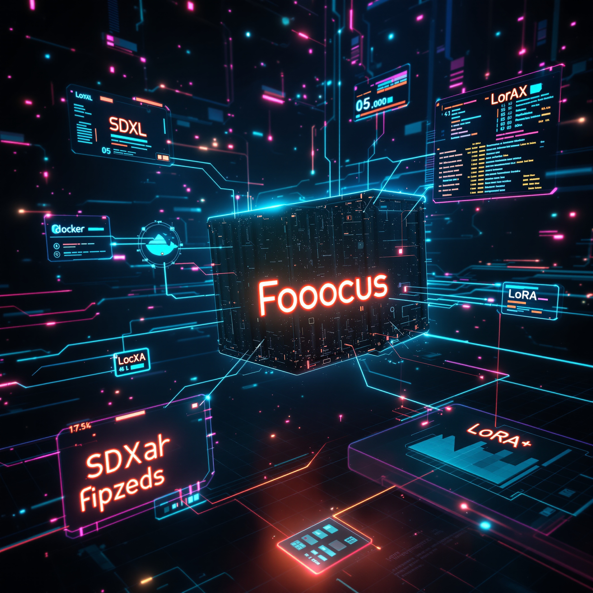

# Fooocus with Docker + SDXL Models & LoRAs

<p align="center">
    
</p>

This folder provides a **Dockerized setup of Fooocus** for generating images with **Stable Diffusion XL (SDXL)**.
The goal is to make it easy to replicate Fooocus on your computer or laptop without worrying about environment setup.

I’ve preconfigured this project with a curated collection of **SDXL models** and **LoRAs**, so you can start experimenting right away.

---

## 📦 Included Models

The following **SDXL models** are available inside the container:

- `juggernautXL_v8Rundiffusion.safetensors` (<a href="https://civitai.com/models/133005/juggernaut-xl">Link to Civitai</a>)
- `sdXL_v10VAEFix.safetensors` (<a href="https://civitai.com/models/101055/sd-xl">Link to Civitai</a>)
- `SDXLRonghua_v45.safetensors` (<a href="https://civitai.com/models/125634/sdxl-ronghua-or-or">Link to Civitai</a>)
- `sdxlYamersRealistic5_v5Rundiffusion.safetensors` (<a href="https://civitai.com/models/127923/sdxl-yamers-realistic-5">Link to Civitai</a>)
- `sdxlUnstableDiffusers_nihilmania.safetensors` (<a href="https://civitai.com/models/84040?modelVersionId=395107">Link to Civitai</a>)

And the following **LoRAs** are included:

- `lingerie_loha.safetensors`
- `pumpsheel.safetensors`
- `retro_neon_illustriouos.safetensors` (<a href="https://civitai.com/models/569937/retro-neon-style-fluxsdxlillustrious-xlpony">Link to Civitai</a>)
- `sd_xl_offset_example-lora_1.0.safetensors`

---

## 🚀 Getting Started

### 1. Clone the repo with only the `AI-media` folder

```bash
# Clone the repo without checking out files
git clone --no-checkout https://github.com/chemacabeza/my-github-projects.git my-github-projects.git
cd my-github-projects.git

# Enable sparse-checkout
git sparse-checkout init --cone

# Configure sparse-checkout to get only root files + fooocus folder
echo "/*" > .git/info/sparse-checkout
echo "\!/*/" >> .git/info/sparse-checkout
echo "/AI-media/" >> .git/info/sparse-checkout

# Pull the filtered content from master branch
git checkout master
```

### 2. Build the Docker image

```bash
docker compose build --no-cache
```

### 3. Run Fooocus

```bash
docker compose up
```

This will start Fooocus and expose the web interface on:
👉 [http://localhost:7860](http://localhost:7860)


### 🗂️ Project Structure

```bash
── cache
│   └── huggingface
│       └── hub
│           └── version.txt
├── docker-compose.yml # A Docker Compose configuration that builds and runs Fooocus with GPU support, mounted model/LoRA folders, and a web UI exposed on port 7860.
├── Dockerfile # Fooocus container setup
├── entrypoint.sh # A Bash script that prepares Fooocus by ensuring required SDXL models and LoRAs are downloaded into host-mounted folders before starting the container.
├── LoRAs
│   ├── lingerie_loha.safetensors
│   ├── pumpsheel.safetensors
│   ├── retro_neon_illustriouos.safetensors
│   └── sd_xl_offset_example-lora_1.0.safetensors
├── models
│   ├── juggernautXL_v8Rundiffusion.safetensors
│   ├── SDXLRonghua_v45.safetensors
│   ├── sdxlUnstableDiffusers_nihilmania.safetensors
│   ├── sdXL_v10VAEFix.safetensors
│   └── sdxlYamersRealistic5_v5Rundiffusion.safetensors
├── outputs
├── README.md
├── run.sh # A Bash script that rebuilds Docker containers without cache and then starts them using Docker Compose.
└── start.sh # Once you have all the LoRAs and models installed you can use this script to start the docker container
```
