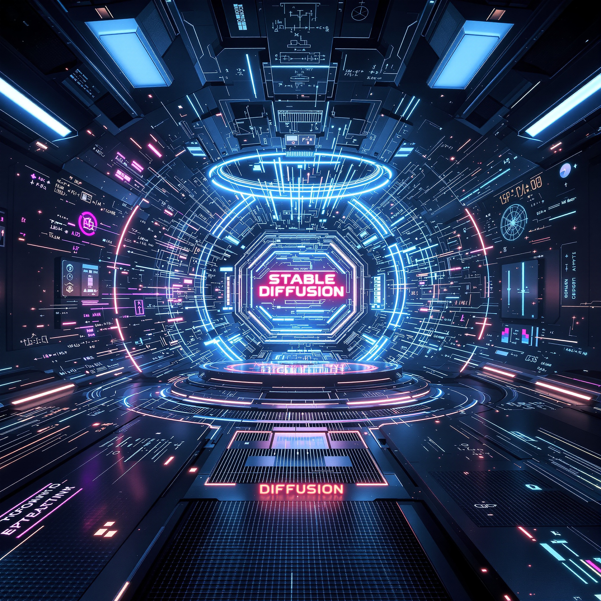

# AI-media

 

## INTRODUCTION

Welcome to **AI-media** — the creative lab where imagination meets algorithms. This folder is dedicated to exploring the intersection of art and artificial intelligence, with experiments, assets, and notes that showcase how modern AI tools can transform ideas into stunning visuals.

Inside, you’ll find:
* **Hands-on experiments** with models like Stable Diffusion and beyond, turning code into a digital paintbrush.
* **Learning notes** from Udemy courses, capturing key insights and workflows that make AI media creation accessible and repeatable.
* **Custom projects** where theory collides with practice, producing one-of-a-kind results and inspiring new directions.

Whether you’re here to learn, to create, or just to be inspired, this is the launchpad for AI-powered media innovation. Dive in, explore, and spark something unexpected.

## CONTENTS

* [Running Fooocus on your local computer](LOCAL-FOOOCUS.md)
* [Running Fooocus on Google Colab](GOOGLE-COLAB.md)
* Courses
    * [Flux Step by Step - AI Influencers & Fanvue Models FAST](courses/Flux_Step_by_Step/README.md)
    * [Realistic AI Images with Stable Diffusion & Fooocus](courses/Realistic_AI_Images_with_Stable_Diffusion_and_Fooocus/README.md)
