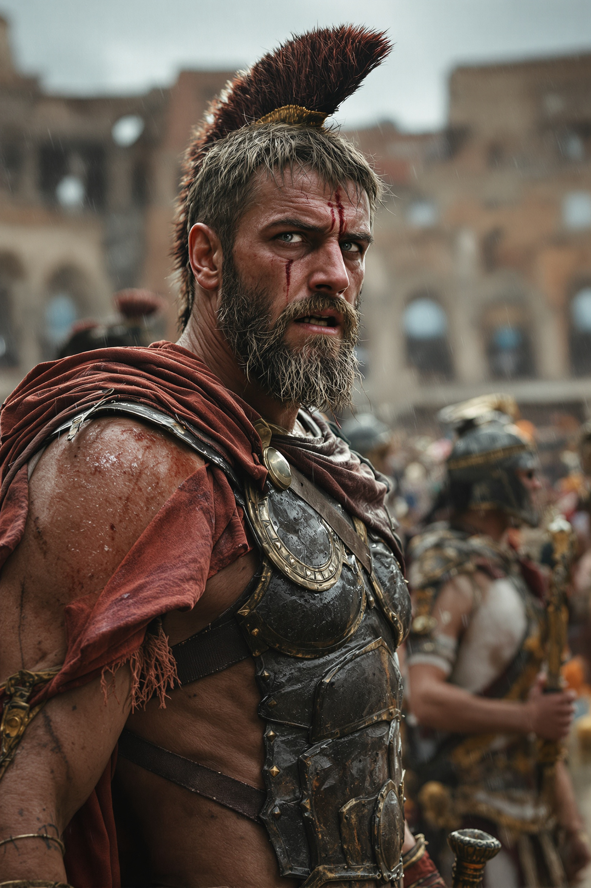
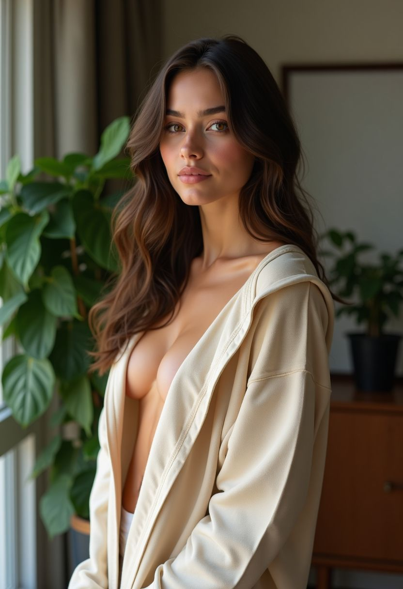
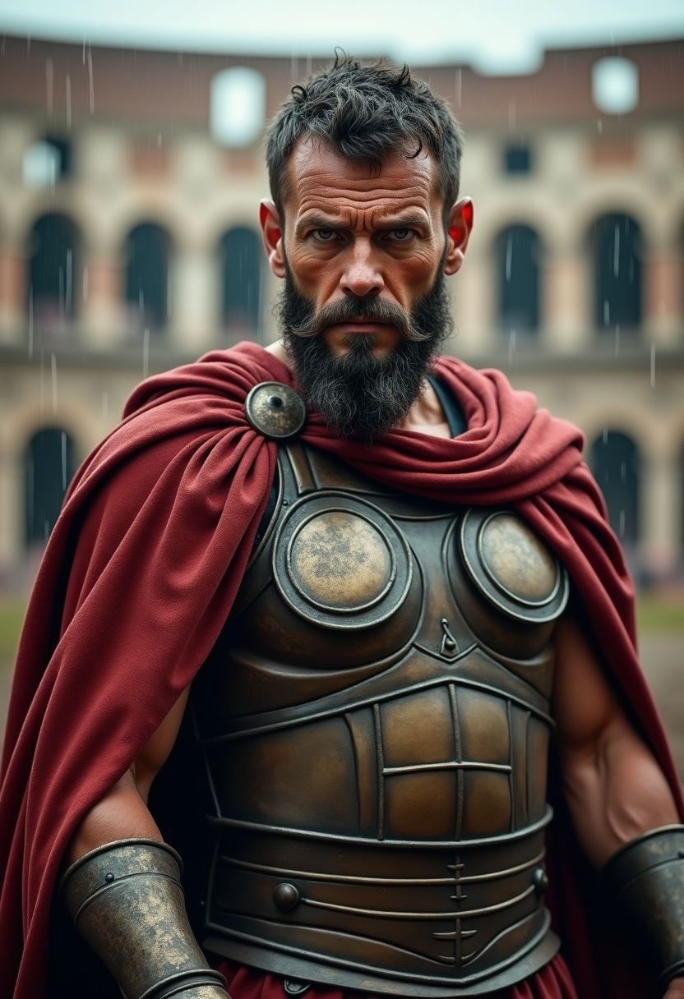
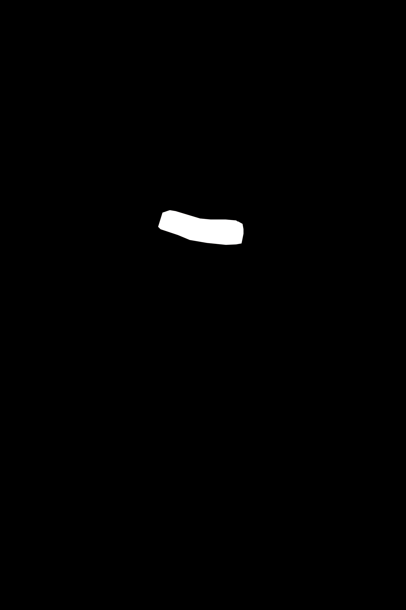
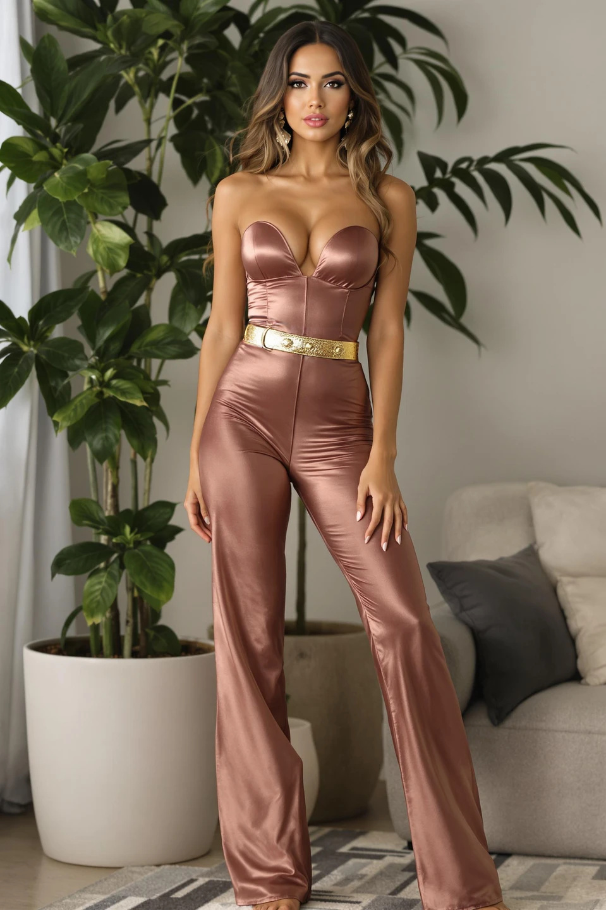
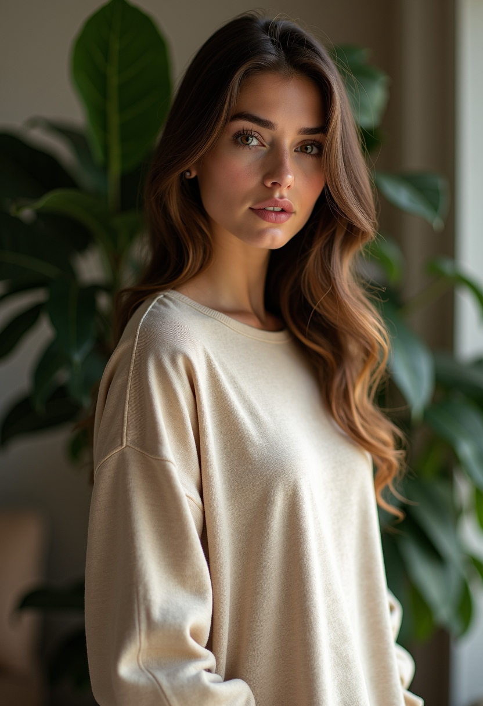
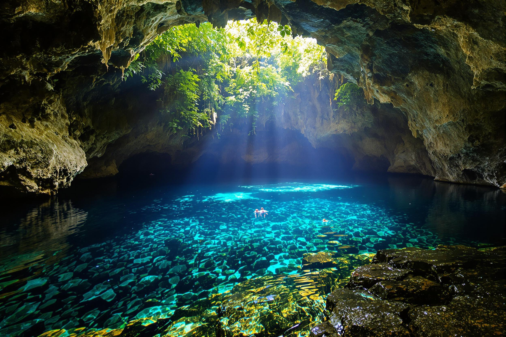
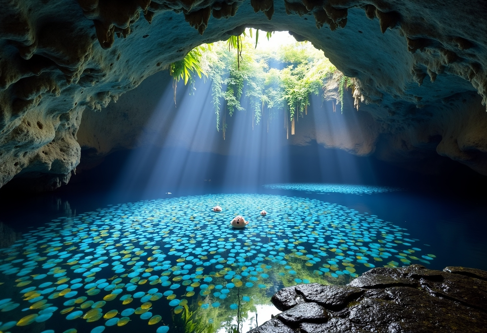
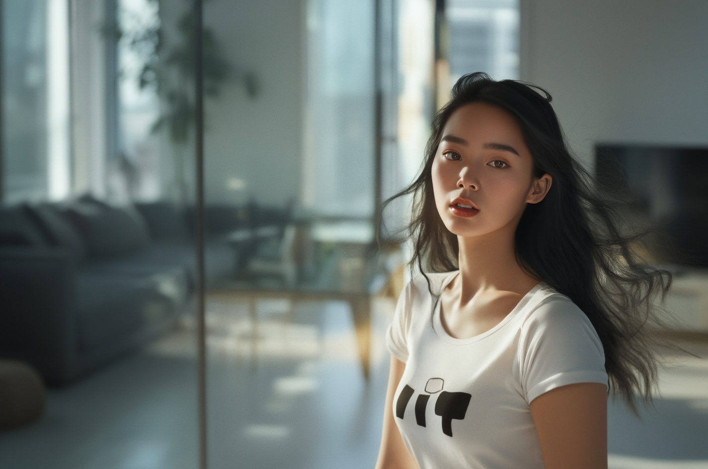

# Section 2: Learning how to use the different models of Flux family on Replicate

## Creating AI images using the Flux models

Which Flux Model to use on <a href="https://replicate.com/">Replicate</a>?
* <a href="https://replicate.com/black-forest-labs/flux-kontext-pro">Flux Pro</a>
* <a href="https://replicate.com/black-forest-labs/flux-1.1-pro">Flux 1.1 Pro</a>
* <a href="https://replicate.com/black-forest-labs/flux-1.1-pro-ultra">Flux 1.1 Pro Ultra</a>
* <a href="https://replicate.com/black-forest-labs/flux-dev">Flux Dev</a>
* <a href="https://replicate.com/black-forest-labs/flux-schnell">Flux Schnell</a>

On the search bar of Replicate type "`flux`" under "`Collections`" you will see "`Use the FLUX family of models`" and when you click on it you will come to <a href="https://replicate.com/collections/flux">the following website</a>.

On our case we will select the Fluck 1.1 Pro Ultra model. 

Then we use the following prompt:

```txt
A hyper-realistic knee-length portrait of a beautiful busty 24-year-old Italian girl, beautiful full lips, round face, sensual face, (very realistic skin structure) flawless skin, stunning brown eyes, vibrant look, small waist, athletic figure, wearing (a fitted rose gold jumpsuit) (posed near a large indoor plant in a luxury apartment living room), perfect lighting.
```

There is a paramter in the same that is called "`image_prompt`" where you upload an image where you are telling the AI what you are expecting as result.

There is another parameter that is called "`image_prompt_strength`" where we are telling the AI how much of impact should the image take.

Then we select the "`aspect_ratio`" of "`2:3`".

The we have a very important parameter named "`safety_tolerance`", this tells the AI how strict should be with the image created. If you want to generate something that is NSFW you need to set it to "`6`".

We have another parameter named "`seed`", if you leave empty the AI will select a random number.

Another important parameter is the "`raw`" checkbox. The instructor highly recommends it to have it checked as its description says "`Generate less processed, more natural-looking images`".

Then we click on "`Run`".

This is the result.

<p align="center">
    
</p>

Then we use the following prompt:

```txt
A hyper-realistic upper body portrait of a 40 year old gladiator, exhausted face, piercing grey eyes,
dirty skin, little scratches, athletic figure, wearing (a roman body armor, holding a sword in his hand) (standing in the middle of a colosseum), raining, epic scene, hero image
```

With same configuration as before.

<p align="center">
    
</p>

Then one last prompt is the following.

```txt
A hyper-realistic image of a black dragon expanding his wings and raising his head, throwing flames out of his mouth into the air, scaled detailed skin structure, orange glowing eyes, sharp teeth, dangerous, on top of a snowy mountain, cloudy sky, rain and thunderstorm, epic scene
```

<p align="center">
    
</p>

Now we give it a try to the Flux Dev model with the same prompts as before.

The Flux Dev model has a parameter that is named "`num_inference_steps`" the instructor recommends it to have it to maximum value of "`50`".

The is another parameter named "`guidance`" which is basically telling the AI model how creative can it be. If you set a low value the AI model will be more creative, if you give a higher value your image will be much more closer to your prompt. The instructor recommends going with the default value of "`3.5`". 

There is another parameter named "`output_quality`", the instructor recommends to have it with the value "`100`".

Then you need to uncheck "`go_fast`".

We tried to generate the Italian Woman with the original prompt and it failed because it was NSFW.

Then the instructor fixed the prompt as follows:

```txt
A hyper-realistic knee-length portrait of a beautiful busty 24-year-old Italian girl, beautiful full lips, round face, sensual face, (very realistic skin structure) flawless skin, stunning brown eyes, vibrant look, small waist, athletic figure, wearing (a long cosy sweatshirt) (posed near a large indoor plant in a luxury apartment living room), perfect lighting.
```

<p align="center">
    
</p>

We were able to generate the Gladiator with the original prompt.

<p align="center">
    
</p>

## Inpainting using the Flux models

Which Flux model to use?

What are **Inpaintaing** and **Outpainting**?

* **Outpainting**: Extensions outside of the image
* **Inpainting**: Changes within an image

In our case we go to the <a href="https://replicate.com/black-forest-labs/flux-fill-pro">Flux Pro</a> model and we provide the following image.

<p align="center">
    
</p>

On the "`prompt`" we provide the following text:

```txt
A golden belt, very realistic, sharp image, hight quality
```

Then on the paramter "`mask`" we do upload the following image:

<p align="center">
    
</p>

Once you click on "`Run`" the following image will appear.

<p align="center">
    
</p>

## Creating variations of AI images using the Flux models

There are some Flux models that we can use to modify the images:
* **Canny**: edge-guided generation (using Canny edge detection as structural guide)
    * <a href="https://replicate.com/black-forest-labs/flux-canny-pro">Canny Pro</a>
    * <a href="https://replicate.com/black-forest-labs/flux-canny-dev">Canny Dev</a>
* **Depth**: depth-map guided/aware generation (using depth information for preserving spatial relationships, perspective, etc.)
    * <a href="https://replicate.com/black-forest-labs/flux-depth-pro">Depth Pro</a>
    * <a href="https://replicate.com/black-forest-labs/flux-depth-dev">Depth Dev</a>
* **Redux**: image variation / restyling — take an existing image and produce variations, possibly guided by text as well.
    * <a href="https://replicate.com/black-forest-labs/flux-redux-dev">Redux Dev</a>
    * <a href="https://replicate.com/black-forest-labs/flux-redux-schnell">Redux Schnell</a>

We do start with the Canny Pro model. 

First of all we need to upload our "`control_image`" which is the following one:

<p align="center">
    
</p>

Now we set in the "`prompt`" the following text:

```txt
a hyper realistic image of a fashion model with read hair wearing a yellow dress
```

Set the "`steps`" to "`50`".

And check on "`prompt_upsampling`".

For the "`guidance`" we will go with the default which is "`25`".

And the "`safety_tolerance`" we put it to "`6`".

And this is the output generated.

<p align="center">
    
</p>

Let's now try with the Redux Dev model.

In that case we upload the following image as "`redux_image`":

<p align="center">
    
</p>

And this was the result:

<p align="center">
    
</p>

Then we try with the following image:

<p align="center">
    
</p>

And this is the result:

<p align="center">
    
</p>

And then we try the <a href="https://replicate.com/black-forest-labs/flux-depth-pro">Flux Depth Pro</a> model.

In our case we provide the following image as "`control_image`":


<p align="center">
    
</p>

as prompt we put the following text:

```txt
a hyper realistic image of a black haired influencer girl wearing a T-shirt
```

* Check the "`prompt_upsampling`" checkbox
* As "`guidance`" we will stick to default which is "`7`"
* Set the "`safety_tolerance`" to "`6`"

As a result we have the following image:

<p align="center">
    
</p>

