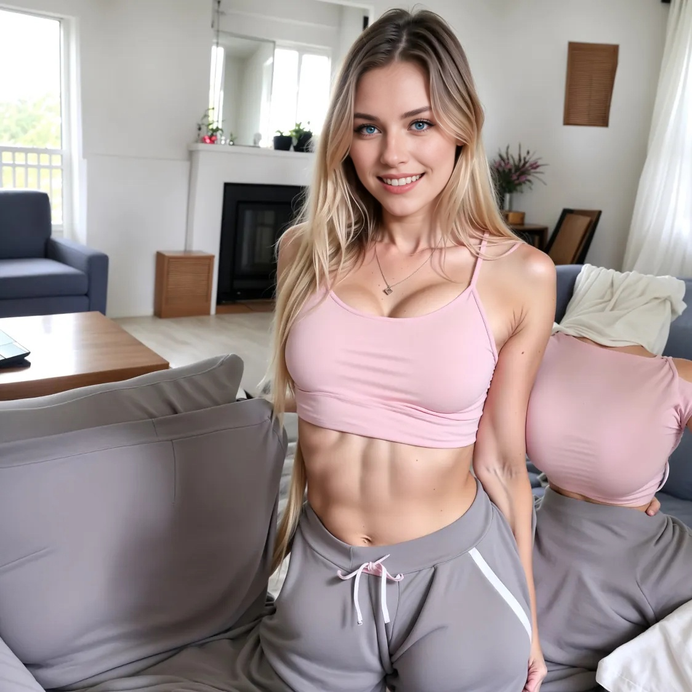

# Section 10: Bonus Section: First Steps into AI Video Creation

We upload the following picture to <a href="https://klingai.com">Kling AI</a>, to the Video Generation section under "`Image to Video`".

The in the prompt section we provide the following text "`Excited french girl dancing in front of the camera`".

Also, in the "`Negative Prompt`" section we provide "`blur, distortion, disfigurement, low quality, grainy, abstract`".

Then you click the "`Generate`" button.

<video width="640" height="360" controls>
  <source src="./images/section10/Professional_Mode_Excited_french_girl_dancing_in_f.mp4" type="video/mp4">
  Your browser does not support the video tag.
</video>

<video width="640" height="360" controls>
  <source src="./images/section10/Professional_Mode_Excited_french_girl_dancing_in_f_2.mp4" type="video/mp4">
  Your browser does not support the video tag.
</video>

Videos generated based on the previous image
* <a href="./images/section10/Professional_Mode_Excited_french_girl_dancing_in_f.mp4">Video 1</a>
* <a href="./images/section10/Professional_Mode_Excited_french_girl_dancing_in_f_2.mp4">Video 2</a>
