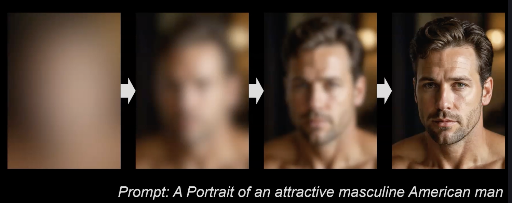

# Introduction to the ai tool Fooocus and Google Colab

Foocus is a powerful, free-to-use interface for creating AI images, based on the open-source software Stable Diffusion.

-> Stable Diffusion is the open-source software that generates the actual images in the background

-> Fooocus is the interface we will be using

At this point, it's absolutely unnecessary to understand Stable Difussion in detail. Here's a simple example to help you grasp the basic principle.

Stable Difussion always starts with a random noise, no matter what text (or even image) we provide to it as the prompt.




This works because Stable Diffusion, through a trained neural network, has learned to recognize patterns in increasingly noisy images.

By reversing the process, clear images are generated from these noisy images by gradually reducing the noise step by step.


Just keep this principle in mind:

Stable Difussion "recognizes" your prompt within even extremely noisy images and generates the finished image from it.

This gives us incredible freedom because we don't have to show the software exactly what to do; it's enough to give it an "idea".

We'll use this specifically later in the inpainting session.

**Why using Fooocus?**
* Because it's free or extremely low-cost usage in combination with <a href="https://colab.research.google.com/">Google Colab</a>.
* User-friendly interface with advanced settings
* Excellent image quality and photorealistic image generation
* Wide selection of checkpoints models and LoRAs

Go to <a href="https://colab.research.google.com/github/lllyasviel/Fooocus/blob/main/fooocus_colab.ipynb">the following Jupyter Notebook</a>.

You make a copy of the Jupyter Notebook <a href="https://colab.research.google.com/drive/1ad2m9uqFt0femf1BPEtj_CVAZv3k56lt#scrollTo=VjYy0F2gZIPR">this is my copy</a>.

You press the play button that appears at the left of the python code and you need to wait until you see the public URL something like:

```txt
Running on public URL: https://9b701c85cd07036a67.gradio.live
```

Putting the next Prompt "`a cute little animal`" in Fooocus we create the following images.


and


In this section we will learn how to install different Base Models in Fooocus.

A Base Model is basically something that we can install in our Google Colab to create different outputs. For example there is a model called "Realism Engine SDXL" which creates very nice and realistic images.

We will find plenty of models in <a href="https://civitai.com/">CIVIT AI</a>.

Once you start your remote Fooocus.

Add another line of code and add the following in that line of code:

```txt
!wget -O /content/Fooocus/models/checkpoints/realismEngineSDXL_v30VAE.safetensors https://civitai.com/api/download/models/293240
```

This line of code will install the Base Model with name "Realism Engine SDXL".

Then you need to add the following line of code:

```txt
!python entry_with_update.py --share --always-high-vram
```

Below the line of code that installs "Realism Engine SDXL".

You only need the name of the file. In that case, search for the model you want to download, start the download, copy the name of the file and stop the download.

The second piece of information that we need is a 6 digit number in the URL of the model.

```txt
https://civitai.com/models/152525?modelVersionId=293240
```

In our case we need to grab the number "`293240`".

This is the code we need to use to install "Realism Engine SDXL" in our Fooocus.

```txt
!pip install pygit2==1.15.1
%cd /content
!git clone https://github.com/lllyasviel/Fooocus.git
%cd /content/Fooocus
!wget -O /content/Fooocus/models/checkpoints/realismEngineSDXL_v30VAE.safetensors https://civitai.com/api/download/models/293240
!python entry_with_update.py --share --always-high-vram
```


