<!--
  
-->
# Section 3: The most important functions of Fooocus and how to use them

**The most important functions in Fooocus**
* Text Prompt
* Image Prompt
* Upscale and Variation
* Inpainting and Outpainting

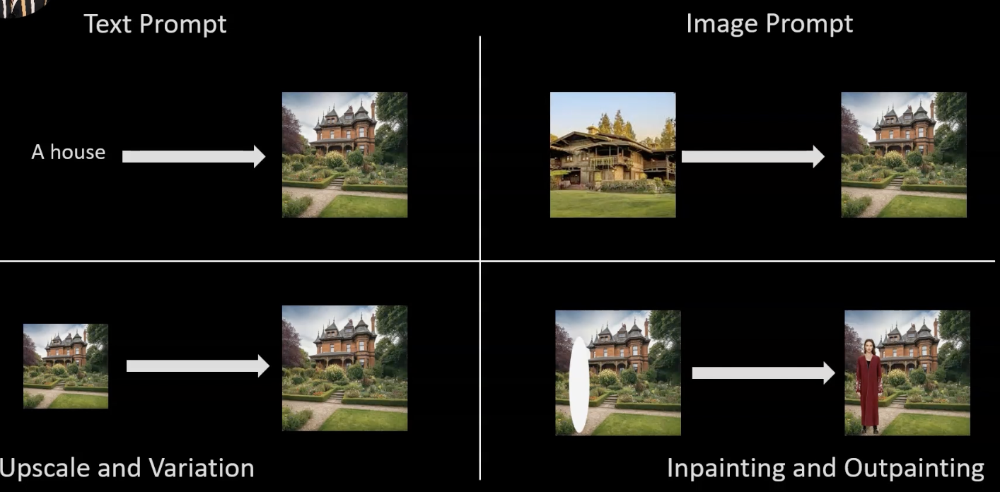

## Text Prompt

In this case we will create an image from a text given.

In the UI of Fooocus, when you check the "`Advanced`" checkbox you will see more options to the right.

One of those options is the text box named "`Negative Prompt`" which is basically you describing what you do not want to see in the image.

Then you have the "`Output format`" section where you can decide which is going to be the format of the image. 

Then you have the section named "Image Number" where you can select how many images you want to generate with the same prompt the range of images goes from 1 until 32.

Then you have the section named "Performance" in this case it is better to go with "Quality".

Then you have a section named "Aspect Ratios" where you can select the aspect ratio of your image.

Then you have other tabs in the UI of Fooocus which are:
* Styles: You will see a lot of checkboxed with different styles if you hover over the styles you will see a preview of the image.
* Models: Here you can select the model you want to use to generate images in our case we will select "`realismEngineSDXL_v30VAE.safetensors`".
* Advanced: More advanced options to use.

With the following protmp "`A hyper realistic portrait of a 80 year old guru wearing a yoga outfit standing in a temple in India`" we were able to generate the following images.

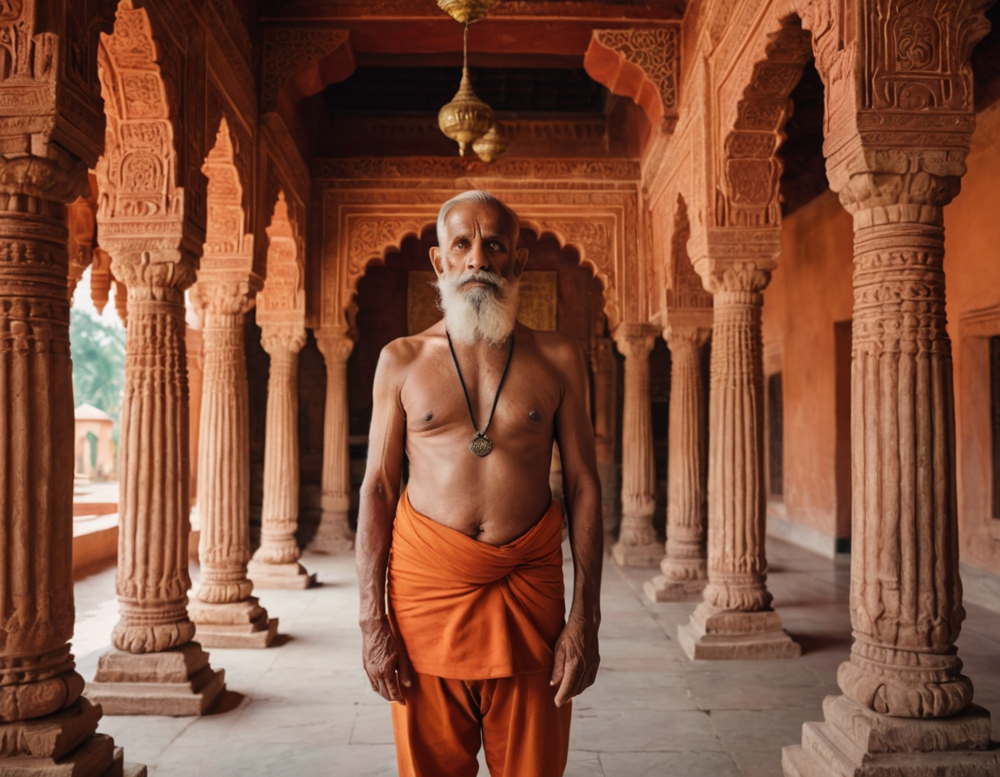
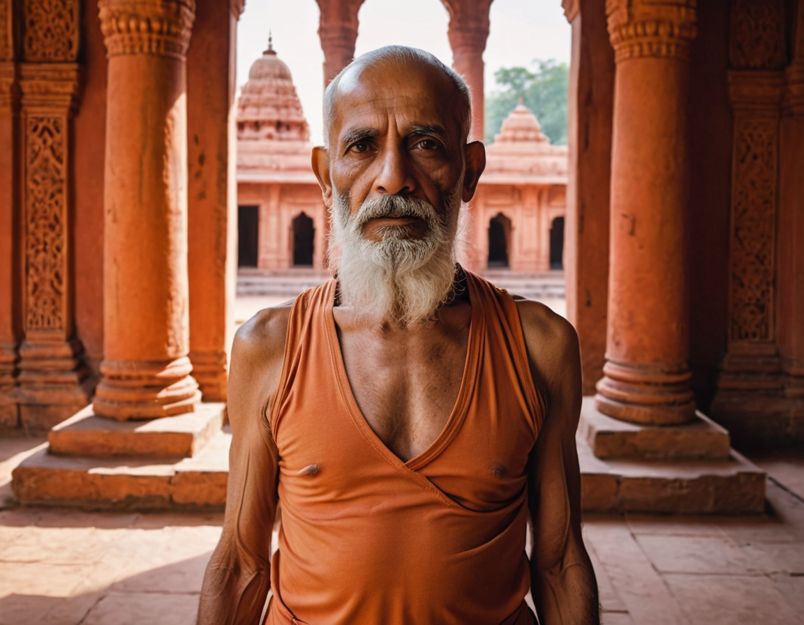
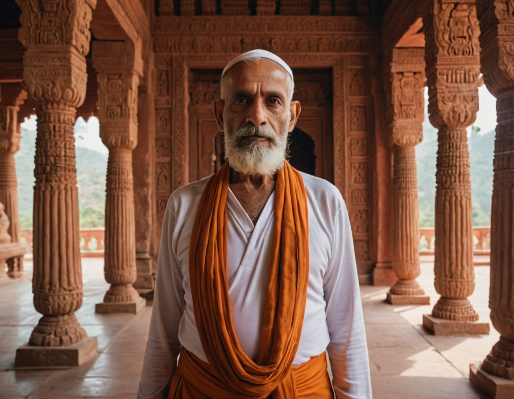

## Image Prompt

In our case we will check the checkbox with name "Input Image" then you will that a bunch of tabs appear below. One of the tabs is called "Image Prompt", in that tab use the top left section to upload the following image.

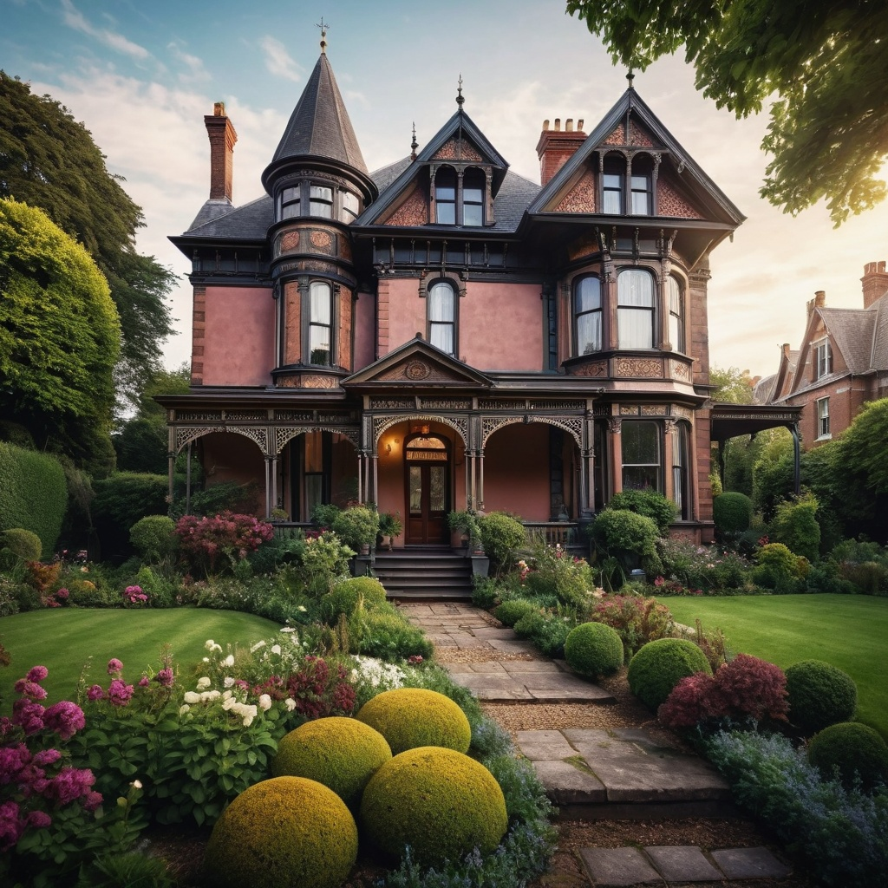

Then adjust the "Weight" of that image to "`0.9`". Then press the "Generate" button. When it is done you will see something like the following image.

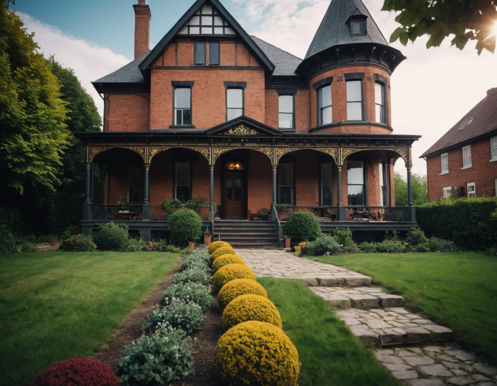

What happens here is that you are giving Fooocus an image of reference and Fooocus will generate images that are similar to the one provided.

Next we will try "Face Swap" which is basically replacing the face of a person in a photo. Let's see it with an example.

In our case, same as before you need to check "Input Image" checkbox, then on the "Image Prompt" tab you have to upload on the top left section an image of a face. When you upload that image then set "Stop At" to '`1`' and set "Weight" to "`1.19`". 

Then we go to the tab named "Inpaint or Outpaint" and select the method (that is at the bottom) "Improve Detail (face, hand, eyes, etc)". Then in this section we upload our body image.

Then we mark the face of the body image. 

Then you need to go to the "Advanced" tab (at the left of the UI of Fooocus), then you need to check the checkbox named "Developer Debug Mode", then you need to go to the "Control" tab and check the checkbox with name "Mixing Image Prompt and Inpaint". And this checkbox will connect the "Inpaint or Outpaint" tab to the "Image Prompt" tab. 

In our case this is the result of the Face Swap we did.

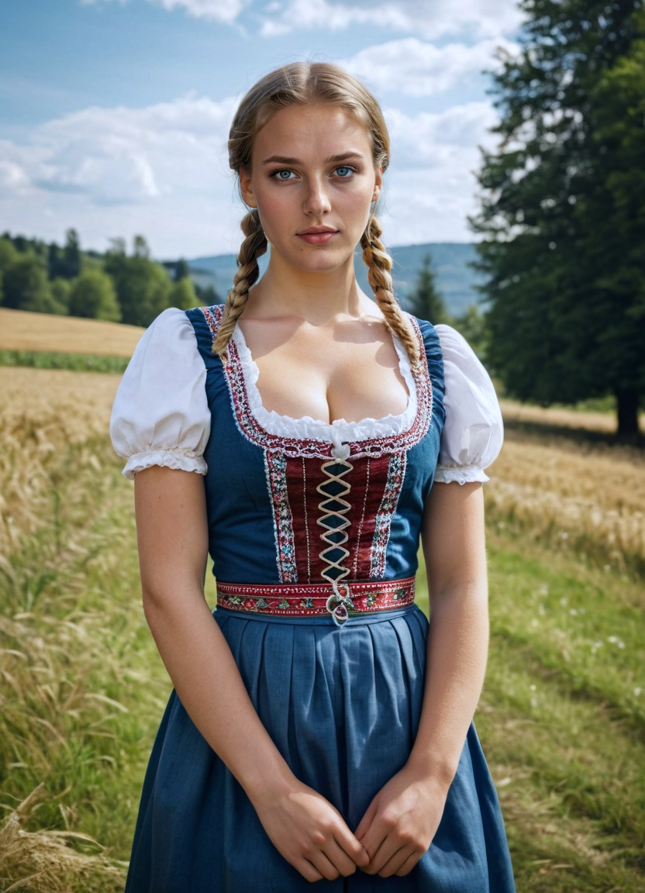

## Pyra Canny

Pyra Canny is a control network that analyses the form / the pose of a given image and applies it to your target image.

Go back to the "Image Prompt" tab:
* In the top left section we upload the image of the person you want to alter the pose
    * Leave "Stop At" parameter as "`1`"
    * Leave "Weight" parameter as "`1.19`"
* On the top right section we upload the image of the pose we want to apply
    * Check the "PyraCanny" toggle
    * Leave the values of "Stop At" and "Weight" as default.
* Then you add the following prompt "`a german girl posing on a field in a traditional green german dress`"
* Then check the aspect ratio 13:18

## Seed Number

When creating images with AI, randomness plays an important role in enabling variations and creativity. A random number generator produces a random number that defines the **starting point** for the image generation. This number is called the SEED number or just SEED.

The same SEED number means the process starts from the **same starting point**.

This is what you can do with the SEED number.

## Upscale and Variation

### Upscale

Check the checkboxes for "Input Image" and "Advanced", then you go to the tab named "Upscale or Variation".

Then you upload the image you want to upscale, and select "`Upscale (1.5x)`". Then you need to uncheck the "`Random`" checkbox and leave it with the value "`0`". We need to use the SEED number as "`0`" to avoid changing the image too much.

The result is the following.

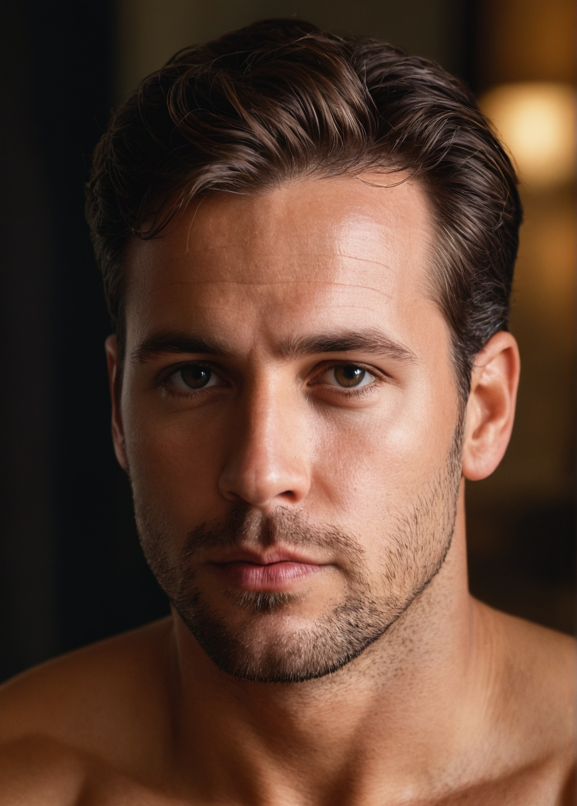

Now you need to go to the "`Advanced`" tab, you select the "`Developer Debug Mode`" checkbox and go to the slider called "`Forced Overwrite of Denoising Strength of "Upscale"`", then type in that slider the following value of "`0.01`". This helps to get the face exactly as it is. 

The result is the following.

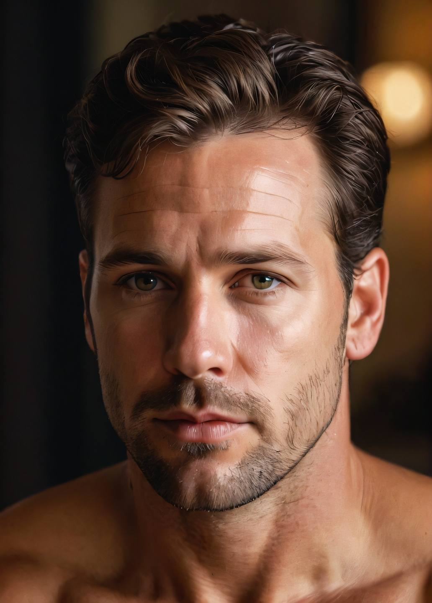

### Variation

Variation is to generate some variations of the image provided. 

Same as before you need to go to the "`Upscale or Variation`" tab at the bottom and select "`Vary (Subtle)`". If you use "`Vary (Strong)`" you will get results that have nothing to do with the given image.

Then as prompt you provide "`a golden old sports car`".

Then we can check back the "`Random`" checkbox.

The result is something like the following.

### Inpainting

**Inpainting** means fixing or changing a part inside the picture. Like if you drew a picture of a dog but the nose looks weird — you can paint over just the nose to make it better.

Fooocus looks at the rest of the picture and magically fills in that spot so it looks like it belongs there. Think of it like using an eraser and repainting just a little part.

In our case we go to the "`Inpaint or Outpaint`" tab and we upload the image we want to inpaint to.

Then we are going to inpaint a sleeping dog on the floor of our office image.

Then we select the default method which is "`Inpaint or Outpaint`". 

Then in the prompt section you type "`a sleeping dog on the floor`".

The result is something like the following.

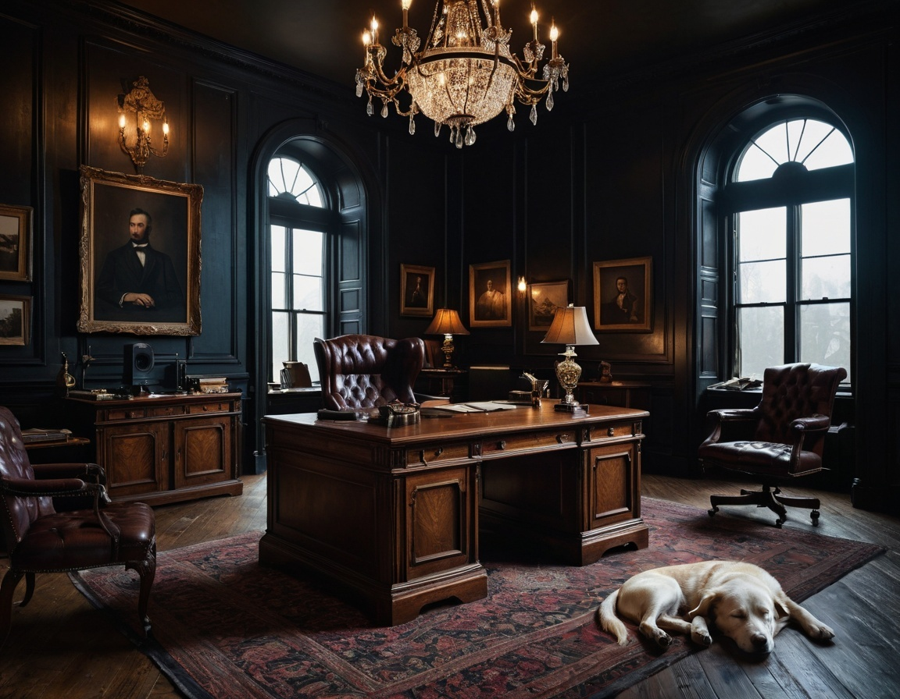

Now we are going to use the Method named "`Modify Content (add objects, change background, etc.)`" and put the same prompt we used before in the text box named "`Inpaint Additional Prompt`".

The result is the following.

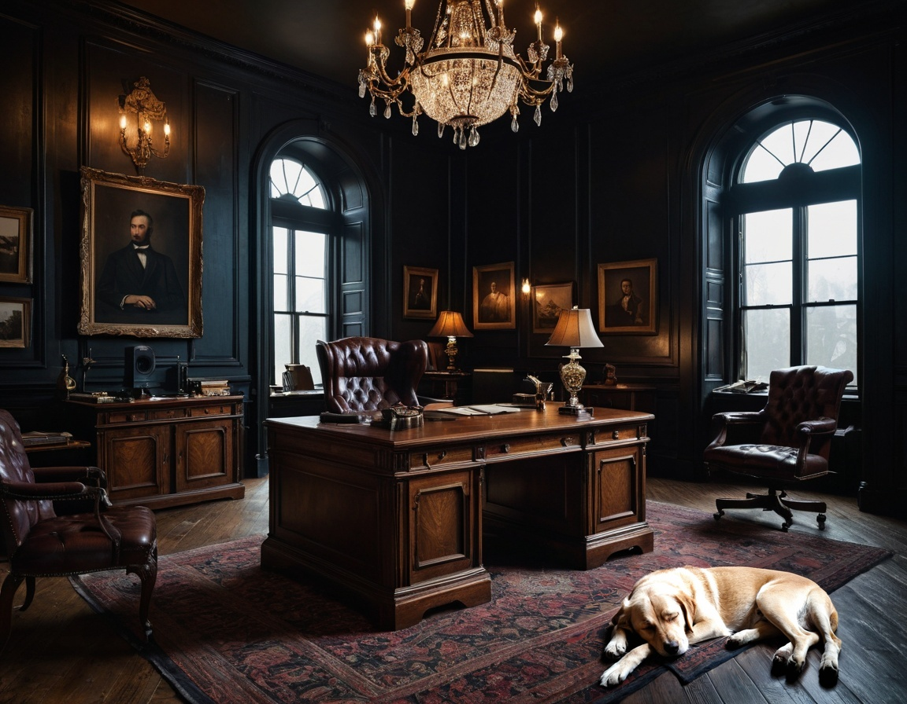

Then we select the default method of "`Inpaint or Outpaint (default)`", we mark the leather chair in the office photo and add as prompt the following "`a green leather chair`", press the "`Generate`" button. 

The result we got was as follows.

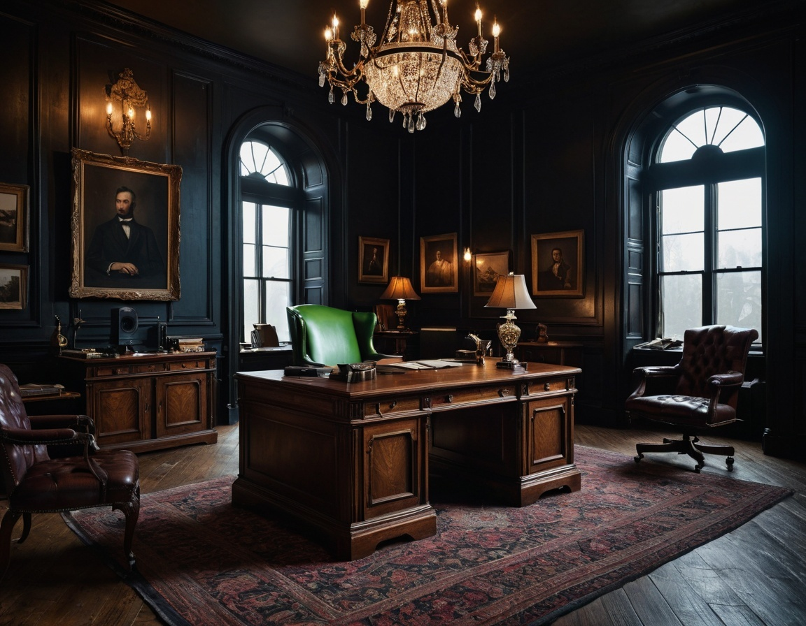

Now we are going to improve some details in the following image.

We upload to Fooocus the image to improve in the "`Inpaint or Outpaint`" tab. We mark the face of the image, marking the eyes, the chin, the ear. 

As method we select "`Improve Detail (face, hand, eyes, etc.)`". Then on the "`Inpaint Additional Prompt`" text box we can put the following prompt "`beautiful face of a german girl`". Then we press "`Generate`".

The result is as follows.

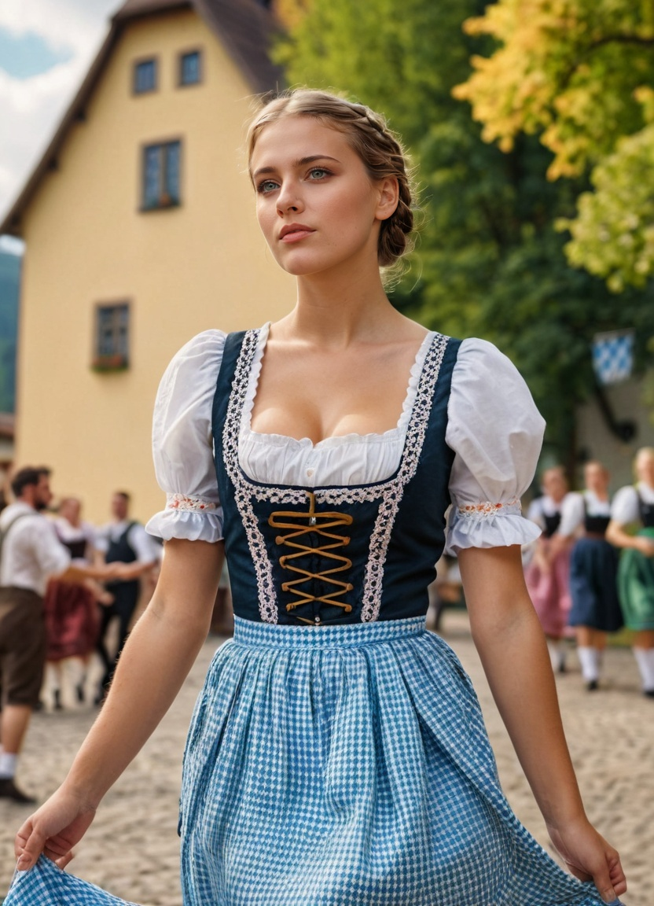

### Outpainting

**Outpainting** means expanding the picture outside its edges.

Imagine your drawing ends at the edges of the paper, but you want to see what’s outside — maybe more sky, more trees, or the rest of the dragon’s tail. 

Fooocus will guess what should be there and adds more to the picture around it.

It’s like making your paper bigger and letting Fooocus continue the drawing!

Then we will upload again our office image to the "`Inpaint or Outpaint`" tab. Then select the Method "`Inpaint or Outpaint (default)`". Then you mark the right side of the image. Then in the "`Outpaint Direction`" section you select "`Right`".

Then you put in the Prompt text box what you want to appear in the extension of the image, for example you could type in "`a well dressed old business man in a suit`". Then you press "`Generate`".

The result is as follows.

### Uploading a mask for very precise inpainting

In this case we need to check the following checkboxes:
* "`Input Image`"
* "`Enhance`"
* "`Advanced`"

Then you go to the "`Inpaint or Outpaint`" tab and check the checkbox with name "`Enable Advanced Masking Features`". When you check that checkbox there will appear 2 areas that will appear, one for the image you want to deal with (at the left) and then an area to upload a mask (at the right).

A **mask** is a negative of the image where the white parts are the things we are going to edit. The areas we do not want to edit are black.

Now, you upload the image of the car and the corresponding mask.

Then for the method you need to select the default one, which is "`Inpaint or Outpaint (default)`".

Then you put in the Prompt text box what you want to do, something like "`a yellow painted race car with a crazy design`". Then press "`Generate`".

The result I had was something like this.

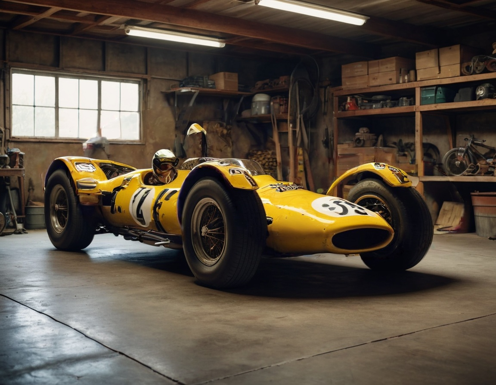

There are several ways to create masks. You can use <a href="https://www.canva.com/">Canva</a> or <a href="https://www.gimp.org/">Gimp</a>.

Creating a mask using Gimp.
1. Import the image you want to create a mask for
2. You use the selecting tool to go around the shape you want to create a mask for (a car, a person, etc.)
3. Then you fill in the area selected in WHITE
4. Then you go to selection and click on Invert selection, now everything else is selected
5. Then you fill in the area selected in BLACK
6. The mask is done. You can use any shape you want.

