# Section 5: Expert Knowledge

## How to write perfect prompts

2 different prompts:
* Prompt A: "`A beautiful girl`"
* Prompt B: "`A full body portrait of beautiful 28 year old blonde girl, beautiful smile, atheltic body type, wearing a dark blue formal dress, traditional church background, wedding, sunshine`"
    * What makes this Prompt better? In this Prompt we have:
        * Intention
        * Details
        * Context
        * Complete Scene

Is providing more details always better?
* Not necessarily
* Rule of thumb: **As short as possible, as long as necessary**
* The beginning of the prompt is given more weight
* Too many words lead to poorer results
* Around **60 words** is the maximum for effective prompts

Example of a "perfect" Prompt:

```txt
A hyper realistic portrait of a beautiful Mexican 29 year old Latina girl with full dark brown hair, full lips, sensual smile, messy bun hairstyle, small waist, long legs, athletic body, hourglass shape, flawless skin, perfect clear skin, sensual apperearance, wearing (grey crop top, tank top), grey sweatpants, sitting on bench, modern gym, Instagram post, social media picture, HD32K, incredibly detailed, uhd, vibrant colors, perfect saturation
```

(63 words)

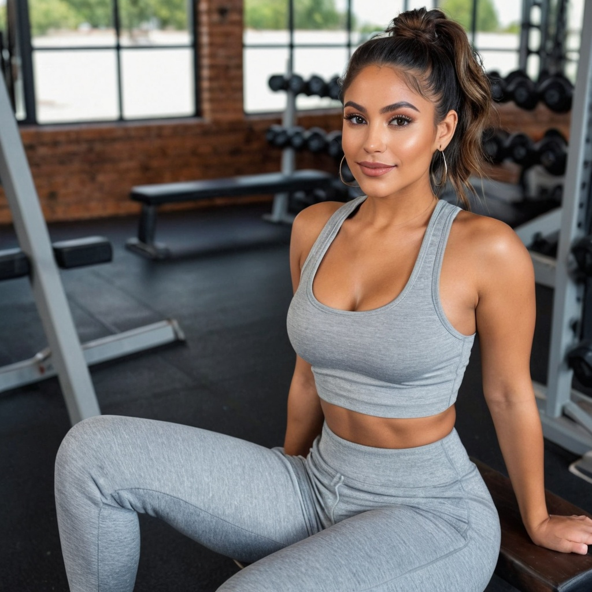

We can use the following "trick" to increate the weight of a word or term in the Prompt

```txt
A hyper realistic portrait of a beautiful Mexican 29 year old Latina girl with full dark brown hair, full lips, sensual smile, messy bun hairstyle, small waist, long legs, athletic body, hourglass shape, flawless skin, perfect clear skin, sensual apperearance, wearing (grey crop top, tank top), grey sweatpants, sitting on bench, (modern gym:1.4), Instagram post, social media picture, HD32K, incredibly detailed, uhd, vibrant colors, perfect saturation
```

In this case we have increased the weight the of the term "`modern gym`" this will affect the image in a positive way showing a more modern gym.

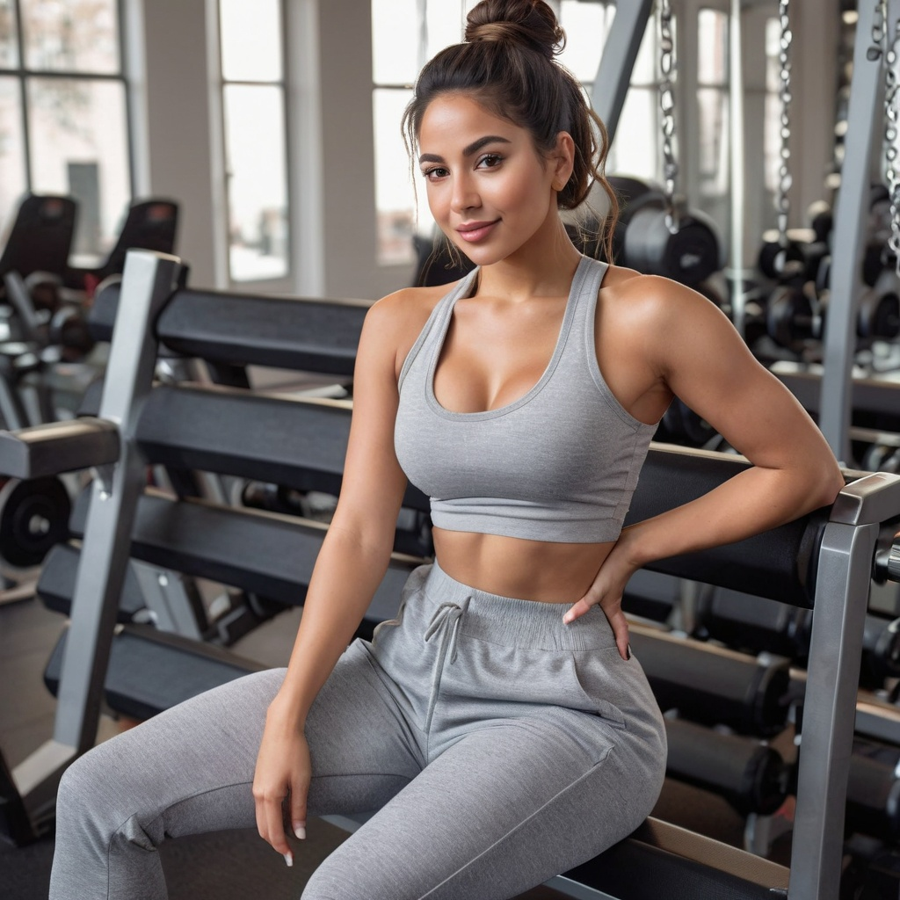

If try to get the weight of the term above "`1.4`" will generate "crazy results". I did a test with "`2.5`" and it generated a nonsensical image.

Important to take into account:
* AI works with context
* Anything you don't want in the image should not be included in the prompt
* Use the negative prompt for that purpose

Prompts:
* **Prompt A**: "`A 80 year old senior without hair`"
* **Prompt B**: "`A bald 80 year old senior`"
    * **Negative Prompt**: "`hair`"

**Prompt A**

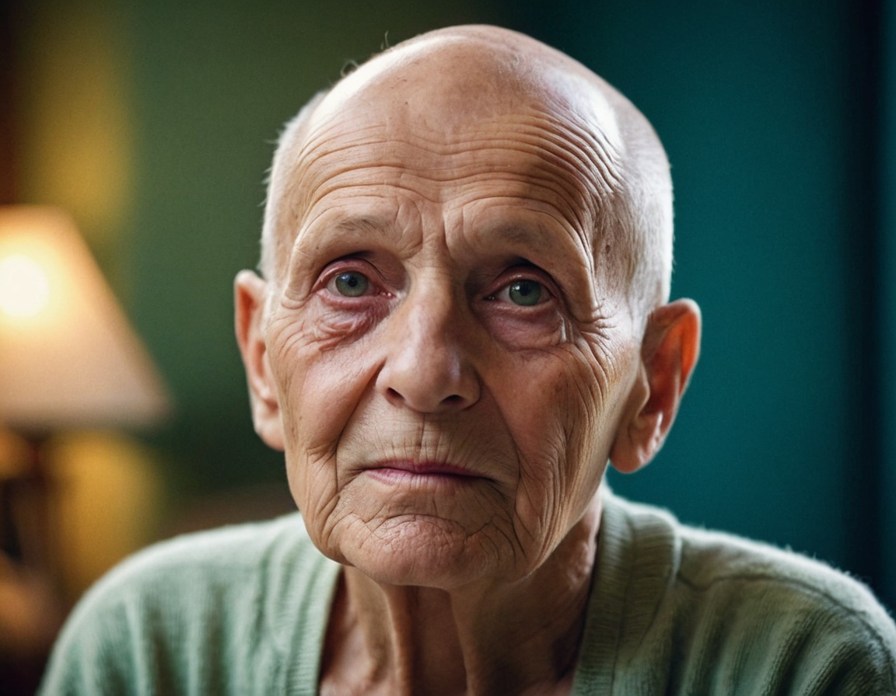

**Prompt B**

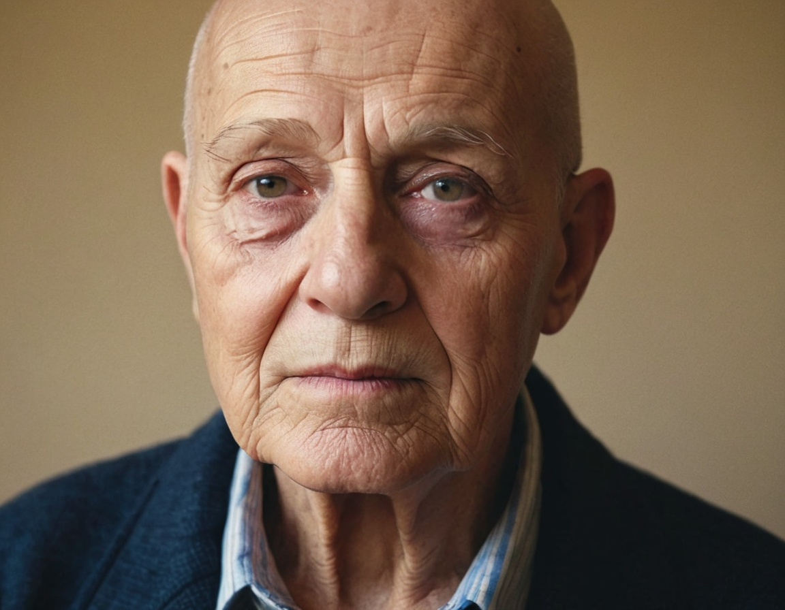


I tried with the Negative Prompt "`hair`" and still the image has some hair.

If you want some inspiration for Prompts, please check <a href="https://civitai.com/images">CIVITAI Images</a>.


## Context based prompts

**Context for Special Results**
Stable Diffusion infers a context based on the words in the prompt:
* Use this to achieve certain results that you cannot describe perfectly (e.g., emotions)
* Examples for **Positive** contexts: Wedding, Anniversary, Birthday, Celebration, Vacation, Holiday
* Examples for **Negative** contexts: Funeral, War, Horror, Sinister, Depression

Let's do a couple of example with the same Prompt but changing a word:

* **Prompt A**: "`A beautiful girl walking down the street, Depression`"

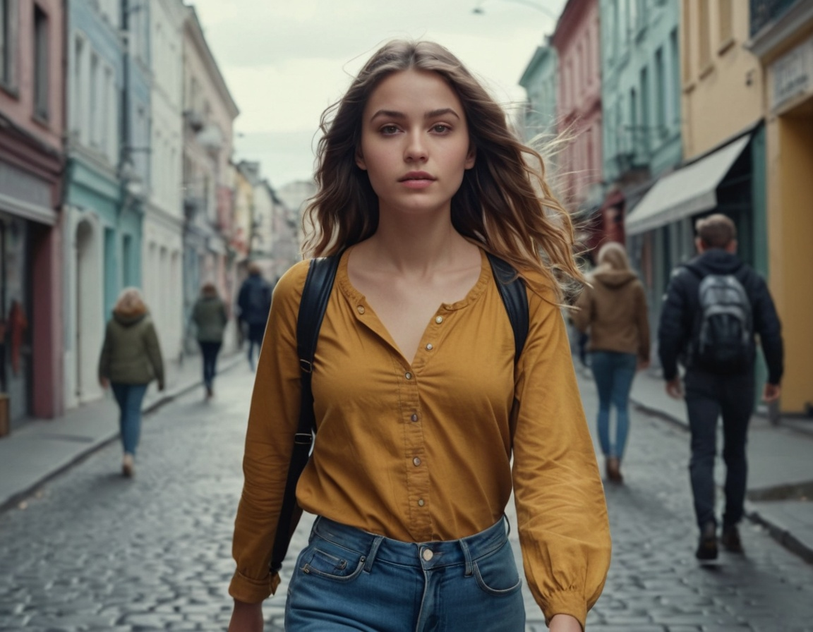

* **Prompt B**: "`A beautiful girl walking down the street, Celebration`"

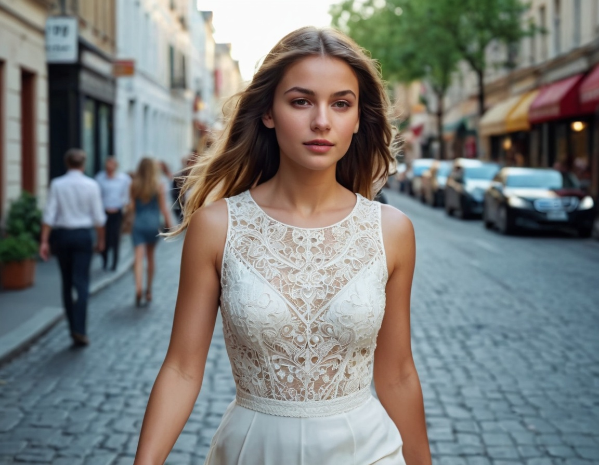


## Use different styles in Fooocus

We are to add another style which is "`SAI Line Art`", so in total we will be using the following styles in our Fooocus:
* "`SAI Line Art`"

We use the following Prompt: "`a beautiful paradise bird`".

The result is as follows.

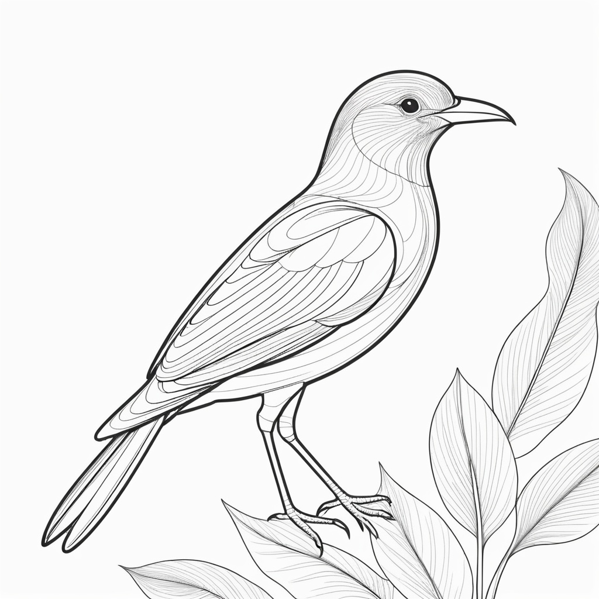

Then I add to the mix the style "`SAI Anime`" so the styles we are going to use are:
* "`SAI Anime`"

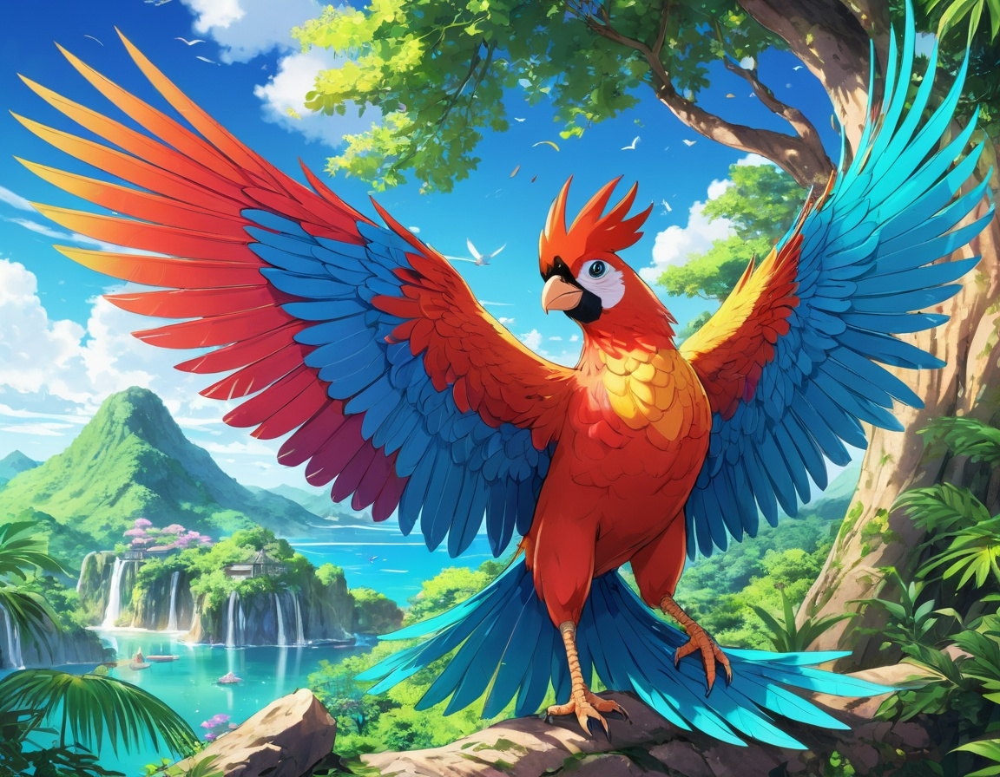

Then will try the style named "`Steampunk 2`" the result of the image with the same Prompt will be as follows.

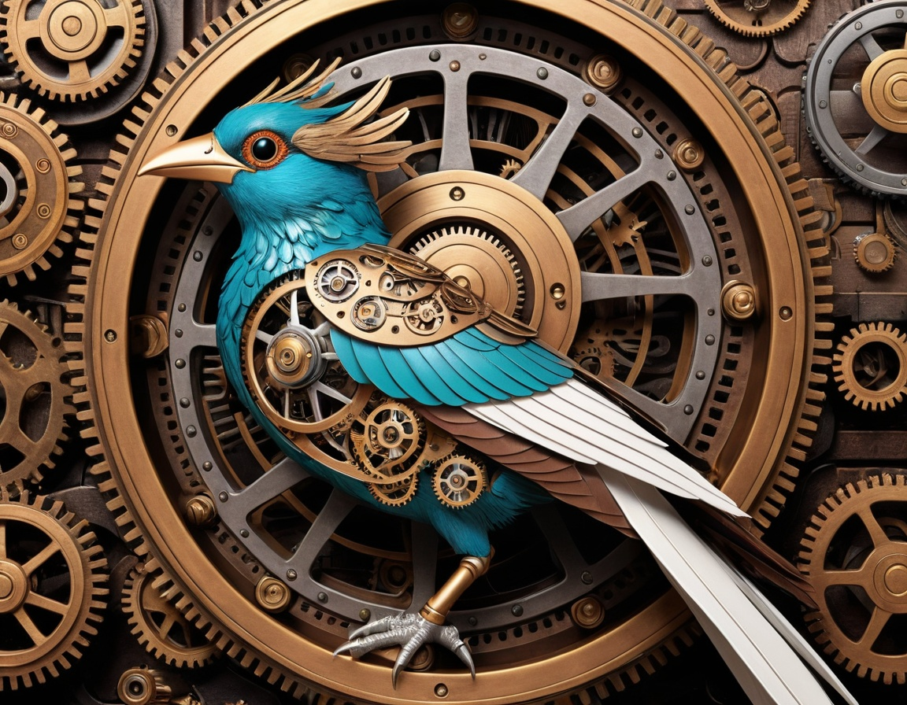


## Using SD1.5 base models in Fooocus

* Normally you could only run SDXL Basemodels in Fooocus. But with a little trick you can also run SD1.5 Basemodels.
* SDXL and SD1.5 are just different versions of Stable Diffusion. This is all you have to know at that point.
* The trick is to use a SD1.5 Basemodel as a refiner Model together with a SDXL Basemodel.
* Lets check that out in Fooocus.

Now we will use the following base model which is called <a href="https://civitai.com/models/4201/realistic-vision-v60-b1">Realistic Vision V6.0 B1</a>.

In our case we are going to use the following code in our colab.

```txt
!pip install pygit2==1.15.1
%cd /content
!git clone https://github.com/lllyasviel/Fooocus.git
%cd /content/Fooocus
!wget -O /content/Fooocus/models/checkpoints/realismEngineSDXL_v30VAE.safetensors https://civitai.com/api/download/models/293240
!wget -O /content/Fooocus/models/checkpoints/realisticVisionV60B1_v51HyperVAE.safetensors https://civitai.com/api/download/models/501240
!wget -O /content/Fooocus/models/loras/lingerie_loha.safetensors https://civitai.com/api/download/models/362360
!wget -O /content/Fooocus/models/loras/retro_neon_illustriouos.safetensors https://civitai.com/api/download/models/1082049
!wget -O /content/Fooocus/models/loras/pumpsheel.safetensors https://civitai.com/api/download/models/100982
!python entry_with_update.py --share --always-high-vram
```

Pay attention to put the "`Realistic Vision V6.0 B1`" in the folder "`/content/Fooocus/models/checkpoints/`" otherwise will not work.

Then in the "`Models`" tab you need to select as a "`Base Model (SDXL only)`" the model "`realismEngine...`" and as a "`Refiner (SDXL or SD 1.5)`" the model "`realisticVision...`".

Then you will see another slider named "`Refiner Switch At`" with the following description "`Use 0.4 for SD1.5 realistic models; or 0.667 for SD1.5 anime models; or 0.8 for XL-refiners; or any value for switching two SDXL models.`" this tells Fooocus when to change from the SDXL model to the SD 1.5 model.

Then we use the following Prompt "`A beautiful paradise bird`" and the result is the following.


## Increase the Speed of Fooocus

In our case we can select a different CPU when connecting to the runtime in Google Colab.

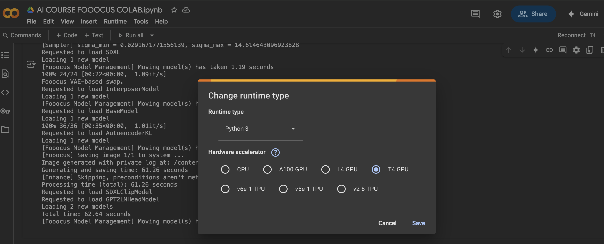

You can select the CPU named "`A100 GPU`" which uses 10x resources and will generate the image in a matter of seconds.

## Fixing Images - Hands

**General Tips**
* Avoid hands (use negative prompt)
* Avoid objects in hands
* Don't aim for perfectionism
* Keep it simple (crop the image, regenate the image)
* Slightly bad hands can be fixed to improve detail (inpainting)
* Find an easy solution for the really bad hands

The instructor is recommending to create a gallery of nice hands and change them with the bad hands. It takes some photo editing skills but most of the time it's the fastest solution for really messed up hands.

### Inpainting

We import the photo we want to fix in the "`Inpaint or Outpaint`" tab, then we mark the hand we want to fix. Then on the "`Method`" which is down we select "`Improve Detail (face, hand, eyes, etc.)`".

Then in the "`Inpaint Additional Prompt`" we write "`detailed female hand`" (in the case of fixing the hand of a woman).

Then we create multiple images like 5 or higher number.

**🧠 What is "Inpainting"?**
Inpainting is when an AI fills in part of an image — like fixing or changing a selected area. You usually use it when you:
* Erase or mask a part of an image
* Want the AI to "paint in" that missing part using your prompt

For example:
```
You remove someone's eyes from a photo and prompt "green eyes" — the AI inpaints green eyes in the empty spot.
```

**💡 What is "Denoising Strength"?**
**Denoising Strength** controls **how much the AI changes the image** during the inpainting process.
* **Low value (e.g. 0.2)** = The AI makes **small changes**, keeping most of the original image.
* **High value (e.g. 0.8 or 1.0)** = The AI makes **big changes**, following your prompt more aggressively.

**🧪 What does this mean in "Developer Debug Mode" of Fooocus?**
In **Developer Debug Mode**, Fooocus gives you **extra fine control** over things like Inpaint Denoising Strength — this is useful for debugging or achieving precise edits.

**✅ Simple Examples**
**Example 1: Fixing a Face**
* You paint over a face and want to change the expression slightly.
    * **Denoising Strength 0.2**: Just minor changes, keeps facial structure.
    * **Denoising Strength 0.9**: Might totally change the face and expression.

**Example 2: Changing Clothes**
* You mask a shirt and prompt "`leather jacket`".
    * **Denoising Strength 0.3**: Might look like the original shirt with leather texture.
    * **Denoising Strength 0.7**: AI is more likely to replace the shirt entirely with a new leather jacket design.

**🧭 TL;DR**

| Denoising Strength | Effect |
| :----: | :---- |
| `0.1 – 0.3` | Minor edits; keeps image close to original |
| `0.4 – 0.6` | Balanced — a bit of both worlds |
| `0.7 – 1.0` | Major changes; follows your prompt more strongly |

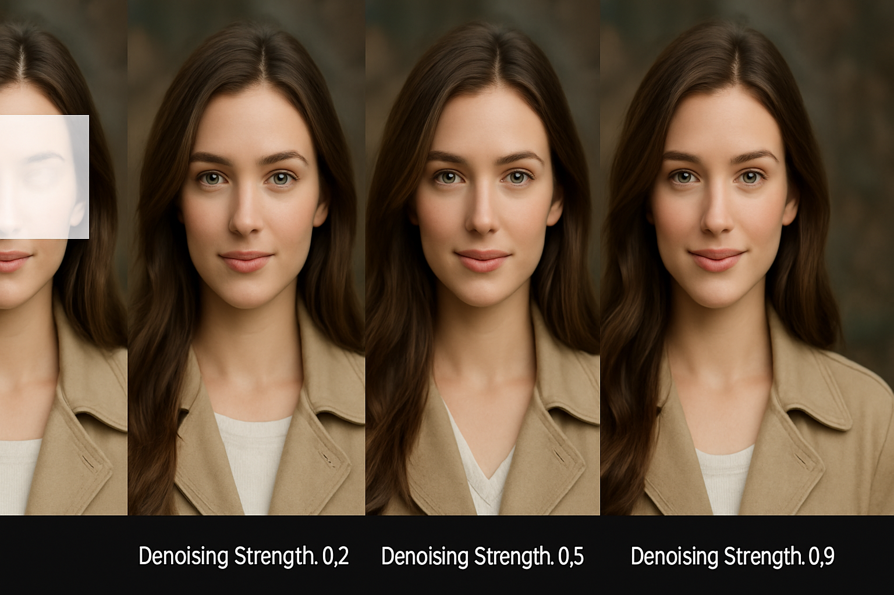


## Fixing Images - Faces

Now we will the following image that we created in Section 3.


To fix the face of the man in the suit.

We import the image in the "`Inpaint or Outpaint`" tab. The we use the brush to mark the face.

Then we select in the "`Method`" dropdown the option that says "`Improve Detail (face, hand, eyes, etc.)`" and in the "`Inpaint Additional Prompt`" we write "`A realistic face of an old business man`".

The result of the fixed image is as follows. Here we used "`Inpaint Denoising Strength`" with the default value which was "`0.5`".


Then we will try the "`Inpaint Denoising Strength`" with value "`0.35`".

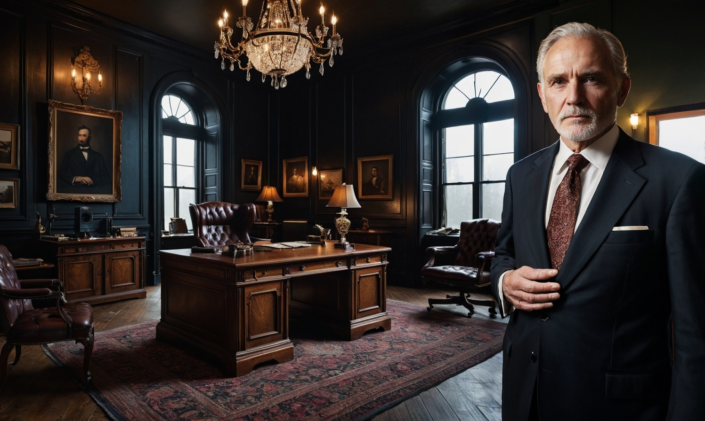


## Combine ChatGPT and AI image creation

* ChatGPT is the most well-known LLM (Large Language Model)
* It is an extremely powerful model, especially for **text-based tasks**
* We can assign ChatGPT a specific role, such as an expert in AI image generation
* ChatGPT can provide us with information and even handle parts of our work (writing prompts, translating requirements)

**The instructor personal approach**
* Assign a role to ChatGPT
* Show ChatGPT examples
* Present a specific problem to ChatGPT
* Instruct ChatGPT to provide a specific solution

Example of prompt for ChatGPT: "`Write me the perfect prompt for 'a full-body portrait of an Italian fashion model presenting a luxury dress on a runway.'`". 

We use the following prompt in ChatGPT.

```
You are an expert in AI image generation using Stable Diffusion and Fooocus. You have many years of experience and understand both AI image generation and professional photography. You know how to write perfect prompts for generating high-quality AI images. Your prompts also include camera and lens information to create extremely realistic images with outstanding quality. Reply with “Okay.”
```

Follow the conversation with ChatGPT <a href="https://chatgpt.com/share/68514d4f-b9bc-8011-87f6-d3965e56837c">here</a>.


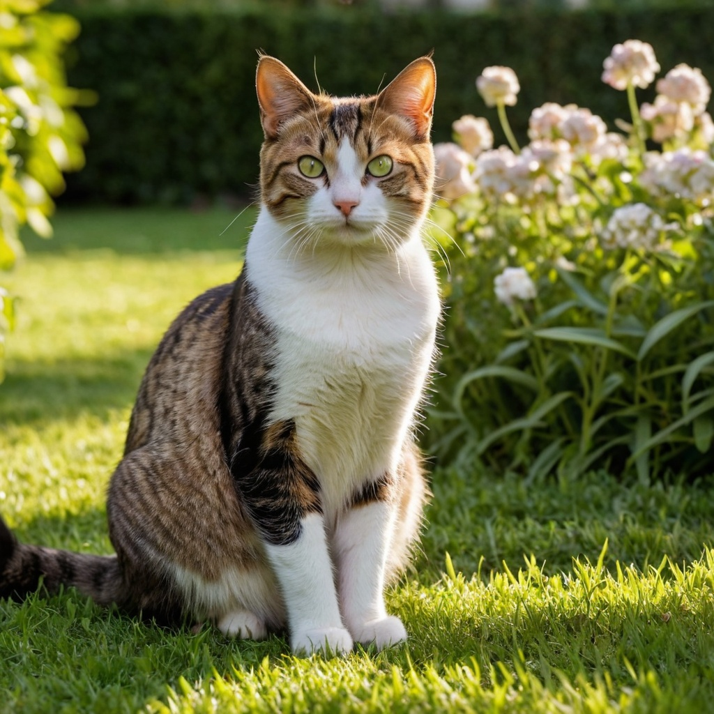


## Combine Image Prompts and Inpainting to change the clothing of digital models

On one side you need to upload the photo of the clothing to the "`Image Prompt`" tab and then upload the image of our model to the "`Inpaint or Outpaint`" tab.

Now, in the "`Inpaint or Outpaint`" tab we select the area we want to change the clothing to... in our case all the clothes of the person we want to modify.

Now, in the prompt we write the following. (This was the case of the instructor)

```
A girl wearing a short black winter jacket
```

Then we will use as "`Method`" (inside the "`Inpaint or Outpaint`" tab) both "`Inpaint or Outpaint (default)`" and "`Modify Content (add objects, change background, etc.)`" to see which works better for us.

It is recommended to play in the "`Image Prompt`" tab with "`Stop At`" and "`Weight`" in the image you imported... higher values of those parameters generate an image that is closer to the one provided.

In the case of using "`Modify Content (add objects, change background, etc.)`" we need to enter the prompt in the "`Inpaint Additional Prompt`" text box. 


