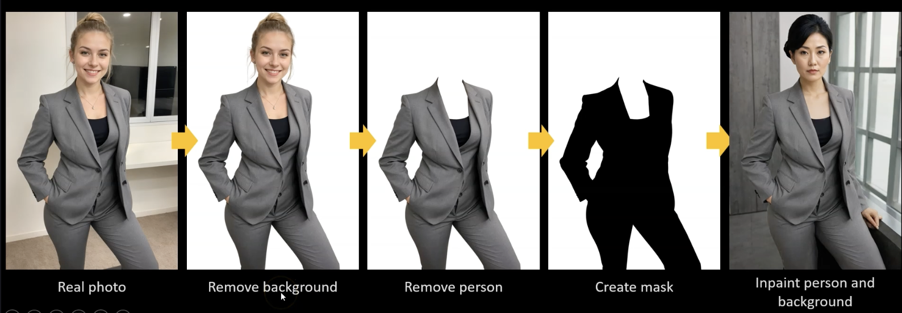
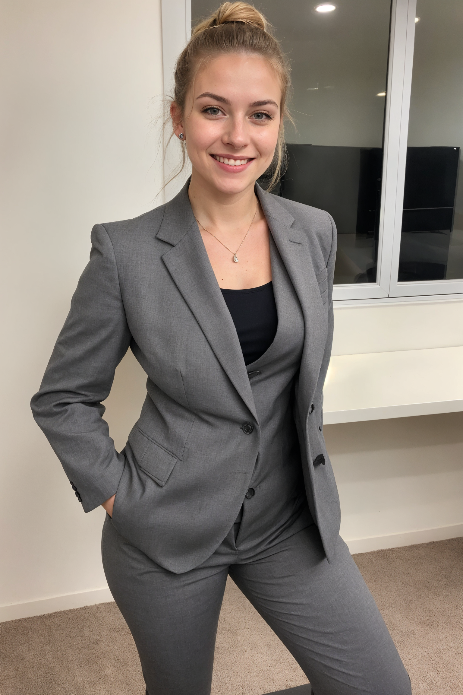
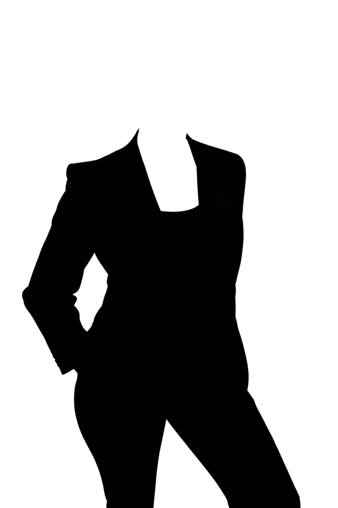

# Section 6: Product Placement

The idea is to have the same clothing and different people wearing it.

We need to follow the next process to be able to achieve our objective.



Steps to proceed:
1. First we start with the real photo
2. Then we remove the background (you can use Canva and is with one click)
3. Then we go to an image manipulation program (like Gimp) and cut out the person
4. Then you create a mask (you learned about it in the Inpainting section)
5. Then you can use the original image together with the mask to inpaint a new person and a new background

Let's do an example in Fooocus.

We start with the following real photo.



Which we upload to the "`Inpaint or Outpaint`" tab.

And we use the following mask.



That we upload to the "`Inpaint or Outpaint`" tab as well.

Then we select as "`Method`" the default one which is "`Inpaint or Outpaint (default)`".

And then in the prompt we provide the following text.

```
A hyper realistic image of a 50 year old french woman with red hair wearing a grey suit and a black t-shirt
```

When we generate the image the result is as follows.


The we upload this image to the "`Inpaint or Outpaint`" tab (without the mask, of course) and type the following text in the prompt.

```
female naked body
```

And then on the "`Negative Prompt`" you type "`clothing`".

Will not put the photo generated here... but the woman with red hair **appears completely naked**.
