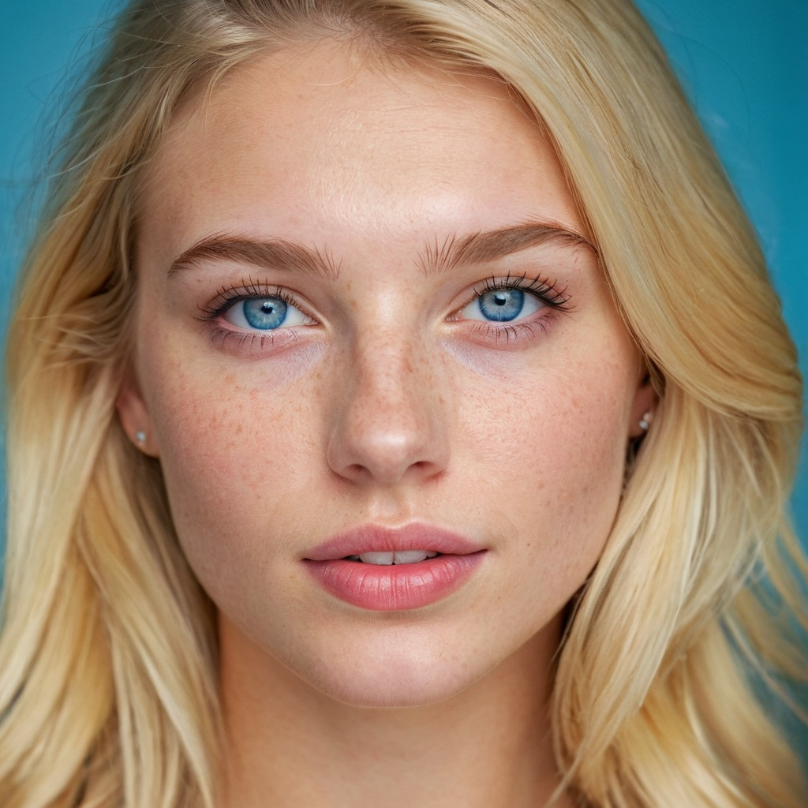
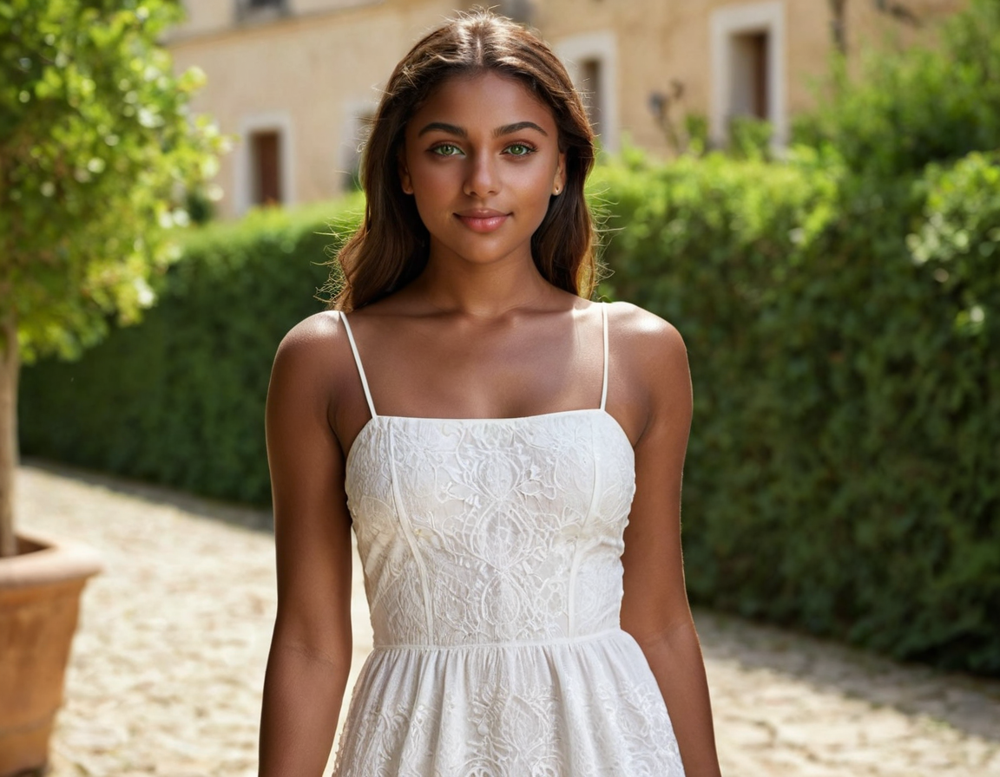
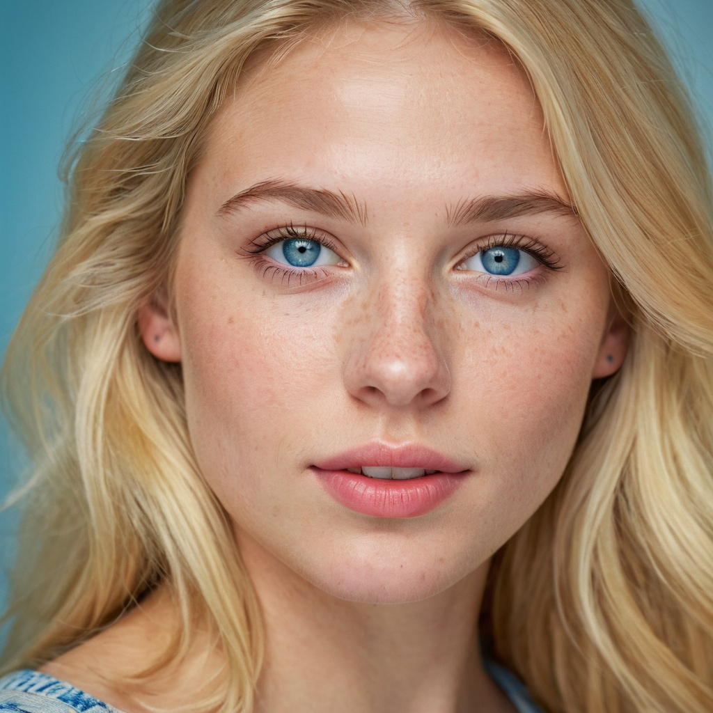
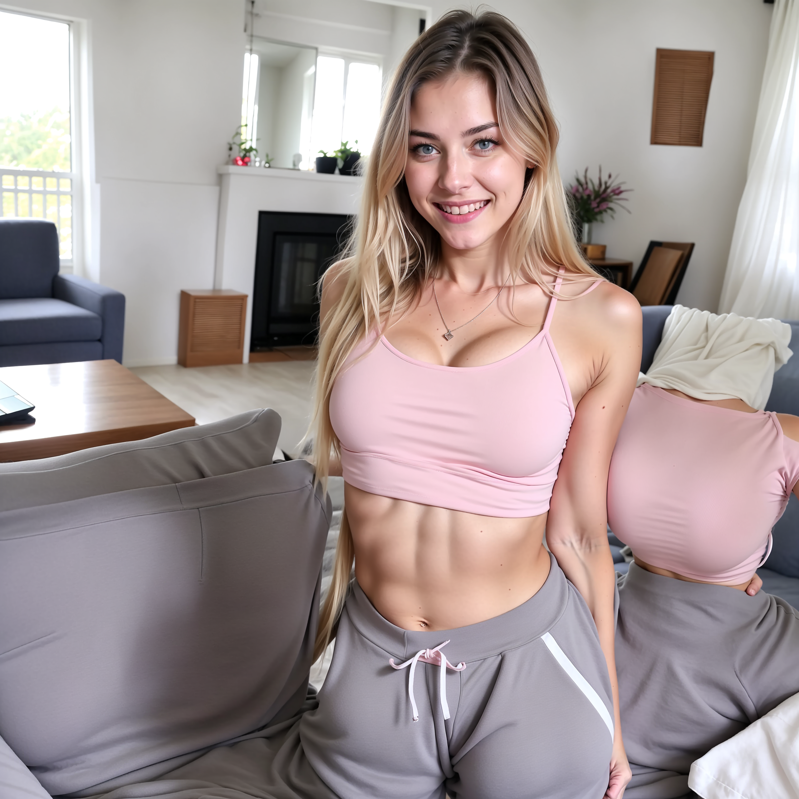
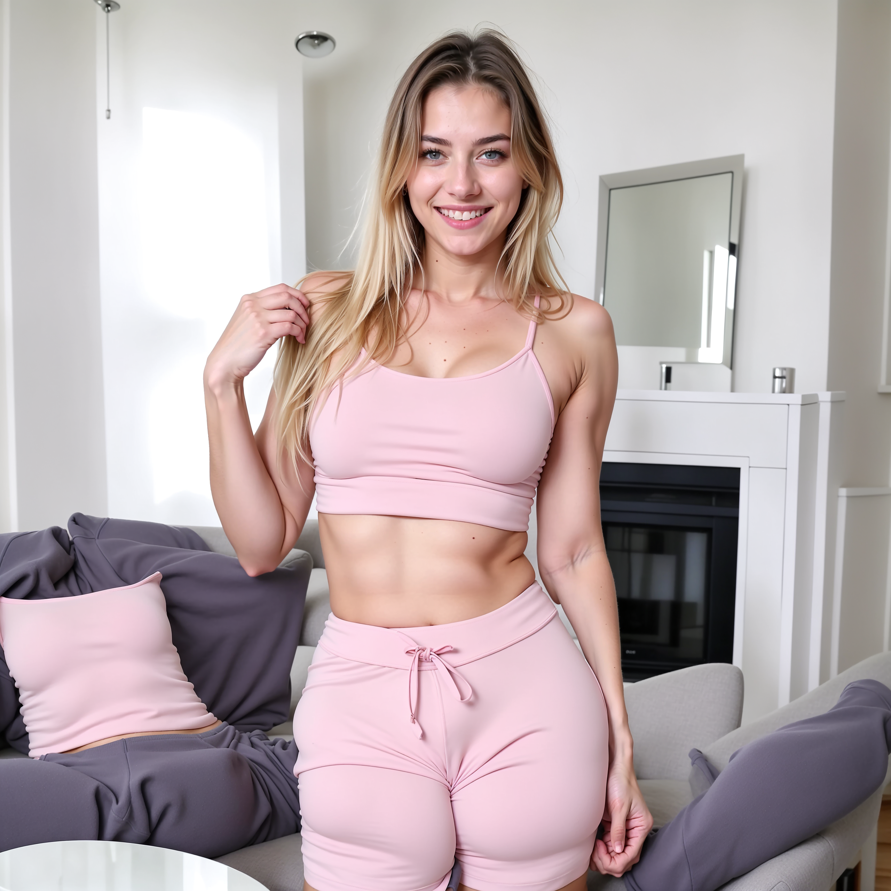
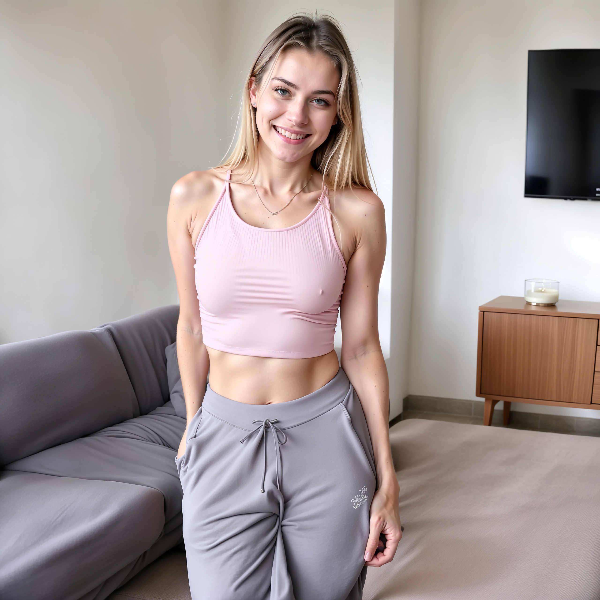
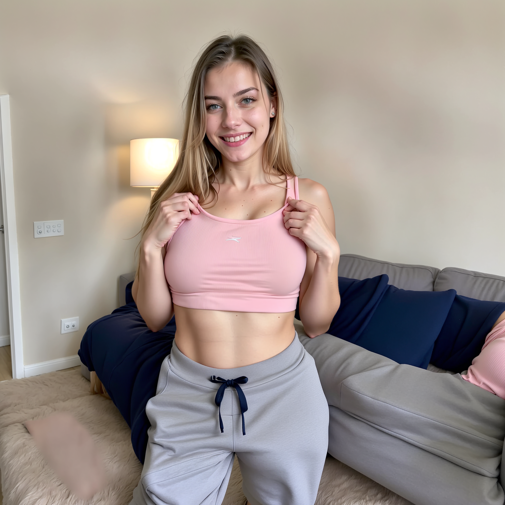
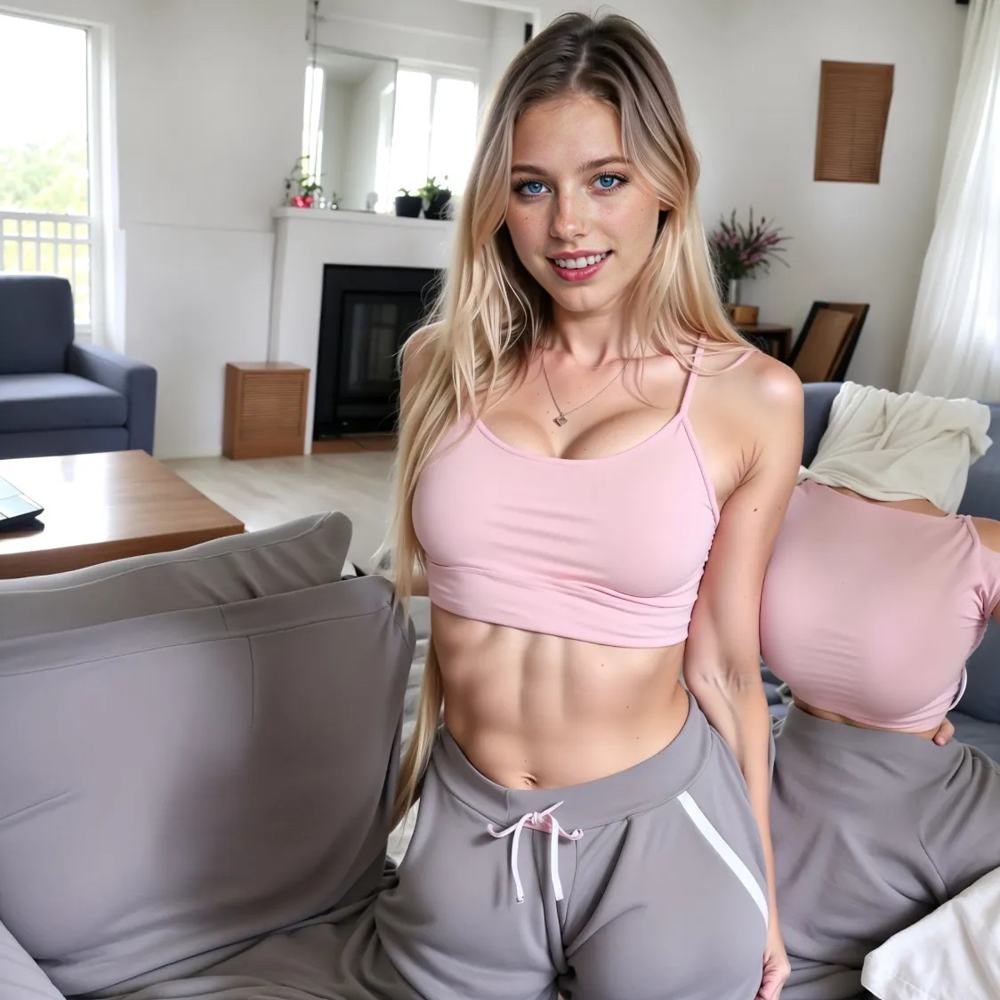

# Section 7: Create an AI influencer (constant character)

You need to think about an AI influencer as a business. Bear in mind that people are following stories and personalities not only nice good looking pictures.

Steps to define your AI influencer

## Step 1 - Define your requirements

* Gender
* Nationality
* Age (approx.)
* Hair color
* Hairstyle
* Eye color
* Body type (buttocks, breasts, etc.)
* Clothing & style
* Lifestyle & hobbies
* Residence & vacation destinations
* Social class (wealthy, middle class, etc.)
* Special feature

At the end you want to create a story of digital person that does not exist

## Step 2 - Write a prompt for the face of the AI Influencer

Let's use the following prompt that the instructor prepared.

```
A hyper realistic closeup face portrait of a beautiful 22 year old French girl, full lips,
beautiful blue eyes, perfect white teeth, light freckled skin, beautiful full blonde hair,
neutral background, perfect lighting, vibrant colors, perfect saturation, stunning
quality, professional camera, cristal clear
```

And this is the result.



## Step 3 - Write a prompt for the body and first scene the AI influencer

In this step, you will write a prompt for the body of your AI influencer and first scene that you want to generate as an image.

It should be noted that you will naturally change this prompt repeatedly, depending on what kind of image you want to create of your influencer. However, you will always keep certain base portion of the prompt to ensure you get similar results.

**Prompt Body**

**Base Prompt:** "`A hyper-realistic full body portrait of a beautiful 19 year old french girl, beautiful smile, full lips, medium long (blonde hair), Stunning beautiful blue eyes, flawless skin, vibrant look, athletic, well-proportioned figure, perfect small perky breasts`"
* This prompt always stay the same.

**Variable Part of the Prompt:** "`standing, wearing a (light pink croptop), grey sweatpants, beautiful cosy living room`"
* This describes the scene of the image

**Negative Prompt:** "`nude, nipples, (3d, render, cgi, doll, painting, fake, cartoon, 3d modeling:1.4), (worst quality, low quality:1.4), monochrome, child, deformed, malformed, deformed face, bad teeth, bad hands, bad fingers, bad eyes, long body, blurry, duplicated, cloned, duplicate body parts, disfigured, extra limbs, fused fingers, extra fingers, twisted, distorted, malformed hands, mutated hands and fingers, conjoined, missing limbs, bad anatomy, bad proportions, logo, watermark, text, copyright, signature, lowres, mutated, mutilated, artifacts, gross, ugly, xasian eyes,clothes, hands, fingers, open hands, closed hands, wrists, deformed`"

Some notes from the instructor:
* Some Models are pretty biased towards certain looks
* It can be hard to achieve what you actually want to create
* Use the following tricks to increase the weight of certain words

Some examples to add more weight:
* "`A girl with dark skin`" - "`A girl with (dark skin)`", "`A girl with ((dark skin))`"
* "`A girl with green eyes`" - "`A girl with (green eyes):1.2`", "`A girl with (green eyes):1.5`"
* It can also help to **repeat** a word or to put it in the **beginning** of the prompt
* Another trick is to write the opposite of what you want into the **negative prompt**

Let's try the following prompt.

```
A hyper-realistic full body portrait of a beautiful 21-year-old italian girl, (dark skin), stunning ((green eyes)), beautiful lips, round face, sensual smile, flawless vibrant look, athletic, well-proportioned figure, wearing, a white summerdress, perfect lighting
```

The result is the following image.



Then we use the following prompt to create, again, the face of our AI influencer.

```
A hyper realistic closeup face portrait of a beautiful 22 year old French girl, full lips, beautiful blue eyes, perfect white teeth, light freckled skin, beautiful full blonde hair, neutral background, perfect lighting, vibrant colors, perfect saturation, stunning quality, professional camera, cristal clear
```

Which will generate the following image.



Then we upload the image to the "`Inpaint or Outpaint`" tab, use the brush to mark the eyes of the blonde girl and we select in the "`Method`" dropdown the option named "`Improve Detail...`", then in the text box named "`Inpaint Additional Prompt`" we write "`beautiful blue eyes`". 


## Step 4 - Finding the LazyMix Base Model at Tensorart

In the next lecture we will use a model called "LazyMix" and I already want to prepare you to find it at Tensorart.

There was a bit of confusion recently about whether the LazyMix base model is still available on TensorArt — and the answer is YES. I’ve attached a screenshot showing where to click and what to type to find it.

Also check the url and make sure you are actually at " **tensor.art** " and NOT " **tensorart.green** " as there the model isn't available.

You need to go to the website of <a href="https://tensor.art/">Tensor Art</a> in the search bar you need to look for "`lazymix`" you will go to the following page <a href="https://tensor.art/models/730555112478691012">LazyMix+ (Real ******* Nudes)</a>.

Then you click on the "`Create`" button, select on the left the Model named "`LazyMix+...`", then you select as Aspect Ratio "`Square`", then you put the following text in the prompt.

```
A hyper-realistic full body portrait of a beautiful 19 year old french girl, beautiful smile, full lips, medium long (blonde hair), Stunning beautiful blue eyes, flawless skin, vibrant look, athletic, well-proportioned figure, perfect small perky breasts. standing, wearing a (light pink croptop), grey
sweatpants, beautiful cosy living room
```

And in the Negative Prompt you put the following text.

```
nude, nipples, (3d, render, cgi, doll, painting, fake, cartoon, 3d
modeling:1.4), (worst quality, low quality:1.4), monochrome, child, deformed,
malformed, deformed face, bad teeth, bad hands, bad fingers, bad eyes, long body,
blurry, duplicated, cloned, duplicate body parts, disfigured, extra limbs, fused fingers,
extra fingers, twisted, distorted, malformed hands, mutated hands and fingers,
conjoined, missing limbs, bad anatomy, bad proportions, logo, watermark, text,
copyright, signature, lowres, mutated, mutilated, artifacts, gross, ugly,xasian
eyes,clothes, hands, fingers, open hands, closed hands, wrists, deformed
```

Then you click the "`Generate`" button.

Tensor Art will generate the following images.










Now we are going to put together the face that we created with the body that we created as well.

For that we are going to use <a href="https://discord.com/">Discord</a>. When you log in in Discord you need to click on the "`+`" button on the left that says "`Create Server`", then you select "`For me and my friends`" and finally we name the server as "`Swap Server`".

Once the server is created we click on "`Add your first app`" and click on the "`Check it out`" button.

Now inside the Search text box we type "`midjourney`", then you click on the "`Midjourney Bot`", and you click on "`Add App`".

Then you select "`Add to Server`", you select your server ("`Swap Server`" in our case) and click the "`Continue`" button, and then you click on the "`Authorize`" button.

Then we need to repeate the same process for the app that is named "`InsightFace`".

Once both applications are installed in our "`Swap Server`" we go to the "terminal" of our server and type the following "`/saveid`" we provide as name "`swap`" and we upload the following image.


That we created before and hit the Enter key.

Once the image has been processed, we click on the "`+`" sign and select "`Upload file`" and select one of the bodies we created before, for instance the following image.


You hit the Enter key. Once the image is uploaded, you click in the image and select "`Apps > INSwapper`". The image on the left side is always better (according to the instructor).


## Step 5 - Refine the face of the AI Influencer using Fooocus

Once you start your Fooocus, you upload the image we did a Face Swap on, which is this one.


Then we use the brush and paint the face of the model. The on the "`Method`" dropdown we select "`Improve Detail (face, hand, eyes, etc.)`", then on the "`Inpaint Additional Prompt`" text box you type "`beautiful blue eyes`".

Then we go to the "`Image Prompt`" tab and click "`Advanced`", then in one of the sections to drop an image, you select the toggle "`FaceSwap`" and assign the value "`1`" to "`Stop At`" and the value of "`1.19`" to the "`Weight`", then in that section we upload the following image.


The we click on "`Advanced`" to have more options at the left. 

Then you go to the "`Models`" tab and select in the dropdown "`Base Model (SDXL only)`" the "`realismEngine..`", then you select in the dropdown "`Refiner (SDXL or SD 1.5)`" the model "`lazymixRealAm...`".

Then you set the value "`0.4`" in the "`Refiner Switch At`", then you need to deactivate the "`LoRA 1`" by unchecking the checkbox.

Then we go to the "`Advanced`" tab at the left of the screen, check in the "`Developer Debug Mode`", go to the "`Control`" tab and check the "`Mixing Image Prompt and Inpaint`" checkbox to connect "`Image Prompt`" and the "`Inpaint or Outpaint`" tabs.

Then we go to the "`Inpaint`" tab inside the "`Developer Debug Mode`" and set value of "`0.4`" to the "`Inpaint Denoising Strength`" slider.

Then you click the "`Generate`" button. The resulting image is as follows.


Now we will do another variation where we will put "`None`" of the "`Refiner (SDXL or SD 1.5)`", we leave the "`Base Model (SDXL only)`" with only "`realismEngine...`", and we check the "`LoRA 1`". Then you click the "`Generate`" button and this is our result.




## Step 6 - Fix some little errors and adjust details

When you are fixing the hands of your images you need to upload your image to the "`Inpaint or Outpaint`" tab and select as "`Method`" the option "`Improve Detail (face, hand, eyes, etc.)`" and then inside the "`Inpaint Additional Prompt`" text box you type what you want to improve, in the case of the instructor he is typing "`detailed female hands`".

When you fixing an image that was generated with Fooocus, you need to use the same settings as the original version, in our case:
* "`Base Model (SDXL only)`" was "`realismEngine...`"
* "`Refiner (SDXL or SD 1.5)`" was "`lazymixReal...`"
* "`Refiner Switch At`" was "`0.4`"
* "`LoRA 1`" was unchecked
* "`Developer Debug Mode > Inpaint Denoising Strength`" is "`0.35`"
* "`Inpaint or Outpaint > Method`" is "`Inpaint or Outpaint (default)`".
* Then you mark the area of the photo you want to modify (For example, the instructor is marking the top of the lady in the photo)
* Then you write type in the general prompt what you want to modify (For example, the instructor typed "`beige crop top`"
* Then on the negative prompt the instructor writes "`nude`"

Then you press the "`Generate`" button.

## Summary and creation of another image of the AI Influencer

The instructor just redid everything very fast.

