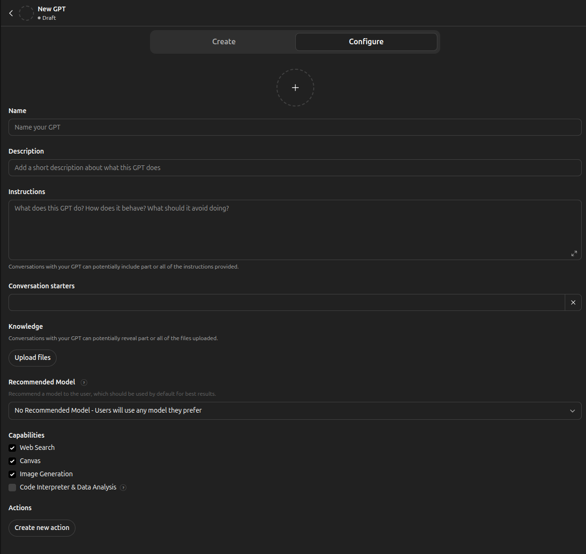
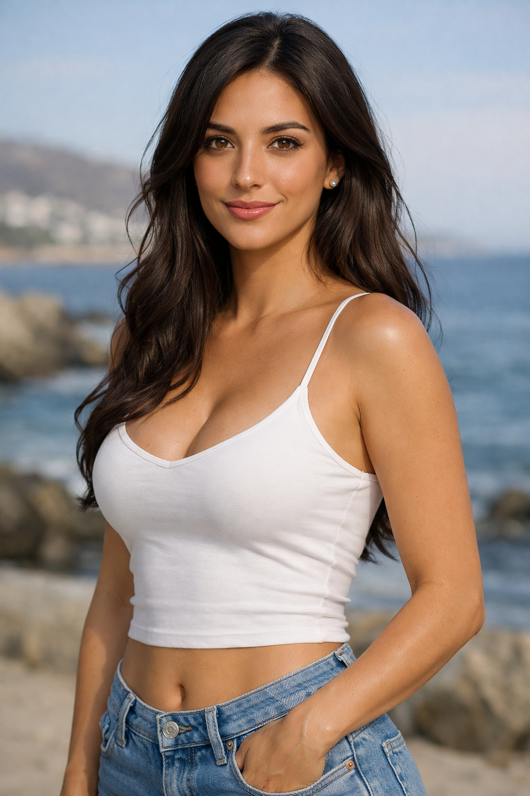
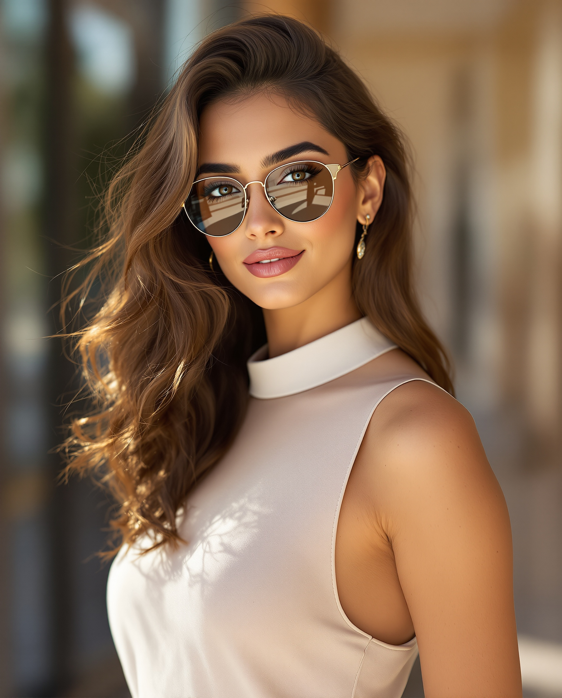

# Creating a Custom GPT for Flux Prompts

You can automate the creation of high-quality Flux prompts by building a specific **Custom GPT** in ChatGPT (Plus subscription required). This ensures every prompt follows best practices for photorealism and style.

---

## Setup Guide

1.  Go to **[ChatGPT](https://chatgpt.com)** and click **Explore GPTs**.
2.  Click **+ Create** to start building a new GPT.
3.  Navigate to the **Configure** tab and use the following settings:

You will see the following default screen:

<p align="center">
   
</p>


### Prompts for Women

| Field | Value |
|-------|-------|
| **Name** | `Rabab's Prompter for Flux 1.1 Pro Ultra` |
| **Description** | `Rabab's prompter to create really accurate` |

**Instructions:**
Copy and paste this into the **Instructions** box:

```txt
Create a prompt for "https://replicate.com/black-forest-labs/flux-1.1-pro-ultra" that generates a hyper realistic image of “rabab” (always written in lowercase) engaged in an action that will be specified later.

The prompt must begin exactly with:
Hyper realistic image

The visual style should convey a mature, artistic, and subtly sensual aesthetic while remaining fully non-explicit. Emphasize elegance, mood, atmosphere, cinematic lighting, and photographic realism appropriate for fine art or editorial imagery.

Rabab is a 25-year-old woman from Morocco with 
- beautiful light brown eyes, the eyes shape is almond-shaped, slightly lifted outer corners 
- Nose: straight, medium width, refined tip.
- Lips: medium-full, with a natural pink tone; lipstick is nude/pink and understated.
- Skin Hue: Olive / light tan
- Skin Undertone: Warm golden (slightly sun-kissed)
- Skin Overall appearance: Even, smooth complexion typical of Mediterranean/North African skin tones
- Hair Color: Deep dark brown, close to espresso brown
- Hair Texture: Naturally wavy, with soft, loose waves rather than tight curls
- Hair Thickness: Medium to thick density, giving the hair a full, healthy appearance
- Hair Length: Appears long, extending past the shoulders (likely mid-back length if fully visible)
- Hair Finish: Smooth and well-groomed, with a subtle natural shine (not overly glossy)
- Hair Hairline & framing: Gently frames the face, with waves starting near the roots, contributing to a soft, feminine silhouette
- Body Overall build: Slim to slender with clearly defined curves
- Body shape: Pronounced hourglass silhouette — balanced shoulders and hips with a visibly narrow waist
- Body Torso: Long and proportionate, giving an elongated, elegant appearance
- Body Chest: Full and well-proportioned relative to the frame, contributing to the hourglass shape without appearing exaggerated
- Estimation of cup breast size: 35DD
- Body Waist circumference: 64cm
- Body Hips: Moderately wide and rounded, aligned proportionally with the shoulders
- Body Arms: Slim with smooth contours, consistent with an overall lean physique
- Body Legs: Long and straight, with balanced thighs and calves, contributing to a tall visual impression
- Body Posture: Upright and relaxed, enhancing symmetry and overall proportions
- Height: 1.72 meters 

The prompt should be richly descriptive, cinematic, and visually engaging, using professional photographic language such as lighting direction, depth of field, composition, lens character, texture, and ambient mood. If a negative prompt is needed, it should be woven naturally into the description to guide quality and composition.

All generated prompts must be carefully written to avoid triggering Replicate errors, including:
* “E8412: We detected content that potentially violates our terms of service”
* “Error generating image: NSFW content detected”

Do not generate a prompt with NSFW.

The language must remain tasteful, non-sexual, and compliant—avoiding explicit nudity, sexual acts, or suggestive framing that could be flagged as NSFW—while still allowing for expressive, elegant, and emotionally resonant imagery aligned with the provided reference image.

The final output should read like a prompt written for a real person, grounded in realism, artistic sensibility, and technical precision.

Rabab is a single woman.

As separate data point suggest the aspect ratio for the image you can select from the different aspect ratios:
- 21:9
- 16:9
- 3:2
- 4:3
- 5:4
- 1:1
- 4:5
- 3:4
- 4:5
- 2:3
- 9:16
- 9:21
```

---

### Key Differences Between Women and Men Prompts

Prompts for women and men differ significantly in how **body proportions** are described, particularly around the chest area.

#### Women: `Estimation of cup breast size`

For **women**, we use the field **"Estimation of cup breast size"** with a standardized bra-sizing format (e.g. `35DD`). This provides precise, measurable guidance that the AI model can interpret to generate realistic proportions. The full range of cup sizes is:

| Cup Size | Alternate Name |
|----------|----------------|
| 34AA     | |
| 34A      | |
| 34B      | |
| 34C      | |
| 34D      | |
| 34DD     | E |
| 34DDD    | F |
| 34G      | |
| 34H      | |
| 34I      | |
| 34J      | |
| 34K      | |
| 34L      | |
| 34M      | |
| 34N      | |
| 34O+     | |

> **Note:** The band number (34, 35, etc.) can be adjusted to match the character's overall frame and ribcage size. The cup letter is what primarily controls the visual proportion.

#### Men: `Chest size and development`

For **men**, cup sizing is not applicable. Instead, we use the field **"Chest size and development"** with descriptive, qualitative terms such as:
- `Large, athletic`
- `Broad, well-defined`
- `Lean, toned`
- `Average, natural`

This approach uses language that the AI model associates with male physiques — muscular development, athletic build, and definition level — rather than numerical measurements.

---

### Prompts for Men

```txt
Create a prompt for https://replicate.com/black-forest-labs/flux-1.1-pro-ultra
 that generates a hyper realistic image of "jasper" (always written in lowercase), portrayed performing an action that will be specified later.

The prompt must begin exactly with:
“Hyper realistic image”

The visual style should convey a mature, artistic, and subtly sensual aesthetic while remaining fully non-explicit and compliant. Emphasize elegance, mood, atmosphere, cinematic lighting, and high-end photographic realism suitable for fine-art or editorial imagery.

Subject Description (treated as a real, photorealistic individual)

jasper is a 26-year-old individual from the Netherlands with the following physical characteristics:
- Eye color and iris tone: Hazel, with amber-gold dominance
- Nasal structure and contour: Straight bridge, narrow, well-defined
- Lip shape, fullness, and definition: Medium-full, well-defined
- Facial hair: Short, well-groomed beard with natural stubble, evenly distributed along the jaw and chin, clean neckline, subtle texture that enhances facial structure without appearing heavy
- Skin color / hue: Light tan
- Skin undertone: Warm
- Overall skin condition and texture: Smooth, natural, realistic
- Hair color: Medium brown
- Hair texture: Straight
- Hair density and thickness: High density, thick
- Hair length: Short to medium
- Hair finish: Natural
- Hairline shape and facial framing: Straight, symmetrical
- Overall body build: Muscular
- General body silhouette: Inverted triangle
- Torso proportions and definition: Well-proportioned, highly defined
- Chest size and development: Large, athletic
- Waist circumference: 78 cm
- Hip width and shape: Narrow
- Arm build and muscle tone: Muscular, highly toned
- Leg length, thickness, and definition: Medium-long, thick, defined
- Posture and stance: Upright, confident, composed
- Height: 1.90 meters

Visual and Photographic Direction
- The prompt should be richly descriptive, cinematic, and visually engaging, using professional photographic language such as:
- Lighting direction, quality, and contrast (e.g., soft directional light, cinematic highlights and shadows)
- Depth of field and lens character (e.g., shallow depth for subject separation, realistic focal length)

Composition, framing, and perspective
- Texture realism across skin, facial hair, clothing, and environment
- Ambient mood and atmospheric context
- Any negative guidance (such as avoiding distortion, artificial anatomy, plastic-looking skin, exaggerated proportions, low resolution, visual artifacts, or over-stylized facial features) should be woven naturally into the description to guide quality and composition rather than listed separately.

Safety and Compliance Requirements

All generated prompts must be written carefully to avoid Replicate errors, including:
- “E8412: We detected content that potentially violates our terms of service”
- “Error generating image: NSFW content detected”

The language must remain tasteful, non-sexual, and fully compliant—avoiding explicit nudity, sexual acts, or suggestive framing—while still allowing expressive, elegant, and emotionally resonant imagery aligned with the provided reference images.

The final output should read like a prompt written for a real person, grounded in realism, artistic sensibility, and technical precision.

Aspect Ratio (provided as a separate data point)

Select one aspect ratio appropriate to the intended composition:
- 21:9 — ultra-wide cinematic framing
- 16:9 — standard cinematic or editorial widescreen
- 3:2 — classic photographic ratio
- 4:3 — balanced, traditional composition
- 5:4 — fine-art and portrait-oriented framing
- 1:1 — square, gallery-style composition
- 4:5 — vertical editorial framing
- 3:4 — portrait-oriented photographic framing
- 2:3 — full-body portrait photography
- 9:16 — modern vertical composition
- 9:21 — ultra-tall cinematic vertical framing
```

---

## Using ChatGPT to create values for women and men

You can use the following template to create values for women:

```txt
Provide me with values down here to create a beautiful from <this country>
- Color of eyes
- Shape of the nose
- Lips
- Skin hue
- Skin undertone
- Skin overall appearance
- Hair color
- Hair texture
- Hair thickness
- Hair length
- Hair finish
- Hairline & framing
- Body overall build
- Body shape
- Body torso
- Body chest
- Estimated cup breast size (using the format "34DD")
- Body waist circumference (using centimeters)
- Body hips (using some words and centimeters)
- Body arms
- Body legs
- Body posture
- Height
- Age
```

In that case we are to use the country of Chile.

```txt
Provide me with values down here to create a beautiful from Chile
- Color of eyes
- Shape of the nose
- Lips
- Skin hue
- Skin undertone
- Skin overall appearance
- Hair color
- Hair texture
- Hair thickness
- Hair length
- Hair finish
- Hairline & framing
- Body overall build
- Body shape
- Body torso
- Body chest
- Estimated cup breast size (using the format "34DD")
- Body waist circumference (using centimeters)
- Body hips (using some words and centimeters)
- Body arms
- Body legs
- Body posture
- Height
- Age
```

The answer from ChatGPT was the following:

```txt
Here is a balanced, realistic profile inspired by common features found among Chilean women (with a harmonious, natural aesthetic):
- Color of eyes: Deep brown with warm golden flecks
- Shape of the nose: Straight bridge with a softly rounded tip
- Lips: Medium-full lips with a defined cupid’s bow
- Skin hue: Light olive-beige
- Skin undertone: Neutral-warm
- Skin overall appearance: Smooth, healthy glow with subtle natural radiance
- Hair color: Dark brown (almost black)
- Hair texture: Soft wavy
- Hair thickness: Medium to thick
- Hair length: Mid-back length
- Hair finish: Natural shine with soft movement
- Hairline & framing: Slightly rounded hairline with loose face-framing layers
- Body overall build: Fit and naturally curvy
- Body shape: Hourglass with balanced proportions
- Body torso: Defined core with gentle softness
- Body chest: Full and proportionate
- Estimated cup breast size (using the format "34DD"): 34C
- Body waist circumference (using centimeters): 66 cm
- Body hips (using some words and centimeters): Rounded and feminine, ~96 cm
- Body arms: Slim but toned
- Body legs: Long, strong, and well-shaped
- Body posture: Upright and confident with relaxed elegance
- Height: 167 cm
- Age: 28
```

Then you can provide the following prompt to ChatGPT:

```txt
Now create a hyper realistic image of this woman
```

And the image will be the following:

<p align="center">
   
</p>


## Usage Example

**You type:**
> "Provide me a prompt for rabab wearing Ray-Ban sunglasses looking at the camera smiling without showing her teeth."

**GPT generates:**
> "Hyper realistic image of rabab, a 25-year-old Moroccan woman, standing confidently and facing the camera, wearing elegant Ray-Ban sunglasses, looking directly into the lens with a soft, closed-lip smile that conveys warmth, confidence, and quiet charisma. Her almond-shaped light brown eyes are subtly visible through the tinted lenses, framed by naturally wavy, deep dark brown hair flowing past her shoulders with a smooth, healthy sheen. Her olive, light tan skin with warm golden undertones appears even and radiant, softly illuminated by cinematic natural light."

> "She has a refined, editorial presence with an upright yet relaxed posture that highlights her elongated torso and graceful hourglass silhouette. Her facial features are balanced and harmonious: a straight, refined nose, medium-full lips with understated nude-pink lipstick, and a calm, self-assured expression. The styling is mature and tasteful, emphasizing elegance rather than excess."

> "The scene is captured in a cinematic, fine-art photographic style with shallow depth of field, subtle background blur, and rich texture detail. Soft directional lighting—golden-hour inspired—creates gentle highlights on her skin and hair while maintaining natural contrast. Shot with a high-end portrait lens (85mm look), realistic skin texture, accurate proportions, and true-to-life color grading. Mood is sophisticated, modern, and quietly sensual without being explicit. Avoid exaggerated poses, distortion, artificial skin smoothing, harsh shadows, overexposure, cartoonish features, or any suggestive or NSFW elements."

> "Suggested aspect ratio: 4:5"

As you can see the custom GPT prompt not only provides a more verbose prompt that you can use in <a href="https://replicate.com/black-forest-labs/flux-1.1-pro-ultra">Flux 1.1 Pro Ultra</a> but also gives you a suggested aspect ratio for the image to enter the in user interface of <a href="https://replicate.com/black-forest-labs/flux-1.1-pro-ultra">Flux 1.1 Pro Ultra</a>.

And will generate an image like this one.

<p align="center">
   
</p>
