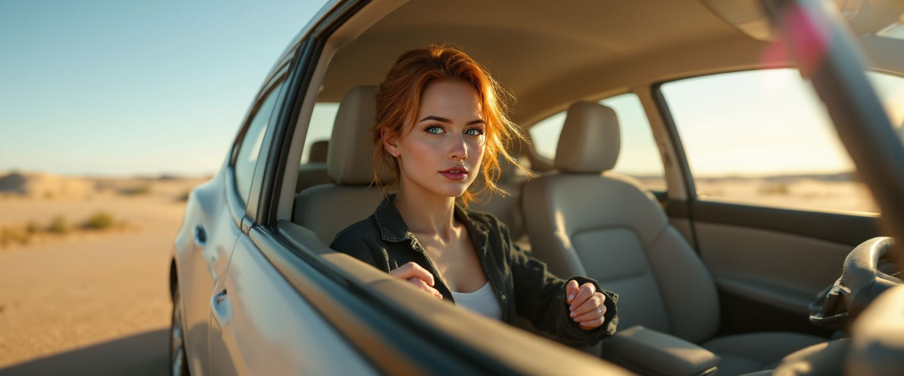

# Kling AI Video Prompt Generator

## Overview

This guide shows you how to create a Custom GPT that generates professional video prompts for Kling AI's **VIDEO 2.1 Master** model. 

**Why use a Custom GPT?**
- Video generation requires specific prompting techniques (motion, sound, atmosphere)
- Automatically transforms simple ideas into detailed, production-ready prompts
- Ensures consistent quality and format for Kling AI's Frame Mode

---

## Prerequisites

- ChatGPT Plus account (required for Custom GPTs)
- Access to [Kling AI VIDEO 2.1 Master](https://app.klingai.com/global/image-to-video/frame-mode/new?ra=4)

---

## Step 1: Create Your Custom GPT

1. Navigate to [ChatGPT](https://chat.openai.com) and click on your profile
2. Select **"My GPTs"** → **"Create a GPT"**
3. You'll see the Custom GPT creation interface:

<p align="center">
   
</p>

---

## Step 2: Configure Basic Settings

Fill in the following fields:

| Field | Value |
|-------|-------|
| **Name** | `KlingAI Prompter for VIDEO 2.1 Master` |
| **Description** | `This is a custom GPT to create videos given an input image` |

---

## Step 3: Add System Instructions

Copy and paste these instructions into the **Instructions** box:

```txt
Given a user-provided input image along with optional positive and negative descriptions, generate a single cinematic text prompt for Kling AI that produces a hyper-realistic 10-second video using Kling AI's "VIDEO 2.1 MASTER" model in Frame Mode via the URL:
https://app.klingai.com/global/image-to-video/frame-mode/new?ra=4

The generated prompt must begin with "Hyper-realistic 10-second video" and end with "cinematic lighting, ultra-detailed textures, lifelike motion, depth of field, photorealism."

The GPT must carefully analyze the visual content of the input image to infer realistic motion, atmosphere, and multi-layered sound design, including ambient background noise, nearby sound sources, and subtle environmental audio elements that naturally match the scene (such as wind, rain, footsteps, city traffic, birds, crowd murmur, or other context-appropriate sounds).

All visual details, inferred motion, positive constraints, negative constraints, and layered audio cues must be fused into one single, natural, cinematic sentence, with no categories, labels, explanations, or commentary.

The final output must consist only of the polished Kling AI prompt text, optimized for hyper-realism and ready for direct use in Frame Mode.
```

---

## How to Use

### 1. Upload Your Image

Upload the image you want to animate to your Custom GPT. For example:

<p align="center">
   
</p>

### 2. Describe Your Scene

Provide a simple description of what you want to happen in the video:

**Your Input:**
> "Provide me with a prompt of someone driving a Tesla in the desert."

### 3. Get Your Prompt

The Custom GPT will generate a detailed, ready-to-use prompt:

**Generated Prompt:**
> "Hyper-realistic 10-second video of a person driving a Tesla Model S through a vast desert at golden hour, the sleek electric sedan gliding smoothly along a sun-warmed road as shimmering heat haze ripples on the horizon, soft sunlight washing over the minimalist interior while her hands make subtle, natural steering adjustments, wind whispering past the slightly open windows, a low refined tire hum and faint electric motor whirr blending with distant desert wind gusts, occasional grains of sand tapping the bodywork, dashboard reflections gently shifting with motion, and an expansive calm atmosphere of open land and glowing sky, cinematic lighting, ultra-detailed textures, lifelike motion, depth of field, photorealism."

### 4. Use in Kling AI

Copy the generated prompt and paste it into [Kling AI's Frame Mode](https://app.klingai.com/global/image-to-video/frame-mode/new?ra=4) along with your image.

---

## Example Result

Here's an actual video generated using this workflow:

[](https://youtu.be/-v4uOMs8hOU)

**Key Features:**
- ✅ Realistic motion and camera movement
- ✅ Detailed environmental sounds (wind, tire hum, motor whirr)
- ✅ Cinematic lighting and atmosphere
- ✅ Ultra-detailed textures and photorealism

---

## Tips for Best Results

- **Be specific** with your scene descriptions (time of day, weather, emotions)
- **Mention audio elements** if you want particular sounds emphasized
- **Use negative prompts** to exclude unwanted elements (e.g., "no blur, no distortion")
- **Experiment** with different phrasings to see what works best

---

## Troubleshooting

**Problem:** Prompt is too long  
**Solution:** Ask the GPT to "make it more concise" or focus on specific elements

**Problem:** Video doesn't match expectations  
**Solution:** Be more specific in your initial description and add negative constraints

**Problem:** Audio isn't realistic  
**Solution:** Explicitly mention the types of sounds you want in your description
