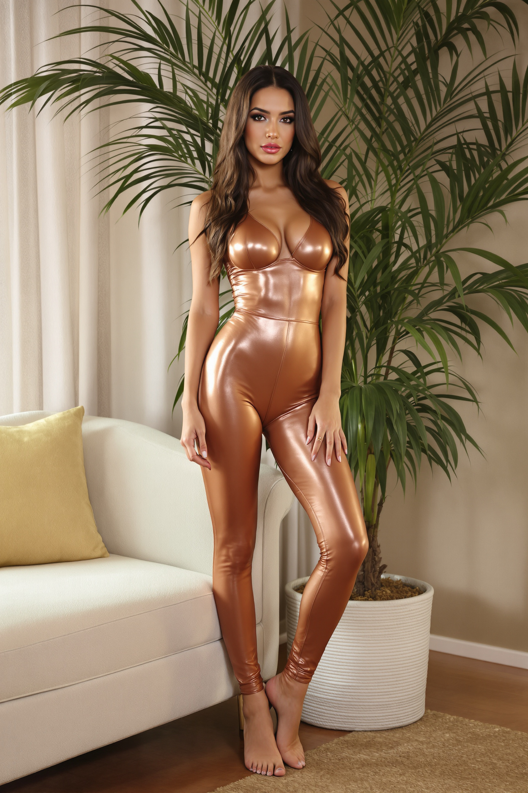
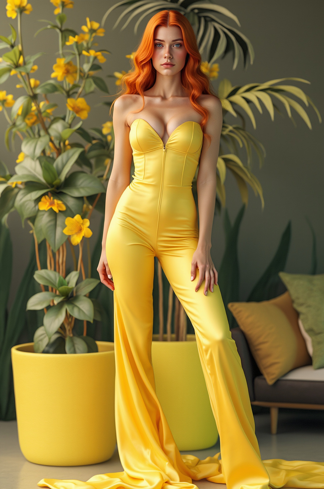
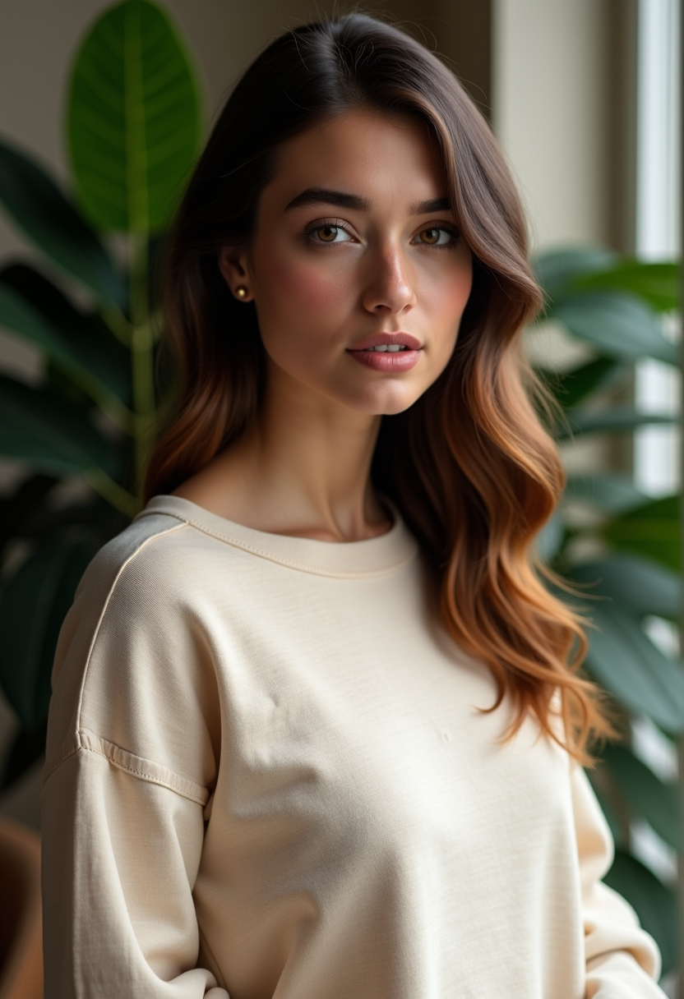
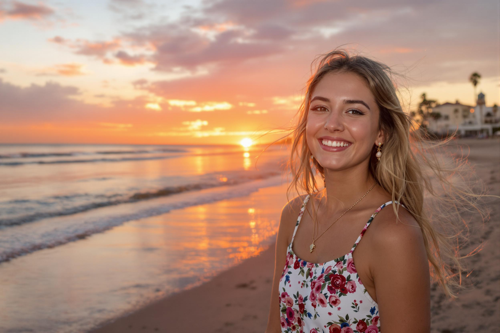

# Section 2: Learning to Use the Flux Model Family on Replicate

## Understanding the Flux Model Family

Flux offers a range of models, each optimized for different use cases. In this section, you'll learn which model to use and when.

### Available Flux Models on Replicate

| Model | Best For | Speed | Quality | Cost |
|-------|----------|-------|---------|------|
| [**Flux 1.1 Pro Ultra**](https://replicate.com/black-forest-labs/flux-1.1-pro-ultra) | Highest quality, photorealistic images | Slower | ⭐⭐⭐⭐⭐ | $$$ |
| [**Flux 1.1 Pro**](https://replicate.com/black-forest-labs/flux-1.1-pro) | Professional quality, balanced | Medium | ⭐⭐⭐⭐ | $$ |
| [**Flux Pro**](https://replicate.com/black-forest-labs/flux-kontext-pro) | High-quality production | Medium | ⭐⭐⭐⭐ | $$ |
| [**Flux Dev**](https://replicate.com/black-forest-labs/flux-dev) | Development and testing | Fast | ⭐⭐⭐ | $ |
| [**Flux Schnell**](https://replicate.com/black-forest-labs/flux-schnell) | Rapid prototyping, quick previews | Fastest | ⭐⭐ | $ |

**How to find Flux models:**
1. Go to [Replicate](https://replicate.com/)
2. Search for `flux` in the search bar
3. Under **Collections**, click **"Use the FLUX family of models"**
4. Or visit: [https://replicate.com/collections/flux](https://replicate.com/collections/flux)

---

## Part 1: Creating AI Images with Flux

### Using Flux 1.1 Pro Ultra

For this tutorial, we'll use **Flux 1.1 Pro Ultra** - the highest quality model.

#### Example 1: Portrait of an Italian Woman

**Prompt:**
```
A hyper-realistic knee-length portrait of a beautiful busty 24-year-old Italian girl, beautiful full lips, round face, sensual face, (very realistic skin structure) flawless skin, stunning brown eyes, vibrant look, small waist, athletic figure, wearing (a fitted rose gold jumpsuit) (posed near a large indoor plant in a luxury apartment living room), perfect lighting.
```

**Key Parameters:**

| Parameter | Value | Description |
|-----------|-------|-------------|
| `aspect_ratio` | `2:3` | Portrait orientation |
| `safety_tolerance` | `6` | Maximum - allows mature/artistic content |
| `seed` | Leave empty | Random seed for variety |
| `raw` | ✅ Checked | More natural, less processed images |

💡 **Pro Tip**: Always check the **`raw`** option for more natural-looking, less AI-processed images.

**Result:**

<p align="center">
    
</p>

#### Example 2: Epic Gladiator Scene

**Prompt:**
```
A hyper-realistic upper body portrait of a 40 year old gladiator, exhausted face, piercing grey eyes, dirty skin, little scratches, athletic figure, wearing (a roman body armor, holding a sword in his hand) (standing in the middle of a colosseum), raining, epic scene, hero image
```

**Configuration:** Same as above

**Result:**

<p align="center">
    
</p>

#### Example 3: Fantasy Dragon

**Prompt:**
```
A hyper-realistic image of a black dragon expanding his wings and raising his head, throwing flames out of his mouth into the air, scaled detailed skin structure, orange glowing eyes, sharp teeth, dangerous, on top of a snowy mountain, cloudy sky, rain and thunderstorm, epic scene
```

**Result:**

<p align="center">
    
</p>

---

### Using Flux Dev Model

Now let's compare results using **[Flux Dev](https://replicate.com/black-forest-labs/flux-dev)** - faster and more cost-effective.

#### Flux Dev Parameters

| Parameter | Recommended Value | Description |
|-----------|------------------|-------------|
| `num_inference_steps` | `50` | Maximum quality (higher = better) |
| `guidance` | `3.5` | Balance between creativity and prompt adherence |
| `output_quality` | `100` | Maximum output quality |
| `go_fast` | ❌ Unchecked | Prioritize quality over speed |

**Guidance Scale Explained:**
- **Low values (2-3)**: More creative, may deviate from prompt
- **High values (7-15)**: Strict adherence to prompt, less creativity
- **Recommended**: 3.5 for balanced results

#### Flux Dev Results

**Italian Woman (Modified Prompt for Safety):**

Original prompt was flagged as NSFW. Modified version:
```
A hyper-realistic knee-length portrait of a beautiful busty 24-year-old Italian girl, beautiful full lips, round face, sensual face, (very realistic skin structure) flawless skin, stunning brown eyes, vibrant look, small waist, athletic figure, wearing (a long cosy sweatshirt) (posed near a large indoor plant in a luxury apartment living room), perfect lighting.
```

<p align="center">
    
</p>

**Gladiator (Same Prompt):**

<p align="center">
    
</p>

---

## Part 2: Inpainting with Flux

**Inpainting** and **Outpainting** allow you to modify existing images:

- **Inpainting**: Modify specific areas *within* an image
- **Outpainting**: Extend the image beyond its original borders

### Tutorial: Adding a Golden Belt

We'll use **[Flux Fill Pro](https://replicate.com/black-forest-labs/flux-fill-pro)** for inpainting.

#### Step-by-Step Process

1. **Upload the Original Image:**

<p align="center">
    
</p>

2. **Write a Descriptive Prompt:**
```
A golden belt, very realistic, sharp image, high quality
```

3. **Upload a Mask Image:**

The mask defines what area to modify (white = modify, black = keep):

<p align="center">
    
</p>

4. **Click "Run"**

**Result:**

<p align="center">
    
</p>

💡 **Creating Masks**: Use image editing software (Photoshop, GIMP, Paint) to create masks. Paint white where you want changes, black where you want to preserve.

---

## Part 3: Creating Image Variations with Flux

### Available Variation Models

Flux offers specialized models for different types of image transformations:

#### 1. **Canny Edge Detection** (Structure Preservation)

Preserves edges and structural composition while changing style, colors, and details.

**Models:**
- [Flux Canny Pro](https://replicate.com/black-forest-labs/flux-canny-pro) - Higher quality
- [Flux Canny Dev](https://replicate.com/black-forest-labs/flux-canny-dev) - Faster, budget-friendly

**Use Case:** Keep pose/structure, change everything else

#### 2. **Depth-Guided Generation** (Spatial Preservation)

Uses depth information to maintain spatial relationships and perspective.

**Models:**
- [Flux Depth Pro](https://replicate.com/black-forest-labs/flux-depth-pro) - Higher quality
- [Flux Depth Dev](https://replicate.com/black-forest-labs/flux-depth-dev) - Faster

**Use Case:** Preserve depth and 3D structure, change appearance

#### 3. **Redux** (Image Restyling)

Creates variations or completely restyles an image, optionally guided by text.

**Models:**
- [Flux Redux Dev](https://replicate.com/black-forest-labs/flux-redux-dev) - Development quality
- [Flux Redux Schnell](https://replicate.com/black-forest-labs/flux-redux-schnell) - Fastest

**Use Case:** Creative variations and transformations

---

### Tutorial 1: Canny Pro Transformation

We'll transform an image while keeping its structure.

**Original Control Image:**

<p align="center">
    
</p>

**Prompt:**
```
a hyper realistic image of a fashion model with red hair wearing a yellow dress
```

**Parameters:**
- `steps`: `50`
- `prompt_upsampling`: ✅ Checked
- `guidance`: `25`
- `safety_tolerance`: `6`

**Result:**

<p align="center">
    
</p>

Notice how the **pose and structure remained identical** but the hair color, clothing, and style completely changed!

---

### Tutorial 2: Redux Dev (Image Variation)

Redux creates artistic variations without needing a text prompt.

**Original Image:**

<p align="center">
    
</p>

**Result (No Prompt Needed):**

<p align="center">
    
</p>

**Another Example - Landscape:**

**Original:**

<p align="center">
    
</p>

**Variation:**

<p align="center">
    
</p>

---

### Tutorial 3: Depth Pro Transformation

Preserves depth and spatial structure while changing appearance.

**Control Image:**

<p align="center">
    
</p>

**Prompt:**
```
a hyper realistic image of a black haired influencer girl wearing a T-shirt
```

**Parameters:**
- `prompt_upsampling`: ✅ Checked
- `guidance`: `7` (default)
- `safety_tolerance`: `6`

**Result:**

<p align="center">
    
</p>

The depth, pose, and spatial positioning stayed the same while the appearance transformed!

---

## Summary

You've now learned how to:

✅ **Choose the right Flux model** for your needs  
✅ **Create high-quality AI images** from text prompts  
✅ **Use inpainting** to modify specific parts of images  
✅ **Generate variations** using Canny, Depth, and Redux models  
✅ **Configure parameters** for optimal results  

### Key Takeaways

- **Flux 1.1 Pro Ultra**: Best for final, production-quality images
- **Flux Dev**: Great for testing and rapid iteration
- **Canny**: Preserve structure/pose, change everything else
- **Depth**: Maintain spatial relationships and perspective
- **Redux**: Creative variations without text prompts
- **Always check `raw`** for more natural-looking results

In the next section, you'll learn how to create a consistent AI influencer!
