# Section 3: Creating a consistent AI Influencer with Flux

## Introduction and the general process of creating an AI Influencer

**WHAT IS AN AI INFLUENCER?**
* Is a beautiful person
    * The most famous AI Influencer is <a href="https://www.instagram.com/fit_aitana/?hl=en">Aitana Lopez</a>

**HOW CAN THEY BECOME A BUSINESS?**
The same as human Influencers:
* Building a follower base
* Monetizing the reach
* Monetizing the personal brand

**HOW CAN THEY MONETIZE?**
* Sponsorships
* Affiliate links
* Commercial deals
* Selling products and services
* Get paid for views or watch time
* Offering exclusive subscriptions

**HOW TO CREATE SUCH AN AI INFLUENCER?**
1. Define your requirements
    * Description: In the first step, I recommend considering all relevant aspects of the AI influencer and writing them down. Also, think about a story for your AI influencer, as this is important for the long-term success.
    * You need to define:
        * Gender
        * Nationality
        * Age (approx.)
        * Hair color
        * Hairstyle
        * Eye color
        * Body type (buttocks, breasts, etc.)
        * Clothing & style
        * Lifestyle & hobbies
        * Social class (wealthy, middle class, etc.)
        * Special feature
2. Write your Prompts (Face and Body)
3. Create a first image
4. Create the face
5. Swap the face
6. Create more images
7. Train a Lora of your Influencer

2. **WRITE YOUR PROMPTS (FACE AND BODY)**

**Face Prompt**
```txt
A hyper-realistic portrait of a 24-year-old Italian model, beautiful full lips, round face, sensual face, (very realistic skin structure) flawless skin, stunning brown eyes, professional camera, high resolution, perfect saturation, 4k
```

<p align="center">
    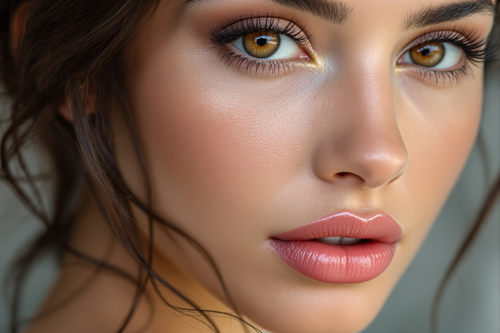
</p>

[📄 Read the PDF about Body Prompts](../files/Section3/Body+Prompts.pdf)


**Body Prompt**
```txt
A hyper-realistic knee-length portrait of a beautiful busty 24-year-old Italian girl, beautiful full lips, round face, sensual face, (very realistic skin structure) flawless skin, stunning brown eyes, vibrant look, small waist, athletic figure, wearing (an elegant beige party dress) (posed in a modern luxurious hotel lobby), perfect lighting
```

<p align="center">
    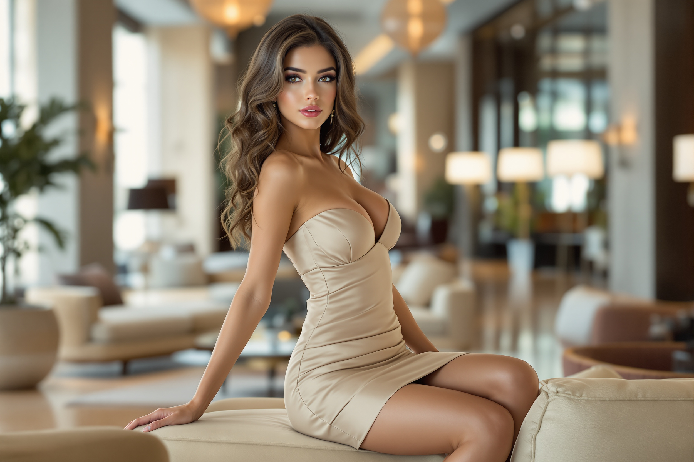
</p>

3. **CREATE A FIRST IMAGE**

Introducing the previous prompts inside the <a href="https://replicate.com/black-forest-labs/flux-1.1-pro-ultra">Flux 1.1 Pro Ultra</a> model generates the following output:

<p align="center">
    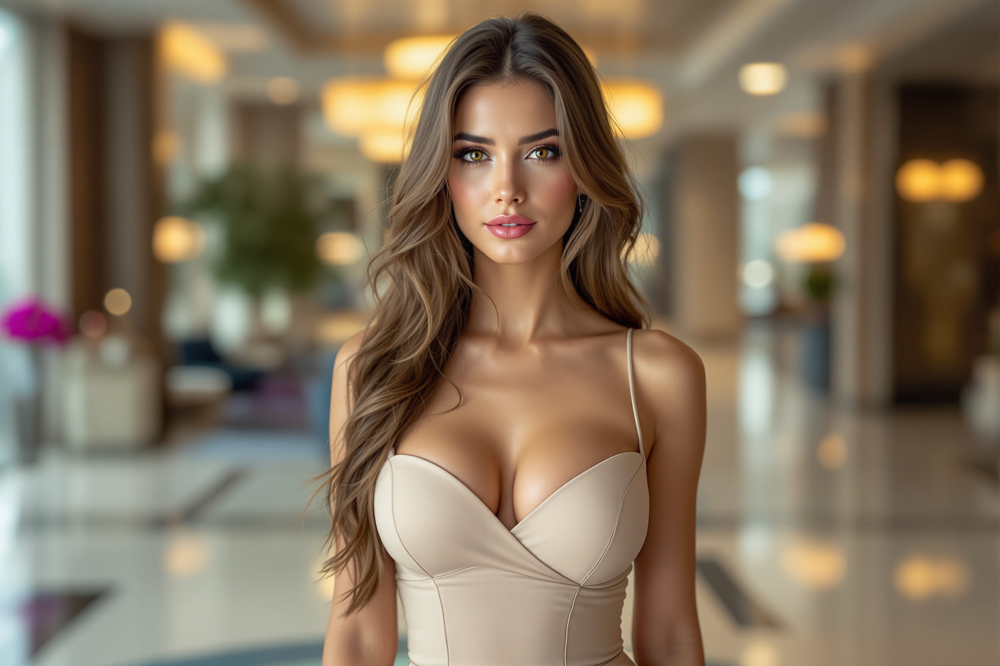
</p>

4. **CREATE THE FACE**

<p align="center">
    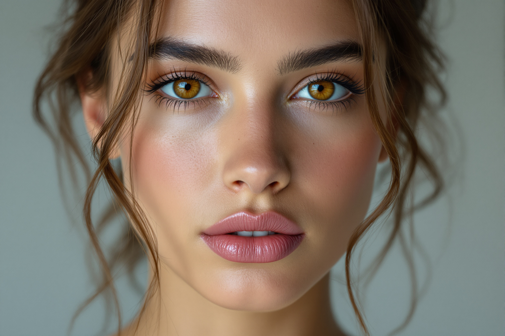
</p>

It is very important that a lot of the face is showing up in the image.

5. **SWAP THE FACE**

Swapping the face means exchanging the face in creating in the previous (step 4) and putting it in the body we created in step number 3.

There are 2 methods to consider.
**Method 1**
* Create a Body Image
* Create a Face Image
* Do a Discord Face Swap
* PROs: Easy and Fast
* CONs: Lower Quality

**Method 2**
* Create a Body Image
* Create a Face Image
* Do a Discord Face Swap
* Do an additional Fooocus Face Swap (Refinement)
* PROs: Highest Quality
* CONs: More Work

6. **CREATE MORE IMAGES**

**Body Prompt 2**
```txt
A hyper-realistic knee-length portrait of a beautiful busty 24-year-old Italian girl, beautiful full lips, round face, sensual face, (very realistic skin structure) flawless skin, stunning brown eyes, vibrant look, small waist, athletic figure, wearing (a white spaghettig top and black jeans, standing in modern designer kitchen), perfect lighting
```
<p align="center">
    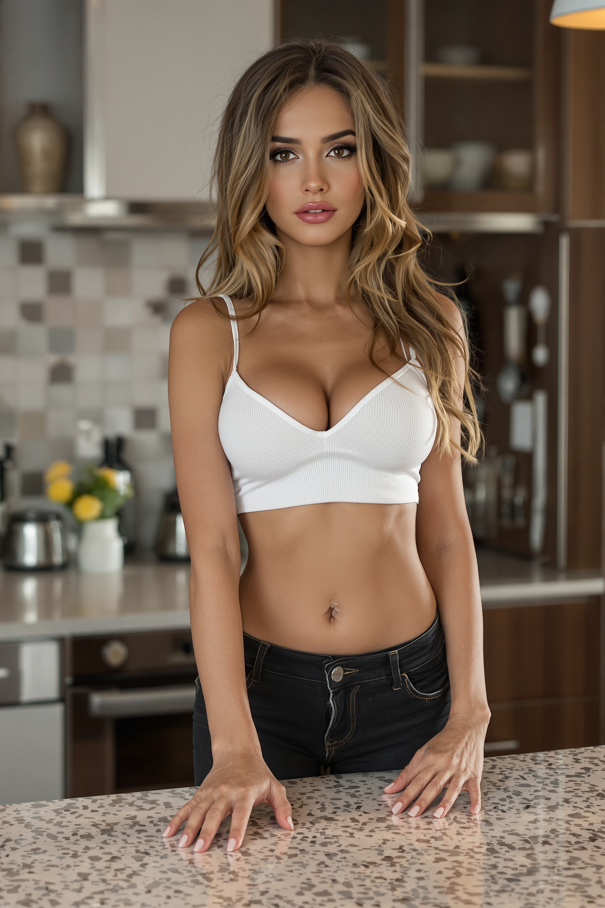
</p>


**Body Prompt 3**
```txt
A hyper-realistic knee-length portrait of a beautiful busty 24-year-old Italian girl, beautiful full lips, round face, sensual face, (very realistic skin structure) flawless skin, stunning brown eyes, vibrant look, small waist, athletic figure, wearing (an olive-green swimsuit with cutouts posing at beautiful rooftop infinity pool), perfect lighting
```
<p align="center">
    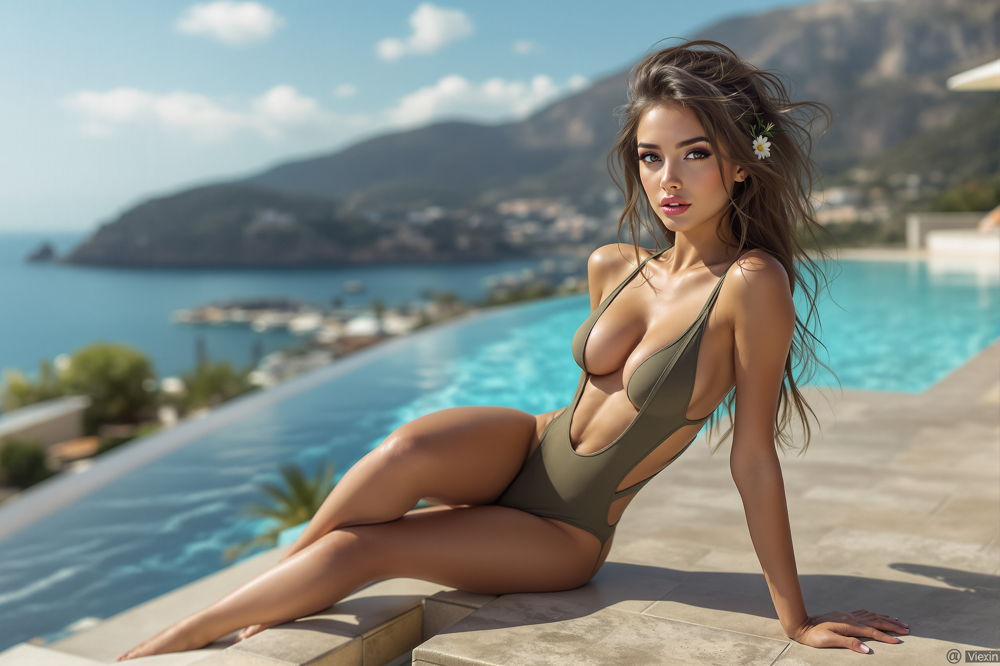
</p>

7. **TRAIN A LORA OF YOUR AI INFLUENCER**
We will tackle this later in the course.

For now, you only have to remember that LoRA is basically your own AI model, and you can train such an AI model so that later you can use that LoRA, to recreate your own AI influencer again and again without doing the face swap.

And this is a huge opportunity to speed up the process and to achieve a higher output rate and of course, a higher efficiency.

## Defining the requirements of your AI Influencer

We can use ChatGPT to provide the background story for our AI Influencer like <a href="https://chatgpt.com/share/68d3d03a-8250-800c-bb46-f0c0cc8d1d1f">we did in this conversation with ChatGPT</a>.

## Creating the face and the body of your AI Influencer

### Creating the body

**Body Prompt 1**
```txt
A hyper-realistic knee-length portrait of a beautiful busty 24-year-old Italian girl, beautiful full lips, round face, sensual face, (very realistic skin structure) flawless skin, stunning brown eyes, vibrant look, small waist, athletic figure, wearing (an elegant beige party dress) (posed in a modern luxurious hotel lobby), perfect lighting
```

<p align="center">
    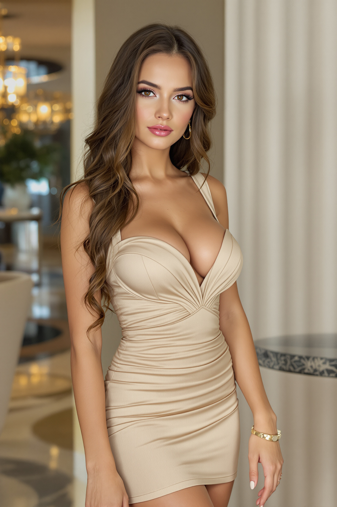
</p>


**Body Prompt 2**
```txt
A hyper-realistic knee-length portrait of a beautiful busty 24-year-old Italian girl, beautiful full lips, round face, sensual face, (very realistic skin structure) flawless skin, stunning brown eyes, vibrant look, small waist, athletic figure, wearing (a white spaghetti top and a black jeans, standing in modern designer kitchen), perfect lighting
```

<p align="center">
    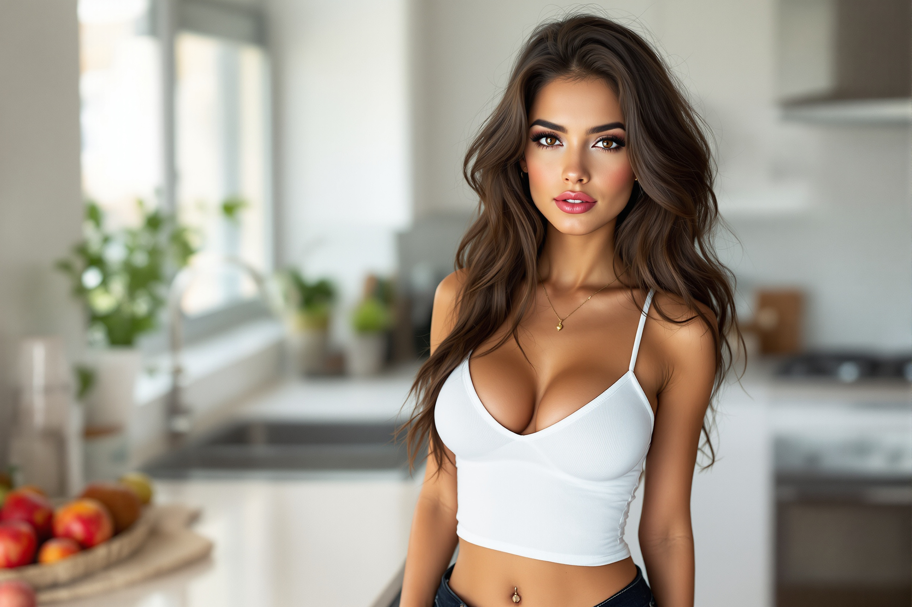
</p>


**Body Prompt 3**
```txt
A hyper-realistic knee-length portrait of a beautiful busty 24-year-old Italian girl, beautiful full lips, round face, sensual face, (very realistic skin structure) flawless skin, stunning brown eyes, vibrant look, small waist, athletic figure, wearing (an olive-green swimsuit with cutouts posing at a beautiful rooftop infinity pool), perfect lighting
```

<p align="center">
    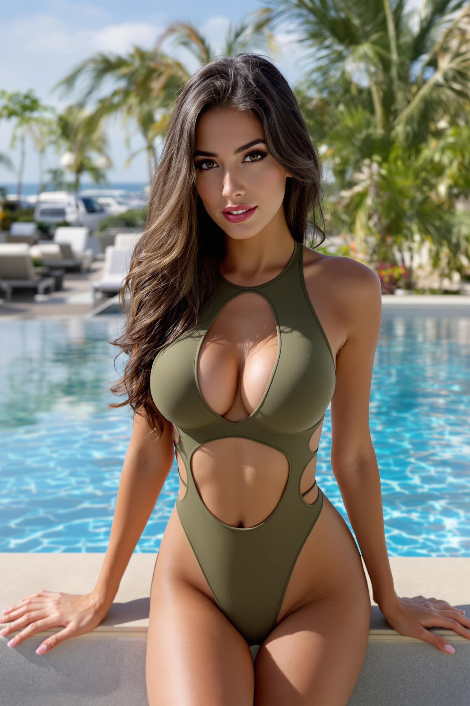
</p>

### Creating the face

**Face Prompt**
```txt
A hyper-realistic portrait of a beautiful 24-year-old Italian model, beautiful full lips, round face,
sensual face, (very realistic skin structure) flawless skin, stunning brown eyes, professional camera,
high resolution, perfect saturation, 4k
```

<p align="center">
    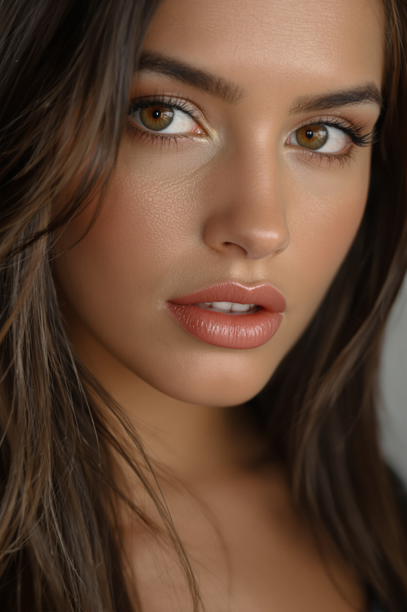
</p>

<p align="center">
    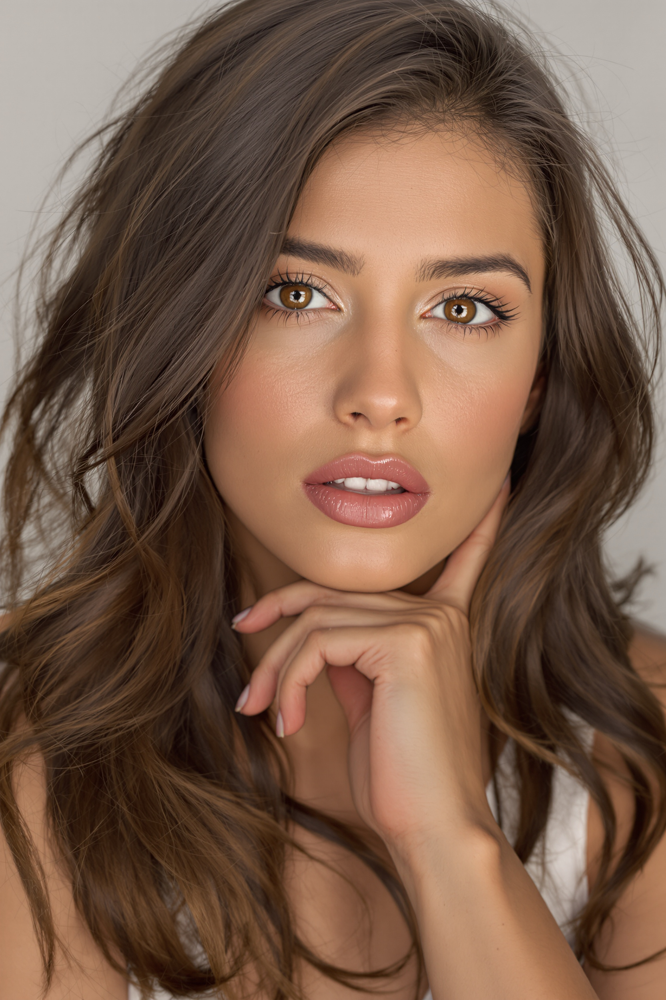
</p>


### Face Swap using Discord

Link to <a href="https://discord.com/">Discord</a>

Once you create an account in Discord your need to:
1. Create your own Server
    * Assign a name to your server, in our case our server will be named "`Swap Server`"
2. Once created your server you need to click on "`Add your first app`"
    * Click on "`Check it out`"
    * In the search text box you type for "`midjourney`"
    * Click on the "`Midjourney Bot`"
    * Click on "`Add app`"
    * You click on "`Add to Server`"
    * You select your server of "`Swap Server`"
    * Then you authorize all
    * Then we go to "`Swap Server`"
3. Once you are done with the installing the "`Midjourney Bot`" you need to install "`InsightFace`"
    * Click on "`Check it out`"
    * In the search text box you type for "`InsightFace`"
    * Click on the "`InsightFace`"
    * Click on "`Add app`"
    * You click on "`Add to Server`"
    * You select your server of "`Swap Server`"
    * Then you authorize all
    * Then we go to "`Swap Server`"

Once you do all the configuration done in the last points you will have something like the following:

<p align="center">
    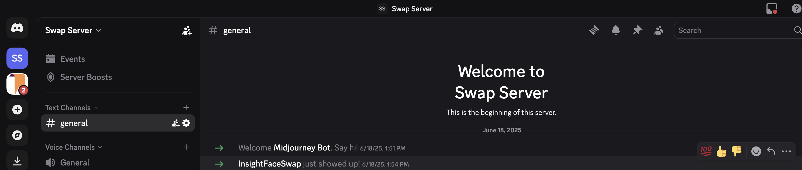
</p>

Once we have that configuration in our server in Discord.

We go to out server and use "`/saveid`" with that we select a 3-letter name like "`bbb`" and we upload a photo of our AI Influencer so that we can do Face Swap of this face in other bodies.

We selected the following face:

<p align="center">
    
</p>

Then you confirm the order with the Enter key.

Then next step that happens now is that you upload another photo with a different body to you Discord sever. In our case we upload the following image:

<p align="center">
    
</p>

Then you click in the image with the right button of your mouse and select "`Apps > INSwapper`".

And the following results were generated:
<table>
    <tr>
<td>
<p align="center">
    
</p></td>
<td><p align="center">
    
</p></td>
    </tr>
</table>

### Trick to face swap NSFW images on Discord

In the case of using an image with Not Suitable For Work we will recieve an error on Discord.

The trick is only use the face of the image. With this image you can do the Face Swap without any issues.

Then you only need to open the original image in a tool like Paint and you need to import the image of the face swapped and put it on top of the original image. 

### Installing and customizing the AI tool Fooocus

I prepared the following <a href="https://colab.research.google.com/drive/1-XWG91YqADQna0uXEVL5C4TlN2IPGw18">Google Colab Notebook</a>. **PLEASE MAKE A COPY OF THIS GOOGLE COLAB NOTEBOOK AND WORK ON YOUR COPY**.


### Doing a Face Swap with Fooocus

First of all you need to start your <a href="https://colab.research.google.com/drive/1-XWG91YqADQna0uXEVL5C4TlN2IPGw18">Google Colab Notebook</a>

Then you:
* Check on "`Input Image`"
* Check on "`Advanced`"
* You go to the tab "`Image Prompt`"
* On the top left square you select:
    * Choose "`FaceSwap`"
    * Set "`Stop At`" to "`1`"
    * Set "`Weight`" to "`1.19`"
* On that top left square you upload the face you want to FaceSwap
* Then you go to the "`Inpaint or Outpaint`" tab
    * Upload the body you want to do the FaceSwap on
    * Then on the image of that body, you need to mark the face of the image of the body
    * On the "`Method`" drop down you need to select "`Improve Detail (face, hand, eyes, etc.)`"
    * Then on the "`Inpaint Additional Prompt`" you need to add something like the following:
        * "`beautiful brown eyes`"
* Then you go to the "`Advanced`" tab at the top right
    * You need to check on "`Developer Debug Mode`"
    * Then you go to the "`Control`" tab
    * Check on the "`Mixing Image Prompt and Inpaint`"
        * This checkbox will connect the "`Image Prompt`" tab and the "`Inpaint or Outpaint`" tab
    * The you go to the "`Inpaint`" tab
        * Set up "`Inpaint Denoising Strength`" to "`0.38`"
* Click on the "`Generate`" button

**PRO TIP**:
1. Do the FaceSwap with Discord
2. Do another FaceSwap with Fooocus setting up "`Inpaint Denoising Strength`" to "`0.34`"


### Editing your images with Fooocus

<p align="center">
    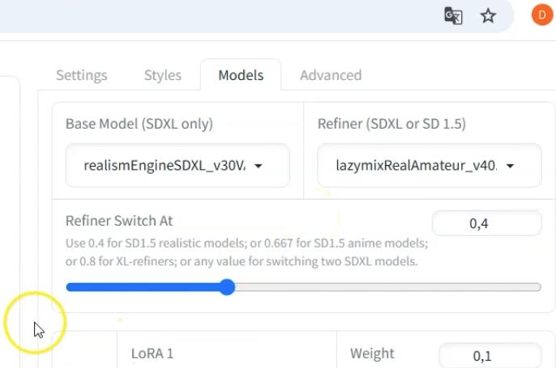
</p>

In this part of the section the instructor is showing us how to use Fooocus to use Inpainting to modify something in the image.
