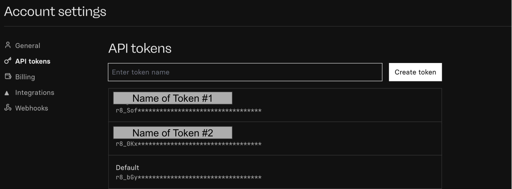
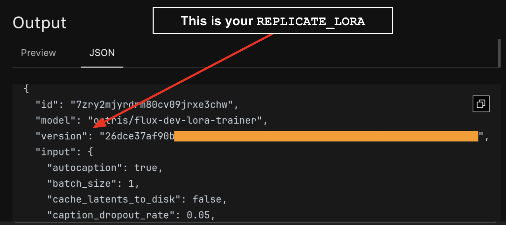

# Section 4: Training a Flux LoRA of Your AI Influencer

## Understanding LoRAs

<p align="center">
    
</p>

**What is a LoRA?**

LoRA (Low-Rank Adaptation) is a small, specialized module that extends an AI model's capabilities without retraining the entire model. In the diagram above:
- **Grey box**: The full base model
- **Yellow box**: Your custom LoRA

Think of it as a "plugin" that teaches the model something specific while keeping the base model unchanged.

**How LoRAs Work**

LoRAs add small, trainable layers to an existing AI model. These layers learn specific tasks or styles, such as:
- A particular art style
- Your AI influencer's unique appearance and features
- Specific visual characteristics or aesthetics

**Why Use LoRAs?**

* ✅ **Efficient**: Train only a small portion of the model (much faster and cheaper)
* ✅ **Reusable**: Apply your LoRA to any compatible base model
* ✅ **Consistent**: Generate your AI influencer reliably with just a trigger word
* ✅ **Accessible**: No need for expensive hardware - use cloud services

---

## Prerequisites

Before you begin, you'll need accounts and API tokens from two platforms:

### 1. Hugging Face Account & Token

**Purpose**: Store and host your trained LoRA model

1. Create an account at [Hugging Face](https://huggingface.co/)
2. Go to [Token Settings](https://huggingface.co/settings/tokens)
3. Click **"New token"**
4. Give your token **write permissions** (required to upload your LoRA)
5. Copy and save the token securely (you'll need it later)

### 2. Replicate Account & API Token

**Purpose**: Train your LoRA using cloud GPUs

1. Create an account at [Replicate](https://replicate.com/)
2. Navigate to [API Tokens](https://replicate.com/account/api-tokens)

<p align="center">
    
</p>

3. Click **"Create token"**
4. Give it a descriptive name (e.g., "Flux LoRA Training")
5. Copy the token (format: `r8_SofzVG*******************************` - 40 characters)
6. **Save it securely** - you'll need it for training and image generation

---

## Preparing Your Training Dataset

**Dataset Quality = LoRA Quality**

The images you use to train your LoRA directly impact the results. Follow these guidelines:

### Dataset Requirements

**Quantity**: 30-40 high-quality images (recommended)

**Variety is Critical**:
- ✅ **Different poses**: Standing, sitting, walking, various angles
- ✅ **Different backgrounds**: Indoor, outdoor, studio, natural settings
- ✅ **Different outfits**: Casual, formal, various styles
- ✅ **Different lighting**: Natural light, studio lighting, golden hour, etc.
- ✅ **Different angles**: Front view, side profile, 3/4 view, close-ups, full body

**Image Naming**:
Use descriptive filenames that describe the image content. For example:
- `portrait_neutral_expression_studio_lighting.jpg`
- `full_body_beach_sunset_casual_dress.jpg`
- `closeup_smiling_natural_light.jpg`

**Packaging**:
Once you have your images ready, create a **ZIP file** containing all of them.

---

## Training Your LoRA on Replicate

### Step 1: Access the Trainer

Go to the [Flux Dev LoRA Trainer](https://replicate.com/ostris/flux-dev-lora-trainer/train) on Replicate.

### Step 2: Configure Training Parameters

Here are the recommended settings for optimal results:

#### Essential Parameters

| Parameter | Value | Description |
|-----------|-------|-------------|
| `input_images` | *Your ZIP file* | Upload your dataset |
| `trigger_word` | e.g., `"helga"` | Unique word to activate your LoRA |
| `steps` | `3000` | Training iterations (2000-3000 recommended) |
| `lora_rank` | `32` | Model capacity (higher = more detail, slower) |
| `learning_rate` | `0.0004` | How fast the model learns |
| `hf_token` | *Your HF token* | Hugging Face access token |
| `hf_repo_id` | e.g., `username/my-lora` | Where to save your LoRA on HF |

#### Advanced Parameters

| Parameter | Recommended Value | Notes |
|-----------|------------------|-------|
| `autocaption` | `true` | Automatically generates image descriptions |
| `batch_size` | `1` | Images processed simultaneously |
| `resolution` | `512,768,1024` | Training resolutions |
| `caption_dropout_rate` | `0.05` | Helps model generalize better |
| `optimizer` | `adamw8bit` | Memory-efficient optimizer |
| `cache_latents_to_disk` | `true` | Speeds up training, uses disk space |
| `gradient_checkpointing` | `false` | Set to `true` if running out of memory |

#### Optional: Weights & Biases Tracking

Track your training progress visually:

| Parameter | Example Value |
|-----------|--------------|
| `wandb_project` | `helga_flux_lora` |
| `wandb_run` | `helga_steps3000_rank32_lr4e-4` |
| `wandb_sample_interval` | `200` |
| `wandb_save_interval` | `750` |
| `wandb_sample_prompts` | See example below |

**Example sample prompts** (for monitoring during training):
```
portrait of helga, neutral expression, studio lighting, 50mm lens, photorealistic
full body photo of helga standing on a beach at sunset, detailed skin, sharp focus, 8k
photorealistic helga riding a black horse on a misty shoreline, cinematic lighting, high detail
editorial fashion photo, 8k helga in casual streetwear, city at night, neon lights, shallow depth of field, ultra realistic
```

### Step 3: Start Training

1. Review all parameters
2. Click **"Run"** or **"Train"**
3. Training typically takes **30-60 minutes** depending on settings
4. **Cost**: Approximately $3-4 USD per training session

### Step 4: Retrieve Your Trained LoRA

Once training completes:

<p align="center">
    
</p>

1. Your LoRA will be automatically uploaded to Hugging Face (if `hf_repo_id` was set)
2. Note the **version ID** from Replicate (you'll need this for the API)
3. The version ID looks like: `26dce37af90b........`

---

## Using Your Trained LoRA

### Option 1: Replicate API (Programmatic)

Create a bash script to generate images using your LoRA:

```bash
#!/usr/bin/env bash
# generate_image.sh

# Configuration
REPLICATE_API_KEY="r8_SofzVG*******************************"  # Your Replicate API token
REPLICATE_LORA="26dce37af90b........"                         # Your LoRA version ID from Replicate

# The prompt MUST contain your trigger word
PROMPT="portrait of helga in a red dress, studio lighting, professional photography, 8k"

# Generate image
curl -X POST "https://api.replicate.com/v1/predictions" \
  -H "Authorization: Bearer $REPLICATE_API_KEY" \
  -H "Content-Type: application/json" \
  -d "{
    \"version\": \"$REPLICATE_LORA\",
    \"input\": {
      \"model\": \"dev\",
      \"prompt\": \"$PROMPT\",
      \"megapixels\": \"1\",
      \"aspect_ratio\": \"4:5\",
      \"output_format\": \"png\",
      \"num_inference_steps\": 50,
      \"disable_safety_checker\": true
    }
  }"
```

#### Parameter Reference

**Aspect Ratios**:
- `21:9` - Ultra-wide (cinematic)
- `16:9` - Widescreen
- `4:5` - Portrait (Instagram)
- `1:1` - Square
- `9:16` - Vertical (mobile)
- `3:2`, `4:3`, `5:4`, `2:3`, `3:4`, `9:21` - Other ratios

**Output Formats**:
- `png` - High quality, larger file size
- `jpg` - Smaller file size, slight compression

**Safety Checker**:
- `disable_safety_checker: true` - Allows NSFW content
- `disable_safety_checker: false` - Filters NSFW content

### Option 2: Replicate Web Interface

1. Go to your training on Replicate
2. Navigate to the **"API"** or **"Use"** tab
3. Enter your prompt (including trigger word)
4. Adjust parameters as needed
5. Click **"Run"**

---

## Running Your Script

Make the script executable and run it:

```bash
# Make executable
chmod +x generate_image.sh

# Run the script
./generate_image.sh
```

---

## Tips for Best Results

### Crafting Prompts

* ✅ **Always include your trigger word** (e.g., "helga")
* ✅ **Be specific**: Describe pose, clothing, lighting, background
* ✅ **Use quality descriptors**: "8k", "photorealistic", "detailed", "cinematic"
* ✅ **Specify camera details**: "50mm lens", "shallow depth of field"

### Example Quality Prompts

```
portrait of helga wearing elegant evening gown, soft studio lighting, professional photography, detailed skin texture, 8k, sharp focus

full body shot of helga in casual jeans and white t-shirt, urban street background, golden hour lighting, photorealistic, cinema quality

close-up of helga smiling, natural makeup, outdoor setting, bokeh background, 50mm lens, editorial photography
```

### Troubleshooting

**LoRA not capturing the likeness?**
- Add more diverse images to your dataset
- Ensure good lighting in training images
- Increase training steps to 3000-4000

**Images look inconsistent?**
- Use more specific prompts
- Include your trigger word multiple times
- Adjust `caption_dropout_rate` and retrain

**Training failed?**
- Check that your ZIP file isn't corrupted
- Verify all API tokens are correct and have proper permissions
- Ensure images are in common formats (JPG, PNG)

---

## Summary

You've learned how to:
1. ✅ Set up accounts and obtain API tokens
2. ✅ Prepare a high-quality training dataset
3. ✅ Configure and train a Flux LoRA on Replicate
4. ✅ Generate images using your custom LoRA
5. ✅ Optimize prompts for best results

With your trained LoRA, you can now generate consistent images of your AI influencer with just a prompt and your trigger word!
