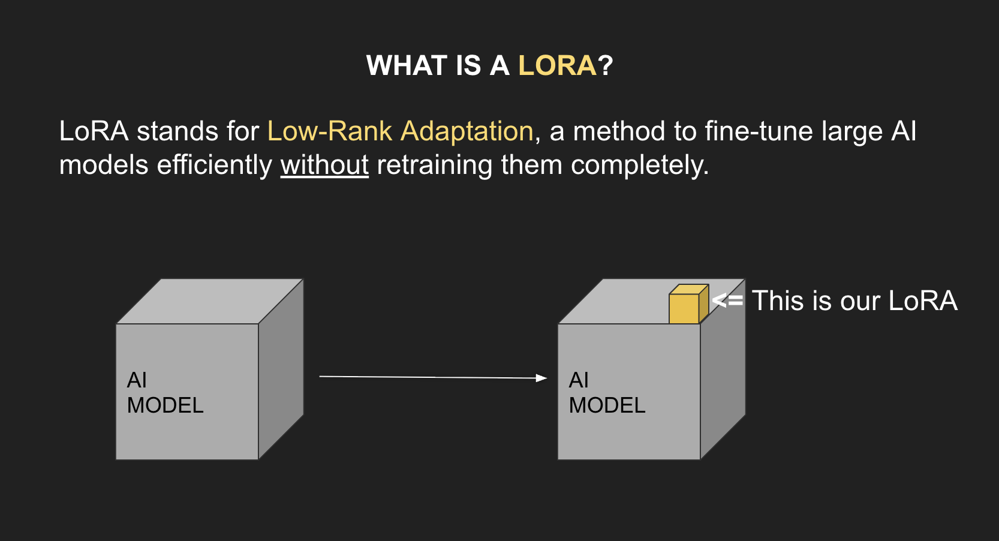

# Section 4: Training a Flux LoRA of your AI Influencer

## ALL YOU NEED TO KNOW ABOUT LORAS

<p align="center">
    
</p>

The grey box is the full model and the yellow box represent our LoRA.

The LoRA is a tiny part of the whole model that is retrained.


**How do LoRAs work?**

LoRAs work by adding small, extra layers to an AI model. These layers are **trained** to handle a **specific task** or style, like drawing in a particular art style or generating images with certain look.

We can train our LoRA to do:
* A certain style
* To create images of our AI influencer
* To generate images with a specific style

**Why Should You Use LoRAs?**

LoRAs empowers creators, even those with limited resources, to **personalize AI models** for unique outputs in a time-efficient way.

## Create your token in Hugging Face

You need to go <a href="https://huggingface.co/settings/tokens">the following website</a> to create User Access Token.

You need to give all permissions to your token.

## Training a Flux LoRA with images of your own AI Influencer

The advantange of training our own LoRA with images of our own AI Influencer is that you can recreate the AI Influencer again and again with a just a prompt and a click.

First of all you need to have your **DATA SET** which is a list of images to train your LoRA.

The **DATA SET** needs to contemplate:
* Different backgrounds
* Different dresses for the AI Influencer
* Different poses for the AI Influencer

It's important to train the LoRA with different:
* Angles
* Lightings
* Backgrounds

Give each image a very descriptive name of what is in the image itself.

It's recommended to use **between 30 to 40 images** to train your LoRA.

When you have this folder with the images within you just need to create a ZIP file.

What you need to have is:
* An account on <a href="https://replicate.com/">Replicate</a>
* An account on <a href="https://huggingface.co/">Hugging Face</a>

Inside <a href="https://replicate.com/">Replicate</a> you will find the <a href="https://replicate.com/ostris/flux-dev-lora-trainer/train">Flux Dev LoRA Trainer</a>

The recommended parameter to set in your LoRA are:
* "`trigger_word`": The trigger word for your LoRA it could be anything... (For example: "`helga`", "`anastasia`", "`bob`"...)
* "`autocaption`": "`true`"
* "`steps`": "`3000`"
* "`lora_rank`": "`32`"
* "`hf_repo_id`": Hugging Face Access Token
* "`wandb_project`": "`helga_flux_lora`"
* "`wandb_sample_prompts`": "`portrait of helga, neutral expression, studio lighting, 50mm lens, photorealistic full body photo of helga standing on a beach at sunset, detailed skin, sharp focus, 8k, photorealistic helga riding a black horse on a misty shoreline, cinematic lighting, high detail, editorial fashion photo, 8k helga in casual streetwear, city at night, neon lights, shallow depth of field, ultra realistic`"
* "`learning_rate`": "`0.0004`"
* "`batch_size`": "`1`"
* "`resolution`": "`512,768,1024`"
* "`caption_dropout_rate`": "`0,05`"
* "`optimizer`": "`adamw8bit`"
* "`cache_latents_to_disk":
    * "`true`" if your dataset is big and you’re OK using disk space to speed up repeated passes.
    * "`false`" is fine too; quality is the same.
* "`layers_to_optimize_regex`":
    * Leave **blank / default** unless you explicitly know you want to only train some layers.
    * For a normal character LoRA, don’t touch it.
* "`gradient_checkpointing`"
    * "`false`" if you’re training on Replicate’s H100 (plenty of VRAM, faster).
    * "`true`" only if you somehow hit OOM; it trades speed for memory, not quality.
* "`skip_training_and_use_pretrained_hf_lora_url`":
    * Leave **empty/false.**
    * This is only if you want to load a LoRA from Hugging Face instead of training on your zip.
* "`wandb_run`": "`helga_steps2200_rank32_lr4e-4`"
* "`wandb_sample_interval`": "`200`"
* "`wandb_save_interval`": "`750`"

Once you are in that trainer you need to:
1. Adding the name for your AI Influencer, it could be anything.
2. Then provide your dataset in the field "`input_images`" of the Flux Dev LoRA Trainer
3. Then you need to select the "`trigger_word`" this is a very important because it will be the word that will trigger the LoRA. The recommendation is to use the name of the AI Influencer
4. On the "`steps`" you need to select between "`2000`" and "`3000`". The more steps you take the more time you will get to train the LoRA and the more expensive it is. The cost to train a LoRA could be between 3$ or 4$.
5. Then you need go back to <a href="https://huggingface.co/">Hugging Face</a> to create a new Access Token
6. Then with Access Token you created in Hugging Face you back to the Flux Dev LoRA Trainer and paste Access Token in the field that says "`hf_token`"
7. Then you go back to <a href="https://huggingface.co/">Hugging Face</a> to create a new model with the name of your AI Influencer, do not forget to copy the name of your model.
8. Then you go back to the Flux Dev LoRA Trainer and paste the name of the model of Hugging Face inside the field "`hf_repo_id`"
9. Then you need to create a <a href="https://replicate.com/account/api-tokens">Replicate Token</a>

Once you have all the information you can create a Bash script to create the images of your AI Influencer were you will be to generate images without any constraints.

```bash
#!/usr/bin/env bash
# generate_image.sh

REPLICATE_API_KEY="..."
REPLICATE_LORA="..."

# The prompt needs to contain the trigger word for your LoRA
PROMPT="..."

curl -X POST "https://api.replicate.com/v1/predictions" \
  -H "Authorization: Bearer $REPLICATE_API_KEY" \
  -H "Content-Type: application/json" \
  -d "{
    \"version\": \"$REPLICATE_LORA\",
    \"input\": {
      \"model\": \"dev\",
      \"prompt\": \"$PROMPT\",
      \"megapixels\": \"1\",
      \"aspect_ratio\": \"4:5\",
      \"output_format\": \"png\",
      \"num_inference_steps\": 50,
      \"disable_safety_checker\": true
    }
  }"
```

The paramter that is named "`disable_safety_checker`" allows you to create images that are Not Suitable For Work.

Once you have created the following Bash script, you will have enable the permissions for execution with...

```shell
$ chmod + generate_image.sh
```
