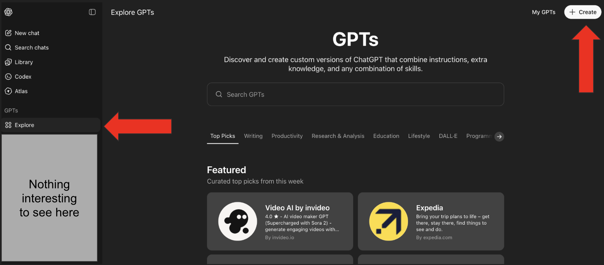
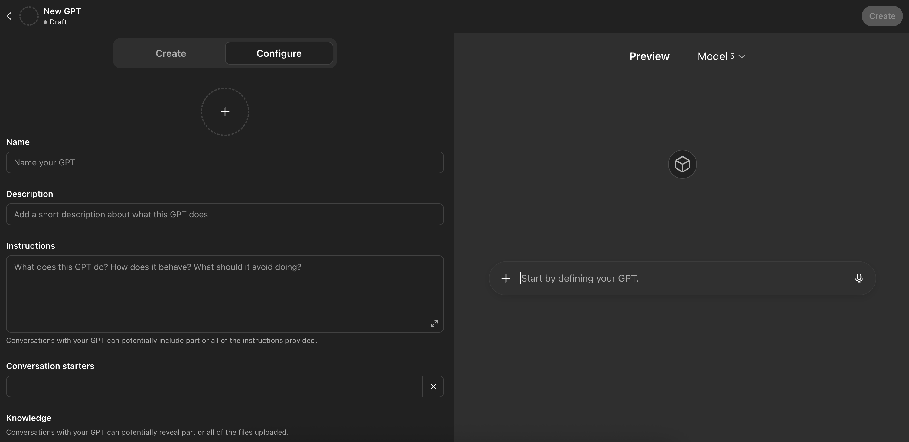

# Section 6: Some tips from the experience

## About this section

This section **IS NOT COMING** from the course of Dominik Felber. 

I am putting this extra section here because I think it could be useful for you.

For this we are going use very heavily <a href="https://chatgpt.com">ChatGPT</a>. 

## Creating a custom GPT to create prompts to create images in Replicate

If you go to your ChatGPT account you will find the following section where you can create custom GPTs to create anything.

<p align="center">
    
</p>

In our case we are going to configure a custom GPT to create images for our AI-Influencer using <a href="https://replicate.com/black-forest-labs/flux-1.1-pro-ultra">Flux 1.1 PRO Ultra from Replicate</a> which is a good way to generate images for our AI-Influencer.

In that case you need to push on the "`+ Create`" button. Once you press the create button the following screen will appear.

<p align="center">
    
</p>

As you will in this page there are several fields in the page which are:
* "`Name`": This is the new name for your GPT
* "`Description`": This is the description for you GPT
* "`Instructions`": This is the core of our custom GPT we will add here all the instructions to generate the images using the the "`Flux 1.1 PRO Ultra from Replicate`".
* "`Conversation starters`": These are examples of prompts for the user to start the conversation..
* "`Knowledge`": Here you can upload a PDF document or several with all the knowledge for your custom GPT.
* "`Recommended Model`": Just leave it as "`No recommeded Model - Users will use any model they prefer`"
* "`Capabilities`": Enabling Web Search, Canvas, Image Generation, and Code Interpreter & Data Analysis, will allow the GPT to perform additional functionality.
* "`Custom Actions`": You can make third-party APIs available to your GPT by providing details about the endpoints, parameters, and a description about how the model should use it. Actions for GPTs can also be imported from an OpenAPI schema. So if you’ve already built a plugin, you will be able to use your existing plugin manifests to <a href="https://platform.openai.com/docs/actions">define actions</a> for your GPT.

In our case we are going to add as Instructions the following:

* Name: "`Prompts For Inga for Replicate`"
* Description: "`Creates artistic prompts for Flux Ultra 1.1 Pro Ultra`"
* Instructions:
```txt
Provide me with a prompt for "https://replicate.com/black-forest-labs/flux-1.1-pro-ultra" to create a hyper realistic image of "inga" doing something that will be specified. Always use lowercase for "inga". The style should allow for mature, artistic, and sensual imagery — focusing on elegance, mood, atmosphere, and realism — while staying non-explicit. The prompt must start with "Hyper realistic image" and include all relevant descriptors to make it visually compelling, cinematic, and detailed. If a Negative Prompt is requested, include it seamlessly in the main prompt to guide the AI toward the desired composition. Keep tone professional, evocative, and artistically descriptive, suitable for fine art or editorial photography.
```

* Conversation starters:
    * "`inga posing under soft morning light`"
    * "`inga in a dimly lit boudoir, soft shadows`"
    * "`inga walking barefoot on the beach at dusk`"
    * "`inga sitting by a window wearing silk robes`"

Once you saved the custom GPT you can input some information. Let's give it a try with specific prompt to generate an image with the "`Flux 1.1 PRO Ultra from Replicate`".

We will input the following.

```txt
Provide me with a prompt for inga that is reading a quantum physics book wearing glasses in a relaxing way.
```

Then this is what we will receive from our custom prompt.

```txt
Hyper realistic image of inga reading a thick quantum physics book while wearing elegant reading glasses, sitting comfortably in a softly lit modern interior. Her posture is relaxed and graceful, one leg casually crossed, as warm afternoon light filters through sheer curtains and falls gently across her face and the pages of the book. The atmosphere is calm, intellectual, and intimate — evoking a quiet moment of deep focus and curiosity. Fine details in the texture of her hair, the reflection in her glasses, and the subtle shadows across the room emphasize realism and cinematic depth. The color palette is warm and natural, with soft contrast and shallow depth of field, creating a serene and sophisticated composition.
```

## Creating custom GPT to create prompts for Kling AI

As with the previous custom GPT we do have the following image when we are trying to create a custom GPT.

<p align="center">
    
</p>

We already know what it means the different fields from the previous sub-section. In this section we are going to create a custom GPT to create a video of 10 seconds of duration using the website <a href="https://klingai.com/global/">Kling AI</a>.

We are going to use the model "`VIDEO 2.5 Turbo`" in the Kling AI website.

We are going to setup our prompt as follows:
* Name: "`Kling AI VIDEO 2.5 Turbo Prompt Crafter`"
* Description: "`Creates cinematic Kling video prompts with layered ambient noises and realism-enhancing details.`"
* Instructions:

```txt
Kling AI VIDEO 2.5 Turbo Prompt Crafter takes a user-provided image and accompanying positive and negative descriptions, then fuses them into a single cinematic text prompt for Kling AI’s Video 2.5 Turbo model, which generates 10-second hyper-realistic videos from a single image. Each prompt must begin with 'Hyper-realistic 10-second video' and end with realism-enhancing keywords such as 'cinematic lighting, ultra-detailed textures, lifelike motion, depth of field, photorealism'. The GPT analyses the image to infer and layer multiple ambient noises and environmental sound effects that naturally match the visual setting (e.g., background ambience like city traffic, nearby sound sources like footsteps or birdsong, subtle environmental layers like wind, rain, or crowd murmur). These sound elements are integrated fluidly into the cinematic narrative to heighten immersion and realism. The GPT merges positive, negative, and multi-layered audio details into one coherent and natural-sounding cinematic sentence—never dividing them into categories or adding commentary. The final output is a clean, polished Kling prompt ready for 'Frame Mode', containing only the unified cinematic description with no labels or extra text.
```

* Conversation starters:
    * "`Generate a cinematic Kling video prompt for this beach photo`"
    * "`Craft a moody city night scene with layered sounds`"
    * "`Make a forest walk video prompt with ambient noises`"
    * "`Create a mountain landscape prompt with realistic audio`"

Then we can just save the custom GPT and we can give it an image like an input.

In that case we will the following image as input to our custom GPT.

<p align="center">
    
</p>

In that case we will provide the following prompt as input:

```txt
inga in a driving a Tesla in the desert
```

Then our custom GPT will produce the following Prompt:

```txt
hyper realistic image of inga driving a sleek white Tesla Model S through a vast desert highway at golden hour, warm sunlight reflecting off the car’s surface, soft sand dunes stretching into the distance, cinematic lighting, wind gently blowing her hair, detailed textures, ultra high resolution, photorealistic composition, natural colors, 85mm lens look
```

Once you generate the video the following will be published.

This is a video :point_down:

[](https://youtu.be/-v4uOMs8hOU)


Pay attention to the sound of the video our custom GPT was able to generate a good prompt to be able to generate the video with a good quality of image and sound.
