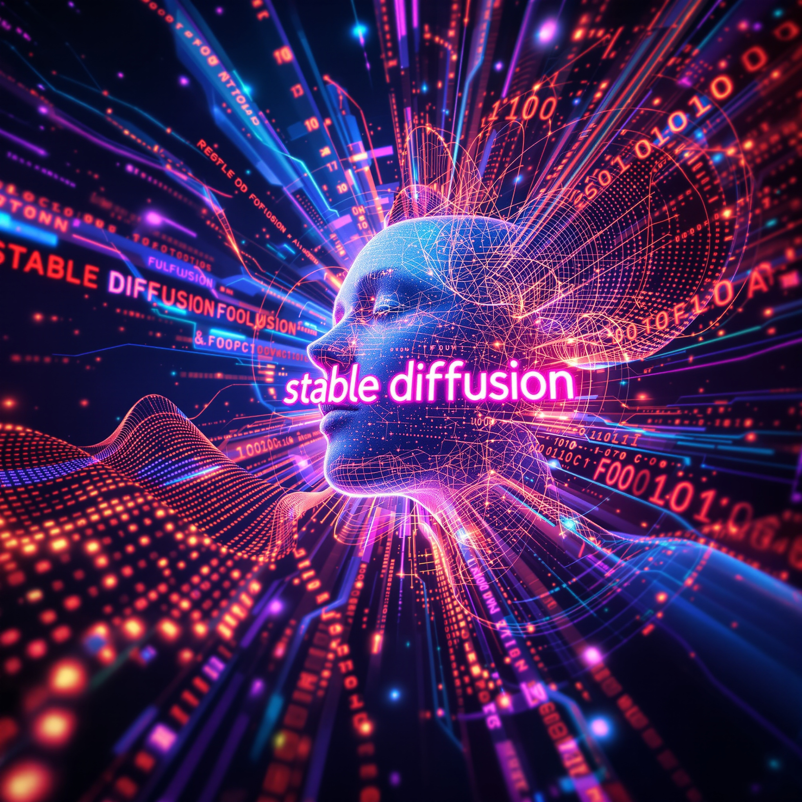

# Realistic AI Images with Stable Diffusion & Fooocus

    

## Udemy course

<a href="https://www.udemy.com/share/10cgyr3@fMowz80dquFfuqGir0CqXTdKZeYvsH-zgyrd4hMfNI69_NBRDpBXSBomVAJyz0MK/">Realistic AI Images with Stable Diffusion & Fooocus</a>

This course offers an outstanding and immersive learning journey into the world of AI-generated imagery. The curriculum is exceptionally well organized, guiding learners step by step from foundational concepts to advanced techniques. Each module is concise yet comprehensive, ensuring clarity and depth without unnecessary filler.

The teaching approach is articulate, engaging, and highly motivating, with a consistent focus on real-world applications. Practical demos, annotated examples, and hands-on exercises reinforce understanding and build confidence in applying new skills. The integration of Stable Diffusion and Fooocus is expertly handled, allowing learners to grasp both theory and practice in a balanced way.

The value provided is remarkable: this course delivers premium content with professional polish, well beyond typical expectations for online learning. Responsiveness to questions and attention to detail further elevate the experience.

In summary, this is an exceptional course that empowers creators, designers, and AI enthusiasts alike to master realistic image generation. Highly recommended for anyone serious about pushing creative boundaries with modern tools.

## Instructor

The instructor of this course in Udemy is <a href="https://www.linkedin.com/in/dominik-felber-32b71812a/">Dominik Felber</a>.

**Dominik Felber** is a dynamic expert in AI automation and content creation, combining deep technical expertise with entrepreneurial vision. As the founder of Limitless AI Solutions LLC, he helps businesses harness the transformative power of artificial intelligence through advanced prompting, prompt design, and engineering. His career reflects a unique blend of innovation, leadership, and resilience—having successfully built and managed multiple companies in real estate, fitness, and now cutting-edge AI solutions.

With a strong academic foundation from the Technical University of Munich in Mechanical Engineering & Management, Dominik brings both analytical precision and strategic thinking to every endeavor. His early career at BMW Group as a quality specialist highlights his eye for detail and dedication to excellence—qualities he has carried into his entrepreneurial ventures.

Dominik is not only a forward-thinking innovator but also a proven leader who thrives on creating impactful solutions. His ability to combine technology, business acumen, and creativity makes him a trusted partner for organizations seeking to unlock the full potential of AI.

In short, Dominik Felber stands out as a visionary entrepreneur, an AI automation specialist, and an inspiring leader committed to shaping the future of intelligent solutions.

## DISCLAIMER

The content provided in this section represents **MY PERSONAL STUDY NOTES** and should not be considered a substitute for the full course material. For comprehensive instruction, detailed explanations, and structured guidance, it is strongly recommended to enroll in the Udemy course “<a href="https://www.udemy.com/share/10cgyr3@fMowz80dquFfuqGir0CqXTdKZeYvsH-zgyrd4hMfNI69_NBRDpBXSBomVAJyz0MK/">Realistic AI Images with Stable Diffusion & Fooocus</a>”

## SECTIONS

* [Section 1: Introduction](docs/Section-1.md)
* [Section 2: Introduction to the ai tool Fooocus and Google Colab](docs/Section-2.md)
* [Section 3: The most important functions of Fooocus and how to use them](docs/Section-3.md)
* [Section 4: LORAs](docs/Section-4.md)
* [Section 5: Expert Knowledge](docs/Section-5.md)
* [Section 6: Product Placement](docs/Section-6.md)
* [Section 7: Create an AI Influencer (constant character)](docs/Section-7.md)
* [Section 8: Trouble Shooting Fooocus](docs/Section-8.md)
* [Section 9: Aesthetics, Propotions and Composition in images](docs/Section-9.md)
* [Section 10: Bonus Section: First Steps into AI Video Creation](docs/Section-10.md)
* [Section 11: Become a Freelancer on Platforms like Fiverr](docs/Section-11.md)
* [Section 12: Tipps for an efficient and clean Work Process](docs/Section-12.md)
* [Section 13: Legal and moral aspects of creating ai images](docs/Section-13.md)
* [Section 14: Summary and Goodbye](docs/Section-14.md)

