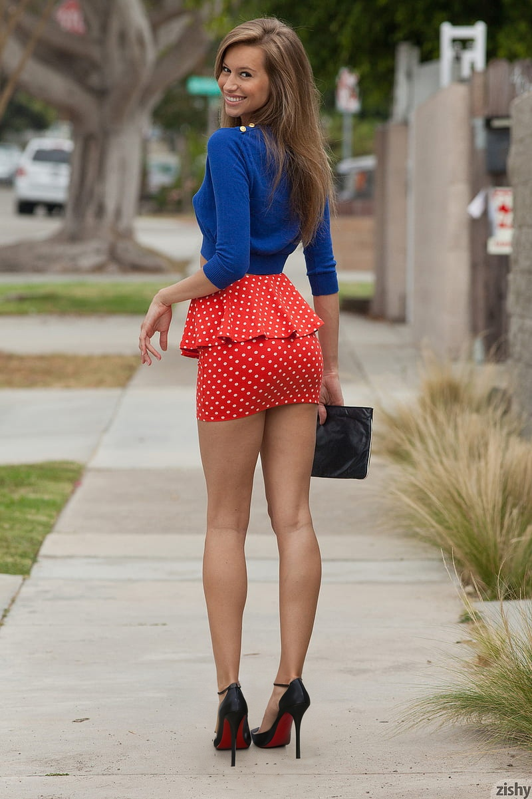
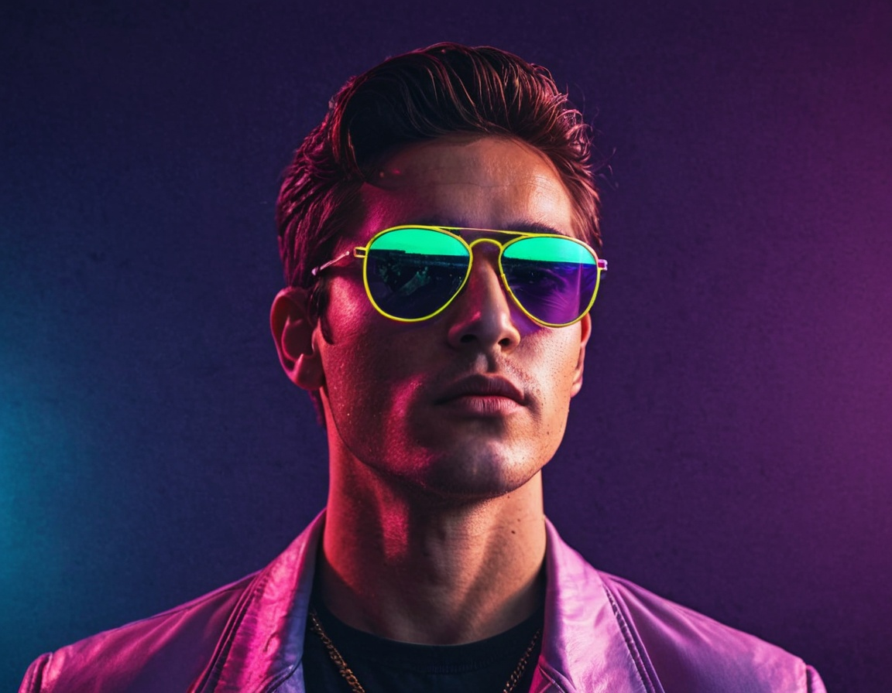
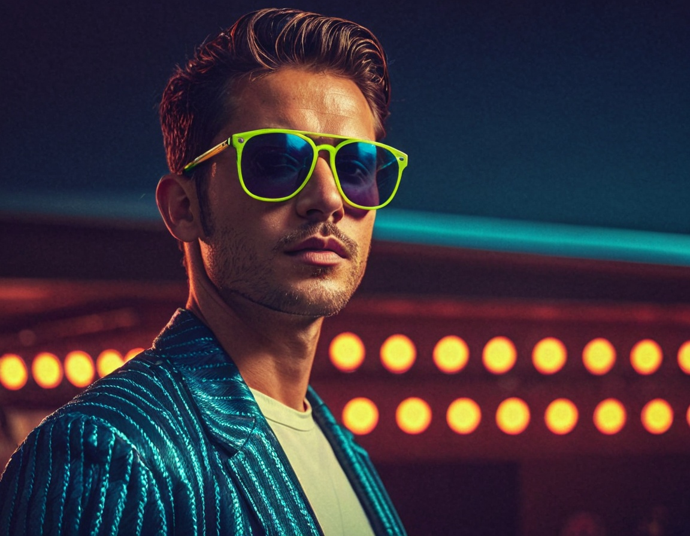

# LoRAs

**LoRA** stands for **Low-Rank Adaptation**. It’s a smart way to *teach* an existing AI model how to create new styles, characters, or specific objects — **without retraining the whole model**.

**Imagine this:**
You have a big, powerful image-making AI (like Stable Diffusion) that knows how to create all kinds of pictures. But now, you want it to learn something new—like a specific cartoon style, a certain outfit, or a made-up character.

Instead of retraining the entire model (which takes a lot of time and computer power), **LoRA** lets you train **just a small part** of the model. This small part is like a "plugin" or "add-on" that contains the new information.

**Why is this helpful?**
* 🧠 It’s efficient – you don’t need to start from scratch.
* 💾 It’s lightweight – the LoRA files are small and easy to share.
* 🎨 It lets you customize AI images easily with new styles or ideas.

So in short: **LoRA is a compact, flexible way to teach big AI models new tricks.**

In this scenario we are going to change a little bit the code in our Google Colab.

Up to now we do have the following code in our Google Colab.

```txt
!pip install pygit2==1.15.1
%cd /content
!git clone https://github.com/lllyasviel/Fooocus.git
%cd /content/Fooocus
!wget -O /content/Fooocus/models/checkpoints/realismEngineSDXL_v30VAE.safetensors https://civitai.com/api/download/models/293240
!python entry_with_update.py --share --always-high-vram
```

To install the LoRA named Smokin' Lingerie we need to use the following code in our Google Colab.

```txt
!pip install pygit2==1.15.1
%cd /content
!git clone https://github.com/lllyasviel/Fooocus.git
%cd /content/Fooocus
!wget -O /content/Fooocus/models/loras/lingerie_loha.safetensors https://civitai.com/api/download/models/362360
!python entry_with_update.py --share --always-high-vram
```

In our case we are going to give it a try to the following code in our Google Colab.

```txt
!pip install pygit2==1.15.1
%cd /content
!git clone https://github.com/lllyasviel/Fooocus.git
%cd /content/Fooocus
!wget -O /content/Fooocus/models/checkpoints/realismEngineSDXL_v30VAE.safetensors https://civitai.com/api/download/models/293240
!wget -O /content/Fooocus/models/loras/lingerie_loha.safetensors https://civitai.com/api/download/models/362360
!wget -O /content/Fooocus/models/loras/pumpsheel.safetensors https://civitai.com/api/download/models/100982
!python entry_with_update.py --share --always-high-vram
```

Then we will upload a picture of a woman wearing high heels to of the LoRA named "`Red Bottoms Heels`" into the "`Inpaint or Outpaint`" tab.

Then we mark the high heels of the image of the lady using the brush in the "`Inpaint or Outpaint`" tab. 

Then we can stay with the default Method which is "`Inpaint or Outpaint (default)`". Then in the Prompt text box we put the following text "`black high heels, black stiletto heels`".

Then you go to the "`Models`" tab and select as Base Model the "`reaslismEngineSDXL_v30VAE.safetensors`" and in the "`LoRA 1`" section you select the "`pumpsheel.safetensors`". Adjust the weight of this LoRA to "`0.8`".

Then you need to setup a parameter in the "`Advanced`" tab inside the "`Developer Debug Mode`", inside the "`Inpaint`" tab, you need to play a little bit with the parameter "`Inpaint Denoising Strength`", we can start at "`1`" but if the results does not match what we expect we can go down a little bit.

Then we press the "`Generate`" button and we get the following as result.

<p align="center">
    
</p>

You need to check if the LoRA you are using needs a "trigger word" if that is the case include the trigger word in your prompt, otherwise the LoRA will not work.

Also we can use LoRAs to create entire images.

We are going to use now the LoRA named <a href="https://civitai.com/models/569937?modelVersionId=1082049">Retro neon style</a>. If you pay attention to this LoRA you will see that it has a trigger work which is "`retro_neon`", so you need to include "`retro_neon`" in your prompt to make it work.

So for this Google Colab we will use the following code.

```txt
!pip install pygit2==1.15.1
%cd /content
!git clone https://github.com/lllyasviel/Fooocus.git
%cd /content/Fooocus
!wget -O /content/Fooocus/models/checkpoints/realismEngineSDXL_v30VAE.safetensors https://civitai.com/api/download/models/293240
!wget -O /content/Fooocus/models/loras/lingerie_loha.safetensors https://civitai.com/api/download/models/362360
!wget -O /content/Fooocus/models/loras/retro_neon_illustriouos.safetensors https://civitai.com/api/download/models/1082049
!wget -O /content/Fooocus/models/loras/pumpsheel.safetensors https://civitai.com/api/download/models/100982
!python entry_with_update.py --share --always-high-vram
```

## How to use LoRAs to create entire images

We go to the "`Models`" tab select Base Model the "`reaslismEngineSDXL_v30VAE.safetensors`" and in the "`LoRA 1`" section you select the "`retro_neon...`" LoRA, and for the LoRA weight we select "`0.8`".

Then as text prompt we use "`RETRO_NEON a cool guy with sunglasses`". Then you press the "`Generate`" button, and the result will be as follows.

<p align="center">
    
</p>

If we reduce the weight of the LoRA from "`0.8`" to "`0.5`" we will have the following effect in the image created.

<p align="center">
    
</p>


