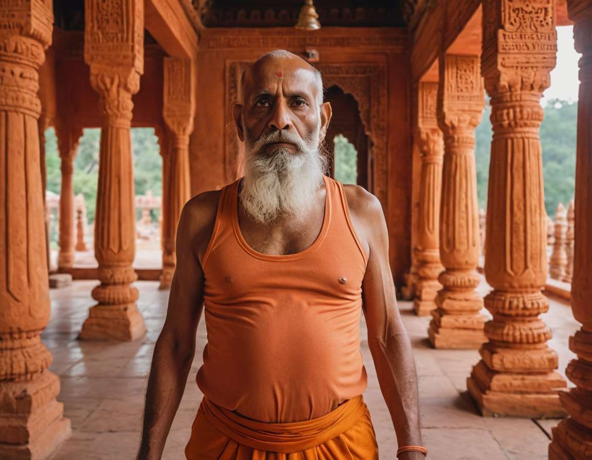
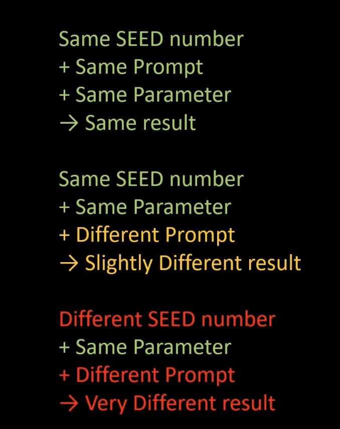
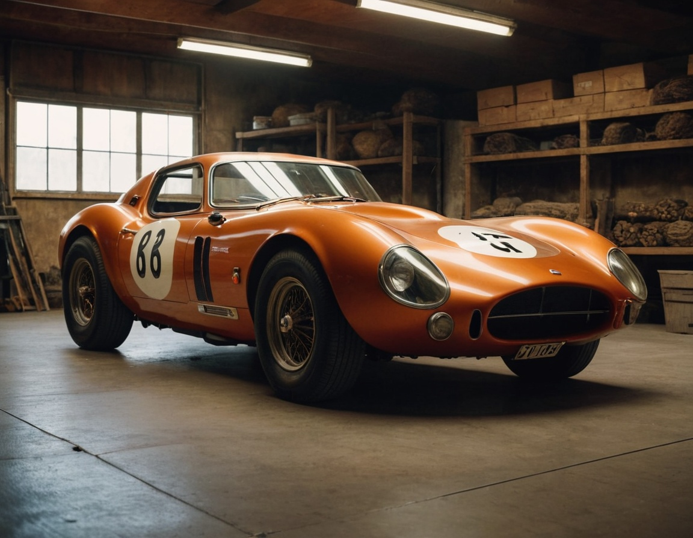
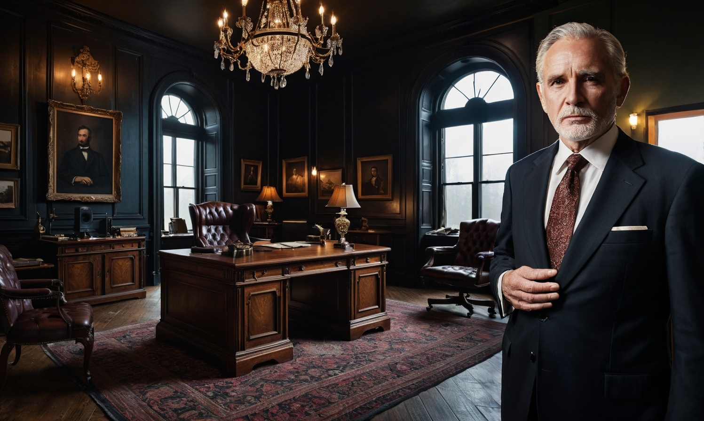

# Section 3: Master the Core Functions of Fooocus

Fluency in Fooocus comes from mastering its four main pillars:
1.  **Text Prompt** (Creating from words)
2.  **Image Prompt** (Creating from reference images)
3.  **Upscale & Variation** (Improving and iterating)
4.  **Inpainting & Outpainting** (Editing and expanding)

    

---

## 1. Text Prompt

The most basic way to generate an image.

### Key Settings (Advanced Tab)

*   **Negative Prompt**: Description of what you *don't* want (e.g., "ugly", "deformed", "blurry").
*   **Output Format**: PNG or JPG.
*   **Image Number**: How many images to generate per batch (1-32).
*   **Performance**: Always use **Quality** for best results (Speed is for quick testing).
*   **Aspect Ratios**: Choose the shape (16:9, 1:1, 4:5, etc.).
*   **Styles**: Select artistic styles (hover to preview).
*   **Models**: Select your customized checkpoint (e.g., `realismEngineSDXL_v30VAE.safetensors`).

### Example

**Prompt:**
> `A hyper realistic portrait of a 80 year old guru wearing a yoga outfit standing in a temple in India`

**Result:**

    
    
    
    

---

## 2. Image Prompt

Use an existing image as a reference or structure guide.

### Basic Usage
1.  Check **Input Image**.
2.  Select the **Image Prompt** tab.
3.  Upload your reference image.

**Example: Style Transfer**
*   **Reference Image**: A house photo.
*   **Weight**: `0.9` (High adherence to the reference).
*   **Result**: New images that closely follow the structure/style of the uploaded photo.

    

### Face Swap
Replace a face in an image with another.
1.  **Image Prompt Tab**: Upload the face you want to *use* (Source).
    *   Set **Stop At** to `1`.
    *   Set **Weight** to `1.19`.
2.  **Inpaint or Outpaint Tab**: Select **Improve Detail (face, hand, eyes, etc)**.
    *   Upload the target body image.
    *   Mask (paint over) the face area.
3.  **Developer Debug Mode**:
    *   Go to **Control** tab.
    *   Check **Mixing Image Prompt and Inpaint**.

    

### Pyra Canny (Pose Transfer)
Transfer the pose of one person to another.
1.  **Image Prompt Tab**:
    *   **Slot 1 (Face)**: Upload the person's face. (Stop At: `1`, Weight: `1.19`).
    *   **Slot 2 (Pose)**: Upload the image with the desired pose.
        *   Click **Advanced** checkbox on the image slot.
        *   Select **PyraCanny**.
2.  **Prompt**: Describe the scene (e.g., `a german girl posing...`).
3.  **Generate**.

---

## 3. Seed Number

The **Seed** determines the random noise pattern.
*   **Same Seed + Same Settings = Exact Same Image**.
*   This allows you to make consistent changes to an image without changing the overall composition.

    

---

## 4. Upscale & Variation

### Upscale
Increase resolution and add detail.
1.  **Upscale or Variation** Tab.
2.  Upload image.
3.  Select **Upscale (1.5x)** or **(2x)**.
4.  **Important**: Set **Seed** to `0` to avoid changing the composition.

**Pro Tip**: To keep facial identity exact during upscale:
*   Go to **Developer Debug Mode**.
*   Set **Forced Overwrite of Denoising Strength of "Upscale"** to `0.01`.

### Variation
Create similar versions of an image.
1.  Select **Vary (Subtle)** for small changes or **Vary (Strong)** for new concepts.
2.  Enter a prompt (e.g., `a golden old sports car`).
3.  Enable **Random** seed for variety.

    

---

## 5. Inpainting & Outpainting

### Inpainting
Fix or change parts *inside* the image.
1.  **Inpaint or Outpaint** Tab.
2.  Upload image and **mask** the area to change.
3.  **Method**: `Inpaint or Outpaint (default)`.
4.  **Prompt**: Describe the new element (e.g., `a sleeping dog on the floor`).

    

**Modify Content**: Use this method to add objects that weren't there before.

**Improve Detail**: Use this method to fix faces/hands. Mask the face, prompt for `detailed beautiful face`, and generate.

### Outpainting
Expand the image *outside* its borders.
1.  **Inpaint or Outpaint** Tab.
2.  **Method**: `Inpaint or Outpaint (default)`.
3.  **Outpaint Direction**: Select `Left`, `Right`, `Top`, or `Bottom`.
4.  **Prompt**: Describe the extension (e.g., `a well dressed old business man`).

    

### Advanced Masking
For precise control, upload a pre-made black & white mask (created in Photoshop/GIMP).
1.  Check **Enable Advanced Masking Features**.
2.  Upload Image (Left) and Mask (Right).
3.  **White Area** = What changes. **Black Area** = What stays the same.
