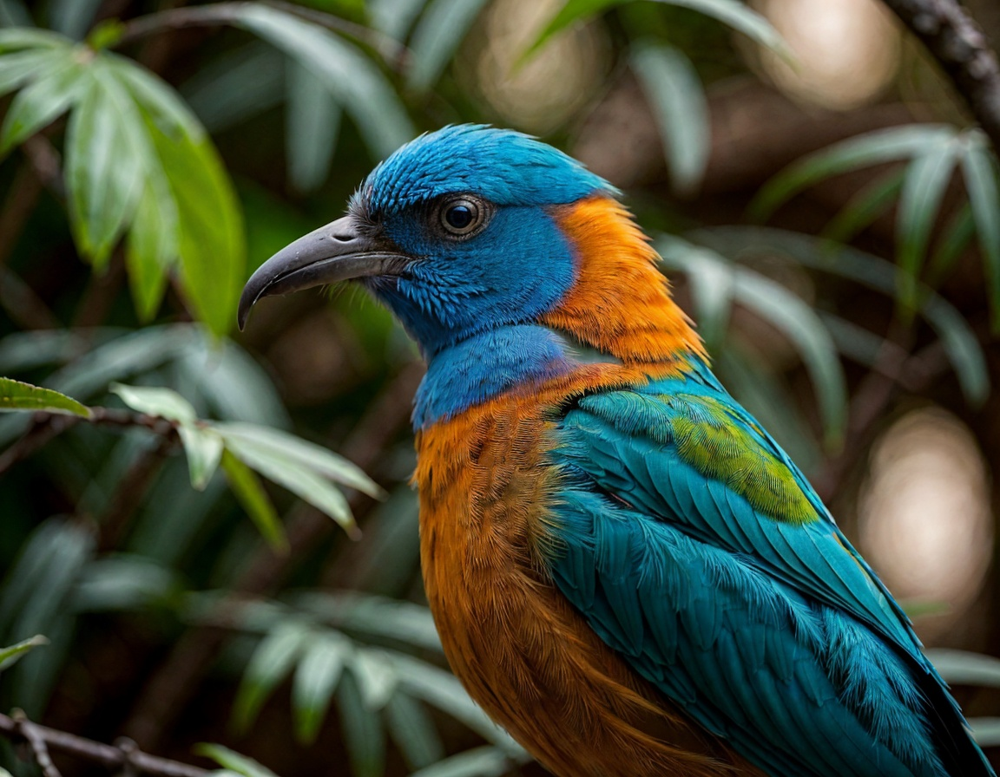
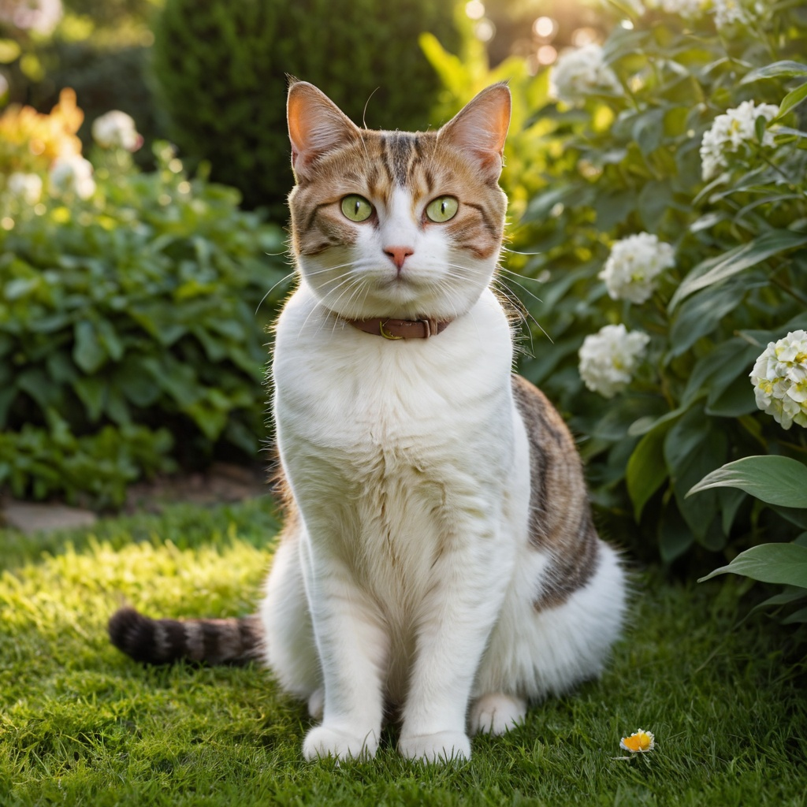

# Section 5: Expert Knowledge & Advanced Techniques

## 1. The Art of the Perfect Prompt

Creating the perfect prompt is about balance.
**Rule of thumb**: "As short as possible, as long as necessary." (Aim for ~60 words max).

### Anatomy of a Great Prompt
Compare these two:
*   ❌ **Basic**: `A beautiful girl`
*   ✅ **Advanced**: `A hyper realistic portrait of a beautiful Mexican 29 year old Latina girl with full dark brown hair, sensual smile, small waist, athletic body, wearing (grey crop top, tank top), grey sweatpants, sitting on bench, modern gym, Instagram post, HD32K, incredibly detailed, vibrant colors`

**Why is the second better?**
1.  **Subject Details**: Age, ethnicity, body type, expression.
2.  **Clothing**: Specific items and colors.
3.  **Setting/Context**: "Modern gym", "sitting on bench".
4.  **Style/Medium**: "Instagram post", "HD32K", "hyper realistic".

### Prompt Weighting
You can emphasize specific words using **syntax**.
*   Standard: `modern gym`
*   Boosted (1.1x - 1.5x): `(modern gym:1.4)`
*   *Warning: Going above 1.5 often creates artifacts.*

### Context Words
Stable Diffusion understands abstract concepts. Adding a single word can change the entire mood.
*   **Positive**: `Wedding`, `Vacation`, `Celebration`.
*   **Negative**: `Depression`, `Horror`, `Sinister`.

---

## 2. Mixing Styles

Fooocus allows you to layer multiple styles for unique effects.
*   **Example Mix**: `SAI Line Art` + `SAI Anime`.
*   **Result**: An anime-style image with distinct line art characteristics.

Experiment with combinations like `Steampunk 2` + `Cinematic` for diverse results.

---

## 3. Using SD1.5 Models with SDXL

By default, Fooocus uses SDXL (high resolution). However, you can use older SD1.5 models (which often have great variety) as a **Refiner**.

### How to Setup
1.  **Download SD1.5 Model**: e.g., Realistic Vision V6.0.
2.  **Colab Code**: Add the download link to your startup script (put it in `checkpoints`).
3.  **Fooocus Settings**:
    *   **Base Model**: `realismEngineSDXL...` (Your main SDXL model).
    *   **Refiner**: `realisticVisionV60...` (Your SD1.5 model).
    *   **Refiner Switch At**: `0.4` (Switches to the refiner at 40% of generation).

    

---

## 4. Fixing Hands & Faces (Inpainting)

Hands and faces are the hardest parts for AI.

### Fixing Hands
*   **Strategy**: Don't aim for perfection in the first shot. Fix it later.
*   **Method**:
    1.  **Inpaint Tab**: Upload image.
    2.  **Mask**: Paint over the bad hand.
    3.  **Method**: `Improve Detail (face, hand, eyes, etc.)`.
    4.  **Prompt**: `detailed female hand`.
    5.  **Generate**: Create batch of 5+ images and pick the best one.

### Fixing Faces
Same process as hands.
*   **Method**: `Improve Detail`.
*   **Prompt**: `realistic face of an old business man`.
*   **Tip**: Adjust **Inpaint Denoising Strength**.
    *   `0.35`: Subtle fix (keeps likeness).
    *   `0.5`: Standard fix.
    *   `0.7+`: Changes the face entirely.

---

## 5. Changing Clothing with Inpainting

You can dress your models in specific digital clothing.

1.  **Image Prompt Tab**: Upload the reference photo of the *clothing*.
2.  **Inpaint Tab**: Upload the photo of the *model*.
3.  **Mask**: Paint over the model's current clothes.
4.  **Prompt**: `A girl wearing a short black winter jacket`.
5.  **Method**: Try `Modify Content` or `Default`.
6.  **Tip**: Increase `Stop At` and `Weight` in Image Prompt for stronger adherence to the reference clothing.

---

## 6. Accelerating Your Workflow

### Google Colab Speed
*   When starting Colab, check the **Runtime Type**.
*   **A100 GPU**: Fastest (Premium).
*   **T4 GPU**: Standard (Free).

### Using ChatGPT for Prompts
Use ChatGPT to act as your "Prompt Engineer".

**System Prompt for ChatGPT:**
> "You are an expert in AI image generation using Stable Diffusion and Fooocus. You know how to write perfect prompts including camera and lens info. Write me a prompt for: [Your Idea]"

    

---
[Previous Section](Section-4.md) | [Next Section](Section-6.md)
