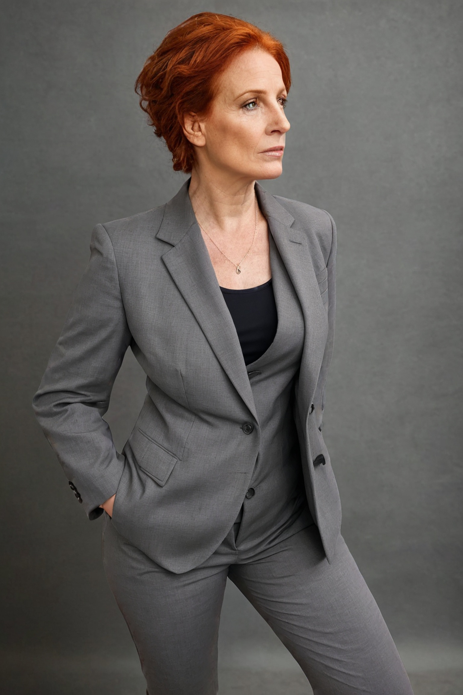

# Section 6: Product Placement & Virtual Models

This technique allows you to keep a specific product (like a shirt or dress) while changing the model wearing it.

## The Process

1.  **Original Photo**: Start with a high-quality photo of your product on a model (or mannequin).
2.  **Remove Background**: Use a tool like Canva or Photoshop to isolate the subject.
3.  **Create a Mask**:
    *   **White Area**: The parts you want to **change** (the model's head, arms, legs, background).
    *   **Black Area**: The parts you want to **keep** (the specific clothing item).
4.  **Inpainting**: Use Fooocus to generate a new model around the preserved clothing.

---

## Practical Example: Changing the Model

We want to see different people wearing the same grey suit and black t-shirt.

### Setup
1.  **Tab**: Go to **Inpaint or Outpaint**.
2.  **Input Image**: Upload the original photo.
3.  **Advanced Masking**: Check **Enable Advanced Masking Features**.
4.  **Mask Upload**: Upload your pre-made mask (Black = Suit, White = Everything else).

    
    

### Generation

**Prompt:**
> `A hyper realistic image of a 50 year old french woman with red hair wearing a grey suit and a black t-shirt`

**Settings**:
*   **Method**: `Inpaint or Outpaint (default)`.
*   **Denoising Strength**: `1.0` (Since we are completely regenerating the masked area).

**Result:**
The suit remains exactly the same, but the person wearing it is now a 50-year-old French woman.

---

## Caution: Unintended Content

Be careful with your prompts and negative prompts.
If you prompt for `female naked body` and set the negative prompt to `clothing`, the AI will attempt to remove the clothing you tried to preserve if your mask isn't perfect or if the denoising strength allows it to hallucinate. Always double-check your mask boundaries!

---
[Previous Section](Section-5.md) | [Next Section](Section-7.md)
