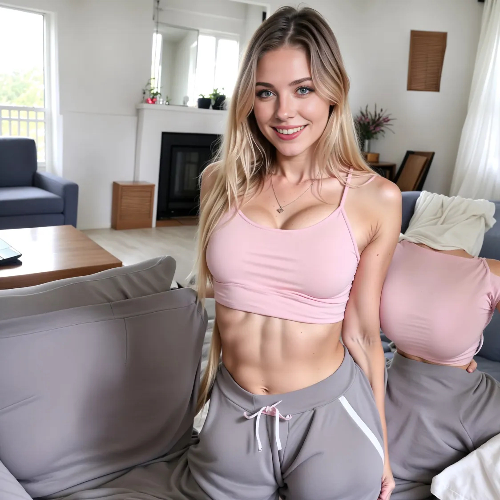

# Section 7: Create an AI Influencer (Consistent Character)

Creating a consistent AI influencer is like building a brand. You need a defined persona and a reliable workflow to recreate them in different scenes.

## Step 1: Define the Persona

Before generation, define who they are:
*   **Demographics**: Age, Nationality, Name.
*   **Appearance**: Hair color/style, eye color, body type, distinctive features.
*   **Style**: Clothing preference, makeup style.
*   **Backstory**: Hobbies, location, personality.

---

## Step 2: The "Perfect Face" Reference

First, we generate the definitive image of our influencer's face. We will use this image forever as our reference for face Swapping.

**Prompt (Example):**
> `A hyper realistic closeup face portrait of a beautiful 22 year old French girl, full lips, beautiful blue eyes, perfect white teeth, light freckled skin, beautiful full blonde hair, neutral background, perfect lighting, vibrant colors, stunning quality`

**Result:**

    

*Save this image. Call it "Face Reference".*

---

## Step 3: Generating the Body & Scene (TensorArt)

We often use **TensorArt** to access specific models like **LazyMix+** which are great for consistent bodies.

1.  **Go to TensorArt**: Search for `LazyMix+`.
2.  **Settings**: Aspect Ratio `Square` (or as needed).
3.  **Prompt**: Describe the scene and the *generic* attributes of your character.
    > `A hyper-realistic full body portrait of a beautiful 19 year old french girl... standing, wearing a light pink croptop, grey sweatpants, beautiful cosy living room`
4.  **Negative Prompt**: Standard negative prompt for quality.
5.  **Generate** and download the best body/pose.

    

---

## Step 4: The Base Face Swap (Discord)

We use the **InsightFace** bot on Discord to create a high-quality initial face swap.

1.  **Setup Discord**:
    *   Create a private server.
    *   Add **InsightFace** bot.
2.  **Register Identity**:
    *   Command: `/saveid name:swap image:[Upload Face Reference]`
3.  **Swap Face**:
    *   Command: `/swapid identity:swap image:[Upload TensorArt Body Image]`
4.  **Save Result**: This is your "Base Swap" image.

    

---

## Step 5: High-Quality Refinement (Fooocus)

The Discord swap is good, but often low resolution or slightly "off". We refine it in Fooocus.

1.  **Input**: Upload "Base Swap" image to **Inpaint or Outpaint**.
2.  **Mask**: Paint over the face.
3.  **Method**: `Improve Detail (face, hand, eyes, etc.)`.
4.  **Prompt**: `beautiful blue eyes` (or specific facial features).
5.  **Advanced - Image Prompt** (Crucial Step):
    *   Upload "Face Reference" image.
    *   Select **FaceSwap**.
    *   **Stop At**: `1`.
    *   **Weight**: `1.19`.
6.  **Advanced - Mixing**:
    *   **Developer Debug Mode** -> **Control** -> Check **Mxing Image Prompt and Inpaint**.
    *   **Inpaint Denoising Strength**: `0.4` (Keeps the structure but fixes details).
7.  **Generate**.

**Result**: A high-resolution, perfectly integrated image of your character.

    

---

## checklist for Consistency
*   ✅ Always use the *same* Face Reference image.
*   ✅ Keep the core physical description in your text prompts consistently.
*   ✅ Use face swapping tools to standardize facial features across different poses.
