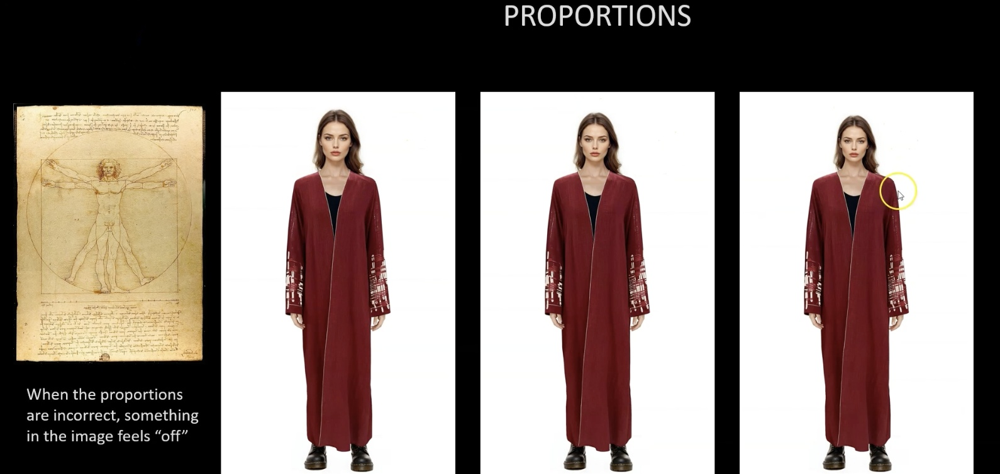
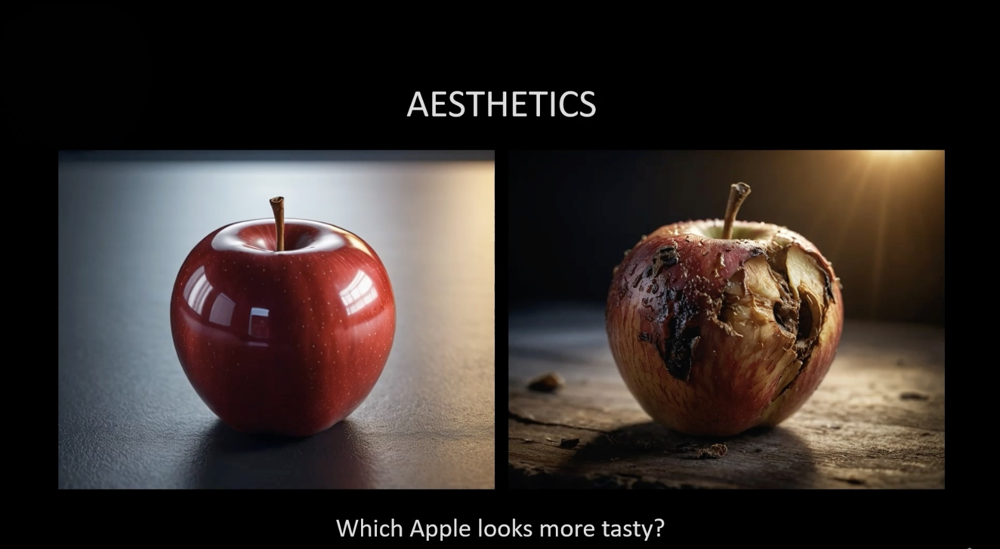
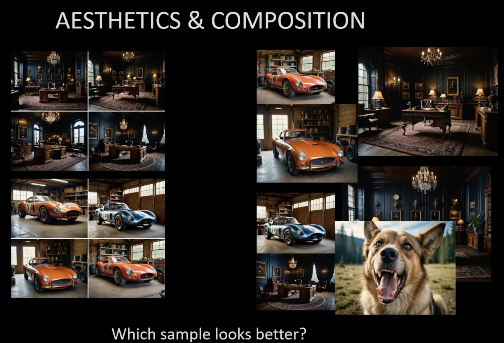

# Section 9: Aesthetics, Proportions & Composition

Creating an image is easy. Creating a **beautiful** image requires understanding art fundamentals.

## 1. Proportions

Even small changes in proportion significantly affect how we perceive a subject.
*   **Head Size**: A slightly smaller head (5-10%) can make a figure look taller, more heroic, or more elegant (fashion model look).
*   **Body Ratios**: Understanding the "Golden Ratio" helps in placing limbs and features naturally.

    
     
    <em>Left: Original | Middle: 5% Smaller Head | Right: 10% Smaller Head</em>

## 2. Aesthetics

**Aesthetics** is the "feel" of the image. It's not just about resolution, but about:
*   **Color Palette**: Harmonious colors (e.g., complementary, analogous).
*   **Lighting**: Soft vs. hard light, directionality, mood.
*   **Texture**: skin pores, fabric details, environmental roughness.

    

## 3. Composition

**Composition** is how you arrange elements in the frame.
*   **Rule of Thirds**: Place key elements (eyes, horizon) on the grid lines.
*   **Leading Lines**: Use lines in the environment to point to the subject.
*   **Depth**: Foreground, middle ground, background separation.

    

---
[Previous Section](Section-8.md) | [Next Section](Section-10.md)
