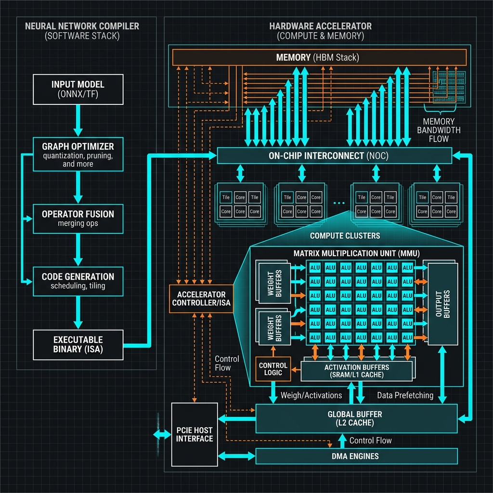

# 01: Deep Learning Systems (Compilers & Hardware)

<p align="center">
  
</p>

## 🎯 The Big Goal

> **Understand how a high-level Python model (PyTorch/TensorFlow) is mathematically transformed, compiled, and executed on raw silicon (GPUs/TPUs) to achieve trillion-operations-per-second performance.**

---

## 1. The Deep Learning Software Stack

When you write `y = torch.matmul(W, x)`, the GPU does not understand Python. It requires a highly complex compiler stack to translate your graph into raw memory commands.

1.  **High-Level Frontend:** (PyTorch, TF) Converts the code into a computational graph.
2.  **Graph Optimizer (Intermediate Representation):** Analyzes the DAG (Directed Acyclic Graph) for inefficiencies.
3.  **Code Generation:** Maps operations to the specific ISA (Instruction Set Architecture) of the target accelerator.

## 2. 🔧 Deep Dive: Operator Fusion
One of the most critical compiler optimizations is **Operator Fusion**. 
If a network has a Convolution operation followed immediately by a ReLU activation function, a naive compiler will:
1. Compute the convolution.
2. Write the result to the main GPU memory (VRAM) (Slow!).
3. Read the result back from VRAM into the ALU cores (Slow!).
4. Apply the ReLU function.

**Fusion avoids this.** The compiler merges `Conv` and `ReLU` into a single, chained assembly instruction. The data stays inside the ultra-fast L1 SRAM cache the entire time, dramatically reducing memory bandwidth bottlenecks.

---

## 3. Hardware Accelerators (TPUs and GPUs)

Traditional CPUs are great at branching logic (`if/else`). Neural networks require massive matrix math.

### The Matrix Multiplication Unit (MMU) / Systolic Array
Google's TPU uses a **Systolic Array**. Instead of reading/writing memory for every single math operation, a systolic array passes data systematically through a massive 2D grid of ALUs (Arithmetic Logic Units) like water through pipes.
*   Data flows left-to-right holding inputs.
*   Weights flow top-to-bottom.
*   Each ALU multiplies them and accumulates the sum, passing the results to its neighbor instantly.
This architecture provides terrifyingly high throughput for raw Matrix-Multiplication operations with minimal power draw.

---

## 🤔 Reflection Questions

1. **Why is memory bandwidth (HBM2/HBM3) often a bigger bottleneck than raw ALU compute speed (TFLOPS) in deep learning?**
<details>
<summary>💡 View Answer</summary>

ALUs operate vastly faster than data can be retrieved from DRAM. A processor might be capable of 300 TeraFLOPS, but if the memory bus can only feed it data at 1 TB/s, the processor spends most of its time "starved" and idling (a phenomenon known as being "Memory Bound"). This is why innovations like High Bandwidth Memory (HBM) and large on-chip SRAM caches are the critical difference between consumer GPUs and data-center AI accelerators.
</details>

2. **If you design a new custom silicon AI chip, how do you ensure that TensorFlow and PyTorch can actually run on it without writing a million lines of custom connector code?**
<details>
<summary>💡 View Answer</summary>

You rely on standardized intermediate representations like **ONNX** (Open Neural Network Exchange), or compiler toolchains like **MLIR** (Multi-Level Intermediate Representation) or **TVM**. Your chip manufacturer only has to provide a "backend" that translates from MLIR/TVM down to your chip's specific machine code, allowing any framework plugged into the frontend of that compiler to automatically target your hardware.
</details>

---

## 💻 Reproducible Code: PyTorch 2.0 Compiler

To see Operator Fusion in action, you can use PyTorch's `torch.compile()`. This JIT compiles your standard Python graphing code down to optimized kernels using OpenAI's Triton.

### `compile_demo.py`
```python
import torch
import time

def my_network(x):
    # Multiple chained operations that typically require trips to VRAM
    return torch.sin(x) + torch.cos(x) * torch.relu(x)

# Create a random tensor on the GPU
x = torch.randn(10000, 10000, device="cuda")

# 1. Uncompiled (Eager Mode)
start = time.time()
res_uncompiled = my_network(x)
torch.cuda.synchronize()
print(f"Uncompiled Time: {time.time() - start:.4f} seconds")

# 2. Compiled Mode (Triggers Operator Fusion)
compiled_network = torch.compile(my_network)

# Warmup to allow compiler to build the kernels
compiled_network(x) 

start = time.time()
res_compiled = compiled_network(x)
torch.cuda.synchronize()
print(f"Compiled Time:   {time.time() - start:.4f} seconds")
```

### 🐳 Run it with Docker
You will need a machine with Nvidia drivers installed and the NVIDIA Container Toolkit.

**Create `Dockerfile`:**
```dockerfile
FROM pytorch/pytorch:2.1.0-cuda11.8-cudnn8-runtime
WORKDIR /app
COPY compile_demo.py /app/
CMD ["python", "compile_demo.py"]
```

**Execute:**
```bash
docker build -t ai-compiler-demo .
docker run --gpus all ai-compiler-demo
```
*Notice how the compiled execution time drops significantly because the GPU is no longer bottlenecked by moving intermediate memory between operations.*

---

[Home: Curriculum Map](./README.md) | [Next: Efficient DNN Processing >>](./02_Efficient_DNN_Processing.md)
