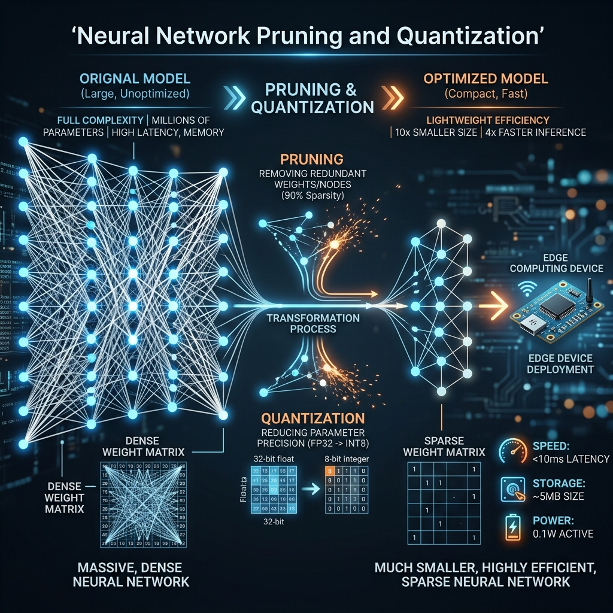

# 02: Efficient Processing of DNNs

<p align="center">
  
</p>

## 🎯 The Big Goal

> **Understand how to take massive, multi-gigabyte Deep Neural Networks (DNNs) that require data-center GPUs and aggressively compress them to run at 60 FPS on edge devices (smartphones, IoT sensors) with minimal loss in accuracy.**

---

## 1. The Problem with Large Models

Modern models (like LLMs or massive ResNet architectures) possess billions of parameters. 
*   **Memory Footprint:** A 7-billion parameter model deployed in 32-bit floating-point (FP32) requires 28 GB of RAM. An iPhone cannot run this.
*   **Power Consumption:** Memory fetches consume 100x more energy than the math operation itself. Running dense models drains batteries in minutes.

We must make the network smaller and faster without destroying its intelligence.

---

## 2. 🔧 Deep Dive: Quantization

**Quantization** is the process of reducing the precision of the numbers used to represent a model's weights and activations.
*   **FP32 (Floating Point 32-bit):** The default format for training. Highly precise but memory heavy.
*   **INT8 (Integer 8-bit):** Maps the continuous float values into 256 discrete integer buckets.

**The Math:** By converting a model from FP32 to INT8, you instantly reduce the memory footprint by **4X** and the memory bandwidth requirements by **4X**. Furthermore, modern CPUs and Neural Engines execute 8-bit integer math exponentially faster than floating-point math.

**The Trade-off:** Dropping precision introduces *Quantization Error*. To mitigate this, engineers use **Quantization-Aware Training (QAT)**, where the model simulates the low precision during the training phase, allowing it to mathematically "learn" to tolerate the noise before deployment.

---

## 3. 🔧 Deep Dive: Network Pruning

**Pruning** is the process of deleting "useless" connections in the neural network entirely.
In a massive weight matrix, many weights drift very close to `0.000` during training. They do not meaningfully contribute to the final output.

1.  **Identify:** Find all weights whose absolute value is below a certain threshold.
2.  **Delete:** Set them exactly to 0, completely removing that synapse from the computational graph.
3.  **Fine-tune:** The model's accuracy will initially drop. Retrain the sparse model on the dataset briefly to allow the remaining weights to compensate.

**Result:** You can often prune up to **80% to 90%** of a neural network's parameters with zero drop in practical accuracy. This creates a highly *Sparse Matrix*, allowing specialized hardware to skip multiplying by zero altogether, exponentially speeding up inference inference.

---

## 🤔 Reflection Questions

1. **Why is it generally necessary to train a model in FP32 format, even if you know you will deploy it in INT8? Why not just train it in 8-bit from the start?**
<details>
<summary>💡 View Answer</summary>

During training, the model relies on **Gradient Descent**. Gradients (the tiny adjustments made to the weights) are often extremely small numbers (e.g., `0.0000045`). If you attempt to train in INT8 precision, these microscopic gradients suffer from "Underflow"—they are rounded straight down to exactly zero. The model simply stops learning because the updates are lost in the rounding error. FP32 provides the vast dynamic range needed to capture these tiny gradients.
</details>

2. **You pruned 80% of a model's weights, making it a sparse matrix. However, when you benchmarked it on a standard CPU, inference speed did not improve at all. Why?**
<details>
<summary>💡 View Answer</summary>

Standard CPUs and GPUs are heavily optimized for **Dense Matrix Multiplication**, relying on contiguous memory access patterns to saturate their vector pipelines. When a matrix is 80% empty (sparse), the hardware has to constantly check memory conditions, suffering terrible cache misses and pipeline stalls. To actually speed up a pruned model, the hardware or the compiler must explicitly support "Sparse Arithmetic Operations" (like Nvidia's Ampere architecture Sparse Tensor Cores), which know how to aggressively skip blocks of zeros without stalling the processor.
</details>

---

## 💻 Reproducible Code: Quantization & Pruning

You can dramatically reduce model sizes directly in PyTorch using `torch.ao.quantization` and `torch.nn.utils.prune`.

### `efficient_dnn.py`
```python
import torch
import torch.nn as nn
import torch.nn.utils.prune as prune
import os

# Define a simple dense model
class MassiveNet(nn.Module):
    def __init__(self):
        super(MassiveNet, self).__init__()
        self.fc1 = nn.Linear(10000, 10000)
    def forward(self, x):
        return torch.relu(self.fc1(x))

model = MassiveNet()
torch.save(model.state_dict(), "dense_model.pth")
print(f"Original FP32 Size: {os.path.getsize('dense_model.pth') / 1e6:.2f} MB")

# --- 1. PRUNING (Sparsity) ---
# Remove 80% of the weights in fc1 (sets them to 0.0)
prune.l1_unstructured(model.fc1, name="weight", amount=0.8)
# Make the pruning permanent
prune.remove(model.fc1, 'weight')
print("Model pruned to 80% sparsity.")

# --- 2. QUANTIZATION (FP32 -> INT8) ---
# Prepare the model for dynamic quantization (great for LSTMs and Linear layers)
quantized_model = torch.ao.quantization.quantize_dynamic(
    model, 
    {nn.Linear}, # Only quantize Linear layers
    dtype=torch.qint8
)
torch.save(quantized_model.state_dict(), "quantized_model.pth")
print(f"Quantized INT8 Size: {os.path.getsize('quantized_model.pth') / 1e6:.2f} MB")
```

### 🐳 Run it with Docker

**Create `Dockerfile`:**
```dockerfile
FROM pytorch/pytorch:2.1.0-cuda11.8-cudnn8-runtime
WORKDIR /app
COPY efficient_dnn.py /app/
CMD ["python", "efficient_dnn.py"]
```

**Execute:**
```bash
docker build -t efficient-dnn-demo .
docker run efficient-dnn-demo
```
*You will immediately see the file size of the model drop by roughly 4x while achieving 80% sparsity!*

---

[<< Previous: Deep Learning Systems](./01_Deep_Learning_Systems.md) | [Home: Curriculum Map](./README.md) | [Next: Federated Learning >>](./03_Federated_Learning.md)
