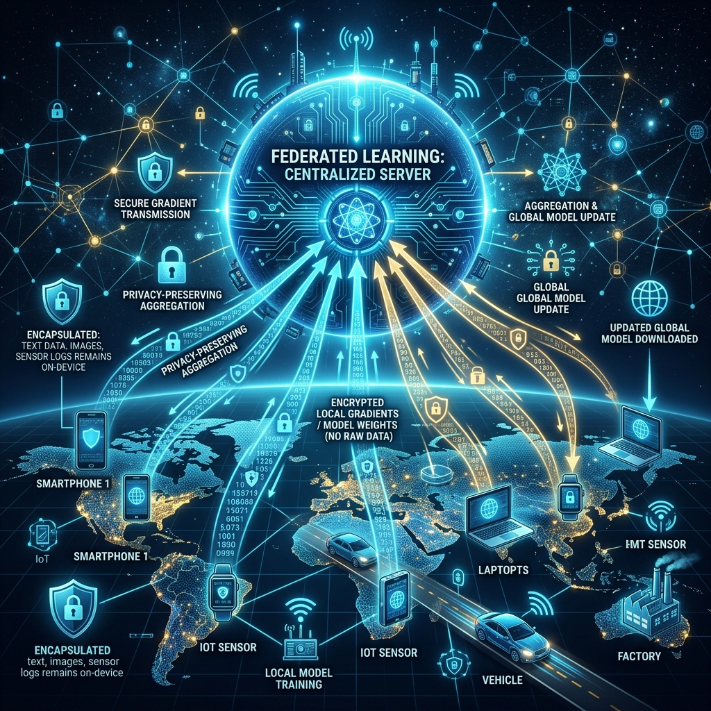

# 03: Federated Learning

<p align="center">
  
</p>

## 🎯 The Big Goal

> **Train machine learning models on vast amounts of real-world user data without the data *ever* leaving the user's localized edge device, thereby preserving absolute privacy.**

---

## 1. The Core Paradigm Shift

Traditional AI training requires moving all the data to the model. 
*   *Old Way:* User takes a photo -> Photo uploaded to Cloud Database -> Cloud server trains model on millions of photos. (Massive privacy risk).

**Federated Learning (FL)** reverses this paradigm: *We move the model to the data.*
*   *New Way:* Global model downloaded to cell phone -> Phone trains localized model purely on local private photos -> Phone uploads **only the learned weight updates (gradients)** back to the cloud -> The cloud averages millions of gradients to update the global model. 

---

## 2. 🔧 Deep Dive: The Federated Averaging (FedAvg) Algorithm

How do millions of separate updates merge safely? The industry standard is **FedAvg**.

1.  **Initialization:** The Central Server initializes a global model $W_0$.
2.  **Distribution:** The server selects a random subset of active edge clients (e.g., 10,000 phones plugged in to Wi-Fi at night) and sends them $W_0$.
3.  **Local Training:** Each client $k$ trains $W_0$ exclusively on its local, private dataset for a few epochs, producing a new local model $W_k$.
4.  **Aggregation:** The clients send the difference (the gradient update) back to the server. The server computes a weighted average of these local models (weighted by the amount of data each client had) to produce the next global model $W_1$.
5.  **Iteration:** Repeat process until convergence.

---

## 3. 🔧 Deep Dive: Secure Aggregation

Even if you only upload weight gradients (and not raw photos), researchers have proven that malicious actors analyzing those gradients can sometimes reverse-engineer exactly what local data produced them (known as a *Gradient Inversion Attack*).

**The Mitigation: Secure Aggregation via Cryptography.**
*   Before the edge devices upload their local gradients to the cloud, they use cryptographic multi-party computation.
*   They intentionally inject localized mathematical "noise" into their gradients.
*   The math is orchestrated so that the noise completely hides the signal of any *individual* device, but when the server sums up the gradients from 10,000 devices, the noise perfectly cancels itself out to exactly zero.
*   The server successfully calculates the accurate, averaged global update without ever being physically capable of reading an individual user's updates.

---

## 4. Challenges & Limitations

*   **Communication Overhead:** Uploading massive gradient files from millions of phones uses tremendous bandwidth. Gradients are often heavily quantized (see Chapter 2) before upload.
*   **Non-IID Data:** (Non-Independent and Identically Distributed). A user in Japan types very differently than a user in Brazil. A model trained simultaneously on completely different data distributions struggles to converge smoothly compared to a homogenous centralized dataset.
*   **Stragglers:** If 1,000 phones are training, but 5 have terrible internet connections, the entire aggregation step hangs waiting for them to finish.

---

## 🤔 Reflection Questions

1. **Why is Federated Learning heavily dependent on device power status (e.g., "only run when plugged in and on Wi-Fi")?**
<details>
<summary>💡 View Answer</summary>

Training a neural network using backpropagation is incredibly computationally expensive and power-hungry. If an app attempted to run Federated Learning in the background while the user was navigating on 5G with 20% battery, it would violently drain the battery and consume potentially gigabytes of the user's cellular data plan just to upload model weight gradients. Therefore, OS-level constraints strictly block FL unless the device considers itself in an idle, high-power, unmetered network state.
</details>

2. **Imagine a Federated Learning system training a predictive text keyboard. One user is intentionally typing malicious gibberish or harmful language to corrupt the global model. How do you defend against this "Data Poisoning" attack?**
<details>
<summary>💡 View Answer</summary>

Because the server is mathematically blind to the user's raw data (due to privacy constraints), it cannot visually inspect what they are typing. Instead, defense relies on **Byzantine Robust Aggregation protocols** (like Krum or Median Aggregation). Instead of doing a blind average of all localized model updates, the server assesses the "distance" or variance between all the incoming gradient vectors. If a gradient from a specific user is a massive outlier compared to the consensus of the other 9,999 users, the aggregation algorithm automatically rejects or heavily downweights it as a presumed anomaly or poisoning attempt.
</details>

---

## 💻 Reproducible Code: Federated Learning with `flwr`

Flower (`flwr`) is the industry standard framework for Federated Learning. Below is a simplified Edge Client that would run on a user's local smartphone. It trains a PyTorch model and pushes *only the gradients* to the central server.

### `fl_client.py`
```python
import flwr as fl
import torch
import torch.nn as nn

# 1. Define Standard Local Model
class SimpleModel(nn.Module):
    def __init__(self):
        super().__init__()
        self.fc = nn.Linear(10, 2)
    def forward(self, x):
        return self.fc(x)

model = SimpleModel()

# 2. Define Federated Client Protocol
class FlowerClient(fl.client.NumPyClient):
    def get_parameters(self, config):
        # Return local model weights to the server
        return [val.cpu().numpy() for _, val in model.state_dict().items()]

    def fit(self, parameters, config):
        # Update local model with server's parameters
        params_dict = zip(model.state_dict().keys(), parameters)
        state_dict = {k: torch.tensor(v) for k, v in params_dict}
        model.load_state_dict(state_dict, strict=True)
        
        # --- TRAINING WOULD HAPPEN HERE ON LOCAL DATA ---
        print("Training locally on private data... (Simulation)")
        
        # Return updated weights, number of local examples, and metrics
        return self.get_parameters(config={}), 100, {}

# 3. Start client and connect to centralized orchestrator 
if __name__ == "__main__":
    print("Starting Federated Edge Client...")
    # fl.client.start_numpy_client(server_address="127.0.0.1:8080", client=FlowerClient())
    print("Code is ready! (Uncomment line above when orchestrator is running)")
```

### 🐳 Run it with Docker

**Create `Dockerfile`:**
```dockerfile
FROM python:3.9-slim
WORKDIR /app
RUN pip install flwr torch numpy
COPY fl_client.py /app/
CMD ["python", "fl_client.py"]
```

**Execute:**
```bash
docker build -t federated-edge-client .
docker run federated-edge-client
```

---

[<< Previous: Efficient DNN Processing](./02_Efficient_DNN_Processing.md) | [Home: Curriculum Map](./README.md)
