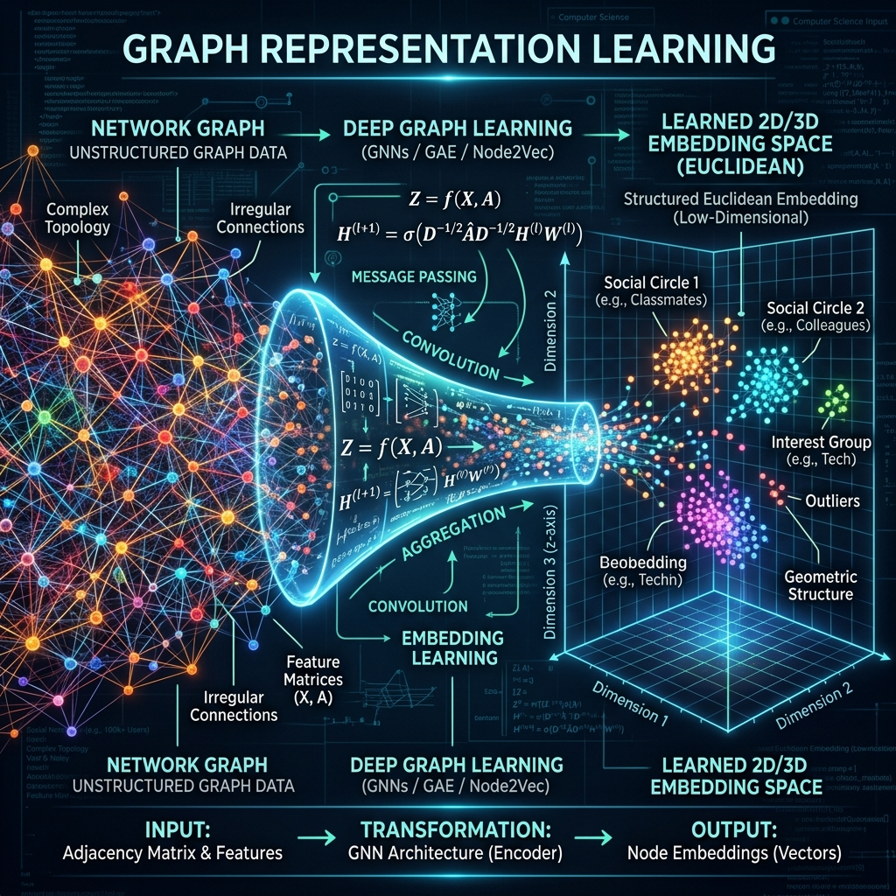

# 04: Graph Representation Learning

<p align="center">
  
</p>

## 🎯 The Big Goal

> **Represent wildly unstructured, messy network data (like a social network of millions of friends, or interactions between proteins) as clean, structured, mathematical vectors so standard machine learning algorithms can analyze them.**

---

## 1. The Challenge of Graph Data

Standard Deep Learning (like CNNs for images or Transformers for text) assumes data is structured:
*   **Images:** A perfect grid of pixels.
*   **Text:** A perfect linear sequence of words.

**Graphs have no structure.** A user in a social network might have 2 friends, while another might have 2,000. There is no strict top-bottom or left-right ordering. You cannot easily feed an irregular graph into a standard Dense Neural Network.

## 2. 🔧 Deep Dive: Node Embeddings (Node2Vec)

The goal of representation learning is to map every node $u$ in the graph to a vector $Z_u$ in a low-dimensional Euclidean space (e.g., 64 dimensions). We want the geographic distance between two points in this mathematical space to directly correlate with how connected those nodes are in the real graph.

**How do we do this? Random Walks.**
If you stand on a node in a graph and randomly walk down its connecting edges 10 times, the nodes you land on are your "neighborhood". 
Algorithms like **DeepWalk** and **Node2Vec** treat these random sequences of nodes exactly like sentences of words. They feed these "node sentences" into NLP algorithms like `Word2Vec`, which learns that nodes appearing in the same "sentences" should have similar mathematical vector embeddings.

---

## 💻 Reproducible Code: Node Embeddings via NetworkX

This code creates a random graph, generates Random Walk "sentences", and trains a continuous bag-of-words (CBOW) Word2Vec model on it to generate structural node embeddings.

### `graph_embed.py`
```python
import networkx as nx
from gensim.models import Word2Vec
import random

# 1. Create a random social network graph (100 people)
G = nx.fast_gnp_random_graph(n=100, p=0.05)
print(f"Created Graph with {G.number_of_nodes()} nodes and {G.number_of_edges()} edges.")

# 2. Generate Random Walks
def generate_walks(G, num_walks=10, walk_length=5):
    walks = []
    for node in G.nodes():
        for _ in range(num_walks):
            walk = [str(node)]
            current = node
            for _ in range(walk_length - 1):
                neighbors = list(G.neighbors(current))
                if len(neighbors) == 0:
                    break
                current = random.choice(neighbors)
                walk.append(str(current))
            walks.append(walk)
    return walks

walks = generate_walks(G)
print(f"Generated {len(walks)} random walks (sentences).")

# 3. Train Word2Vec to create embeddings
model = Word2Vec(sentences=walks, vector_size=32, window=3, min_count=1, workers=4)

# Get the mathematical embedding vector for Node "0"
vector_node_0 = model.wv['0']
print(f"Embedding Vector for Node 0 (First 5 dims): {vector_node_0[:5]}")
```

### 🐳 Run it with Docker

**Create `Dockerfile`:**
```dockerfile
FROM python:3.9-slim
WORKDIR /app
RUN pip install networkx gensim scipy
COPY graph_embed.py /app/
CMD ["python", "graph_embed.py"]
```

**Execute:**
```bash
docker build -t graph-embed-demo .
docker run graph-embed-demo
```
*You will see the unstructured graph topology converted mathematically into dense 32-dimensional tensors!*

---

[Home: Curriculum Map](./README.md) | [Next: Applied Graph Neural Networks >>](./05_Graph_Neural_Networks.md)
