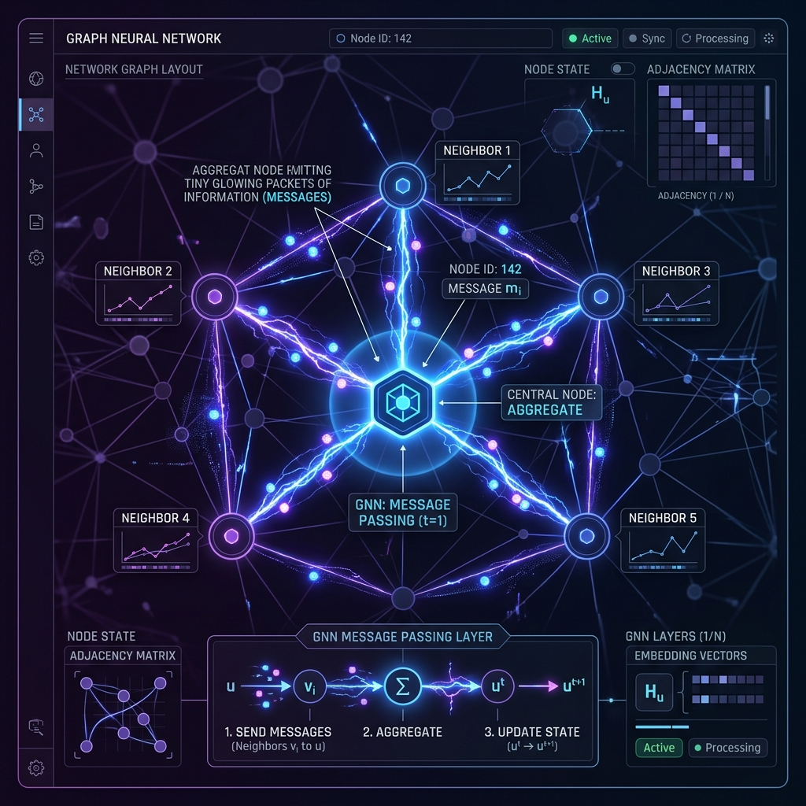

# 05: Applied Graph Neural Networks

<p align="center">
  
</p>

## 🎯 The Big Goal

> **Move beyond static representation learning algorithms and build end-to-end differentiable Neural Networks that inherently understand graph topology to perform precise node classification or link prediction.**

---

## 1. What makes a GNN different?

Unlike standard Neural Networks where layers just multiply numbers with independent weights (`y = Wx + b`), a GNN layer actively looks at the physical structure of the Graph's Adjacency Matrix.

**The core paradigm of a GNN is Message Passing.**
Every node in the network possesses a hidden state. In every layer of a GNN:
1.  **Emit:** A node packages its current state into a "message" and broadcasts it to all nodes it is physically connected to.
2.  **Aggregate:** The node catches all the incoming messages from its neighbors and mathematically summarizes them (often just by summing or averaging them).
3.  **Update:** The node takes that aggregated summary, runs it through a small Dense Neural Network (with a ReLU activation), and updates its own internal state.

If a GNN has 3 layers, then every node absorbs information from its immediate neighbors, its neighbors' neighbors, and its neighbors' neighbors' neighbors (a 3-hop receptive field).

---

## 2. 🔧 Deep Dive: The Graph Convolutional Network (GCN)

The most famous GNN architecture is the **GCN (Graph Convolutional Network)**.
It mathematically solves the "Exploding Message" problem. If Node A is a massive celebrity with 10 million followers, during the "Aggregate" step, anyone connected to Node A will be overwhelmed by Node A's massive degree, distorting their internal state.

The GCN fixes this by introducing **Symmetric Normalization**.
When passing a message, the GCN explicitly divides the signal by the square root of both the sender's degree and the receiver's degree:
$$ H^{(l+1)} = \sigma \left( \tilde{D}^{-\frac{1}{2}} \tilde{A} \tilde{D}^{-\frac{1}{2}} H^{(l)} W^{(l)} \right) $$
This elegant math ensures that signals flowing between two massively connected hubs are diluted, preventing numeric overflow, while signals between isolated edge nodes are amplified.

---

## 💻 Reproducible Code: Building a GCN with `PyTorch Geometric`

PyTorch Geometric (`PyG`) is the industry standard library for building GNNs efficiently using Sparse Tensors.

### `gnn_gcn.py`
```python
import torch
import torch.nn.functional as F
from torch_geometric.datasets import Planetoid
from torch_geometric.nn import GCNConv

# 1. Load the famous Cora Graph Dataset (Academic Citation Network)
print("Downloading Cora Dataset...")
dataset = Planetoid(root='/tmp/Cora', name='Cora')
data = dataset[0] # The entire graph is just one massive isolated Data object
print(f"Graph loaded: {data.num_nodes} nodes, {data.num_edges} edges")
print(f"Node feature dimension: {dataset.num_node_features}, Target Classes: {dataset.num_classes}")

# 2. Define the Graph Convolutional Network (GCN)
class GCN(torch.nn.Module):
    def __init__(self):
        super().__init__()
        # PyG explicitly handles the message passing under the hood
        self.conv1 = GCNConv(dataset.num_node_features, 16)
        self.conv2 = GCNConv(16, dataset.num_classes)

    def forward(self, data):
        x, edge_index = data.x, data.edge_index

        # Layer 1: Message Passing + ReLU
        x = self.conv1(x, edge_index)
        x = F.relu(x)
        x = F.dropout(x, training=self.training)
        
        # Layer 2: Message Passing -> Class Prediction
        x = self.conv2(x, edge_index)
        return F.log_softmax(x, dim=1)

model = GCN()
print("GCN Architecture Compiled and Ready.")
print(model)
```

### 🐳 Run it with Docker

**Create `Dockerfile`:**
```dockerfile
FROM pytorch/pytorch:2.1.0-cuda11.8-cudnn8-runtime
WORKDIR /app
# Install PyTorch Geometric dependencies
RUN pip install torch_geometric
COPY gnn_gcn.py /app/
CMD ["python", "gnn_gcn.py"]
```

**Execute:**
```bash
docker build -t pyg-gcn-demo .
docker run pyg-gcn-demo
```
*You will see PyG download the Cora citation graph and compile the symmetric normalized GCN convolution layer ready for node-level inference.*

---

[<< Previous: Graph Representation Learning](./04_Graph_Representation_Learning.md) | [Home: Curriculum Map](./README.md)
