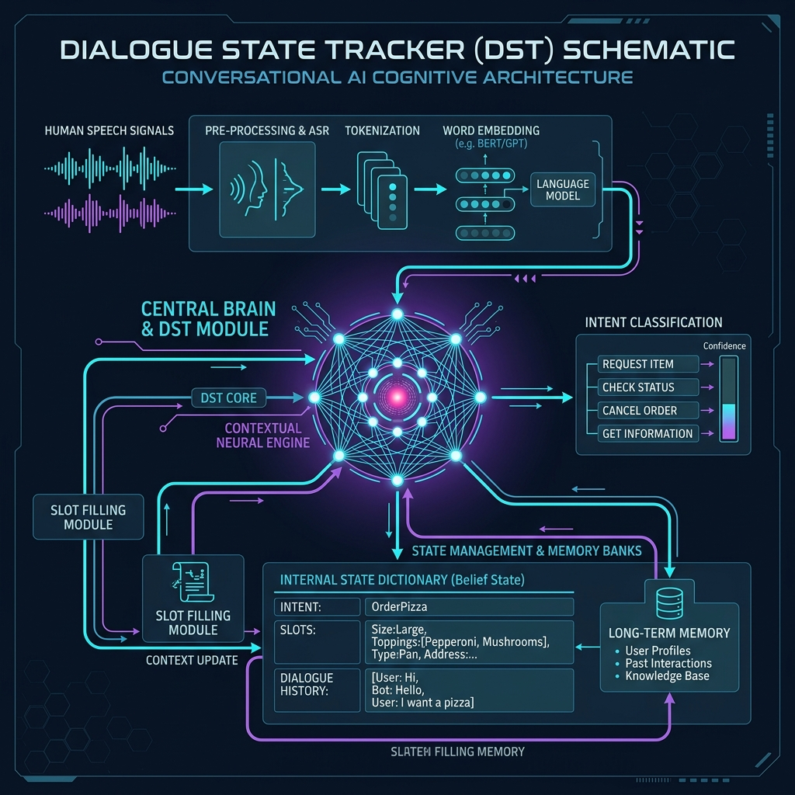

# 07: Conversational AI & Dialogue State Systems

<p align="center">
  
</p>

## 🎯 The Big Goal

> **Build an AI agent capable of holding a persistent, multi-turn conversation that "remembers" context, instead of just treating every user prompt as a brand new isolated event.**

---

## 1. The Death of the Stateless Chatbot

If you ask an AI, "Book me a flight to Tokyo." It responds, "For when?" You reply, "Next Tuesday."
A basic, stateless LLM will crash here. It looks at the prompt `Next Tuesday` completely isolated from the previous sentences. It has no idea what you want to do next Tuesday.

To build an enterprise conversational agent (like a hotel booking bot), you need a structured architecture called a **Dialogue State Tracker (DST)**.

## 2. 🔧 Deep Dive: The Dialogue State Tracker

A DST maintains a JSON-like dictionary in memory (the "Belief State"). As the user speaks across multiple turns, the AI's goal is to accurately fill the "Slots" in this dictionary.

1. **User Turn 1:** "I want a pizza." 
    *   **Intent Classifier Model:** Triggers `OrderPizza` module.
    *   **Belief State:** `{Intent: OrderPizza, Size: null, Toppings: null}`
    *   **Bot:** "What size and what toppings?"
2. **User Turn 2:** "Large with pepperoni."
    *   **Slot Filling Model (NER):** Extracts `Large` and `Pepperoni`.
    *   **Belief State Update:** `{Intent: OrderPizza, Size: Large, Toppings: [Pepperoni]}`
    *   **Bot:** "Would you like anything else?"

By maintaining this structured state, the AI never loses context and can programmatically trigger backend database systems once all mandatory slots are filled.

---

## 💻 Reproducible Code: Building a Basic State Tracker

This Python code demonstrates the core logic of a rule-based Dialogue State Tracker operating over multiple turns.

### `dialogue_tracker.py`
```python
import re

class PizzaBot:
    def __init__(self):
        # 1. Initialize the empty Dialogue State
        self.state = {"intent": "order_pizza", "size": None, "topping": None}
    
    def process_turn(self, user_input):
        user_input = user_input.lower()
        
        # 2. Slot Filling (Regex/NER simulation)
        if "large" in user_input: self.state["size"] = "large"
        elif "small" in user_input: self.state["size"] = "small"
            
        if "pepperoni" in user_input: self.state["topping"] = "pepperoni"
        elif "cheese" in user_input: self.state["topping"] = "cheese"
            
        return self.generate_response()
            
    def generate_response(self):
        # 3. Action Logic based on current state
        if not self.state["size"]:
            return "Bot: What size pizza would you like?"
        elif not self.state["topping"]:
            return "Bot: What topping would you like?"
        else:
            return f"Bot: Perfect! Ordering a {self.state['size']} {self.state['topping']} pizza."

# Simulate a multi-turn conversation
bot = PizzaBot()
conversation = ["I am hungry for pizza.", "A large please.", "Pepperoni sounds good."]

for turn in conversation:
    print(f"User: {turn}")
    response = bot.process_turn(turn)
    print(f"State Memory: {bot.state}")
    print(response + "\n")
```

### 🐳 Run it with Docker

**Create `Dockerfile`:**
```dockerfile
FROM python:3.9-alpine
WORKDIR /app
COPY dialogue_tracker.py /app/
CMD ["python", "dialogue_tracker.py"]
```

**Execute:**
```bash
docker build -t dialogue-bot-demo .
docker run dialogue-bot-demo
```

---

[<< Previous: NLP for Social Media](./06_NLP_for_Social_Media.md) | [Home: Curriculum Map](./README.md) | [Next: Text Production >>](./08_DL_for_Text_Production.md)
