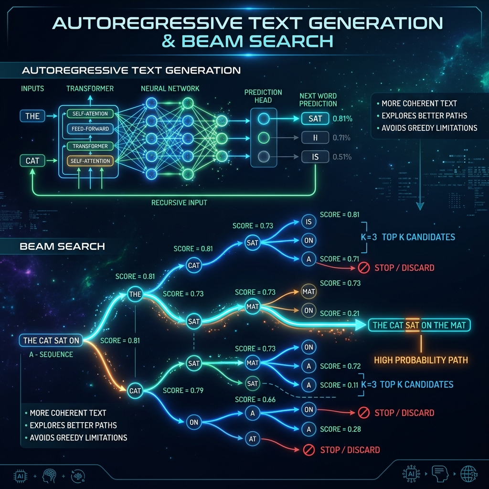

# 08: Deep Learning for Text Production

<p align="center">
  
</p>

## 🎯 The Big Goal

> **Understand how generative AI models (like GPT) mathematically force out words one-by-one, and how decoding algorithms dictate whether the output is hyper-logical or beautifully creative.**

---

## 1. Autoregressive Generation

Language models do not "write" paragraphs. They only do one thing: predict the next single token. 
This is an **Autoregressive** process. 
If the prompt is `"The quick brown"`, the model outputs `"fox"`. 
To get the next word, the system legally must append the new word to the prompt—now `"The quick brown fox"`—and feed the entire sequence back into the model again to predict `"jumps"`.

## 2. 🔧 Deep Dive: Decoding Strategies (Greedy vs. Beam Search)

When the model predicts the next word, it actually outputs a massive probability array for every single word in the dictionary (e.g., `apple: 0.1%`, `fox: 89%`, `dog: 10%`). How do we choose?

1.  **Greedy Decoding:** You always pick the word with the highest probability. It is fast, but it gets legally trapped in predictable, boring loops. "I went to the store to get the store to get the store..."
2.  **Multinomial Sampling (Temperature):** You roll a weighted mathematical dice. Even if `fox` is 89%, if you roll the 10%, it chooses `dog`. This creates chaotic, organic, highly creative text.
3.  **Beam Search:** Used heavily in machine translation. Instead of picking one word, the algorithm explores the top `K` possible branching paths simultaneously (e.g., $K=3$). It looks multiple words into the future along these 3 branches, and then chooses the single branch that yields the highest cumulative probability over the entire sentence.

---

## 💻 Reproducible Code: HuggingFace Text Generation

This code uses GPT-2 to demonstrate the drastic difference in text quality generated by tweaking the mathematical decoding strategy.

### `text_gen.py`
```python
from transformers import GPT2LMHeadModel, GPT2Tokenizer
import torch

print("Loading GPT-2...")
tokenizer = GPT2Tokenizer.from_pretrained("gpt2")
model = GPT2LMHeadModel.from_pretrained("gpt2")

prompt = "The secret to building a successful artificial intelligence is"
input_ids = tokenizer.encode(prompt, return_tensors="pt")

print("\n--- 1. GREEDY DECODING ---")
# Always picks highest probability word. Usually boring and loop-prone.
greedy_output = model.generate(input_ids, max_length=30, pad_token_id=tokenizer.eos_token_id)
print(tokenizer.decode(greedy_output[0], skip_special_tokens=True))

print("\n--- 2. BEAM SEARCH ---")
# Explores 5 paths simultaneously to find the most globally coherent sentence.
beam_output = model.generate(
    input_ids, max_length=30, num_beams=5, early_stopping=True, pad_token_id=tokenizer.eos_token_id
)
print(tokenizer.decode(beam_output[0], skip_special_tokens=True))

print("\n--- 3. TEMPERATURE SAMPLING ---")
# Rolls mathematical dice. High entropy = high creativity.
sample_output = model.generate(
    input_ids, max_length=30, do_sample=True, top_k=50, temperature=0.9, pad_token_id=tokenizer.eos_token_id
)
print(tokenizer.decode(sample_output[0], skip_special_tokens=True))
```

### 🐳 Run it with Docker

**Create `Dockerfile`:**
```dockerfile
FROM python:3.9-slim
WORKDIR /app
RUN pip install torch transformers
COPY text_gen.py /app/
CMD ["python", "text_gen.py"]
```

**Execute:**
```bash
docker build -t text-gen-demo .
docker run text-gen-demo
```

---

[<< Previous: Conversational AI](./07_Conversational_AI.md) | [Home: Curriculum Map](./README.md)
