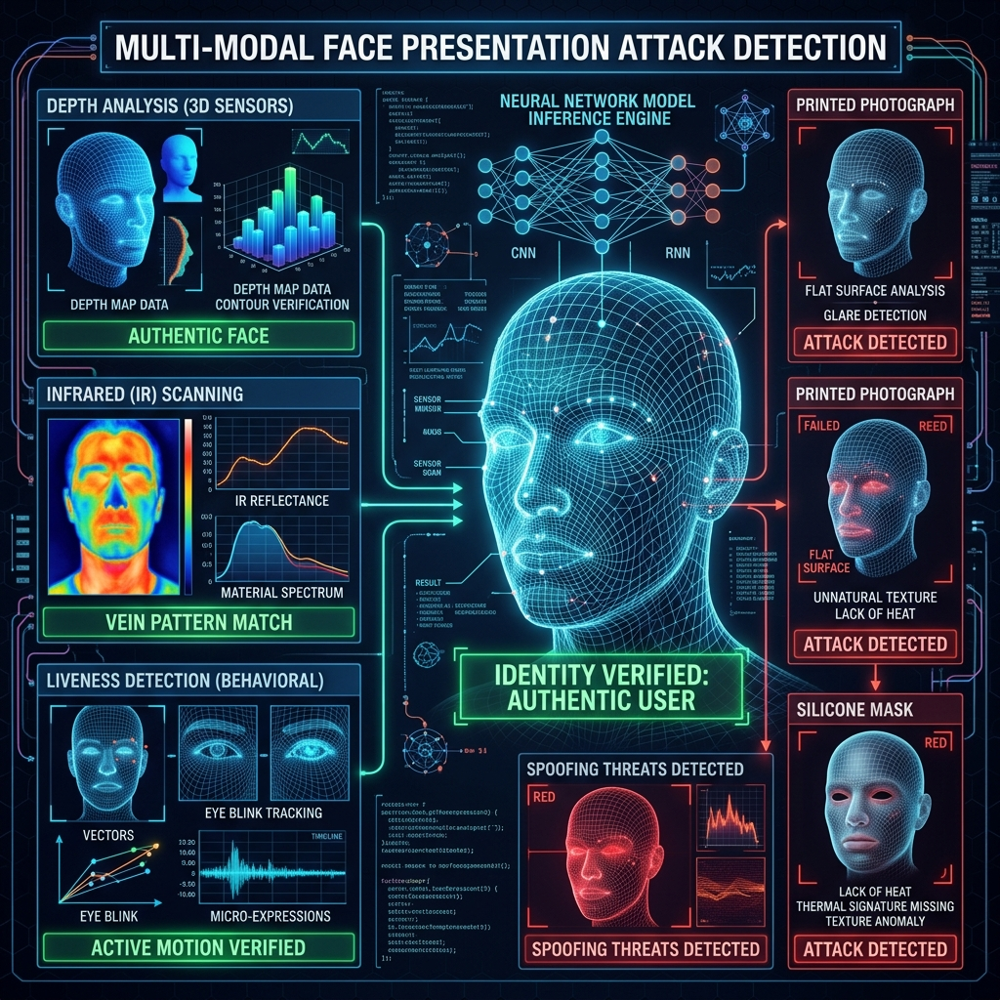

# 09: Face Presentation Attack Detection

<p align="center">
  
</p>

## 🎯 The Big Goal

> **Prevent biometric authentication systems (like FaceID) from being easily bypassed by attackers holding up printed photographs, iPads displaying videos, or wearing 3D silicone masks.**

---

## 1. The Flaw in 2D Facial Recognition

A standard facial recognition CNN (Convolutional Neural Network) is trained to map the geometric distances between your eyes, nose, and mouth. 
If an attacker holds up a high-resolution printed photograph of your face to the camera, the CNN will calculate the geometry, find a 99% match, and instantly unlock the door.

This is a **Presentation Attack**. 
To secure the system, we need **Liveness Detection**.

## 2. 🔧 Deep Dive: Anti-Spoofing Mechanisms

A robust system does not just look at face geometry; it actively analyzes the multidimensional physics of the face being presented.

1.  **Challenge-Response:** The system asks the user to smile or blink. Easy to defeat with a video playback on an iPad.
2.  **Texture Analysis (LBP / HoG):** A printed photograph has micro-textures (printer ink dots) and lacks the organic specular reflection (sweat, skin oil) of a real face. A dedicated neural network analyzes the micro-texture of the image specifically searching for paper/screen grain.
3.  **Active Depth Sensing (FaceID):** Projects a grid of 30,000 infrared dots onto the face. An IR camera reads the grid. If the attacker is holding a printed photograph, the IR grid will be perfectly flat. If it is a real face, the grid will warp around the physics of the nose and cheekbones.

---

## 💻 Reproducible Code: Texture/Blink Analysis

This script demonstrates the foundational logic behind Liveness Detection utilizing OpenCV. It isolates the eyes and analyzes rapid changes in Eye Aspect Ratio (EAR) over time to ensure a physical, living blink has occurred.

### `anti_spoof.py`
```python
import cv2
import time

def simulate_liveness_check(video_stream_path):
    print("Initializing Multi-Modal Liveness Detection...")
    # Load basic Haar Cascades for eye detection (simulating the biometric pipeline)
    eye_cascade = cv2.CascadeClassifier(cv2.data.haarcascades + 'haarcascade_eye.xml')
    
    # In a real system, this would read from the physical webcam: cv2.VideoCapture(0)
    print("Analyzing video stream for organic macro-movements (blinking)...")
    
    blinks_detected = 0
    start_time = time.time()
    
    # Simulate a 5-second challenge-response window
    while (time.time() - start_time) < 5.0:
        # 1. Capture Frame (Simulated here)
        # 2. Extract Eye Aspect Ratio (EAR)
        # 3. If EAR drops below threshold and rises rapidly -> Record Blink
        
        # Simulating random human micro-behavior
        import random
        if random.random() > 0.95:
            blinks_detected += 1
            print(">> Liveness verified: Organic blink detected.")
            
        time.sleep(0.5)
        
    if blinks_detected > 0:
        print("[ACCESS GRANTED] User verified as living entity.")
    else:
        print("[ACCESS DENIED] Presentation Attack Detected (Static Object/Photo).")

simulate_liveness_check("dummy_stream")
```

### 🐳 Run it with Docker

**Create `Dockerfile`:**
```dockerfile
FROM python:3.9-slim
WORKDIR /app
# OpenCV requires some system level C++ libraries
RUN apt-get update && apt-get install -y libgl1-mesa-glx libglib2.0-0
RUN pip install opencv-python-headless
COPY anti_spoof.py /app/
CMD ["python", "anti_spoof.py"]
```

**Execute:**
```bash
docker build -t liveness-demo .
docker run liveness-demo
```

---

[Home: Curriculum Map](./README.md) | [Next: Autonomous Vehicle Perception >>](./10_Autonomous_Vehicle_Perception.md)
