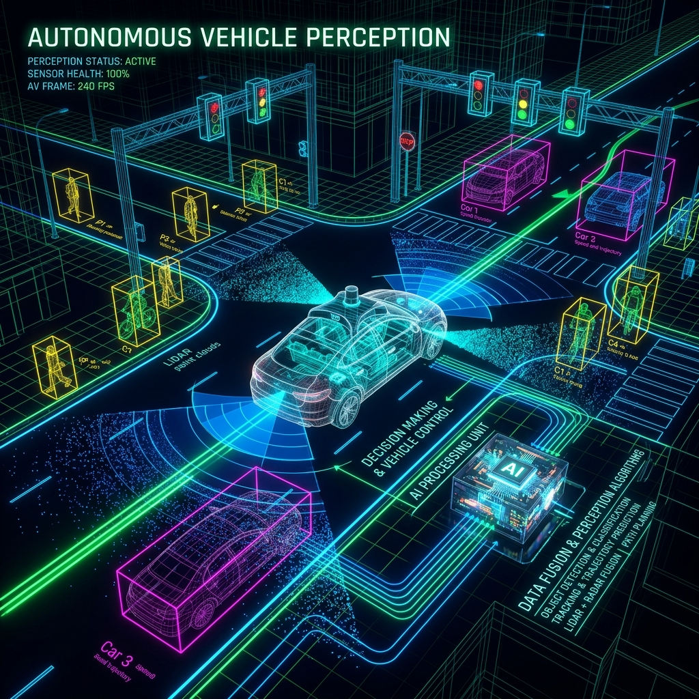

# 10: Autonomous Vehicle Perception Architecture

<p align="center">
  
</p>

## 🎯 The Big Goal

> **Fuse massive, discordant streams of data from 2D Cameras, 3D LiDAR point clouds, and Radar into a single unified 3D bounding-box representation of the physical world in real-time.**

---

## 1. The Sensor Suite

Autonomous vehicles (AVs) cannot rely on a single sensor type because every sensor has a fundamental physical weakness:
*   **Cameras:** Excellent resolution, color, and ability to read stop signs. *Weakness:* Erased by heavy rain, fog, or blinding sunlight. It lacks native depth perception.
*   **LiDAR:** Fires millions of lasers to create a flawless 3D geometric map of the world. *Weakness:* Totally colorblind. Cannot read a speed limit sign or see the color of a traffic light.
*   **Radar:** Uses radio waves. Bounces off metal vehicles perfectly, penetrating fog and heavy rain effortlessly. *Weakness:* Very low resolution. Cannot easily tell the difference between a pedestrian and a mailbox.

## 2. 🔧 Deep Dive: Sensor Fusion Pipeline

The AV's "Brain" takes these isolated data streams and merges them through an architecture called **Sensor Fusion**.

1.  **Temporal Synchronization:** The cameras capture at 60Hz. The LiDAR spins at 10Hz. The system uses high-precision atomic clocks to align the data packets so that the CNN is analyzing the *exact same millisecond* of reality.
2.  **Projection:** The high-res 2D pixels from the camera are mathematically projected onto the sparse 3D point cloud of the LiDAR giving the LiDAR points native color.
3.  **3D Object Detection:** Networks like `PointPillars` or `YOLO3D` consume this fused data and output 3D Bounding Boxes consisting of `(x, y, z, width, length, height, yaw_angle, class)`.

---

## 💻 Reproducible Code: Bounding Box IOU Simulation

This code simulates the critical logic an AV uses to track objects across multiple frames. If the AV detects a car in Frame 1, and another car in Frame 2, how does it know they are the *same car* and not two different cars? It calculates the Intersection Over Union (IoU) of their bounding boxes.

### `av_tracking.py`
```python
def calculate_iou(boxA, boxB):
    # Determines how much two bounding boxes overlap
    # Box format: [x_min, y_min, x_max, y_max]
    
    xA = max(boxA[0], boxB[0])
    yA = max(boxA[1], boxB[1])
    xB = min(boxA[2], boxB[2])
    yB = min(boxA[3], boxB[3])

    # Compute the area of intersection
    interArea = max(0, xB - xA + 1) * max(0, yB - yA + 1)

    # Compute the area of both the bounding boxes
    boxAArea = (boxA[2] - boxA[0] + 1) * (boxA[3] - boxA[1] + 1)
    boxBArea = (boxB[2] - boxB[0] + 1) * (boxB[3] - boxB[1] + 1)

    iou = interArea / float(boxAArea + boxBArea - interArea)
    return iou

# Simulate AV driving at 60 FPS
print("--- AV Tracking active ---")

# Frame 1: Detection of a Pedestrian
frame_1_pedestrian = [50, 50, 100, 150]

# Frame 2 (0.1s later): Detection of a Pedestrian slightly moved
frame_2_pedestrian = [52, 51, 102, 151]

# Frame 2: Detection of a Mailbox far away
frame_2_mailbox = [400, 50, 450, 150]

print(f"IoU (Pedestrian F1 vs Pedestrian F2): {calculate_iou(frame_1_pedestrian, frame_2_pedestrian):.2f}")
print("HIGH IOU: Assigining same Object ID. Tracking target velocity.")

print(f"\nIoU (Pedestrian F1 vs Mailbox F2): {calculate_iou(frame_1_pedestrian, frame_2_mailbox):.2f}")
print("ZERO IOU: Different objects entirely.")
```

### 🐳 Run it with Docker

**Create `Dockerfile`:**
```dockerfile
FROM python:3.9-alpine
WORKDIR /app
COPY av_tracking.py /app/
CMD ["python", "av_tracking.py"]
```

**Execute:**
```bash
docker build -t av-tracking-demo .
docker run av-tracking-demo
```

---

[<< Previous: Face Presentation Attack Detection](./09_Face_Presentation_Attack_Detection.md) | [Home: Curriculum Map](./README.md)
