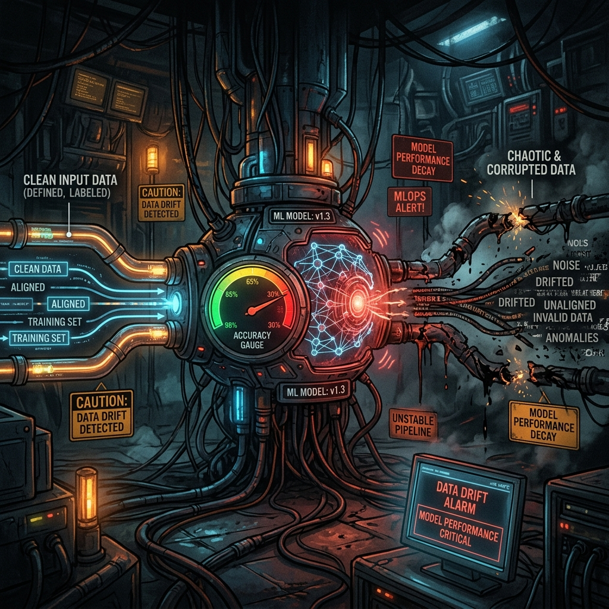

# 12: Why AI Projects Fail: Structural and Deployment Pitfalls

<p align="center">
  
</p>

## 🎯 The Big Goal

> **Understand that deploying a model to production is not the end; it is only the beginning. Master MLOps to prevent silent AI degradation and catastrophic data drift.**

---

## 1. The Illusion of a "Finished" AI

A Junior Engineer trains a model in a Jupyter Notebook, hits 98% accuracy, deploys it to a Kubernetes cluster, and walks away believing the project is finished.
Three months later, the business discovers the AI has been incorrectly rejecting 40% of their customers. 

What happened? **The Model did not break. Reality changed.**

Traditional software is static. If you write a calculator app, $2 + 2 = 4$ forever.
Machine Learning is organic. It learns entirely from the surrounding environment. If the surrounding environment shifts, the model's fundamental assumptions break entirely.

## 2. 🔧 Deep Dive: Data Drift and Concept Drift

The two main killers of production AI systems:

1.  **Data Drift:** The statistical distribution of the incoming data fundamentally shifts away from what the model was trained on. 
    *   *Example:* You train a spam filter purely on English emails. Suddenly, the company expands to Spain. The incoming data is entirely in Spanish. The model fails silently. The code didn't break; the data drifted.
2.  **Concept Drift:** The mapping between the input and the target variable fundamentally changes.
    *   *Example:* An AI predicts the optimal price for airline tickets. Suddenly, a global pandemic hits. A $500 ticket that used to sell instantly yesterday will not sell at all today. The physical data structure hasn't changed, but human behavior (the concept) has completely flipped.

---

## 💻 Reproducible Code: Detecting Data Drift

In MLOps, we use specialized statistical libraries (like `evidently` or `scipy.stats`) to constantly monitor the Kolmogorov-Smirnov (KS) distance between the training data and the live production data.

### `mlops_drift.py`
```python
import numpy as np
from scipy import stats

print("--- MLOps Pipeline Monitor ---")

# 1. Historical Training Data Distribution (e.g., Customer Ages)
# Mean age of 35, spread of 5
training_data_ages = np.random.normal(loc=35, scale=5, size=1000)

# 2. Incoming Production Data (Month 1: Stable)
production_month_1 = np.random.normal(loc=35.5, scale=5.2, size=1000)

# 3. Incoming Production Data (Month 6: Severe Data Drift!)
# Suddenly a younger demographic starts using the app
production_month_6 = np.random.normal(loc=22, scale=3, size=1000)

def alert_on_drift(reference_data, current_data, threshold=0.05):
    # Perform Kolmogorov-Smirnov test for goodness of fit
    statistic, p_value = stats.ks_2samp(reference_data, current_data)
    
    if p_value < threshold:
        print(f"🚨 CRITICAL ALERT: Data Drift Detected! (p-value: {p_value:.5f})")
        print("Model assumptions broken. Retraining protocol required immediately.\n")
    else:
        print(f"✅ System Stable. No significant drift detected (p-value: {p_value:.5f}).\n")

print("Checking Pipeline Health (Month 1)...")
alert_on_drift(training_data_ages, production_month_1)

print("Checking Pipeline Health (Month 6)...")
alert_on_drift(training_data_ages, production_month_6)
```

### 🐳 Run it with Docker

**Create `Dockerfile`:**
```dockerfile
FROM python:3.9-slim
WORKDIR /app
RUN pip install numpy scipy
COPY mlops_drift.py /app/
CMD ["python", "mlops_drift.py"]
```

**Execute:**
```bash
docker build -t mlops-drift-demo .
docker run mlops-drift-demo
```
*Notice how the system immediately flags the catastrophic shift in data distributions natively, allowing engineers to intervene before the model silently bankrupts the system.*

---

[<< Previous: Logic Programming & PDDL](./11_Logic_Programming_and_PDDL.md) | [Home: Curriculum Map](./README.md)
