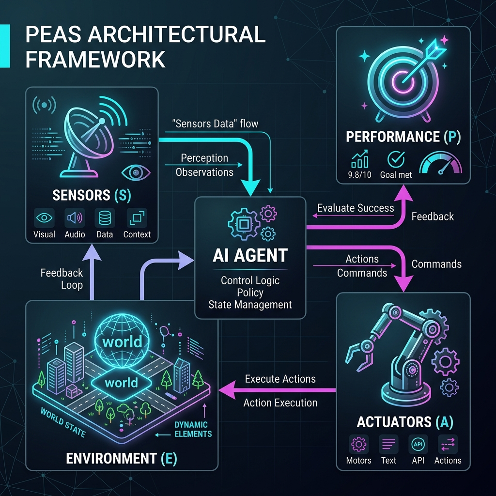

# 13: Foundations of Computational Agents

<p align="center">
  
</p>

## 🎯 The Big Goal

> **After this chapter, you will understand the fundamental building blocks of AI Agents. You will move past simple procedural code and learn the PEAS framework (Performance, Environment, Actuators, Sensors) to architect autonomous systems that observe their environment and make non-deterministic decisions.**

In traditional software engineering, code is entirely deterministic: *If X happens, do Y.* 
An **Agent** is different. An agent is an autonomous entity situated within an environment that uses sensors to perceive its state, makes a decision using an internal policy or model, and executes actions using actuators to maximize a specific performance measure. 

---

## 1. The PEAS Architecture

When designing a new AI Agent from scratch, the very first step is defining its **PEAS** (Performance, Environment, Actuators, Sensors). If you cannot define these four pillars clearly, your agent will fail.

<p align="center">
  
</p>

Let's use an **Autonomous Self-Driving Car** as an example of an agent situated in a highly complex environment:

1.  **Performance Measure:** How do we evaluate success? (e.g., Safe arrival at destination, minimizing driving time, minimizing fuel consumption, no traffic violations).
2.  **Environment:** The external world it operates in. (e.g., City streets, highways, unpredictable pedestrians, weather conditions, other vehicles).
3.  **Actuators:** How the agent physically interacts with the environment. (e.g., Steering wheel, brake pedal, accelerator, turn signals).
4.  **Sensors:** How the agent perceives the environment. (e.g., LiDAR, cameras, GPS, speedometer, engine sensors).

---

## 2. Types of Agent Architectures

Agents exist on a spectrum of complexity, ranging from simple reactive programs to deep-learning-powered reasoning engines.

### 2.1 Simple Reflex Agents
The most basic form of an agent. It operates strictly on **Condition-Action rules**. It has no memory of the past and does not plan for the future. It only looks at the absolute *current* sensor reading.
*   *Example:* A smart thermostat. If the temperature sensor reads > 72°F, turn on the AC Actuator.

### 2.2 Model-Based Reflex Agents
These agents maintain an internal state (a "memory" or "model" of the world) to handle partial observability. If a sensor temporarily loses data, the agent can rely on its internal model to guess what is happening.
*   *Example:* A robot vacuum that remembers which rooms it has already cleaned, so it doesn't get stuck in an infinite loop.

### 2.3 Goal-Based Agents
These agents don't just react; they project into the future. They have a specific target (a Goal) and utilize search or planning algorithms to evaluate multiple possible futures to choose the best sequence of actions.
*   *Example:* A chess engine calculating 10 moves ahead to find a path to checkmate.

### 2.4 Utility-Based Agents
A goal-based agent binary evaluates success: "Did I reach the goal? Yes/No." A utility-based agent calculates *how happy* the outcome makes it. If there are multiple paths to a goal, it chooses the most efficient, safest, or cheapest path by maximizing a mathematical utility function.
*   *Example:* Google Maps giving you a route. Reaching the destination is the goal, but avoiding tolls and minimizing traffic maximizes the utility.

---

## 🐳 Dockerized Application: The Reflex Vacuum Agent

Let's build a classic Simple Reflex Agent. We will simulate a 2-room environment (Room A and Room B). The agent can perceive if its current room is "Dirty" or "Clean", and it can act by "Sucking" dirt or "Moving" left/right.

You can run this fully containerized on your local machine.

### `docker-compose.yml`
```yaml
version: '3.8'
services:
  reflex_agent:
    build: .
    container_name: reflex_vacuum_agent
```

### `Dockerfile`
```dockerfile
FROM python:3.10-slim
WORKDIR /app
COPY app.py .
CMD ["python", "app.py"]
```

### `app.py`
```python
import time
import random

class Environment:
    def __init__(self):
        # A simple 2-room environment. True = Dirty, False = Clean.
        self.rooms = {'A': random.choice([True, False]), 
                      'B': random.choice([True, False])}
    
    def get_percept(self, location):
        return self.rooms[location]
        
    def clean_room(self, location):
        print(f"🧹 Environment: Dirt removed from Room {location}")
        self.rooms[location] = False

class SimpleReflexAgent:
    def __init__(self):
        self.location = 'A' # Agent starts in Room A
        
    def perceive_and_act(self, environment):
        print(f"\n📍 Agent is currently in Room: {self.location}")
        
        # SENSOR: Perceive the environment
        is_dirty = environment.get_percept(self.location)
        
        # ACTUATOR & LOGIC: Reflex rules
        if is_dirty:
            print("👁️ Sensor: Room is DIRTY. Action: SUCK DIRT.")
            environment.clean_room(self.location)
        else:
            print("👁️ Sensor: Room is CLEAN. Action: MOVE.")
            self.location = 'B' if self.location == 'A' else 'A'

if __name__ == "__main__":
    print("--- Starting Simple Reflex Vacuum Environment ---")
    env = Environment()
    agent = SimpleReflexAgent()
    
    for step in range(4): # Run the simulation loop
        agent.perceive_and_act(env)
        time.sleep(1)
        
    print("\n✅ Simulation Complete. Final Environment State:")
    print(f"Room A Dirty: {env.rooms['A']}, Room B Dirty: {env.rooms['B']}")
```

To run this:
1. Save the above files in a new directory.
2. Run `docker-compose up --build`.

---

## 🤔 Reflection Questions

1. **You are designing an automated stock trading bot using the PEAS framework. What exactly are the Actuators for this agent?**
<details>
<summary>💡 View Answer</summary>

While a robot uses physical motors, a software agent's Actuators are its API calls. For a trading bot, the Actuators are the API endpoints used to execute trades, such as `buy_order()`, `sell_order()`, or `cancel_order()` on an exchange like Binance or Coinbase.
</details>

2. **Why would a Simple Reflex Agent fail utterly in a maze-solving task?**
<details>
<summary>💡 View Answer</summary>

A Simple Reflex Agent has no memory (no internal state) and bases its decisions ONLY on its current sensor reading. If it hits a dead end, turns right, hits another wall, and turns right again, it could easily get stuck in an infinite loop. Solving a maze requires a **Model-Based Agent** (to remember visited paths) or a **Goal-Based Agent** (to plan a path forward).
</details>

3. **In the Dockerized Vacuum Agent code above, if BOTH rooms are clean at the start, what will the agent helplessly do forever if we let the loop run infinitely?**
<details>
<summary>💡 View Answer</summary>

It will infinitely bounce back and forth between Room A and Room B in an endless loop. Because it is a simple reflex agent, it doesn't remember that the other room is already clean. Every time it enters a clean room, its hardcoded rule says: "If clean, move." To fix this, it would need to upgrade to a Model-Based agent with an internal variable tracking `cleaned_rooms`.
</details>

---

<div align="center">

| [Home: Curriculum Map](./README.md) | [Next: Reinforcement Learning Fundamentals >>](./14_Reinforcement_Learning_Fundamentals.md) |

</div>
