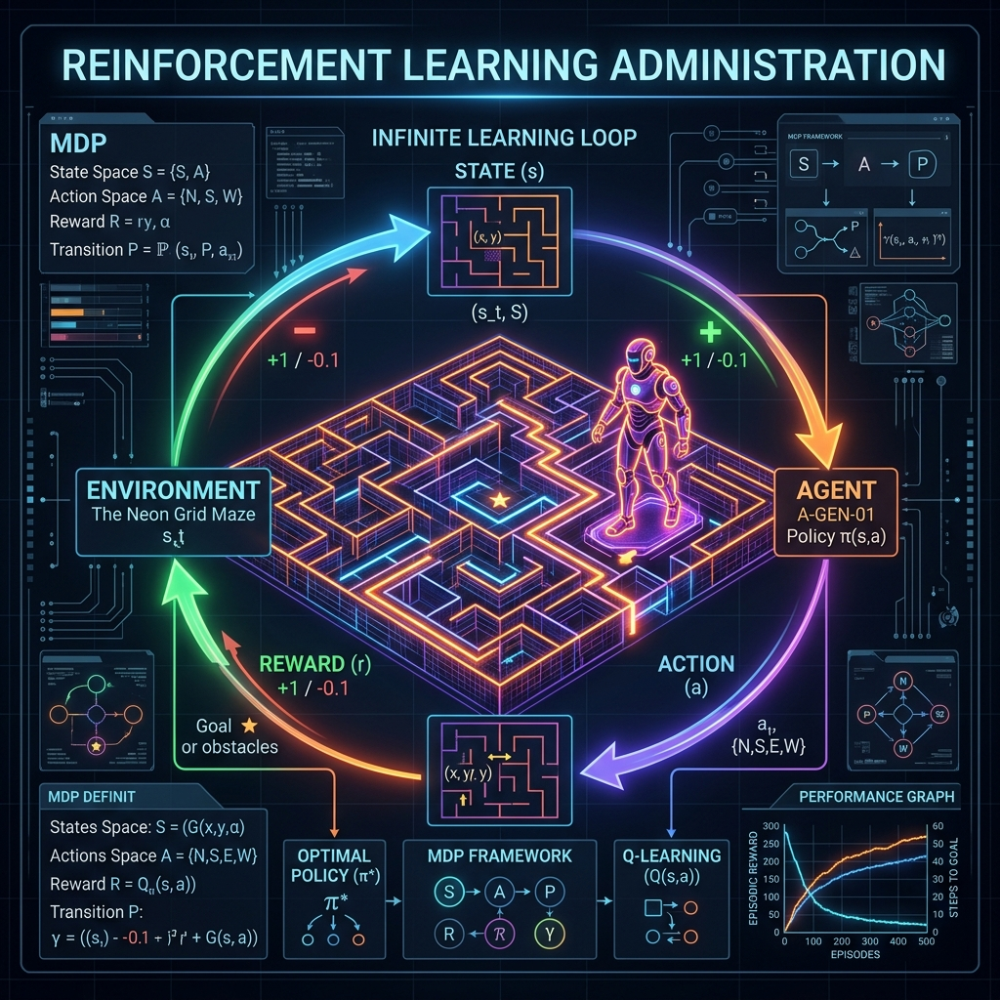
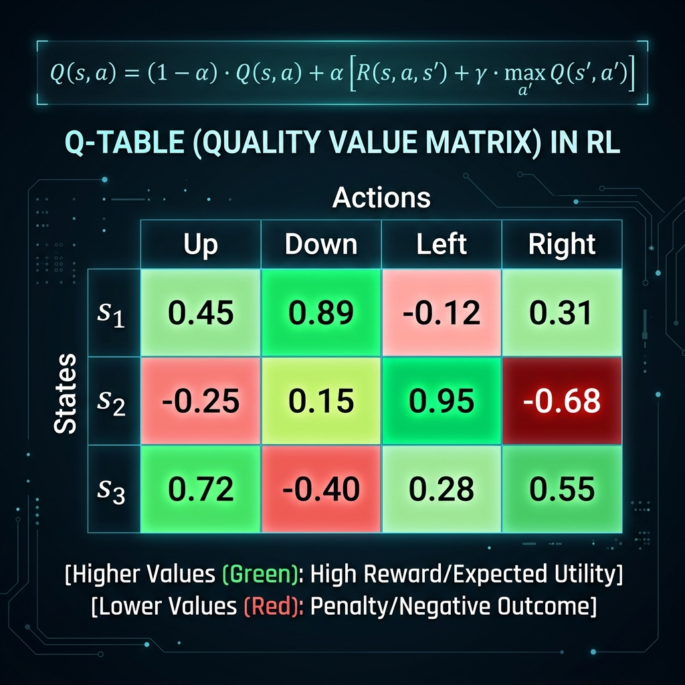

# 14: Reinforcement Learning Fundamentals

<p align="center">
  
</p>

## 🎯 The Big Goal

> **After this chapter, you will understand how AI agents learn to maximize long-term rewards through trial and error. You will master the Markov Decision Process (MDP), the Bellman Equation, and build a fully functional Q-Learning robot that can navigate a dangerous frozen lake without falling through the ice.**

Supervised Learning requires a dataset of labeled answers (e.g., this is a picture of a cat). But how do you train an algorithm to play Super Mario? You don't have a dataset of "perfect button presses." 

Instead, you use **Reinforcement Learning (RL)**. You drop an Agent into an Environment with no instructions, let it take Actions, and give it Rewards (points) or Punishments (deaths). Over millions of iterations, the agent learns the optimal policy to win the game.

---

## 1. The Markov Decision Process (MDP)

To solve an RL problem, we must map the environment into a mathematical framework called an MDP. 
An MDP consists of 5 core components (represented mathematically as a tuple: `<S, A, P, R, γ>`):

1.  **States (S):** Every possible situation the agent can be in. (e.g., Pac-Man's exact grid coordinate).
2.  **Actions (A):** The moves available in a state. (e.g., Up, Down, Left, Right).
3.  **Transition Probability (P):** The uncertainty of the environment. If the agent chooses "Move Forward", does the wind blow it sideways?
4.  **Reward Function (R):** Immediate feedback. Eating food = +10. Hitting a ghost = -100.
5.  **Discount Factor (γ / Gamma):** A value between 0 and 1. Determines how much the agent cares about *immediate* rewards versus *future* rewards.

---

## 2. Q-Learning and The Bellman Equation

If an agent is in State `s` and takes Action `a`, how "good" was that decision? We store that value in a massive matrix called a **Q-Table** (Quality Table).

How do we calculate and update those Q-Values as the agent explores? We use the **Bellman Equation**.

<p align="center">
  
</p>

### The Exploration vs. Exploitation Dilemma
When an agent starts, its Q-Table is completely blank (all zeros). It must explore randomly. As it finds rewards, the Q-Table fills with green numbers. 

Now the agent faces a dilemma:
*   **Exploitation:** Should I just take the action with the highest Q-Value right now because I know it works?
*   **Exploration:** Or should I take a random action just in case there is a *massive* hidden reward I haven't found yet?

We handle this using **Epsilon-Greedy (ε-greedy)**. We set an ε variable (e.g., 0.1). 90% of the time the agent exploits its knowledge. 10% of the time, it explores randomly. 

---

## 🐳 Dockerized Application: Q-Learning on a Frozen Lake

Let's build a real RL agent. The environment is a 4x4 Grid. The agent starts at `Start (S)`, wants to reach the `Goal (G)` (+1 reward), but must avoid falling into `Holes (H)` (-1 reward).

### `docker-compose.yml`
```yaml
version: '3.8'
services:
  q_learning_agent:
    build: .
    container_name: q_learning_agent
```

### `Dockerfile`
```dockerfile
FROM python:3.10-slim
WORKDIR /app
RUN pip install numpy
COPY app.py .
CMD ["python", "app.py"]
```

### `app.py`
```python
import numpy as np
import random

# A simple 1D representation of a 4x4 Frozen Lake
# S = Start (0), F = Frozen/Safe, H = Hole/Death, G = Goal (15)
# S F F F (0,1,2,3)
# F H F H (4,5,6,7)
# F F F H (8,9,10,11)
# H F F G (12,13,14,15)
HOLES = [5, 7, 11, 12]
GOAL = 15

# Initialize 16 states, 4 actions (0:Left, 1:Down, 2:Right, 3:Up)
q_table = np.zeros((16, 4))
learning_rate = 0.8       # Alpha
discount_factor = 0.95    # Gamma
epsilon = 0.1             # Exploration rate
epochs = 1000

for i in range(epochs):
    state = 0 # Always start at S
    done = False
    
    while not done:
        # Epsilon-Greedy Selection
        if random.uniform(0, 1) < epsilon:
            action = random.randint(0, 3) # Explore randomly
        else:
            action = np.argmax(q_table[state]) # Exploit Q-Table

        # Execute Action (Simplified deterministic transitions for demonstration)
        next_state = state
        if action == 0 and state % 4 != 0:   next_state -= 1   # Left
        if action == 1 and state < 12:       next_state += 4   # Down
        if action == 2 and (state+1) % 4!=0: next_state += 1   # Right
        if action == 3 and state >= 4:       next_state -= 4   # Up

        # Calculate Reward
        reward = 0
        if next_state == GOAL:
            reward = 1
            done = True
        elif next_state in HOLES:
            reward = -1
            done = True
            
        # THE BELLMAN EQUATION (Q-Table Update)
        old_value = q_table[state, action]
        next_max = np.max(q_table[next_state])
        
        new_value = (1 - learning_rate) * old_value + learning_rate * (reward + discount_factor * next_max)
        q_table[state, action] = new_value
        
        state = next_state

print("\n🧠 Training Complete! Here are the learned Q-Values for State S (0):")
print(f"Left: {q_table[0,0]:.2f} | Down: {q_table[0,1]:.2f} | Right: {q_table[0,2]:.2f} | Up: {q_table[0,3]:.2f}")
print("Notice how 'Down' or 'Right' learned higher values because they lead towards the goal safely.")
```

To run this:
1. Save the above files.
2. Run `docker-compose up --build`.

---

## 🤔 Reflection Questions

1. **You are training a drone using RL to deliver packages. It keeps flying in endless circles and never delivers the package. What is wrong with your Reward Function?**
<details>
<summary>💡 View Answer</summary>

This is called the "Sparse Reward" problem. The drone only gets a reward (+100) when it completely reaches the destination. The odds of a random drone stumbling all the way to a doorstep 2 miles away are virtually zero, so it never experiences a reward, so the Q-Table never updates. You must use **Reward Shaping**, giving small incremental rewards for moving closer to the target coordinate, or penalizing it slightly (-1) for every second it stays in the air to encourage speed.
</details>

2. **In the Bellman Equation, what happens if we set the Discount Factor (Gamma) to 0.0?**
<details>
<summary>💡 View Answer</summary>

If Gamma is 0, the agent completely ignores all future rewards `(discount_factor * next_max becomes 0)`. The agent essentially becomes extremely short-sighted, acting like a Simple Reflex Agent that only cares about immediate, instant gratification. For tasks requiring long-term planning (like chess), Gamma must be high (e.g., 0.99).
</details>

---

<div align="center">

| [<< Previous: Foundations of Computational Agents](./13_Foundations_of_Computational_Agents.md) | [Home: Curriculum Map](./README.md) | [Next: Building Multiagent Systems >>](./15_Building_Multiagent_Systems.md) |

</div>
