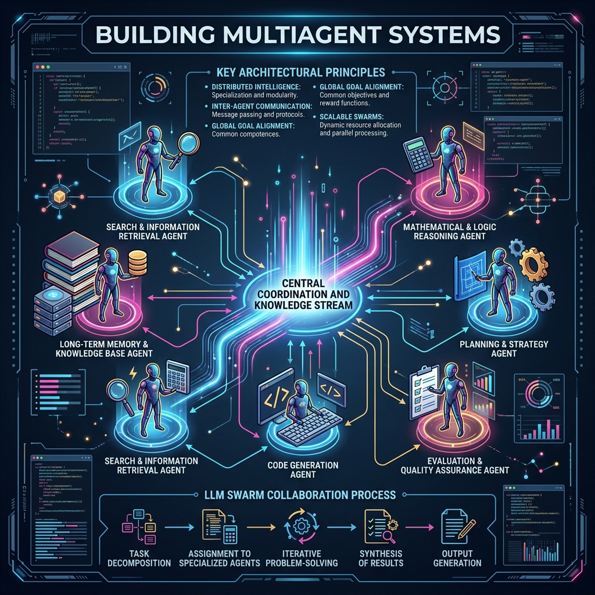
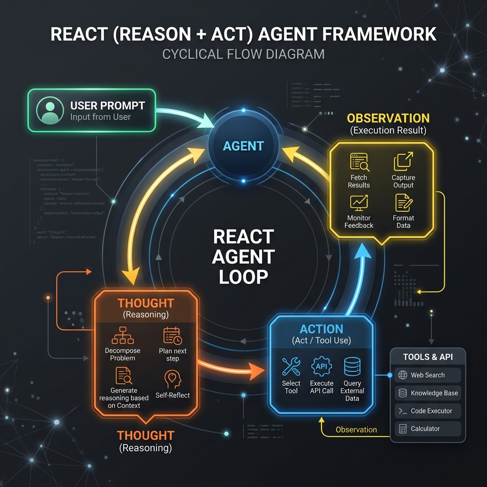

# 15: Building Multiagent Systems

<p align="center">
  
</p>

## 🎯 The Big Goal

> **After this chapter, you will transition from single scripts to Multi-Agent Architectures. You will understand how to grant LLMs access to physical Tools, structure the ReAct (Reason + Act) loop, and deploy a system where specialized agents negotiate and delegate tasks to each other to solve complex, multi-step problems.**

The greatest limitation of a Large Language Model (LLM) is that it is a closed system. It is frozen at its training date, cannot access the internet, cannot do complex math, and cannot execute code.

We solve this by giving the LLM a framework to act as an **Agent**. Instead of just generating text for a user to read, the LLM generates JSON commands to trigger external APIs (Tools), reads the output, and continues reasoning. When one agent is not enough, we build **Multi-Agent Swarms** where tasks are decomposed and routed to specialist agents.

---

## 1. The ReAct Framework

The foundational loop of a modern AI Agent is the **ReAct (Reason + Act)** pattern.

<p align="center">
  
</p>

Instead of trying to answer a prompt instantly, the agent enters an iterative loop:
1.  **Thought:** The agent explains its reasoning internally. *"To find the current weather in Tokyo, I need to use the Search Tool."*
2.  **Action:** The agent halts text generation and requests the system to execute a specific function. `{"tool": "weather_api", "location": "Tokyo"}`
3.  **Observation:** The python backend executes the API and injects the raw JSON result back into the LLM's prompt. *"Observation: 22°C and Sunny."*
4.  **Final Answer:** The LLM synthesizes the observation into a human-readable response.

---

## 2. Multi-Agent Architectures

When building enterprise applications, throwing a 5,000-word prompt at a single massive LLM makes it prone to hallucination and distraction. 

Instead, we use a **Router-Worker Architecture**:
*   **The Orchestrator (Router) Agent:** An LLM tuned purely for natural-language routing. It evaluates the user's prompt, decomposes it, and decides which downstream specialist should handle it.
*   **The Specialist Agents (Workers):** Tightly scoped prompts. 
    *   *Agent A:* "You are a Math Agent. You only use the Calculator tool."
    *   *Agent B:* "You are a Research Agent. You only use the Web Scraper tool."

---

## 🐳 Dockerized Application: A Mock LLM Multi-Agent Router

We will build a deterministic, locally runnable Python application that *models* a multi-agent routing system. Because real LLM agents require paid API keys (like OpenAI), this script uses a deterministic mocked LLM to demonstrate the control flow safely on your local machine.

### `docker-compose.yml`
```yaml
version: '3.8'
services:
  multiagent_system:
    build: .
    container_name: multiagent_system
```

### `Dockerfile`
```dockerfile
FROM python:3.10-slim
WORKDIR /app
COPY app.py .
CMD ["python", "app.py"]
```

### `app.py`
```python
import time

class ToolNetwork:
    @staticmethod
    def execute_calculator(expression):
        print(f"   ⚙️  [Tool] Executing Math: {expression}")
        return eval(expression)
        
    @staticmethod
    def execute_search(query):
        print(f"   🌐 [Tool] Searching Internet for: {query}")
        return "Current CEO is Jane Doe."

class SpecialistAgent:
    def __init__(self, name, tool_access):
        self.name = name
        self.tool_access = tool_access
        
    def act(self, payload):
        print(f"🤖 [{self.name}] Activated. Thinking...")
        time.sleep(1)
        if self.tool_access == 'calculator':
            result = ToolNetwork.execute_calculator(payload)
            return f"The mathematical result is {result}"
        elif self.tool_access == 'search':
            result = ToolNetwork.execute_search(payload)
            return f"Found answer online: {result}"

class OrchestratorAgent:
    def __init__(self):
        self.agents = {
            'math': SpecialistAgent("Math Specialst", "calculator"),
            'research': SpecialistAgent("Search Specialist", "search")
        }
        
    def determine_route(self, prompt):
        print(f"\n🧠 [Orchestrator] Analyzing Prompt: '{prompt}'")
        # Simulating an LLM intent-classification
        if "+" in prompt or "*" in prompt:
            print("🧠 [Orchestrator] Intent: Math. Delegating...")
            return self.agents['math']
        else:
            print("🧠 [Orchestrator] Intent: Research. Delegating...")
            return self.agents['research']

if __name__ == "__main__":
    print("--- Starting Multi-Agent Swarm ---")
    orchestrator = OrchestratorAgent()
    
    # Test Case 1: Math Task
    target_agent = orchestrator.determine_route("What is 15 * 24?")
    result = target_agent.act("15 * 24")
    print(f"✅ Final Answer: {result}\n")
    
    # Test Case 2: Research Task
    target_agent = orchestrator.determine_route("Who is the CEO of Acme Corp?")
    result = target_agent.act("Acme Corp CEO")
    print(f"✅ Final Answer: {result}\n")
```

To run this:
1. Save the files to a directory.
2. Run `docker-compose up --build`.

---

## 🤔 Reflection Questions

1. **You build a coding agent that is allowed to execute Python using an `execute_code()` tool on your local machine. Why is this horrifyingly dangerous, and how do you fix it?**
<details>
<summary>💡 View Answer</summary>

LLMs hallucinate and they are vulnerable to Prompt Injections. A malicious user could instruct your agent to write and execute `import os; os.system('rm -rf /')`. You must NEVER execute AI-generated code directly on the host machine. You must heavily sandbox the Tool, executing the code inside an isolated, temporary, unprivileged Docker container or an isolated WebAssembly VM.
</details>

2. **Your Orchestrator agent is stuck in an infinite loop. It keeps selecting the "Search" tool, getting the result, but then deciding it needs to Search again endlessly. How do you prevent this?**
<details>
<summary>💡 View Answer</summary>

This is a common failure mode in ReAct architectures. To fix this, you must implement a hard `max_iterations` counter (e.g., maximum 5 tool calls per prompt). If it hits the limit, the loop forcefully terminates and forces the LLM to output a Final Answer based on whatever partial data it gathered so far. You should also instruct the agent via its system prompt to output an error if it detects it is stuck.
</details>

---

<div align="center">

| [<< Previous: Reinforcement Learning Fundamentals](./14_Reinforcement_Learning_Fundamentals.md) | [Home: Curriculum Map](./README.md) | [Next: AI Agents in Action >>](./16_AI_Agents_in_Action.md) |

</div>
