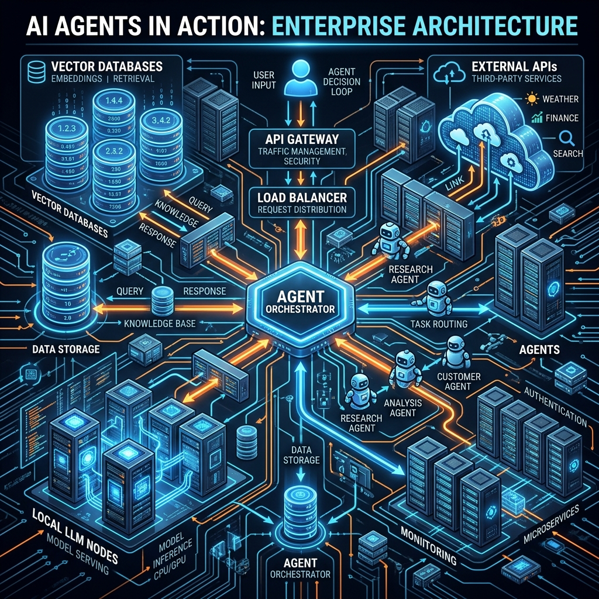
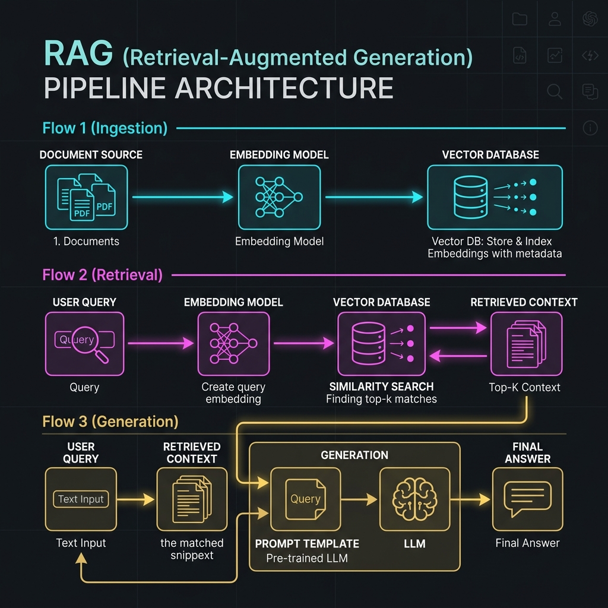

# 16: AI Agents in Action: RAG & Enterprise Architecture

<p align="center">
  
</p>

## 🎯 The Big Goal

> **After this chapter, you will understand how AI agents hold long-term memory. You will master the RAG (Retrieval-Augmented Generation) pipeline, understand Vector Embeddings, and deploy a fully functional local Agent communicating with a ChromaDB Vector Database.**

Large Language Models (LLMs) suffer from severe limitations in enterprise environments:
1.  **Hallucinations:** They make things up if they don't know the answer.
2.  **Cut-off Dates:** GPT-4 knows nothing about an internal company email sent yesterday.
3.  **Context Window Limitations:** You cannot paste a 5,000-page medical textbook into the prompt.

**RAG (Retrieval-Augmented Generation)** solves all three problems instantly.

---

## 1. The RAG Pipeline Architecture

RAG does not train or fine-tune the LLM. Fine-tuning a model to "memorize" facts is mathematically unstable and expensive. Instead, RAG gives the LLM a highly intelligent "search engine" to look up facts in real-time before it answers.

<p align="center">
  
</p>

### The 3 Core Stages of RAG

1.  **Ingestion & Embedding (Offline):** 
    Your systems take thousands of raw company PDFs. They "chunk" them into short paragraphs. An **Embedding Model** converts each paragraph into a dense mathematical array of numbers (e.g., a 1536-dimensional vector). These vectors are stored in a specialized **Vector Database**. 
2.  **Retrieval (Real-time):**
    A user asks a question. The system instantly embeds the user's question into the exact same mathematical vector space. The Vector DB performs a **Similarity Search** (using Cosine Similarity) to find the 3 paragraphs that are mathematically closest in meaning to the question.
3.  **Generation (Real-time):**
    The system takes the user's original query, injects the 3 retrieved paragraphs into the prompt as "Context", and sends it to the LLM. The LLM simply reads the provided context and answers the question accurately without hallucinating.

---

## 2. Vectors and Semantic Meaning

Why use vectors instead of a standard SQL database `WHERE text LIKE '%search%'`?

Because SQL requires exact keyword matches. If a user searches for "puppy", a SQL database will completely ignore a document that says "baby dog" or "juvenile canine".

**Vector Embeddings capture semantic meaning.** An embedding model maps concepts into a multi-dimensional space, placing "puppy" mathematically right next to "dog" and "canine". Therefore, the Vector Database retrieves the correct document even if the exact keyword was never used.

---

## 🐳 Dockerized Application: RAG Pipeline with ChromaDB

We will spin up an isolated memory store. We use a mock LLM logic in Python communicating with an in-memory Vector Database (`chromadb`).

### `docker-compose.yml`
```yaml
version: '3.8'
services:
  rag_agent:
    build: .
    container_name: rag_pipeline_agent
```

### `Dockerfile`
```dockerfile
FROM python:3.10-slim
WORKDIR /app
# Install ChromaDB for local vector storage
RUN pip install chromadb
COPY app.py .
CMD ["python", "app.py"]
```

### `app.py`
```python
import chromadb
import time

class VectorMemory:
    def __init__(self):
        # Create an in-memory ChromaDB instance
        self.client = chromadb.Client()
        self.collection = self.client.create_collection("enterprise_knowledge")
        
    def ingest_documents(self):
        print("📥 [Ingestion] Chunking documents and saving to Vector DB...")
        # In a real system, you use an Embedding Model here. 
        # ChromaDB automatically handles the embedding for us using a default model.
        self.collection.add(
            documents=[
                "The secret launch code for Project Alpha is 7392-Omega.",
                "Employee lunch hour has been moved to 1:00 PM.",
                "The company's primary competitor is Globex Corporation."
            ],
            ids=["doc1", "doc2", "doc3"] # Unique document IDs
        )
        time.sleep(1)
        print("✅ [Ingestion] Complete.")

    def search(self, query, top_k=1):
        print(f"\n🔍 [Retrieval] User Query: '{query}'")
        print("   -> Executing Semantic Similarity Search in Vector DB...")
        results = self.collection.query(
            query_texts=[query],
            n_results=top_k
        )
        return results['documents'][0]

class RagAgent:
    def __init__(self, memory):
        self.memory = memory
        
    def generate_response(self, user_query):
        # 1. Retrieve Context
        retrieved_context = self.memory.search(user_query)
        
        # 2. Augment Prompt
        print(f"🧩 [Augmentation] Injecting Context into LLM Prompt.")
        prompt = f"""
        System: You are a helpful assistant. Use ONLY the provided context to answer.
        Context: {retrieved_context[0]}
        User: {user_query}
        """
        
        # 3. Generate Answer (Mock LLM Generation)
        print(f"🤖 [Generation] LLM Reading prompt and answering...")
        time.sleep(1)
        return f"[Mocked LLM Output]: Based on the secure context provided, the answer is: '{retrieved_context[0]}'"

if __name__ == "__main__":
    print("--- Starting RAG Pipeline ---")
    memory = VectorMemory()
    memory.ingest_documents()
    
    agent = RagAgent(memory)
    
    # Test our RAG Pipeline!
    final_answer = agent.generate_response("What is the secret launch code?")
    print(f"\n✅ Final Answer sent to User: {final_answer}\n")
```

To run this:
1. Save the above configuration.
2. Run `docker-compose up --build`.

---

## 🤔 Reflection Questions

1. **Why do we chunk large PDFs into smaller 500-word paragraphs before storing them in the Vector Database? Why not just convert the entire 1,000-page book into a single vector?**
<details>
<summary>💡 View Answer</summary>

Vectors represent the *average semantic meaning* of the text. If you convert a 1,000-page book into a single vector, the specific details (like a single phone number on page 402) are mathematically diluted to nothing by the rest of the book's contents. The similarity search will fail to find it. Smaller chunks preserve high-fidelity semantic meaning for specific concepts.
</details>

2. **You build a Chatbot using RAG for a hospital. A doctor asks: "What were the patient's vital signs yesterday?" The bot hallucinates. You check the logs and see the Vector DB retrieved a document about vital signs but from the WRONG patient. How do you fix this?**
<details>
<summary>💡 View Answer</summary>

Pure semantic vector search is dangerous for exact identifiers. You must use **Hybrid Search (Vector + Metadata Filtering)**. When you ingest the documents into the Vector DB, you attach metadata tags (e.g., `{"patient_id": "9942", "date": "yesterday"}`). During retrieval, you execute a strict deterministic metadata filter FIRST, and *then* run the semantic vector search only on the remaining subset of documents.
</details>

---

<div align="center">

| [<< Previous: Building Multiagent Systems](./15_Building_Multiagent_Systems.md) | [Home: Curriculum Map](./README.md) |

</div>
