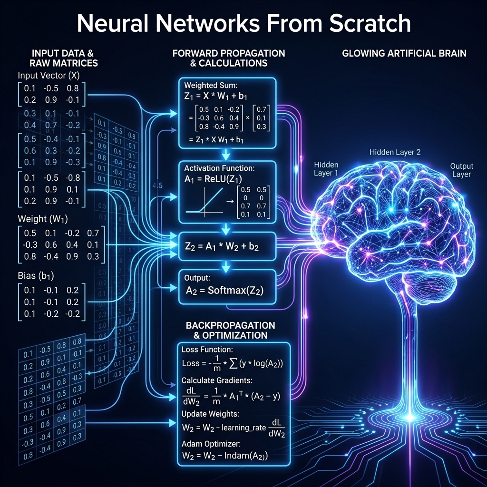
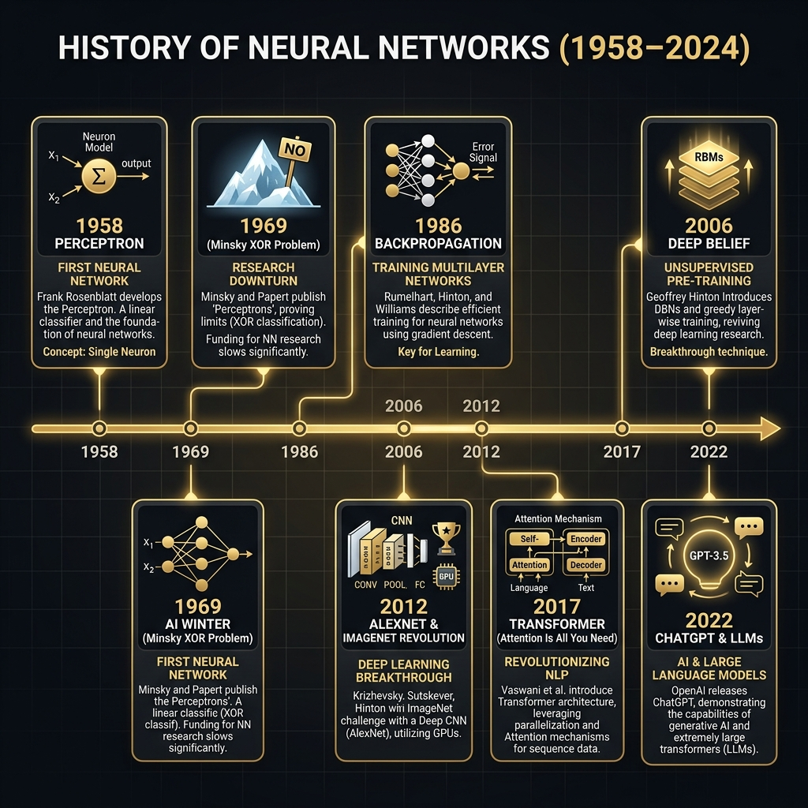
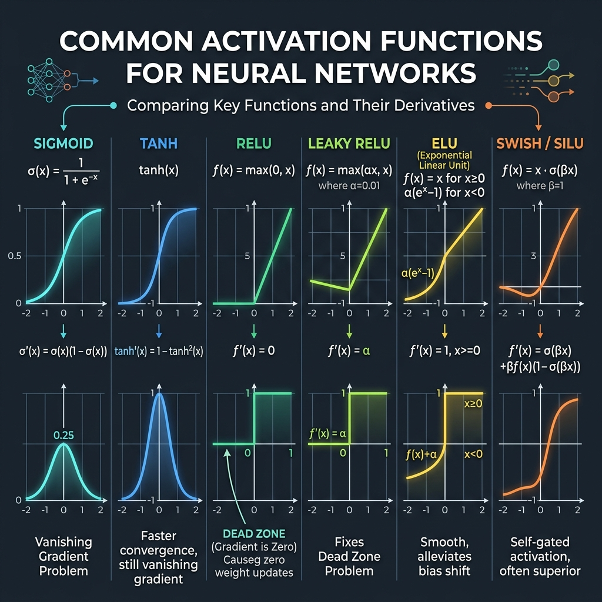
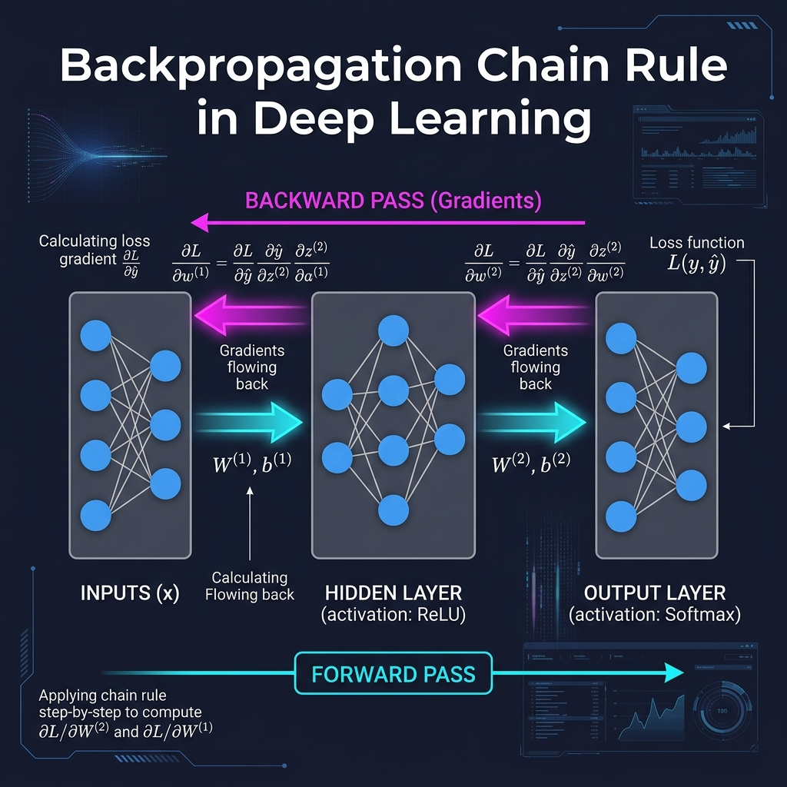
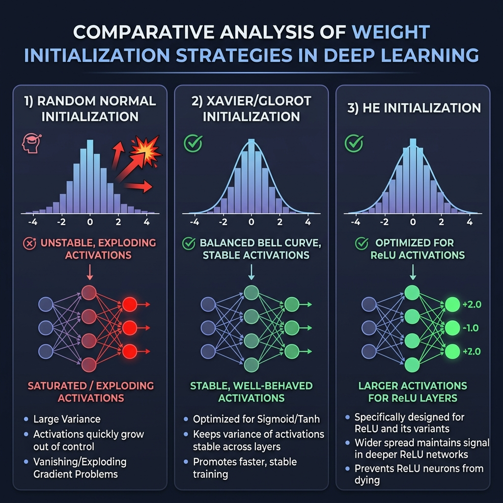
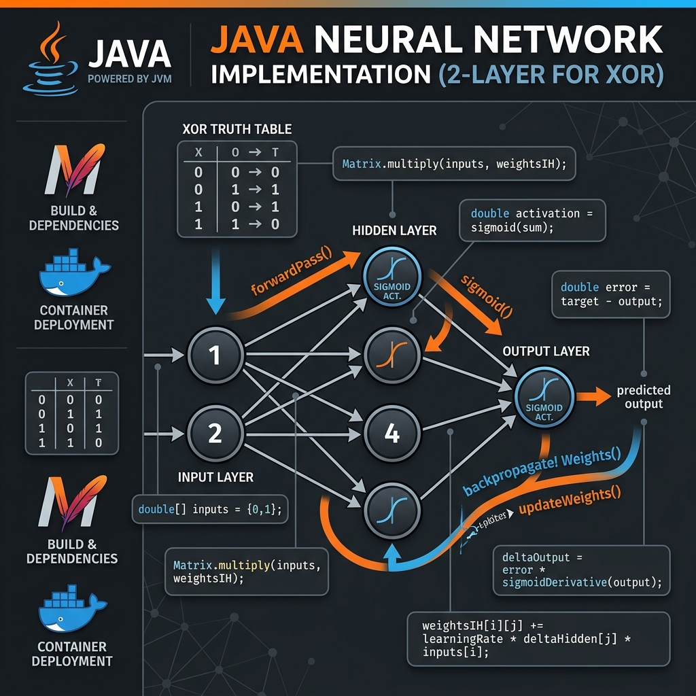
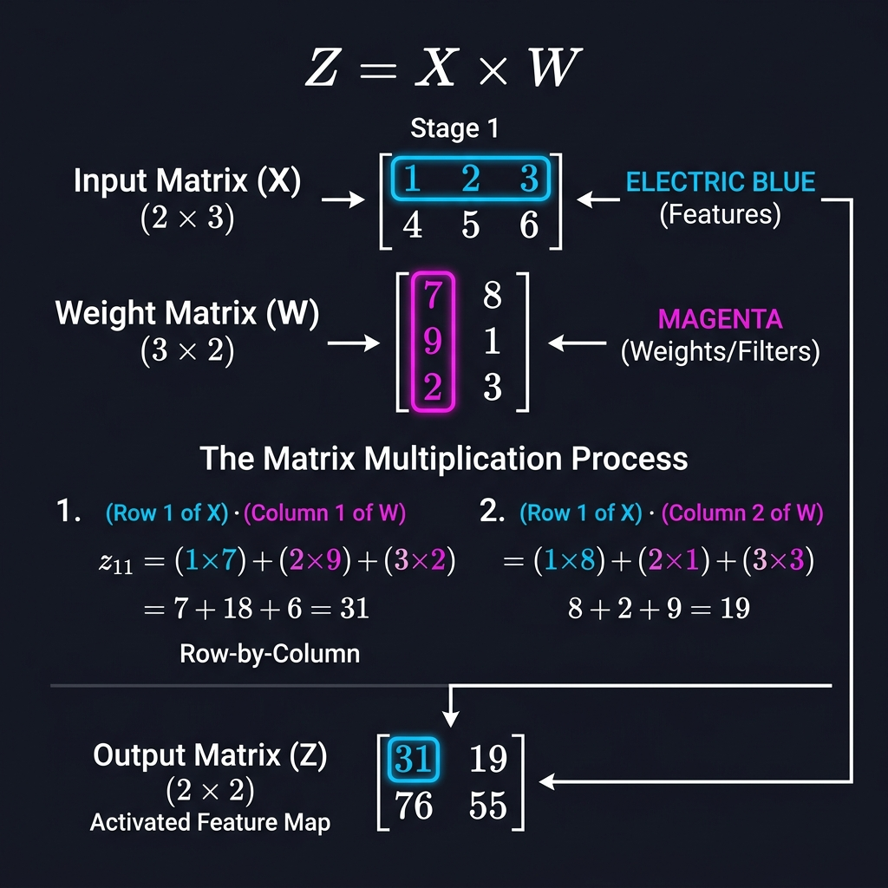

# 17: Neural Networks From Scratch

<p align="center">
  
</p>

## 🎯 The Big Goal

> **After this chapter, you will understand the raw mathematics behind deep learning. Instead of treating PyTorch and TensorFlow as magic black boxes, you will understand exactly how Forward Propagation works via matrix multiplication, and how Backpropagation calculates exact gradients using the multivariable Chain Rule of Calculus.**

In modern deep learning, a library like PyTorch handles all the math for us. But an advanced AI engineer must understand *why* the matrix math works. If you do not understand the underlying gradients, you cannot debug advanced failure modes like vanishing gradients or exploding loss landscapes.

In this chapter, we strip away all libraries. We will build a Neural Network using only raw mathematics and `numpy`.

---

## 1. A Brief History: From Perceptron to Deep Learning

Before diving into code, Tariq Rashid (*Make Your Own Neural Network*) reminds us that understanding the history of neural networks is essential for understanding why modern architectures look the way they do.

<p align="center">
  
</p>

*   **1958 — The Perceptron:** Frank Rosenblatt built the first hardware neural network. It was a single neuron that could learn to classify two categories by adjusting weights. It was a media sensation.
*   **1969 — The AI Winter:** Minsky and Papert mathematically proved that a single Perceptron cannot solve the XOR problem (a non-linearly separable function). This killed neural network funding for 15 years.
*   **1986 — Backpropagation:** Rumelhart, Hinton, and Williams published the efficient backpropagation algorithm, proving you could train multi-layer networks. This is exactly the Chain Rule math we implement in this chapter.
*   **2012 — The GPU Revolution:** Krizhevsky's AlexNet won ImageNet using a deep CNN trained on GPUs, beating all traditional methods by a massive margin. This ignited the modern deep learning era.
*   **2017 — Transformers:** Vaswani et al. published "Attention Is All You Need," replacing recurrence with self-attention and enabling the massive parallelization that powers ChatGPT and modern LLMs.

---

## 2. The Activation Function Zoo

Michael Nielsen (*Neural Networks and Deep Learning*) and Kelleher (*Deep Learning*) both emphasize that the choice of activation function profoundly impacts training dynamics. Here is the complete reference:

<p align="center">
  
</p>

| Function | Formula | Range | Derivative | Best For |
|----------|---------|-------|-----------|----------|
| **Sigmoid** | `1/(1+e^(-x))` | (0, 1) | Max 0.25 | Output probabilities |
| **Tanh** | `(e^x - e^(-x))/(e^x + e^(-x))` | (-1, 1) | Max 1.0 | Zero-centered hidden layers |
| **ReLU** | `max(0, x)` | [0, ∞) | 0 or 1 | Default for hidden layers |
| **Leaky ReLU** | `max(0.01x, x)` | (-∞, ∞) | 0.01 or 1 | Prevents dead neurons |
| **ELU** | `x if x>0, α(e^x-1) otherwise` | (-α, ∞) | Smooth | Reduces bias shift |
| **Swish/SiLU** | `x · sigmoid(x)` | (-0.28, ∞) | Smooth | State-of-the-art (EfficientNet) |

> **The Dead Neuron Problem (Nielsen):** With standard ReLU, if a neuron's weighted sum is always negative, the gradient is permanently zero and the neuron never updates again. It is "dead." Leaky ReLU solves this by allowing a small negative slope (0.01x) so the gradient is never exactly zero.

---

## 3. The Forward Pass (Inference)

A neural network is fundamentally just a sequence of matrix multiplications interwoven with non-linear activation functions.

**The core mathematical formula for a single layer:**
```
Z = X · W + b
A = Activation(Z)
```
*   **X:** The input matrix (e.g., pixel values of an image).
*   **W:** The Weight matrix. These are the trainable parameters.
*   **b:** The Bias vector. It allows the activation function to shift left or right.
*   **Z:** The linear weighted sum.
*   **A:** The activated output (e.g., passing `Z` through a ReLU or Sigmoid function to introduce non-linearity).

In a deep network, the output `A` of Layer 1 simply becomes the input `X` for Layer 2.

---

## 2. The Backward Pass (Backpropagation)

Forward propagation is easy; it's just multiplying numbers. **Backpropagation** is the genius algorithm that makes learning possible.

How do we adjust a million weights so that the final prediction gets closer to the correct answer? We need to calculate the gradient (the partial derivative) of the Loss/Error with respect to every single weight in the network.

<p align="center">
  
</p>

### The Chain Rule
To find out how much a weight in Layer 1 `W(1)` contributed to the final Error `E`, we must chain together partial derivatives backward through the network.

```math
∂E / ∂W(1) = (∂E / ∂A(2)) * (∂A(2) / ∂Z(2)) * (∂Z(2) / ∂A(1)) * (∂A(1) / ∂Z(1)) * (∂Z(1) / ∂W(1))
```

This looks intimidating, but programmatically, it means we calculate the error at the end, and then pass it backward, multiplying it by the derivative of the activation function at each step.

---

## 3. The Universal Approximation Theorem

Before we write any code, it is important to understand *why* neural networks can learn almost anything. The **Universal Approximation Theorem** (proven by Cybenko in 1989) states that a feedforward network with a single hidden layer containing a finite number of neurons can approximate any continuous function on a compact subset of ℝⁿ, to any desired degree of accuracy.

In practical terms: if you give a neural network enough neurons and enough training data, it can theoretically learn *any* mathematical relationship. The question is never "Can a neural network learn this?" but rather "How many neurons, how much data, and how long will it take?"

---

## 4. Weight Initialization: Why Starting Conditions Matter

In the code below, we initialize weights with `np.random.uniform(-1, 1, ...)`. Martinez-Ramon emphasizes that this choice is not trivial — it is one of the most critical practical decisions in deep learning engineering.

<p align="center">
  
</p>

If all weights start at the same value (e.g., zero), every neuron in a layer computes the exact same output, receives the exact same gradient, and updates identically. The network never breaks symmetry and cannot learn anything useful. This is called the **Symmetry Breaking Problem**.

Modern frameworks solve this with mathematically calibrated initialization:

*   **Xavier/Glorot Initialization:** Draws weights from a distribution scaled by: `Var(W) = 2 / (fan_in + fan_out)`. This keeps the variance of activations stable across layers when using **Sigmoid** or **Tanh** activations. It prevents the outputs from either saturating (all near 0 or 1) or exploding.
*   **He Initialization:** Draws weights from: `Var(W) = 2 / fan_in`. Designed specifically for **ReLU** activations. Because ReLU kills half the neurons (those with negative inputs), He initialization compensates by using a wider spread to keep the surviving neurons' signal strong.

> **Practical Rule of Thumb:** Use **He initialization** with ReLU networks (the modern default). Use **Xavier** only if you are using Sigmoid or Tanh activations.

---

## 🐳 Dockerized Application: Raw Numpy Neural Network

Let's build a simple 2-layer Neural Network that learns the XOR logic gate, utilizing ONLY raw Python and NumPy. We explicitly write out the Forward pass and the Backpropagation Chain Rule.

### `docker-compose.yml`
```yaml
version: '3.8'
services:
  numpy_nn:
    build: .
    container_name: numpy_nn_scratch
```

### `Dockerfile`
```dockerfile
FROM python:3.10-slim
WORKDIR /app
RUN pip install numpy
COPY app.py .
CMD ["python", "app.py"]
```

### `app.py`
```python
import numpy as np

# 1. Activation Functions and their Derivatives
def sigmoid(x):
    return 1 / (1 + np.exp(-x))

def sigmoid_derivative(x):
    return x * (1 - x) # Assumes x is already activated

# 2. Input Data (XOR Gate)
# Inputs: (0,0), (0,1), (1,0), (1,1)
X = np.array([[0,0], [0,1], [1,0], [1,1]])
# Expected Outputs: 0, 1, 1, 0
y = np.array([[0], [1], [1], [0]])

# 3. Initialize Weights and Biases randomly
np.random.seed(42)
input_neurons = 2
hidden_neurons = 4
output_neurons = 1

# Weights Layer 1 (Input -> Hidden) [2x4]
W1 = np.random.uniform(-1, 1, (input_neurons, hidden_neurons))
b1 = np.random.uniform(-1, 1, (1, hidden_neurons))

# Weights Layer 2 (Hidden -> Output) [4x1]
W2 = np.random.uniform(-1, 1, (hidden_neurons, output_neurons))
b2 = np.random.uniform(-1, 1, (1, output_neurons))

learning_rate = 0.5
epochs = 10000

print("🧠 Commencing Training from Scratch...")

for epoch in range(epochs):
    # --- FORWARD PASS ---
    # Layer 1
    Z1 = np.dot(X, W1) + b1
    A1 = sigmoid(Z1)
    
    # Layer 2 (Output)
    Z2 = np.dot(A1, W2) + b2
    A2 = sigmoid(Z2)
    
    # Calculate Loss (Mean Squared Error)
    error = y - A2
    if epoch % 2000 == 0:
        print(f"Epoch {epoch} | Current Loss: {np.mean(np.abs(error)):.4f}")

    # --- BACKWARD PASS (THE CHAIN RULE) ---
    # Step 1: Derivative of Loss w.r.t Output (A2)
    dZ2 = error * sigmoid_derivative(A2)
    
    # Step 2: Gradients for Layer 2 weights
    dW2 = np.dot(A1.T, dZ2)
    db2 = np.sum(dZ2, axis=0, keepdims=True)
    
    # Step 3: Pass error back to Hidden Layer
    hidden_error = np.dot(dZ2, W2.T)
    dZ1 = hidden_error * sigmoid_derivative(A1)
    
    # Step 4: Gradients for Layer 1 weights
    dW1 = np.dot(X.T, dZ1)
    db1 = np.sum(dZ1, axis=0, keepdims=True)
    
    # --- OPTIMIZATION (Gradient Descent Update) ---
    W2 += dW2 * learning_rate
    b2 += db2 * learning_rate
    W1 += dW1 * learning_rate
    b1 += db1 * learning_rate

print("\n✅ Training Complete. Final Predictions:")
print(A2)
print("Notice how the network correctly predicts roughly ~0, ~1, ~1, ~0!")
```

To run this:
1. Save the above files.
2. Run `docker-compose up --build`.

---

## 🐳 Dockerized Application: Java Neural Network (Maven)

The neural network math above is entirely language-agnostic. To prove it, let's implement the **exact same XOR network** in pure Java — no ML libraries, just raw matrix math. This demonstrates that the concepts you learned in the Python version translate directly to the JVM ecosystem.

<p align="center">
  
</p>

### Project Structure
```
java-neural-network/
├── docker-compose.yml
├── Dockerfile
├── pom.xml
└── src/
    └── main/
        └── java/
            └── com/
                └── neuralnet/
                    ├── NeuralNetwork.java
                    └── App.java
```

### `docker-compose.yml`
```yaml
version: '3.8'
services:
  java_nn:
    build: .
    container_name: java_neural_network
```

### `Dockerfile`
```dockerfile
# Stage 1: Build with Maven
FROM maven:3.9-eclipse-temurin-21 AS build
WORKDIR /app
COPY pom.xml .
COPY src ./src
RUN mvn clean package -q

# Stage 2: Run with lightweight JRE
FROM eclipse-temurin:21-jre-alpine
WORKDIR /app
COPY --from=build /app/target/neural-network-1.0.jar app.jar
CMD ["java", "-jar", "app.jar"]
```

### `pom.xml`
```xml
<?xml version="1.0" encoding="UTF-8"?>
<project xmlns="http://maven.apache.org/POM/4.0.0"
         xmlns:xsi="http://www.w3.org/2001/XMLSchema-instance"
         xsi:schemaLocation="http://maven.apache.org/POM/4.0.0
         http://maven.apache.org/xsd/maven-4.0.0.xsd">
    <modelVersion>4.0.0</modelVersion>

    <groupId>com.neuralnet</groupId>
    <artifactId>neural-network</artifactId>
    <version>1.0</version>
    <packaging>jar</packaging>

    <properties>
        <maven.compiler.source>21</maven.compiler.source>
        <maven.compiler.target>21</maven.compiler.target>
        <project.build.sourceEncoding>UTF-8</project.build.sourceEncoding>
    </properties>

    <build>
        <plugins>
            <plugin>
                <groupId>org.apache.maven.plugins</groupId>
                <artifactId>maven-jar-plugin</artifactId>
                <version>3.3.0</version>
                <configuration>
                    <archive>
                        <manifest>
                            <mainClass>com.neuralnet.App</mainClass>
                        </manifest>
                    </archive>
                </configuration>
            </plugin>
        </plugins>
    </build>
</project>
```

### `src/main/java/com/neuralnet/NeuralNetwork.java`
```java
package com.neuralnet;

import java.util.Random;

/**
 * A 2-layer Neural Network built from scratch in pure Java.
 * No ML libraries — just raw matrix math identical to the NumPy version above.
 *
 * Architecture: [2 inputs] -> [4 hidden neurons] -> [1 output]
 * Activation: Sigmoid
 * Task: Learn the XOR logic gate
 */
public class NeuralNetwork {

    private final double[][] weightsIH;  // Input -> Hidden [2x4]
    private final double[] biasH;        // Hidden biases [4]
    private final double[][] weightsHO;  // Hidden -> Output [4x1]
    private final double[] biasO;        // Output biases [1]
    private final double learningRate;

    // Cached activations for backpropagation
    private double[] hiddenActivations;
    private double[] outputActivations;

    public NeuralNetwork(double learningRate) {
        this.learningRate = learningRate;
        Random rng = new Random(42);

        // Initialize weights randomly between -1 and 1 (same as NumPy version)
        weightsIH = new double[2][4];
        biasH = new double[4];
        weightsHO = new double[4][1];
        biasO = new double[1];

        for (int i = 0; i < 2; i++)
            for (int j = 0; j < 4; j++)
                weightsIH[i][j] = rng.nextDouble() * 2 - 1;

        for (int j = 0; j < 4; j++)
            biasH[j] = rng.nextDouble() * 2 - 1;

        for (int i = 0; i < 4; i++)
            weightsHO[i][0] = rng.nextDouble() * 2 - 1;

        biasO[0] = rng.nextDouble() * 2 - 1;
    }

    // --- Activation Function ---
    private double sigmoid(double x) {
        return 1.0 / (1.0 + Math.exp(-x));
    }

    private double sigmoidDerivative(double activated) {
        return activated * (1.0 - activated);  // Assumes input is already activated
    }

    // --- Forward Pass: Z = X · W + b, A = sigmoid(Z) ---
    public double[] forwardPass(double[] inputs) {
        // Layer 1: Input -> Hidden
        hiddenActivations = new double[4];
        for (int j = 0; j < 4; j++) {
            double sum = biasH[j];
            for (int i = 0; i < inputs.length; i++) {
                sum += inputs[i] * weightsIH[i][j];  // This IS np.dot(X, W1)
            }
            hiddenActivations[j] = sigmoid(sum);
        }

        // Layer 2: Hidden -> Output
        outputActivations = new double[1];
        double sum = biasO[0];
        for (int i = 0; i < 4; i++) {
            sum += hiddenActivations[i] * weightsHO[i][0];  // np.dot(A1, W2)
        }
        outputActivations[0] = sigmoid(sum);

        return outputActivations;
    }

    // --- Backward Pass: The Chain Rule (identical math to NumPy version) ---
    public void backpropagate(double[] inputs, double[] targets) {
        // Step 1: Output error gradient
        // dZ2 = error * sigmoid_derivative(A2)
        double outputError = targets[0] - outputActivations[0];
        double deltaOutput = outputError * sigmoidDerivative(outputActivations[0]);

        // Step 2: Hidden layer error gradient
        // hidden_error = np.dot(dZ2, W2.T)
        double[] deltaHidden = new double[4];
        for (int i = 0; i < 4; i++) {
            double hiddenError = deltaOutput * weightsHO[i][0];
            deltaHidden[i] = hiddenError * sigmoidDerivative(hiddenActivations[i]);
        }

        // Step 3: Update Hidden->Output weights
        // W2 += np.dot(A1.T, dZ2) * learning_rate
        for (int i = 0; i < 4; i++) {
            weightsHO[i][0] += learningRate * deltaOutput * hiddenActivations[i];
        }
        biasO[0] += learningRate * deltaOutput;

        // Step 4: Update Input->Hidden weights
        // W1 += np.dot(X.T, dZ1) * learning_rate
        for (int i = 0; i < inputs.length; i++) {
            for (int j = 0; j < 4; j++) {
                weightsIH[i][j] += learningRate * deltaHidden[j] * inputs[i];
            }
        }
        for (int j = 0; j < 4; j++) {
            biasH[j] += learningRate * deltaHidden[j];
        }
    }
}
```

### `src/main/java/com/neuralnet/App.java`
```java
package com.neuralnet;

public class App {

    public static void main(String[] args) {
        System.out.println("\uD83E\uDDE0 Java Neural Network — Learning XOR from Scratch");
        System.out.println("============================================");

        // XOR Training Data (same as the NumPy version)
        double[][] inputs = {
            {0, 0},
            {0, 1},
            {1, 0},
            {1, 1}
        };
        double[][] targets = {
            {0},
            {1},
            {1},
            {0}
        };

        NeuralNetwork nn = new NeuralNetwork(0.5);
        int epochs = 10000;

        System.out.println("\n\uD83D\uDD25 Commencing Training Loop...");
        long startTime = System.currentTimeMillis();

        for (int epoch = 0; epoch < epochs; epoch++) {
            double totalError = 0;

            for (int sample = 0; sample < inputs.length; sample++) {
                // Forward Pass
                double[] output = nn.forwardPass(inputs[sample]);

                // Calculate error for logging
                totalError += Math.abs(targets[sample][0] - output[0]);

                // Backward Pass + Weight Update
                nn.backpropagate(inputs[sample], targets[sample]);
            }

            if (epoch % 2000 == 0) {
                System.out.printf("Epoch %5d | Mean Absolute Error: %.4f%n",
                    epoch, totalError / inputs.length);
            }
        }

        long elapsed = System.currentTimeMillis() - startTime;
        System.out.printf("%n\u2705 Training Complete in %d ms.%n", elapsed);

        // Final Predictions
        System.out.println("\n\uD83C\uDFAF Final Predictions:");
        System.out.println("----------------------------");
        for (int i = 0; i < inputs.length; i++) {
            double[] prediction = nn.forwardPass(inputs[i]);
            System.out.printf("  Input: [%.0f, %.0f] -> Predicted: %.4f | Expected: %.0f%n",
                inputs[i][0], inputs[i][1], prediction[0], targets[i][0]);
        }
        System.out.println("----------------------------");
        System.out.println("Notice how the network correctly predicts ~0, ~1, ~1, ~0!");
    }
}
```

To run this:
1. Create the project structure as shown above.
2. Run `docker-compose up --build`.
3. The multi-stage Docker build compiles with Maven and runs with a minimal JRE Alpine image (~200MB instead of ~800MB).

> **Java vs Python comparison:** The Java version performs the **exact same mathematics** (matrix multiply, sigmoid, chain rule backpropagation). The key differences are syntactic: Python's `np.dot(X, W1)` becomes explicit nested `for` loops in Java, and NumPy broadcasting becomes manual array indexing. The underlying linear algebra is identical.

---

## 3. Theoretical Deep Dive: Maximum Likelihood Estimation

In basic tutorials, the Loss Function is often glossed over as a simple "error calculation" (like Mean Squared Error). However, modern deep learning (as formulated by Ian Goodfellow and Yoshua Bengio) roots neural networks strictly in **Information Theory** and **Probability**.

Training a neural network is mathematically identical to **Maximum Likelihood Estimation (MLE)**. 
We are not just "lowering an error score." We are asking the math: *"Given this dataset, what is the most highly probable configuration of weights (`W`) that would likely produce these outputs?"*

### Cross-Entropy vs. MSE
When doing classification, we do not use Mean Squared Error (MSE). We use **Cross-Entropy**. Why?
Because MSE assumes the outputs follow a Gaussian (Normal) distribution. Classification outputs (like probability % of a dog vs cat) follow a Bernoulli or Multinoulli distribution.

Cross-Entropy measures the distance between two probability distributions (the model's prediction vs the true label) using **Kullback-Leibler (KL) Divergence**. 
Crucially, minimizing Cross-Entropy ensures that if the model is confidently wrong (e.g., predicting 99% Dog when it's a Cat), the error gradient penalizes the network logarithmically, delivering a massive gradient update to fix the weights. MSE would produce a very flat gradient in this situation, causing learning to stall.

---

## 4. Step-by-Step Code Breakdown: The NumPy Calculus

Let's break down exactly what the Python code above is doing, using a simple visual analogy.

<p align="center">
  
</p>

1. **The Forward Pass (`Z1 = np.dot(X, W1) + b1`)**
   * **Analogy:** Imagine grading a multiple-choice test. `X` is the student's answers (0s and 1s). `W1` is the Answer Key.
   * **Technical Detail:** `np.dot` physically multiplies the rows of `X` against the columns of `W1`. If `X` has shape `[4, 2]` (4 rows of data, 2 features) and `W1` has shape `[2, 4]`, the output `Z1` becomes `[4, 4]`. The inner dimensions completely collapse mathematically to produce our weighted sum.

2. **The Chain Rule Backward (`dW2 = np.dot(A1.T, dZ2)`)**
   * **Analogy:** After grading the test, we find the student failed (`error = y - A2`). We need to figure out *which specific question* confused them the most so we can fix the teacher's lesson.
   * **Technical Detail:** We transpose the Activation matrix (`A1.T`) to flip its dimensions so they mathematically align with our error gradient dimensions (`dZ2`). By multiplying them, we calculate exactly how much *every single weight* inside `W2` was responsible for the final error.

3. **Optimization Step (`W2 += dW2 * learning_rate`)**
   * **Analogy:** We rewrite the teacher's lesson slightly (`learning_rate = 0.5`) so the student doesn't get whiplash by learning too much at once.
   * **Technical Detail:** We simply add the calculated gradients (`dW2`) to our original weights (`W2`), adjusting them infinitesimally in the correct direction.

---

## 🤔 Reflection Questions

1. **Why do we need an Activation Function like Sigmoid or ReLU? Why not just chain together matrix multiplications?**
<details>
<summary>💡 View Answer</summary>

Matrix multiplication is a completely linear operation. If you multiply an input matrix by 50 weight matrices in a row, the mathematics simplifies entirely into just a single equivalent matrix multiplication. Without a non-linear activation function, a 100-layer deep neural network is mathematically identical to a 1-layer neural network. Non-linearities (like ReLU) allow the network to learn complex, non-linear boundaries.
</details>

2. **In the backpropagation code above, we transpose matrices using `.T` (e.g., `np.dot(A1.T, dZ2)`). Why is this transposition mathematically necessary?**
<details>
<summary>💡 View Answer</summary>

Matrix algebra requires inner dimensions to match (e.g., you can multiply a 2x4 matrix by a 4x1 matrix). During the forward pass, we multiply `[Samples x Features] * [Features x HiddenNodes]`. During the backward pass, we are propagating gradients from the output backwards. To align the dimensions of the error gradient `dZ` with the activations `A` to correctly calculate the Weight gradients `dW`, we absolutely must transpose the activation matrix so the dimensions align mathematically.
</details>

---

<div align="center">

| [<< Previous: AI Agents in Action](../16_AI_Agents_in_Action.md) | [Home: Curriculum Map](./README.md) | [Next: Theoretical DL Foundations >>](./18_Theoretical_Foundations_of_Deep_Learning.md) |

</div>
