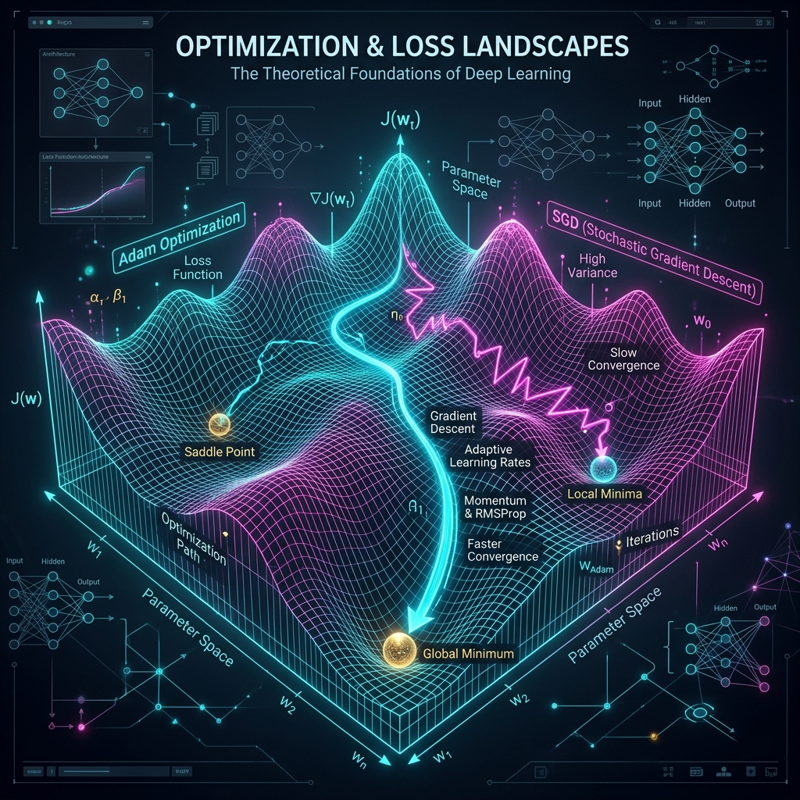
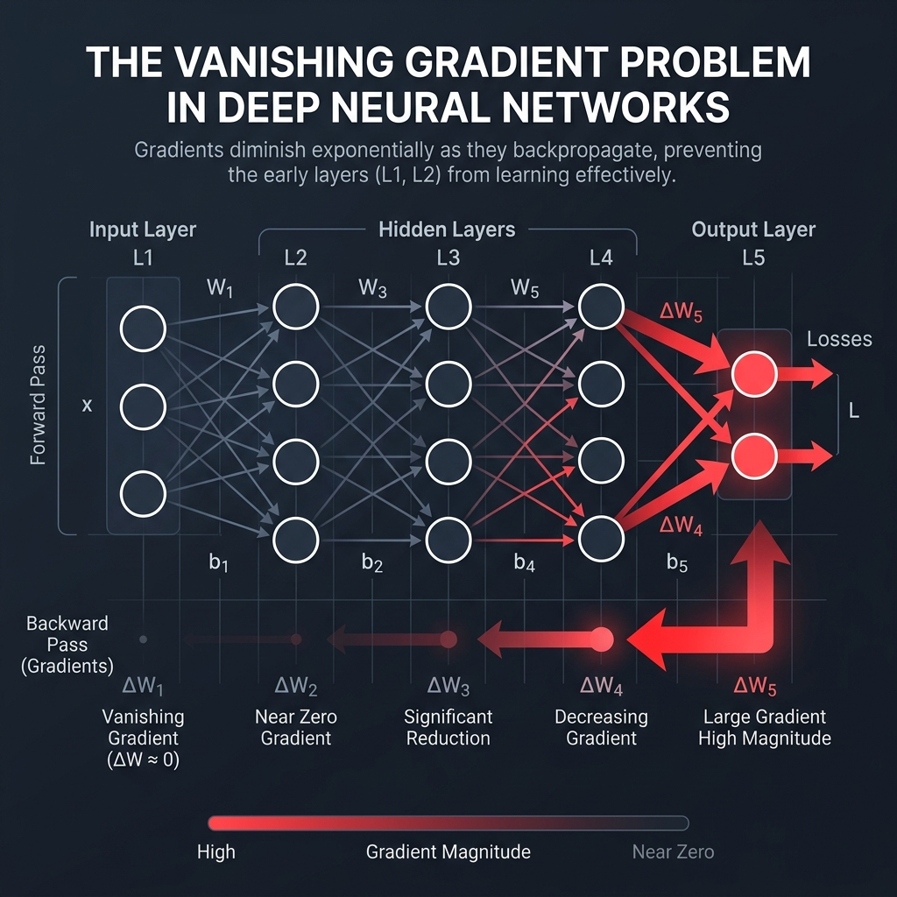
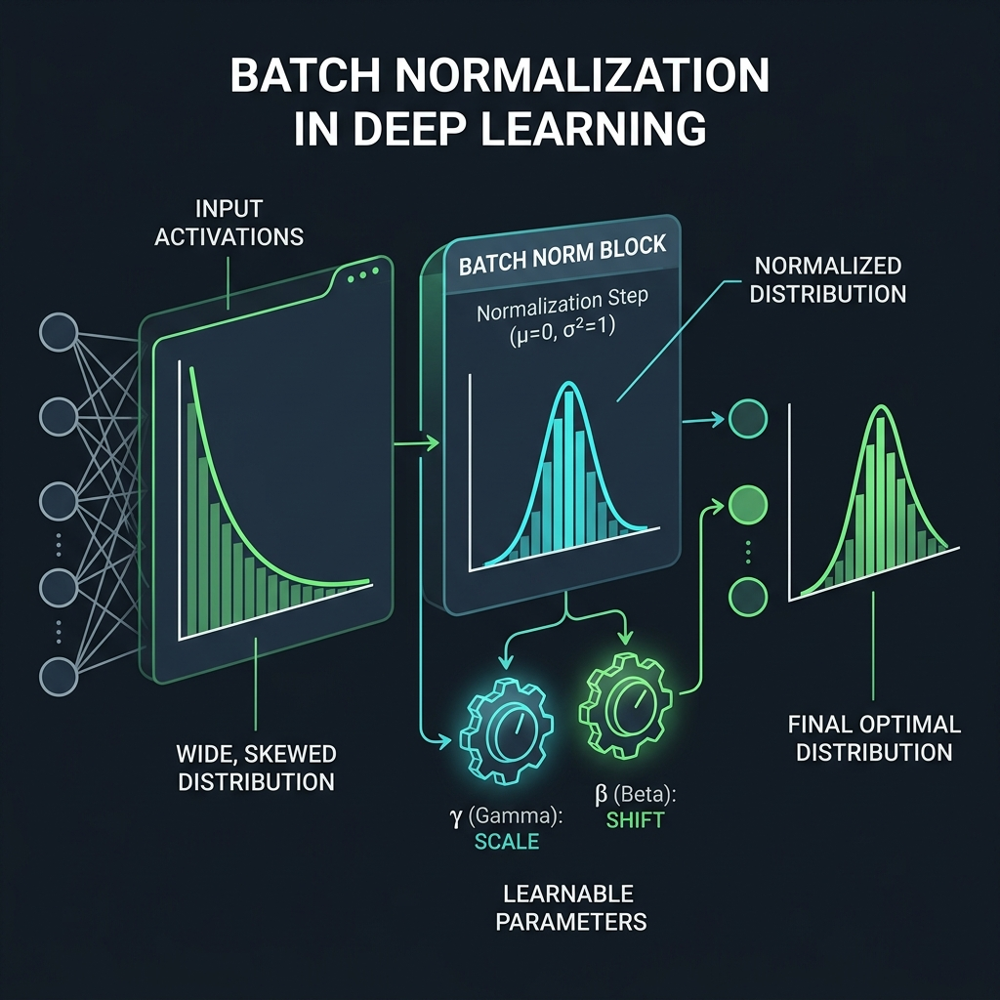
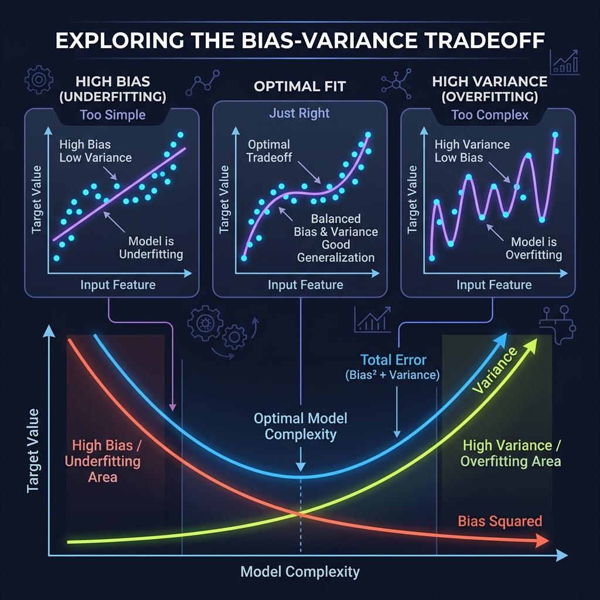
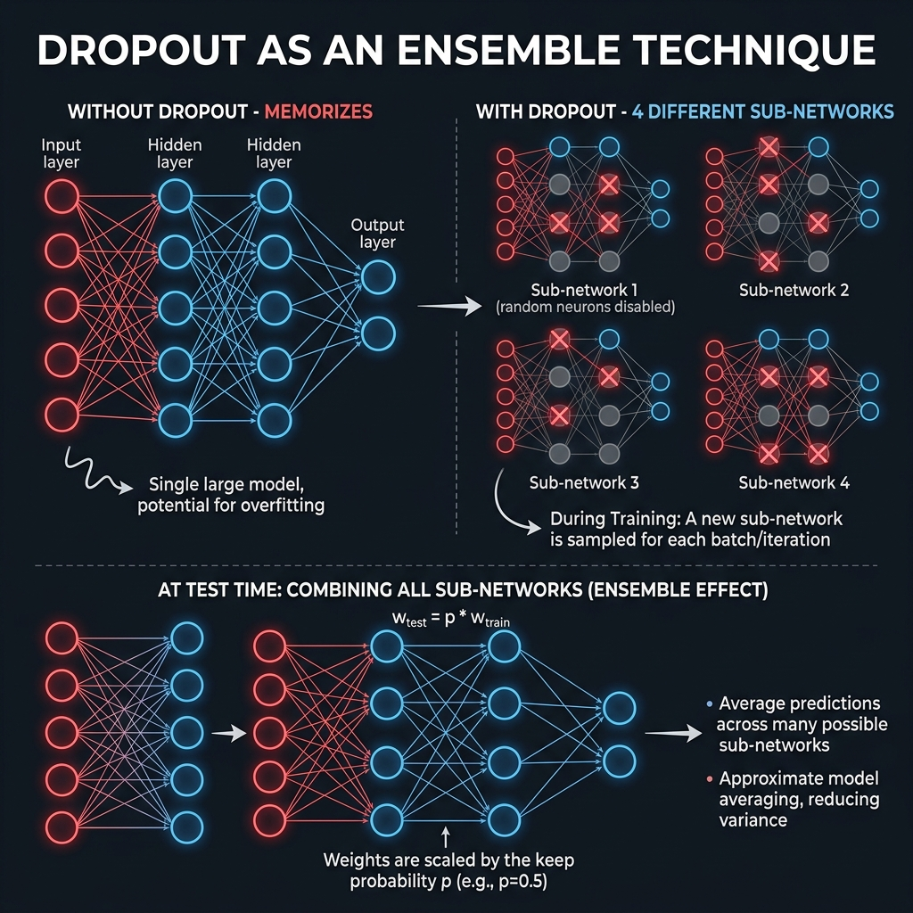
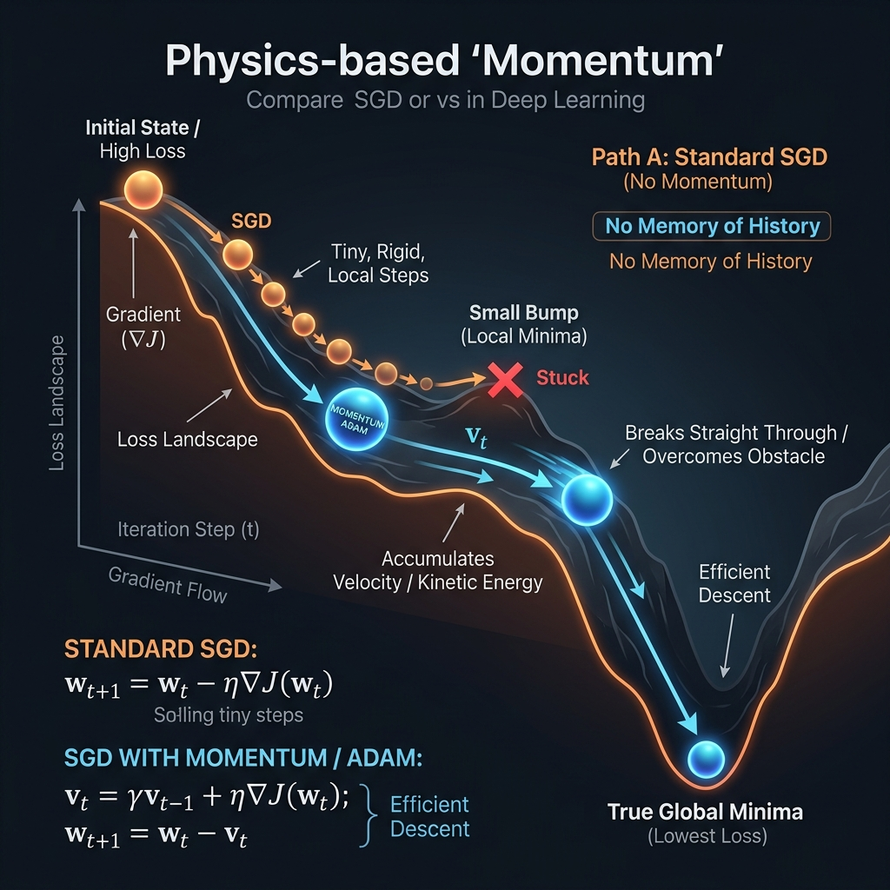

# 18: Theoretical Foundations of Deep Learning

<p align="center">
  
</p>

## 🎯 The Big Goal

> **After this chapter, you will move past basic tutorials and understand the true theoretical bottlenecks of Deep Learning. You will master the physics of the Loss Landscape, understand why standard Gradient Descent fails, learn the mathematics behind Adam Optimization, and defeat the Vanishing Gradient problem.**

Training a neural network is an exercise in high-dimensional topology. Every weight in a network adds a dimension to the "Loss Landscape." A simple network with 1,000 weights has a 1,000-dimensional landscape. 

The goal of Deep Learning is to drop an algorithm into this massive landscape and ask it to walk downhill blindly until it reaches the absolute bottom (the Global Minimum).

---

## 1. Advanced Optimization Algorithms

In Chapter 17, we used **Stochastic Gradient Descent (SGD)**. SGD calculates the slope and takes a step downhill. However, in a complex landscape, SGD is famously terrible at navigating **Saddle Points** and narrow ravines. It will zig-zag aggressively and learn incredibly slowly.

Modern networks use advanced geometric and temporal physics to solve this.

### Momentum
Instead of treating each step independently, what if we treat our algorithm like a heavy ball rolling down a hill? When a ball rolls down a steep hill, it builds up *momentum*. If it hits a tiny bump, it blasts right through it instead of getting stuck.
*   **Math Concept:** We calculate a moving average of past gradients and add a fraction of it to the current update vector.

### RMSProp (Root Mean Square Propagation)
What if the landscape is very steep in Dimension X, but very flat in Dimension Y? SGD will explode horizontally while barely moving vertically. 
*   **Math Concept:** RMSProp adapts the learning rate for *each individual weight*. If a weight has historically huge gradients, it suppresses the learning rate to stop it from exploding. If a weight has tiny gradients, it boosts it so it can learn faster.

### Adam (Adaptive Moment Estimation)
Adam is the undisputed king of modern optimization. It takes the best of both worlds. It combines **Momentum** (Directional acceleration) with **RMSProp** (Adaptive per-weight scaling). It is the default optimizer for almost all modern LLMs.

---

## 2. The Vanishing Gradient Problem

Why couldn't computer scientists train 100-layer neural networks in the 1990s? The mathematics of Backpropagation broke down in deep architectures. This is the **Vanishing Gradient Problem**.

<p align="center">
  
</p>

As we saw in Chapter 17, the Chain Rule multiplies derivatives together as it moves backward. 
Historically, networks used the **Sigmoid** activation function. The mathematical derivative of Sigmoid ranges only from `0` to `0.25`.

If you have a 5-layer network, passing the error backward through 5 layers requires multiplying it by 5 sigmoid derivatives.
`Error * 0.25 * 0.25 * 0.25 * 0.25 * 0.25 = Error * 0.0009`

By the time the error signal reaches the very first layer, the gradient is `0.0009`. The first layer's weights do not update. The network physically cannot learn.

### The Solution: ReLU and ResNets
*   **ReLU (Rectified Linear Unit):** The derivative of ReLU is `1.0` if `x > 0`. Because multiplying by `1.0` doesn't shrink the number, gradients can flow unimpeded through hundreds of layers without vanishing!
*   **ResNets (Residual Connections):** Creating physical "skip connections" that allow the gradient to bypass the activation functions entirely, creating a highway for error signals to reach layer 1 intact.

---

## 3. Batch Normalization: Taming Internal Distributions

Martinez-Ramon identifies **Internal Covariate Shift** as one of the most insidious practical problems in deep network training. As the network trains, the distribution of inputs to each layer changes constantly because the previous layer's weights are constantly updating. This forces each layer to continuously re-adapt to a moving target.

<p align="center">
  
</p>

**Batch Normalization** (Ioffe & Szegedy, 2015) solves this by inserting a normalization step between each layer:

1.  **Normalize:** For each mini-batch, compute the mean and variance of the activations. Normalize them to mean=0, variance=1.
2.  **Scale and Shift:** Introduce two *learnable* parameters (γ and β) that allow the network to undo the normalization if it wants to. This ensures BatchNorm never reduces the network's representational power.

**Practical Benefits:**
*   Allows much higher learning rates (training is 5-10x faster)
*   Acts as a mild regularizer (reducing the need for Dropout)
*   Significantly reduces sensitivity to weight initialization
*   Prevents activations from saturating in Sigmoid/Tanh networks

> **Production Rule:** In modern practice, Batch Normalization layers are inserted after every linear/convolutional layer and *before* the activation function. This is the default in most production architectures (ResNet, EfficientNet, etc.).

---

## 4. Learning Rate Scheduling

The learning rate is arguably the single most important hyperparameter in deep learning. Martinez-Ramon emphasizes that a fixed learning rate throughout training is almost never optimal.

*   **Too high:** The optimizer will overshoot minima, oscillating wildly and potentially diverging to NaN.
*   **Too low:** The optimizer will converge painfully slowly and get trapped in shallow local minima.

Modern practice uses **Learning Rate Schedules** that adapt the rate during training:

*   **Step Decay:** Reduce the learning rate by a factor (e.g., ×0.1) every N epochs. Simple and effective.
*   **Cosine Annealing:** Smoothly decreases the learning rate following a cosine curve, potentially with warm restarts.
*   **1cycle Policy:** Rapidly increases the learning rate to a maximum, then slowly decreases it. Discovered by Leslie Smith, this counter-intuitive approach often finds better minima and converges faster.

---

## 🐳 Dockerized Application: Visualizing Optimizers

Let's use `matplotlib` to visualize the difference between SGD and Adam. We will mathematically define a massive "Saddle Point" and watch how SGD gets stuck while Adam accelerates past it.

### `docker-compose.yml`
```yaml
version: '3.8'
services:
  optimizer_viz:
    build: .
    container_name: optimizer_visualization
    volumes:
      - .:/app # Maps local directory so the output image saves to your host machine
```

### `Dockerfile`
```dockerfile
FROM python:3.10-slim
WORKDIR /app
RUN pip install numpy matplotlib
COPY app.py .
CMD ["python", "app.py"]
```

### `app.py`
```python
import numpy as np
import matplotlib.pyplot as plt

# Define a mathematical "Saddle Point" landscape: z = x^2 - y^2
def saddle_function(x, y):
    return x**2 - y**2

def gradients(x, y):
    return 2*x, -2*y

def run_optimizer(start_pos, optimizer_type, iterations=100, lr=0.1):
    path = [start_pos]
    x, y = start_pos
    
    # Adam variables
    m_x, m_y = 0, 0
    v_x, v_y = 0, 0
    beta1, beta2, epsilon = 0.9, 0.999, 1e-8
    
    for t in range(1, iterations + 1):
        grad_x, grad_y = gradients(x, y)
        
        if optimizer_type == 'SGD':
            x = x - lr * grad_x
            y = y - lr * grad_y
            
        elif optimizer_type == 'Adam':
            # Momentum calculation
            m_x = beta1 * m_x + (1 - beta1) * grad_x
            m_y = beta1 * m_y + (1 - beta1) * grad_y
            
            # RMSProp scaling calculation
            v_x = beta2 * v_x + (1 - beta2) * (grad_x ** 2)
            v_y = beta2 * v_y + (1 - beta2) * (grad_y ** 2)
            
            # Bias correction
            m_hat_x = m_x / (1 - beta1**t)
            m_hat_y = m_y / (1 - beta1**t)
            v_hat_x = v_x / (1 - beta2**t)
            v_hat_y = v_y / (1 - beta2**t)
            
            x = x - lr * m_hat_x / (np.sqrt(v_hat_x) + epsilon)
            y = y - lr * m_hat_y / (np.sqrt(v_hat_y) + epsilon)
            
        path.append((x, y))
    return np.array(path)

print("🏔️ Simulating Gradient Trajectories on a Saddle Point...")

path_sgd = run_optimizer(start_pos=(0.01, 1.0), optimizer_type='SGD', iterations=50, lr=0.1)
path_adam = run_optimizer(start_pos=(0.01, 1.0), optimizer_type='Adam', iterations=50, lr=0.1)

# Visualization
X, Y = np.meshgrid(np.linspace(-1, 1, 100), np.linspace(-1, 1.5, 100))
Z = saddle_function(X, Y)

plt.figure(figsize=(10, 8))
plt.contour(X, Y, Z, levels=30, cmap='viridis', alpha=0.6)

plt.plot(path_sgd[:, 0], path_sgd[:, 1], 'r.-', label='SGD (Stuck in ravine)')
plt.plot(path_adam[:, 0], path_adam[:, 1], 'b.-', label='Adam (Accelerating through)')

plt.title('Optimization Landscape: SGD vs Adam on a Saddle Point')
plt.xlabel('X (Dimension 1)')
plt.ylabel('Y (Dimension 2)')
plt.legend()
plt.grid(True, alpha=0.3)

plt.savefig('optimizer_comparison.png')
print("✅ Simulation complete! Output saved as 'optimizer_comparison.png'")
```

To run this:
1. Save the above files.
2. Run `docker-compose up --build`.
3. Open the `optimizer_comparison.png` file generated in your folder. You will clearly see SGD get stuck perfectly horizontally, while Adam's momentum blasts right through the saddle.

---

## 3. Theoretical Deep Dive: Regularization & Priors

A central theme in Goodfellow's *Deep Learning* is that optimizing for Training Loss alone guarantees **Overfitting**. The true goal of machine learning is generalization (performing well on unseen Test Data). We achieve this via Regularization.

Regularization is mathematically defined as any modification to the learning algorithm that is intended to reduce its generalization error, but not its training error.

### L2 Regularization (Weight Decay) vs. L1 Regularization (Sparsity)
The most common regularization is modifying the Objective Function by adding a parameter penalty: `Loss = OriginalLoss + Penalty`.

*   **L2 Regularization:** Adds the squared magnitude of the weights to the loss function. Mathematically, this corresponds to putting a **Gaussian Prior** belief on the weights, pushing them asymptotically closer to zero, but rarely exactly zero. It penalizes massive spike weights, creating smoother, more distributed feature mappings.
*   **L1 Regularization:** Adds the absolute magnitude of the weights. Mathematically, this corresponds to a **Laplace Prior**. The calculus of the absolute value function aggressively forces less important weights to become *exactly zero*. This creates **Sparsity**, essentially performing automatic feature selection and deleting irrelevant input dimensions.

### Early Stopping as Implicit Regularization
When training a very deep network, if we monitor the Validation Error, it usually drops in a U-shape, eventually rising again as the model begins severely overfitting.
Simply stopping the training when Validation Error hits its lowest point (Early Stopping) is functionally the most common regularizer in Deep Learning. Goodfellow proves mathematically that bounding the number of training iterations with Early Stopping has the exact same theoretical effect as an L2 Weight Penalty: it restricts the volume of the parameter space that the optimizer is allowed to reach.

---

## 5. The Bias-Variance Tradeoff (Kelleher)

John D. Kelleher (*Deep Learning*) provides the clearest formalization of why models fail. Every prediction error can be mathematically decomposed into three components:

<p align="center">
  
</p>

```
Total Error = Bias² + Variance + Irreducible Noise
```

*   **High Bias (Underfitting):** The model is too simple. A linear model trying to fit curved data will always miss the pattern, no matter how much data you provide. It has strong assumptions that don't match reality.
*   **High Variance (Overfitting):** The model is too complex. It fits the training data perfectly — including noise — but performs terribly on new data. Small changes in the training set cause wild changes in predictions.
*   **The Sweet Spot:** The goal is to find the model complexity where the sum of Bias² + Variance is minimized.

> **Kelleher's Practical Insight:** Deep neural networks have extremely low bias (they can fit anything) but extremely high variance (they memorize everything). This is why every regularization technique in this chapter — L1/L2, Dropout, Early Stopping, Data Augmentation — is an anti-variance weapon.

---

## 6. Dropout as Ensemble Learning (Nielsen)

Michael Nielsen (*Neural Networks and Deep Learning*) provides a beautiful theoretical interpretation of Dropout that goes far beyond "randomly turning off neurons."

<p align="center">
  
</p>

**Dropout is actually training an exponential ensemble of neural networks simultaneously.**

Consider a network with `n` neurons and Dropout rate 0.5. Each training batch randomly selects which neurons are active, creating a unique sub-network. With `n` neurons, there are `2ⁿ` possible sub-networks. Over thousands of batches, you are effectively training thousands of different architectures.

At test time, all neurons are active, but their weights are scaled by the Dropout probability `p`. This is mathematically equivalent to averaging the predictions of all `2ⁿ` sub-networks — a technique called **Model Averaging** that is known to dramatically reduce variance.

> **Nielsen's Insight:** Dropout provides the regularization benefit of training an ensemble of `2ⁿ` different models — for the computational cost of training just one model. This is why Dropout is one of the most effective and widely-used regularization techniques in practice.

---

## 7. Step-by-Step Code Breakdown: Analyzing Momentum Math

Let's break down exactly how the Adam Optimization logic works in the Python code above.

<p align="center">
  
</p>

1. **Calculating the Raw Gradients (`grad_x, grad_y = gradients(x, y)`)**
   * **Analogy:** Checking the altimeter to see exactly which direction is "Down" right now at the agent's exact footprint.
   * **Technical Detail:** Standard SGD would use this `grad_x` immediately to take a tiny step. But in flat valleys, `grad_x` becomes `0.0001`, so the step size shrinks to almost zero (causing SGD to get permanently stuck).

2. **Accumulating Velocity (`m_x = beta1 * m_x + (1 - beta1) * grad_x`)**
   * **Analogy:** This is rolling ball physics. If a bowling ball rolls down a hill, it gains speed. If it hits a tiny 2-inch bump, it doesn't instantly stop. It uses its built-up kinetic energy to smash through it.
   * **Technical Detail:** This is the **Momentum** formula. `beta1` is usually `0.9`. It means: "Keep 90% of my previous trajectory speed, and add just 10% of the new gradient." This allows Adam to smoothly carve straight lines through noisy, jagged loss curves.

3. **Applying RMSProp Scaling (`v_x = beta2 * v_x + (1 - beta2) * (grad_x ** 2)`)**
   * **Analogy:** Adjusting the brakes based on the terrain. If the hill to the right is a massive cliff, we want to hit the brakes. If the path straight ahead is a long gentle slope, we want to gently press the gas.
   * **Technical Detail:** By squaring the gradient (`grad_x ** 2`), we punish dimensions that have massive erratic swings, automatically shrinking their individual learning rate.

---

## 🤔 Reflection Questions

1. **You are training a very deep ResNet image classifier. You plot the Loss chart over time. The Loss suddenly spikes upwards to infinity (`NaN`), and the model breaks. What happened?**
<details>
<summary>💡 View Answer</summary>

This is the opposite of vanishing gradients; this is the **Exploding Gradient problem**. The chain rule multiplied several gradients together that were massively greater than `1.0`. The weights updated so violently that the computer ran out of 32-bit float memory bounds (NaN). You solve this by implementing **Gradient Clipping** (forcing all gradients to max out at a ceiling value like `1.0`) and using aggressive **Batch Normalization** to keep outputs scaled.
</details>

2. **Your model achieves 99% accuracy on your Training data, but only 65% accuracy on your Test data. What concept from theoretical ML explains this, and list two ways to fix it?**
<details>
<summary>💡 View Answer</summary>

This is textbook **Overfitting**. Your model mathematically memorized the noise in the training set instead of learning general patterns. To fix this, you apply **Regularization**. You can use **Dropout** to randomly turn off neurons during training (forcing the network to learn redundant, robust paths), or apply **L2 Weight Penalty** to mathematically punish the network from having excessively large weights.
</details>

---

<div align="center">

| [<< Previous: Neural Networks From Scratch](./17_Neural_Networks_From_Scratch.md) | [Home: Curriculum Map](./README.md) | [Next: Hands-On TensorFlow Architecture >>](./19_Hands_On_TensorFlow_Architecture.md) |

</div>
