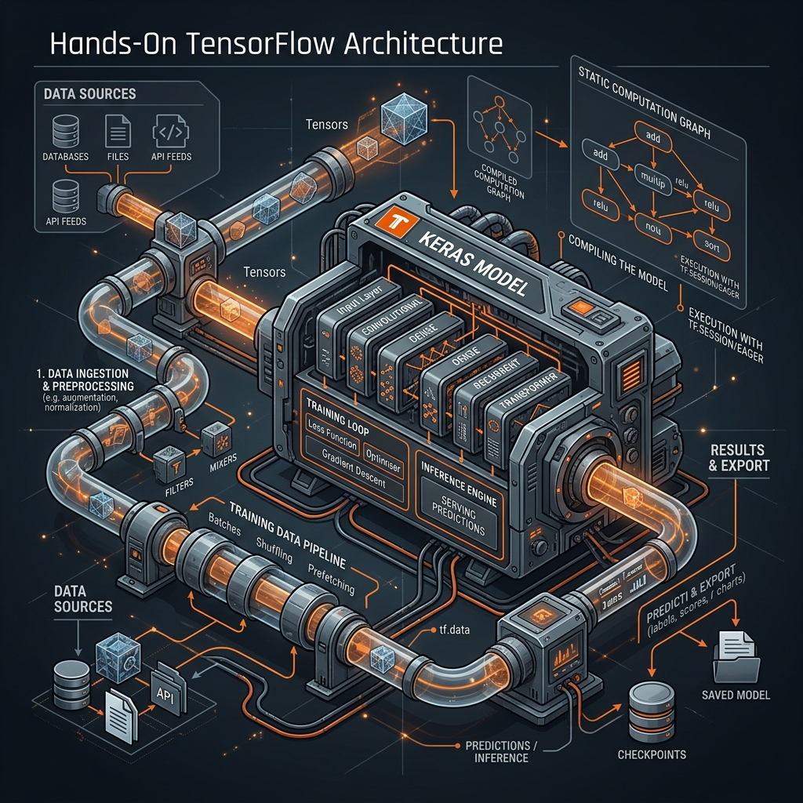
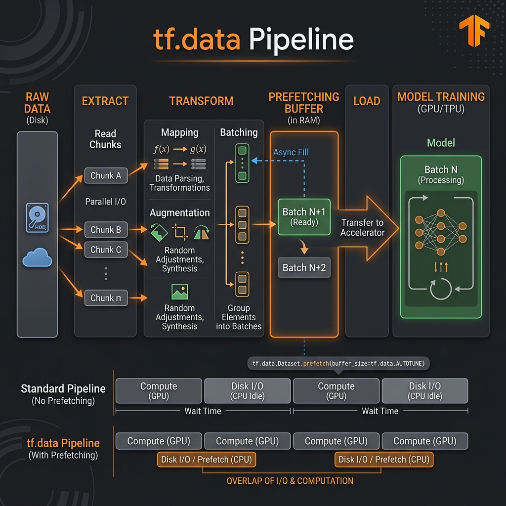

# 19: Hands-On TensorFlow Architecture

<p align="center">
  
</p>

## 🎯 The Big Goal

> **After this chapter, you will transition from raw theoretical Python code to writing production-ready Deep Learning pipelines using Google's TensorFlow and the high-level Keras API. You will understand how static computation graphs are compiled down to highly optimized C++/CUDA code, and build highly performant `tf.data` GPU ingestion pipelines.**

While raw NumPy code is essential for learning (as seen in Chapter 17), it runs entirely on the CPU in a slow, interpreted fashion. When training on billions of parameters, you need a framework that can compile mathematical operations down to raw hardware optimization.

**TensorFlow** is Google's flagship open-source machine learning framework. It operates by converting your Python models into highly optimized **Computation Graphs** that can be rapidly distributed across clusters of GPUs and TPUs.

---

## 1. Tensors & The Computation Graph

In TensorFlow, data does not flow as simple objects or lists; it flows as **Tensors**. 
A Tensor is a mathematically strict multi-dimensional array.

*   `0D Tensor`: A scalar. `shape=()`
*   `1D Tensor`: A vector. `shape=(5,)`
*   `2D Tensor`: A matrix. `shape=(5, 10)`
*   `3D Tensor`: Image Data [Batch, Width, Height]. `shape=(32, 28, 28)`

### AutoGraph and Static Compilation (`@tf.function`)
TensorFlow operates using **Graph Mode**. When you decorate a Python function with `@tf.function`, TensorFlow traces the Python code and converts it into a static, language-agnostic Data Flow Graph. 
This means the final code isn't really running "Python" inside the training loop; a highly optimized backend C++ engine is instantly evaluating the mathematical graph on the GPU.

---

## 2. The `tf.data` Ingestion Pipeline

The #1 bottleneck in most junior AI engineers' code is not the neural network itself; **it is the Hard Drive**.
If your GPU trains a batch in 2 milliseconds, but your Python `for`-loop takes 10 milliseconds to open the image from the hard drive, your $10,000 GPU is sitting completely idle 80% of the time.

<p align="center">
  
</p>

The `tf.data` API solves this by moving data loading entirely into the C++ backend and using asynchronous multithreading.
1.  **Extract:** Read data from local raw files asynchronously.
2.  **Transform:** Resize images, normalize pixels, and augment data in parallel across multiple CPU cores.
3.  **Prefetch:** Keep the GPU constantly fed. While the GPU is training on **Batch N**, the CPU uses `dataset.prefetch()` to automatically prepare **Batch N+1** in RAM, completely eliminating idle wait times.

---

## 🐳 Dockerized Application: Keras CNN Classification

Let's build a functional, scalable TensorFlow prototype. We will use the `tensorflow/tensorflow:latest` Docker image. We'll use the intuitive Keras API to build a Convolutional Neural Network (CNN) to classify images (MNIST dataset) using a standard sequential approach.

### `docker-compose.yml`
```yaml
version: '3.8'
services:
  tf_classifier:
    image: tensorflow/tensorflow:latest
    container_name: tf_keras_classifier
    volumes:
      - .:/app
    working_dir: /app
    command: python app.py
```

### `app.py`
```python
import tensorflow as tf
from tensorflow import keras
import time

print(f"🚀 Initializing TensorFlow Engine v{tf.__version__}")

# 1. Load Data (MNIST Handwritten Digits dataset is built-in)
# Normally you would build a custom tf.data pipeline here, but for this demo 
# we use the built-in loader for simplicity.
(x_train, y_train), (x_test, y_test) = keras.datasets.mnist.load_data()

# Normalize pixel values to be between 0 and 1
x_train, x_test = x_train / 255.0, x_test / 255.0

# 2. Build the Model Architecture using Keras Sequential API
model = keras.Sequential([
    # Input Layer: Flattens the 28x28 2D image into a 784 1D array
    keras.layers.Flatten(input_shape=(28, 28)),
    
    # Hidden Layer: 128 Neurons, using the ReLU activation from Chapter 18 to prevent vanishing gradients
    keras.layers.Dense(128, activation='relu'),
    
    # Regularization: Randomly drop 20% of connections to prevent overfitting
    keras.layers.Dropout(0.2),
    
    # Output Layer: 10 Neurons (one for each digit 0-9). Uses softmax for probabilities.
    keras.layers.Dense(10, activation='softmax')
])

# 3. Compile the Model (Converting it into a static Graph)
# - Optimizer: We use Adam because it is vastly superior to SGD (from Chapter 18)
# - Loss: SparseCategoricalCrossentropy because we have class integers (0,1,2..)
model.compile(optimizer='adam',
              loss='sparse_categorical_crossentropy',
              metrics=['accuracy'])

print("\n⚙️ Model Architecture Compiled:")
model.summary()

# 4. Train the Model
print("\n🔥 Commencing Training Loop...")
start_time = time.time()

# Train for 5 epochs. Keras automatically handles the backpropagation math!
model.fit(x_train, y_train, epochs=5)

end_time = time.time()
print(f"\n✅ Training Complete in {end_time - start_time:.2f} seconds.")

# 5. Evaluate the Model on unseen Test Data
print("\n📊 Evaluating against Test Set:")
test_loss, test_acc = model.evaluate(x_test,  y_test, verbose=2)

print(f"\n🎯 Final Production Test Accuracy: {test_acc*100:.2f}%")
```

To run this:
1. Save the above files.
2. Run `docker-compose up`. *Note: The first time you run this, Docker must download the heavy TensorFlow image (roughly 1.5GB).*

---

## 🤔 Reflection Questions

1. **In the Keras code above, we added a `keras.layers.Dropout(0.2)` layer. What exactly does this do during training, and what does it do during the final testing/inference phase?**
<details>
<summary>💡 View Answer</summary>

During **Training**, Dropout essentially forcefully unplugs 20% of the neurons completely at random for every single batch. This chaotic disturbance prevents the network from memorizing the data or relying too heavily on any single neuron path, forcing the whole network to learn a more robust "general" representation (preventing Overfitting). 
During **Testing/Inference**, Keras automatically turns Dropout OFF. You want your production model running at 100% capacity when serving predictions to real users.
</details>

2. **You write a custom mathematical function in Python and run it inside a highly complex TensorFlow loop. It works, but it's incredibly slow and you notice your CPU is maxing out but the GPU isn't doing anything. What happened?**
<details>
<summary>💡 View Answer</summary>

You caused a **Context Switch**. TensorFlow is trying to run optimized graph code on the GPU. But because you injected raw standard Python code (or raw `numpy` arrays) into the pipeline, the GPU has to halt execution, transfer that specific matrix *back over the PCIe bus into the CPU's memory*, ask Python to run the slow calculation natively, and transfer it back to the GPU. You must use native TensorFlow mathematical operators (e.g., `tf.math.reduce_sum`) so it stays inside the compiled static graph on the accelerator.
</details>

---

<div align="center">

| [<< Previous: Theoretical DL Foundations](./18_Theoretical_Foundations_of_Deep_Learning.md) | [Home: Curriculum Map](./README.md) | [Next: Dive Into PyTorch Architecture >>](./20_Dive_Into_PyTorch_Architecture.md) |

</div>
