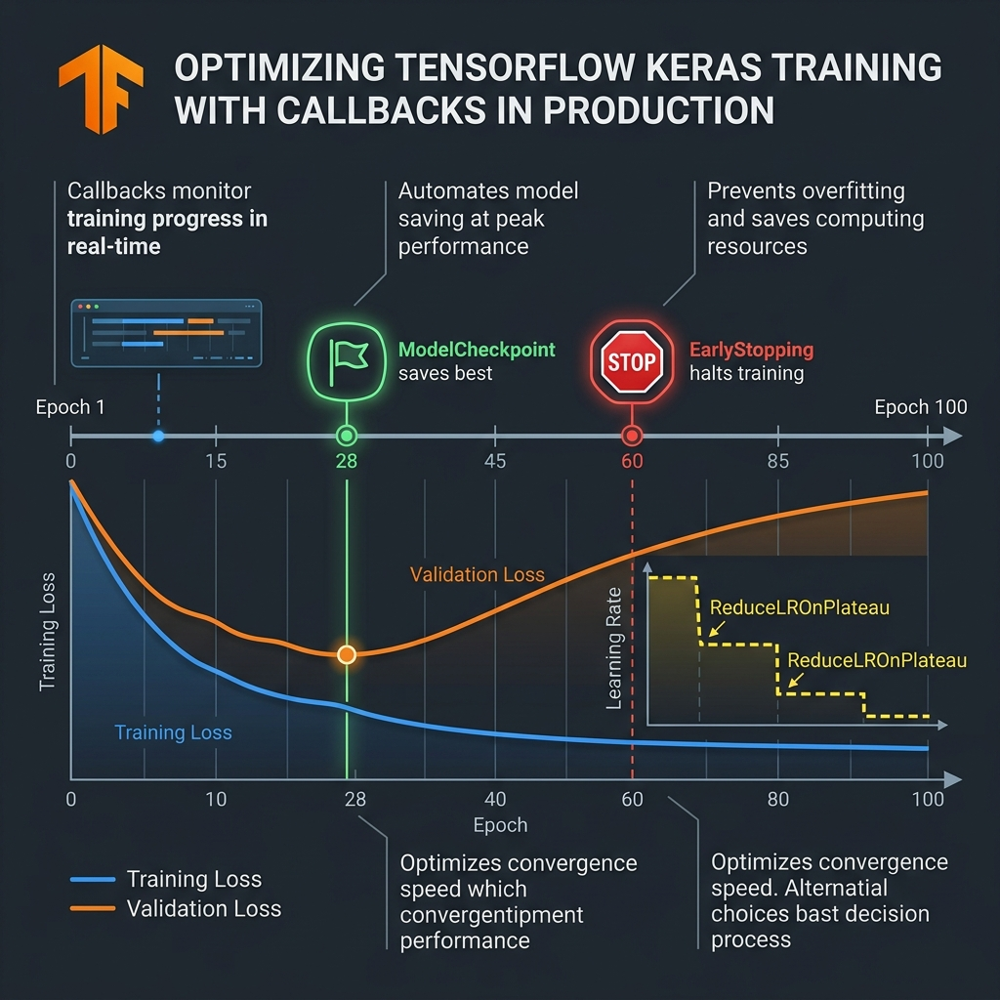
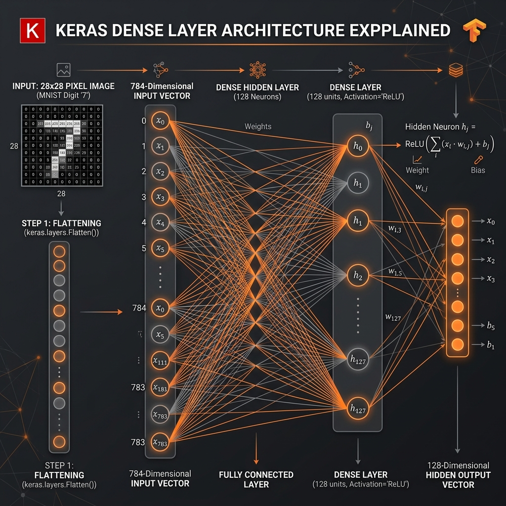
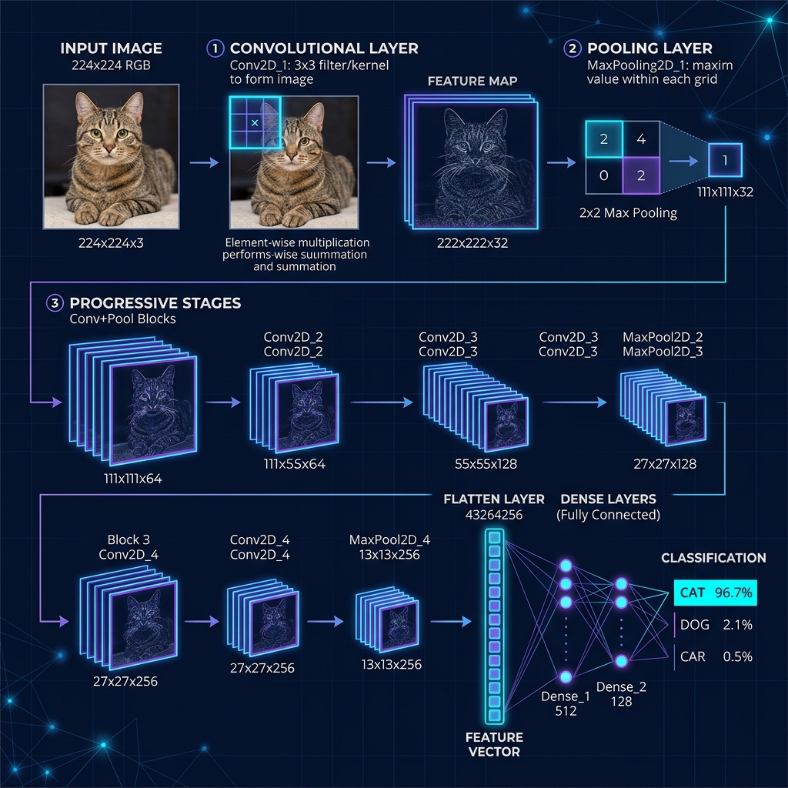
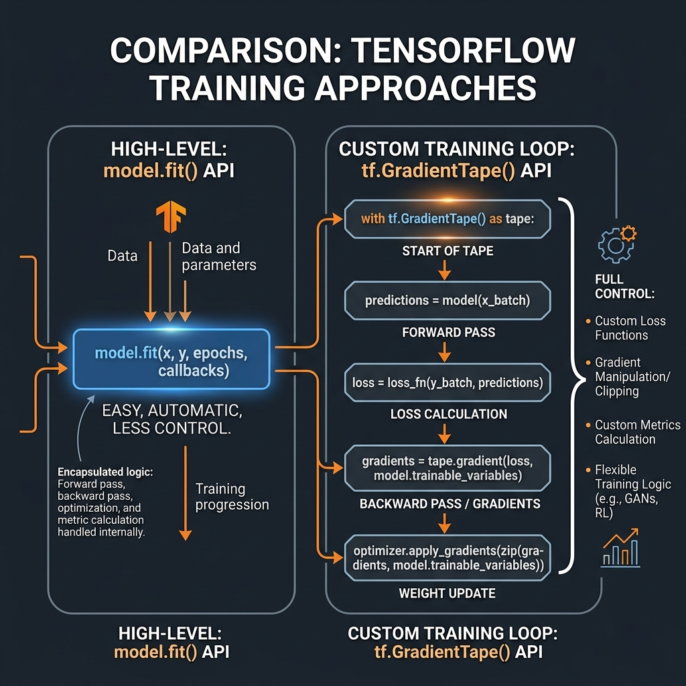
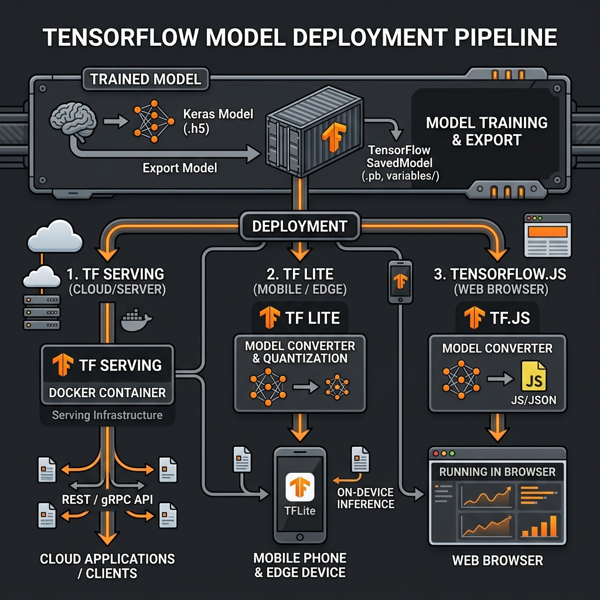
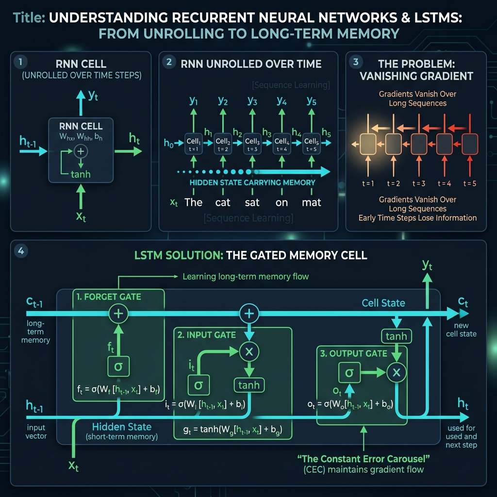

# 19: Hands-On TensorFlow Architecture

<p align="center">
  
</p>

## 🎯 The Big Goal

> **After this chapter, you will transition from raw theoretical Python code to writing production-ready Deep Learning pipelines using Google's TensorFlow and the high-level Keras API. You will understand how static computation graphs are compiled down to highly optimized C++/CUDA code, and build highly performant `tf.data` GPU ingestion pipelines.**

While raw NumPy code is essential for learning (as seen in Chapter 17), it runs entirely on the CPU in a slow, interpreted fashion. When training on billions of parameters, you need a framework that can compile mathematical operations down to raw hardware optimization.

**TensorFlow** is Google's flagship open-source machine learning framework. It operates by converting your Python models into highly optimized **Computation Graphs** that can be rapidly distributed across clusters of GPUs and TPUs.

---

## 1. Tensors & The Computation Graph

In TensorFlow, data does not flow as simple objects or lists; it flows as **Tensors**. 
A Tensor is a mathematically strict multi-dimensional array.

*   `0D Tensor`: A scalar. `shape=()`
*   `1D Tensor`: A vector. `shape=(5,)`
*   `2D Tensor`: A matrix. `shape=(5, 10)`
*   `3D Tensor`: Image Data [Batch, Width, Height]. `shape=(32, 28, 28)`

### AutoGraph and Static Compilation (`@tf.function`)
TensorFlow operates using **Graph Mode**. When you decorate a Python function with `@tf.function`, TensorFlow traces the Python code and converts it into a static, language-agnostic Data Flow Graph. 
This means the final code isn't really running "Python" inside the training loop; a highly optimized backend C++ engine is instantly evaluating the mathematical graph on the GPU.

---

## 2. The `tf.data` Ingestion Pipeline

The #1 bottleneck in most junior AI engineers' code is not the neural network itself; **it is the Hard Drive**.
If your GPU trains a batch in 2 milliseconds, but your Python `for`-loop takes 10 milliseconds to open the image from the hard drive, your $10,000 GPU is sitting completely idle 80% of the time.

<p align="center">
  
</p>

The `tf.data` API solves this by moving data loading entirely into the C++ backend and using asynchronous multithreading.
1.  **Extract:** Read data from local raw files asynchronously.
2.  **Transform:** Resize images, normalize pixels, and augment data in parallel across multiple CPU cores.
3.  **Prefetch:** Keep the GPU constantly fed. While the GPU is training on **Batch N**, the CPU uses `dataset.prefetch()` to automatically prepare **Batch N+1** in RAM, completely eliminating idle wait times.

---

## 3. Production Callbacks: Automating Training Decisions

Martinez-Ramon emphasizes that in production, you never sit and watch your model train for 8 hours. Instead, you use **Callbacks** — automated hooks that execute logic at the end of each epoch.

<p align="center">
  
</p>

The three most critical production callbacks are:

*   **`EarlyStopping`:** Monitors the Validation Loss. If it stops improving for a set number of epochs (called `patience`), training is automatically halted. This prevents overfitting and saves hours of wasted GPU compute.
*   **`ModelCheckpoint`:** Saves the model weights to disk every time the Validation Loss reaches a new minimum. Even if the model later overfits, you always have the best-performing snapshot saved.
*   **`ReduceLROnPlateau`:** If the loss plateaus (stops improving) for several epochs, automatically reduces the learning rate by a factor (e.g., ×0.1). This allows the optimizer to make finer adjustments when it's close to a minimum.

```python
# Example Keras callback configuration:
callbacks = [
    keras.callbacks.EarlyStopping(monitor='val_loss', patience=10, restore_best_weights=True),
    keras.callbacks.ModelCheckpoint('best_model.keras', save_best_only=True),
    keras.callbacks.ReduceLROnPlateau(monitor='val_loss', factor=0.1, patience=5)
]
model.fit(x_train, y_train, epochs=100, validation_split=0.2, callbacks=callbacks)
```

> **Production Rule:** You should almost never call `model.fit()` without at least `EarlyStopping` and `ModelCheckpoint`. Training without these callbacks is like driving without brakes — you will eventually crash.

---

## 4. Data Augmentation: Free Training Data

One of the most practical techniques Martinez-Ramon highlights is **Data Augmentation**. Instead of collecting more data (which is expensive), you can synthetically multiply your existing dataset by applying random transformations:

*   **For images:** Random flips, rotations, crops, brightness/contrast adjustments, color jitter
*   **For text:** Synonym replacement, random insertion, back-translation
*   **For audio:** Time stretching, pitch shifting, noise injection

In Keras, this is built directly into the pipeline:
```python
data_augmentation = keras.Sequential([
    keras.layers.RandomFlip("horizontal"),
    keras.layers.RandomRotation(0.1),
    keras.layers.RandomZoom(0.1),
])
```

Augmentation acts as a powerful regularizer: because the model never sees the exact same image twice, it is forced to learn generalized features rather than memorizing specific pixel patterns.

---

## 🐳 Dockerized Application: Keras CNN Classification

Let's build a functional, scalable TensorFlow prototype. We will use the `tensorflow/tensorflow:latest` Docker image. We'll use the intuitive Keras API to build a Convolutional Neural Network (CNN) to classify images (MNIST dataset) using a standard sequential approach.

### `docker-compose.yml`
```yaml
version: '3.8'
services:
  tf_classifier:
    image: tensorflow/tensorflow:latest
    container_name: tf_keras_classifier
    volumes:
      - .:/app
    working_dir: /app
    command: python app.py
```

### `app.py`
```python
import tensorflow as tf
from tensorflow import keras
import time

print(f"🚀 Initializing TensorFlow Engine v{tf.__version__}")

# 1. Load Data (MNIST Handwritten Digits dataset is built-in)
# Normally you would build a custom tf.data pipeline here, but for this demo 
# we use the built-in loader for simplicity.
(x_train, y_train), (x_test, y_test) = keras.datasets.mnist.load_data()

# Normalize pixel values to be between 0 and 1
x_train, x_test = x_train / 255.0, x_test / 255.0

# 2. Build the Model Architecture using Keras Sequential API
model = keras.Sequential([
    # Input Layer: Flattens the 28x28 2D image into a 784 1D array
    keras.layers.Flatten(input_shape=(28, 28)),
    
    # Hidden Layer: 128 Neurons, using the ReLU activation from Chapter 18 to prevent vanishing gradients
    keras.layers.Dense(128, activation='relu'),
    
    # Regularization: Randomly drop 20% of connections to prevent overfitting
    keras.layers.Dropout(0.2),
    
    # Output Layer: 10 Neurons (one for each digit 0-9). Uses softmax for probabilities.
    keras.layers.Dense(10, activation='softmax')
])

# 3. Compile the Model (Converting it into a static Graph)
# - Optimizer: We use Adam because it is vastly superior to SGD (from Chapter 18)
# - Loss: SparseCategoricalCrossentropy because we have class integers (0,1,2..)
model.compile(optimizer='adam',
              loss='sparse_categorical_crossentropy',
              metrics=['accuracy'])

print("\n⚙️ Model Architecture Compiled:")
model.summary()

# 4. Train the Model
print("\n🔥 Commencing Training Loop...")
start_time = time.time()

# Train for 5 epochs. Keras automatically handles the backpropagation math!
model.fit(x_train, y_train, epochs=5)

end_time = time.time()
print(f"\n✅ Training Complete in {end_time - start_time:.2f} seconds.")

# 5. Evaluate the Model on unseen Test Data
print("\n📊 Evaluating against Test Set:")
test_loss, test_acc = model.evaluate(x_test,  y_test, verbose=2)

print(f"\n🎯 Final Production Test Accuracy: {test_acc*100:.2f}%")
```

To run this:
1. Save the above files.
2. Run `docker-compose up`. *Note: The first time you run this, Docker must download the heavy TensorFlow image (roughly 1.5GB).*

---

## 5. Step-by-Step Code Breakdown: Keras Compilation

Let's demystify exactly what the high-level Keras wrapper is doing under the hood to your images.

<p align="center">
  
</p>

1. **The Flatten Layer (`keras.layers.Flatten(input_shape=(28, 28))`)**
   * **Analogy:** Taking a Rubik's cube and smashing it with a hammer so all the colored cubes lay out in a single straight line on the floor.
   * **Technical Detail:** A neural network requires a 1D vector of numbers. You cannot feed a 2D image directly into a standard dense network. This layer physically restructures the data array from `[28, 28]` (a square grid of 784 pixels) into a perfectly flat `[784]` dimension string.

2. **The Dense Layer (`keras.layers.Dense(128, activation='relu')`)**
   * **Analogy:** Every single one of those 784 pixels is now wired to 128 different lightbulbs. If a pixel is bright, it sends electricity down its unique wire. That electricity passes through a valve (the `weight`). If enough electricity hits the bulb, it turns on.
   * **Technical Detail:** This performs the exact $Z = X \cdot W + B$ matrix math we learned in Chapter 17. The `128` simply defines the width of the destination weight matrix. The `relu` activation stops vanishing gradients.

3. **The Compilation Phase (`model.compile(...)`)**
   * **Analogy:** Translating your blueprint from English into robotic machine-code.
   * **Technical Detail:** In standard Graph execution, Keras locks the architecture down. It assigns the `adam` algorithms we learned in Chapter 18 to manage the backward pass, and assigns the heavy C++ CUDA libraries to manage the data flow. Once compiled, the structure cannot be altered during the `.fit()` loop.

---

## 6. Convolutional Neural Networks (CNNs): How Machines See

Géron dedicates extensive coverage to **Convolutional Neural Networks**, the architecture that powers all modern computer vision. Unlike the Dense (fully connected) layers we used above, CNNs exploit the spatial structure of images.

<p align="center">
  
</p>

A CNN works by sliding small **filters** (typically 3×3 or 5×5 grids of weights) across the input image:

1.  **Convolutional Layer:** A 3×3 filter slides across every position of the image, performing element-wise multiplication and summing the results. Each filter learns to detect one specific feature (edges, corners, textures). Multiple filters stack together to create a **Feature Map**.
2.  **Pooling Layer (MaxPool):** Reduces the spatial dimensions by taking only the maximum value in each small region (e.g., 2×2). This makes the network **translation-invariant** — it doesn't matter if the cat is in the top-left or bottom-right of the image.
3.  **Progressive Depth:** Multiple Conv+Pool stages progressively reduce spatial resolution while increasing the number of feature channels. Early layers detect edges; deep layers detect complex shapes like eyes and faces.
4.  **Classification Head:** After the final pooling layer, the 3D tensor is flattened into a 1D vector and fed into standard Dense layers for classification.

```python
# Géron-style CNN in Keras:
model = keras.Sequential([
    keras.layers.Conv2D(32, (3,3), activation='relu', input_shape=(28,28,1)),
    keras.layers.MaxPooling2D((2,2)),
    keras.layers.Conv2D(64, (3,3), activation='relu'),
    keras.layers.MaxPooling2D((2,2)),
    keras.layers.Conv2D(64, (3,3), activation='relu'),
    keras.layers.Flatten(),
    keras.layers.Dense(64, activation='relu'),
    keras.layers.Dense(10, activation='softmax')
])
```

> **Key Insight from Géron:** The parameter count in CNNs is dramatically lower than Dense networks because the same small filter is reused ("shared") across the entire image. A 3×3 filter has only 9 weights, but a Dense layer connecting 784 inputs to 128 neurons has 100,352 weights.

---

## 7. Transfer Learning: Standing on the Shoulders of Giants

Géron argues that **Transfer Learning** is the single most important practical technique in modern deep learning. Instead of training a model from scratch on your small dataset, you take a model that was already trained on millions of images and fine-tune it for your specific task.

<p align="center">
  
</p>

The process has three steps:

1.  **Load a Pretrained Base Model:** Download a model like ResNet50, EfficientNet, or MobileNet that was trained on ImageNet (14 million images, 1000 classes). These models have already learned universal visual features: edges, textures, shapes, object parts.
2.  **Freeze the Base Layers:** Lock all the pretrained weights so they do not change during training. These layers are your free, pre-learned feature extractors.
3.  **Add and Train New Layers:** Replace the original classification head with your own Dense layers specific to your task (e.g., "Dog vs Cat" or "Malignant vs Benign tumor").

```python
# Transfer Learning in Keras (Géron's approach):
base_model = keras.applications.ResNet50(weights='imagenet', include_top=False, input_shape=(224,224,3))
base_model.trainable = False  # Freeze all 23 million pretrained parameters

model = keras.Sequential([
    base_model,
    keras.layers.GlobalAveragePooling2D(),
    keras.layers.Dense(256, activation='relu'),
    keras.layers.Dropout(0.5),
    keras.layers.Dense(2, activation='softmax')  # Your 2-class problem
])
```

> **Géron's Rule:** With Transfer Learning, you can achieve 95%+ accuracy on custom image classification tasks with as few as **500 training images**. Training from scratch would require 50,000+ images to achieve similar results.

---

## 8. Custom Training Loops with `tf.GradientTape`

Géron covers the `tf.GradientTape` API extensively for cases where `model.fit()` is too restrictive. This is the TensorFlow equivalent to the manual PyTorch training loop in Chapter 20.

<p align="center">
  
</p>

You need `GradientTape` when you need:
*   **Custom loss functions** that combine multiple terms
*   **Gradient clipping** to prevent exploding gradients
*   **Multi-model training** (e.g., GANs where two models train adversarially)
*   **Custom metrics** computed during training

```python
@tf.function  # Compile to static graph for speed
def train_step(x_batch, y_batch):
    with tf.GradientTape() as tape:
        predictions = model(x_batch, training=True)
        loss = loss_fn(y_batch, predictions)
    
    # Calculate gradients
    gradients = tape.gradient(loss, model.trainable_variables)
    
    # Optional: Clip gradients to prevent explosion
    gradients = [tf.clip_by_norm(g, 1.0) for g in gradients]
    
    # Apply gradients
    optimizer.apply_gradients(zip(gradients, model.trainable_variables))
    return loss
```

---

## 9. Deploying TensorFlow Models to Production

Géron dedicates an entire chapter to model deployment. A model that only runs in a Jupyter notebook is worthless. TensorFlow provides a complete deployment ecosystem:

<p align="center">
  
</p>

### SavedModel Format
The universal export format that captures everything: the computation graph, the weights, and the preprocessing logic.
```python
model.save('my_model')  # Exports a SavedModel directory
loaded_model = tf.keras.models.load_model('my_model')  # Loads it back perfectly
```

### TF Serving (Cloud/Server)
A high-performance Docker-based serving system that exposes your model as a REST API or gRPC endpoint. It handles batching, model versioning, and hot-swapping new model versions with zero downtime.
```bash
docker run -p 8501:8501 --mount type=bind,source=/models/my_model,target=/models/my_model \
  -e MODEL_NAME=my_model tensorflow/serving
```

### TF Lite (Mobile/Edge)
Converts and quantizes your model for mobile phones and embedded devices. Reduces model size by 4× and inference latency by 3× through techniques like **post-training quantization** (converting 32-bit floats to 8-bit integers).

### TensorFlow.js (Browser)
Runs your model directly in the user's browser via WebGL acceleration. No server needed — the inference happens entirely on the client device.

---

## 10. Custom Layers and Custom Loss Functions

Géron emphasizes that real-world projects almost always require custom components. Keras makes it straightforward to create your own:

### Custom Loss Function
```python
def huber_loss(y_true, y_pred, delta=1.0):
    error = y_true - y_pred
    is_small_error = tf.abs(error) < delta
    small_error_loss = 0.5 * tf.square(error)
    big_error_loss = delta * (tf.abs(error) - 0.5 * delta)
    return tf.where(is_small_error, small_error_loss, big_error_loss)

model.compile(loss=huber_loss, optimizer='adam')
```

### Custom Layer
```python
class MyDenseLayer(keras.layers.Layer):
    def __init__(self, units, **kwargs):
        super().__init__(**kwargs)
        self.units = units

    def build(self, input_shape):
        self.kernel = self.add_weight("kernel", shape=[input_shape[-1], self.units])
        self.bias = self.add_weight("bias", shape=[self.units])

    def call(self, inputs):
        return tf.matmul(inputs, self.kernel) + self.bias  # The Z = X·W + b from Ch.17!
```

> **Géron's Insight:** The `build()` method uses **lazy initialization** — the weight matrices are not created until the layer first receives data. This allows the same layer class to work with any input size without hardcoding dimensions.

---

## 11. Recurrent Neural Networks (RNNs) & LSTMs in Keras

Aston Zhang (*Dive into Deep Learning*) covers sequence models extensively. While CNNs excel at spatial data (images), **Recurrent Neural Networks** are designed for sequential data (text, time series, audio).

<p align="center">
  
</p>

An RNN processes data one time step at a time, maintaining a **hidden state** that carries information from previous steps — like short-term memory. However, standard RNNs suffer from the same Vanishing Gradient problem (Chapter 18): they cannot remember information from more than ~10-20 steps ago.

**LSTMs (Long Short-Term Memory)** solve this with a **gated memory cell**:
*   **Forget Gate:** Decides what old information to discard
*   **Input Gate:** Decides what new information to store
*   **Output Gate:** Decides what to reveal from memory

```python
# Keras LSTM for text classification (e.g., sentiment analysis):
model = keras.Sequential([
    keras.layers.Embedding(input_dim=10000, output_dim=128),  # Word → Vector
    keras.layers.LSTM(64, return_sequences=True),              # First LSTM layer
    keras.layers.LSTM(32),                                     # Second LSTM layer
    keras.layers.Dense(1, activation='sigmoid')                # Binary output
])
model.compile(optimizer='adam', loss='binary_crossentropy', metrics=['accuracy'])
```

> **Zhang's Note:** For most modern NLP tasks, Transformers (Section 12) have largely replaced LSTMs. However, LSTMs remain extremely valuable for time-series forecasting, audio processing, and any task where you need to process variable-length sequences with limited compute.

---

## 12. The Keras Functional API: Beyond Sequential

The `keras.Sequential` API chains layers in a straight line. But real-world architectures often have:
*   Multiple inputs (e.g., image + text)
*   Multiple outputs (e.g., classify + locate)
*   Skip connections (ResNets)
*   Shared layers across branches

The **Functional API** handles all of these:

```python
# A multi-input model: combine image features with metadata
image_input = keras.Input(shape=(224, 224, 3), name='image')
metadata_input = keras.Input(shape=(10,), name='metadata')

# Image branch
x = keras.layers.Conv2D(32, 3, activation='relu')(image_input)
x = keras.layers.GlobalAveragePooling2D()(x)

# Metadata branch
y = keras.layers.Dense(32, activation='relu')(metadata_input)

# Merge branches
combined = keras.layers.concatenate([x, y])
output = keras.layers.Dense(1, activation='sigmoid')(combined)

model = keras.Model(inputs=[image_input, metadata_input], outputs=output)
```

---

## 🤔 Reflection Questions

1. **In the Keras code above, we added a `keras.layers.Dropout(0.2)` layer. What exactly does this do during training, and what does it do during the final testing/inference phase?**
<details>
<summary>💡 View Answer</summary>

During **Training**, Dropout essentially forcefully unplugs 20% of the neurons completely at random for every single batch. This chaotic disturbance prevents the network from memorizing the data or relying too heavily on any single neuron path, forcing the whole network to learn a more robust "general" representation (preventing Overfitting). 
During **Testing/Inference**, Keras automatically turns Dropout OFF. You want your production model running at 100% capacity when serving predictions to real users.
</details>

2. **You write a custom mathematical function in Python and run it inside a highly complex TensorFlow loop. It works, but it's incredibly slow and you notice your CPU is maxing out but the GPU isn't doing anything. What happened?**
<details>
<summary>💡 View Answer</summary>

You caused a **Context Switch**. TensorFlow is trying to run optimized graph code on the GPU. But because you injected raw standard Python code (or raw `numpy` arrays) into the pipeline, the GPU has to halt execution, transfer that specific matrix *back over the PCIe bus into the CPU's memory*, ask Python to run the slow calculation natively, and transfer it back to the GPU. You must use native TensorFlow mathematical operators (e.g., `tf.math.reduce_sum`) so it stays inside the compiled static graph on the accelerator.
</details>

3. **You want to build a classifier that identifies 5 species of flowers, but you only have 200 images total. What approach from this chapter would you use, and why?**
<details>
<summary>💡 View Answer</summary>

**Transfer Learning.** With only 200 images, training a CNN from scratch would massively overfit — the model would memorize every training image. Instead, load a pretrained ResNet or EfficientNet (trained on 14M ImageNet images), freeze all convolutional layers, and only train a new classification head. The pretrained layers already know how to detect edges, shapes, and textures. You just need to teach the final layer what "a daisy" vs "a sunflower" looks like using your 200 examples. Combine with aggressive Data Augmentation to artificially expand your dataset.
</details>

4. **Explain the difference between `model.save('my_model')` using SavedModel format vs `model.save('my_model.h5')` using HDF5 format. When would you use each?**
<details>
<summary>💡 View Answer</summary>

**SavedModel** is TensorFlow's native format that saves the full computation graph, weights, optimizer state, and custom objects. It is required for TF Serving deployment and supports `@tf.function` traced functions. **HDF5 (.h5)** is the older Keras format that saves weights and architecture but cannot serialize arbitrary TensorFlow operations or custom `@tf.function` code. Géron recommends using SavedModel for all production workflows and HDF5 only for quick prototyping or legacy compatibility.
</details>

---

<div align="center">

| [<< Previous: Theoretical DL Foundations](./18_Theoretical_Foundations_of_Deep_Learning.md) | [Home: Curriculum Map](./README.md) | [Next: Dive Into PyTorch Architecture >>](./20_Dive_Into_PyTorch_Architecture.md) |

</div>
