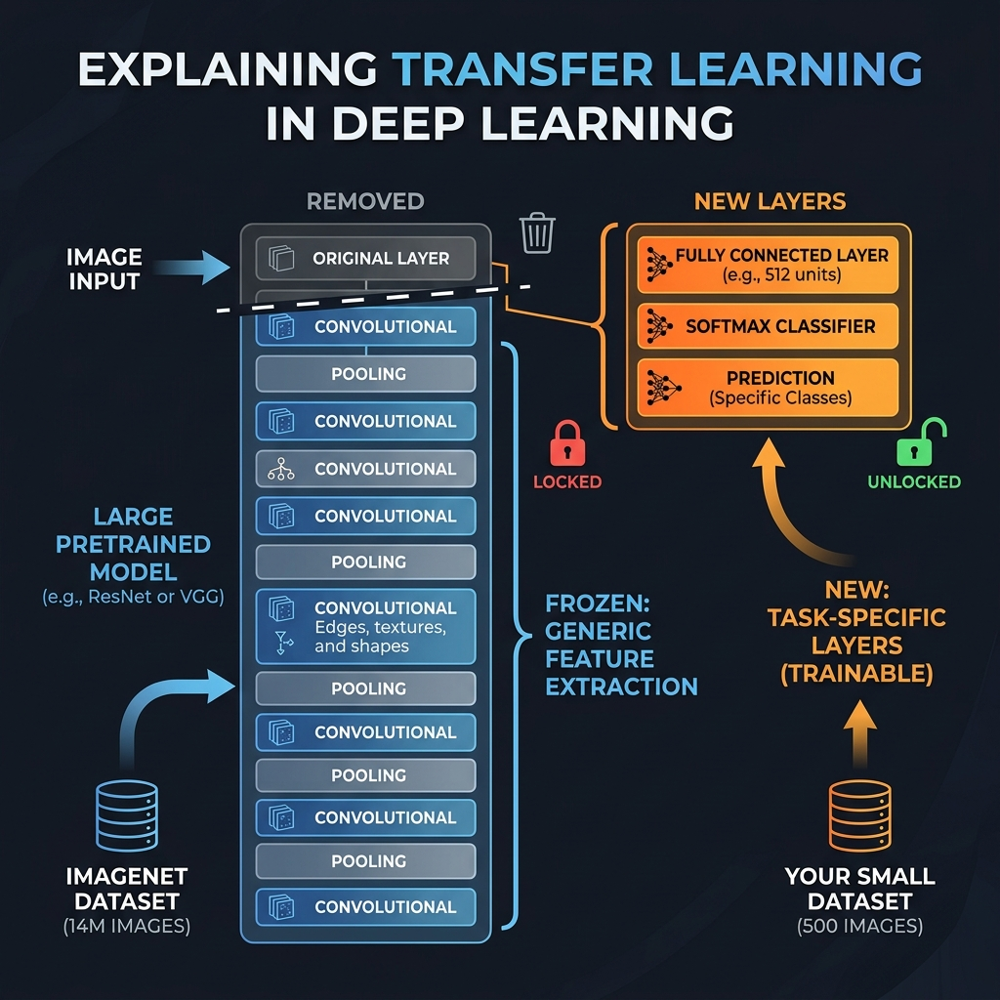

# 20: Dive Into PyTorch Architecture

<p align="center">
  
</p>

## 🎯 The Big Goal

> **After this chapter, you will master PyTorch, the undisputed king of modern AI Research and LLM development. You will understand how Dynamic Computation Graphs (Autograd) radically distinguish it from TensorFlow, how to structure models using pure Object-Oriented `nn.Module` classes, and exactly how to write custom low-level training loops.**

While TensorFlow dominated the enterprise industry from 2016-2020 by compiling static, unchangeable code graphs, the research community rebelled. If you wanted to build an irregular network (like a recurrent network that loops a different number of times depending on the length of a sentence), TensorFlow's static rigidity made it a nightmare.

Meta released **PyTorch**. Instead of compiling a static graph ahead of time, PyTorch builds its graph *on the fly*, dynamically, line-by-line using Python syntax. 

---

## 1. The Autograd Engine (Dynamic Graphs)

PyTorch uses a mechanism called "Define-by-Run" or "Tape-based Autograd".

<p align="center">
  
</p>

1.  **Forward Pass (The Tape Recorder):** As you execute Python code mathematically multiplying tensors together, the Autograd Engine secretly acts like a tape recorder. It records a massive tree of operations, attaching a specific `grad_fn` (Gradient Function) to the metadata of each tensor.
2.  **The Trigger:** When you call `loss.backward()`, the tape recorder immediately plays in reverse.
3.  **Backward Pass:** It traverses the graph from the loss output backward, executing the Chain Rule mathematics instantly, and depositing the final gradients nicely inside the `.grad` attribute of every single parameter in your model. 
4.  **The Cleanup:** The graph is instantly destroyed. It will build a brand new graph from scratch in the very next millisecond for the next batch.

---

## 2. Object-Oriented AI (`nn.Module`)

Because PyTorch is dynamic, it embraces standard Python Object-Oriented Programming (OOP). 
You don't string together long functional pipelines. You create a Python Class that inherits from `torch.nn.Module`. 

*   `__init__()`: This is your parts catalog. You instantiate all the layers (parameters) your model will need.
*   `forward()`: This is your plumbing. You explicitly write exactly how data should flow from `input x` to the output. You can use standard Python `if` statements, `for` loops, and `print()` statements right in the middle of a forward pass!

---

## 3. The Dataset & DataLoader Pipeline

In the Dockerized example below, we use simple synthetic data. But in production, your data lives on disk (images, CSVs, databases). Martinez-Ramon emphasizes that the **Dataset + DataLoader** pattern is the standard engineering solution for feeding data to a PyTorch model.

<p align="center">
  
</p>

*   **`torch.utils.data.Dataset`:** You create a custom Python class that defines two methods:
    *   `__len__()`: Returns the total number of samples.
    *   `__getitem__(index)`: Given an integer index, loads and returns a single sample (e.g., reads an image from disk, applies transformations, returns a tensor).
*   **`torch.utils.data.DataLoader`:** Wraps a Dataset and provides:
    *   **Automatic Batching:** Groups individual samples into mini-batches of a specified size.
    *   **Shuffling:** Randomizes the order of data each epoch to prevent the model from learning the sequence.
    *   **Parallel Loading (`num_workers`):** Spawns multiple background processes to load data from disk simultaneously, completely eliminating I/O bottlenecks.

```python
# Example custom Dataset:
class ImageDataset(torch.utils.data.Dataset):
    def __init__(self, image_paths, labels):
        self.image_paths = image_paths
        self.labels = labels

    def __len__(self):
        return len(self.image_paths)

    def __getitem__(self, idx):
        image = load_and_transform(self.image_paths[idx])
        return image, self.labels[idx]

# Wrap it in a DataLoader:
train_loader = DataLoader(dataset, batch_size=32, shuffle=True, num_workers=4)
```

---

## 4. Model Saving & Loading (`state_dict`)

Martinez-Ramon highlights that PyTorch does **not** save the entire model object. Instead, it saves only the dictionary of learned parameters (the `state_dict`). This is critical for production deployment:

```python
# Save only the learned weights:
torch.save(model.state_dict(), 'model_weights.pth')

# Load them back into an identical architecture:
new_model = AdvancedClassifier()  # Must define the same class structure
new_model.load_state_dict(torch.load('model_weights.pth'))
new_model.eval()  # Switch to inference mode (disables Dropout, etc.)
```

The `.eval()` call is essential: it switches the model from Training mode to Inference mode, which disables Dropout and changes BatchNorm to use stored running statistics instead of per-batch statistics.

---

## 🐳 Dockerized Application: PyTorch Custom Class & Training Loop

We will build a PyTorch application using the official CPU environment. Instead of the high-level `.fit()` we used in Keras, we will explicitly write a custom OOP class and handcraft the training loop so you can see exactly how the Autograd Engine works.

### `docker-compose.yml`
```yaml
version: '3.8'
services:
  pytorch_model:
    image: pytorch/pytorch:latest
    container_name: torch_autograd_engine
    volumes:
      - .:/app
    working_dir: /app
    command: python app.py
```

### `app.py`
```python
import torch
import torch.nn as nn
import torch.optim as optim
import time

print(f"🔥 Initializing PyTorch Engine v{torch.__version__}")

# 1. Generate Synthetic Data
# X: 1000 samples, 10 features. y: 1000 samples, 1 output (binary 0 or 1 classification)
X = torch.randn(1000, 10)
# Create a dummy target. If the sum of the features > 0, class 1, else class 0
y = (torch.sum(X, dim=1) > 0).float().unsqueeze(1) 

# 2. Build the Model using Object-Oriented Principles
class AdvancedClassifier(nn.Module):
    def __init__(self):
        super(AdvancedClassifier, self).__init__()
        # Store layers as attributes. 
        self.fc1 = nn.Linear(10, 64) # Fully Connected Layer 1 (10 inputs -> 64 hidden)
        self.relu = nn.ReLU()        # Non-linear activation
        self.fc2 = nn.Linear(64, 1)  # Fully Connected Layer 2 (64 hidden -> 1 output)
        self.sigmoid = nn.Sigmoid()  # Squeeze output to probability between 0 and 1
        
    def forward(self, x):
        # We explicitly dictate the flow of the computation graph mathematically
        x = self.fc1(x)
        x = self.relu(x)
        x = self.fc2(x)
        x = self.sigmoid(x)
        
        # In PyTorch, you can use normal python debugging right here in the graph!
        # uncomment next line if you want to inspect tensor shapes mid-training:
        # print("Current tensor shape:", x.shape) 
        
        return x

model = AdvancedClassifier()
print("\n⚙️ Object-Oriented Model Instantiated:")
print(model)

# 3. Setup Loss Function and Optimizer
criterion = nn.BCELoss() # Binary Cross Entropy Loss
optimizer = optim.Adam(model.parameters(), lr=0.01) # Link Optimizer directly to our model's weights

# 4. Handcrafted Custom Training Loop
print("\n🧠 Commencing Dynamic Training Loop...")
epochs = 5
start_time = time.time()

for epoch in range(epochs):
    # Step A: ZERO GRADIENTS!
    # By default, PyTorch ACCUMULATES gradients. We must explicitly wipe the slate clean.
    optimizer.zero_grad()
    
    # Step B: Forward Pass (This dynamically constructs the Graph tape!)
    predictions = model(X)
    
    # Step C: Calculate Loss
    loss = criterion(predictions, y)
    
    # Step D: Backward Pass (Auto-magically calculates Chain Rule gradients via Autograd)
    loss.backward()
    
    # Step E: Optimization Step (Adam applies the calculated gradients to update weights)
    optimizer.step()
    
    print(f"Epoch [{epoch+1}/{epochs}] | Loss: {loss.item():.4f}")

end_time = time.time()
print(f"\n✅ Training Complete in {end_time - start_time:.4f} seconds.")

# Prove the model learned something! Let's pass a random vector through it.
test_vector = torch.ones(1, 10) 
prediction = model(test_vector)
print(f"\n🎯 Inference Test Vector -> Predicted Output Probability: {prediction.item():.4f}")
```

To run this:
1. Save the above files.
2. Run `docker-compose up`. *Note: The official PyTorch CPU Docker image is large and will take a moment to download.*

---

## 5. Step-by-Step Code Breakdown: The Training Epoch Loop

Because PyTorch doesn't have a high-level `.fit()` wrapper like Keras, you are responsible for the 4-step physics of the Autograd engine loop.

<p align="center">
  
</p>

1. **Erasing the Blackboard (`optimizer.zero_grad()`)**
   * **Analogy:** Before starting a complex math problem, you must wipe the teacher's blackboard clean.
   * **Technical Detail:** The `.backward()` engine *adds* new gradients to whatever already exists in memory. If you don't zero it out, Epoch 2 will accidentally add its gradients on top of Epoch 1, causing a mathematical explosion.

2. **The Forward Pass (`predictions = model(X)`)**
   * **Analogy:** Pushing water through a complex series of pipes until it leaks out the end.
   * **Technical Detail:** This explicitly calls the `forward()` method of your `AdvancedClassifier` class. As it runs line-by-line, Autograd builds the dynamic computational graph on the fly, remembering exactly which equations were used.

3. **Propagating the Error (`loss.backward()`)**
   * **Analogy:** Realizing the water leaked out the wrong pipe, and sending a red dye backwards through the plumbing to see which specific valves were open.
   * **Technical Detail:** This is the Multivariable Chain Rule (from Chapter 17). It traverses the dynamic graph instantly in reverse, calculating the exact `grad` value for every single tensor that requires gradients in your `nn.Module`.

4. **Locking the Adjustments (`optimizer.step()`)**
   * **Analogy:** A mechanic grabbing a wrench and actually tightening the specific valves identified by the red dye.
   * **Technical Detail:** The optimizer (like Adam or SGD) looks at the `.grad` attributes calculated in the previous step, applies its momentum physics, and actually updates the raw float parameters in your model.

---

## 6. Transfer Learning in PyTorch

Just as Géron covers Transfer Learning extensively for Keras (Chapter 19), the same powerful technique is equally critical in PyTorch. The `torchvision.models` module provides dozens of pretrained architectures.

<p align="center">
  
</p>

The PyTorch approach follows the same three-step pattern, but uses explicit OOP manipulation:

```python
import torchvision.models as models
import torch.nn as nn

# Step 1: Load a pretrained ResNet18 (trained on 14M ImageNet images)
model = models.resnet18(pretrained=True)

# Step 2: Freeze ALL existing layers
for param in model.parameters():
    param.requires_grad = False  # Gradients won't flow here during backward()

# Step 3: Replace the final classification layer with our own
# ResNet18's final layer is 'model.fc' with 512 inputs and 1000 outputs
# We replace it with our own 2-class classifier
model.fc = nn.Sequential(
    nn.Linear(512, 256),
    nn.ReLU(),
    nn.Dropout(0.5),
    nn.Linear(256, 2)  # Binary classification
)

# Only the new 'model.fc' parameters are trainable!
optimizer = optim.Adam(model.fc.parameters(), lr=0.001)
```

> **Key Difference from TensorFlow:** In PyTorch, you freeze layers by setting `param.requires_grad = False` on individual parameters, giving you fine-grained control over exactly which weights to freeze or unfreeze. In Keras, you typically freeze entire layers via `layer.trainable = False`.

### Fine-Tuning: Unfreezing Gradually
After the new head has learned your task, you can optionally unfreeze some of the deeper pretrained layers and train at a very low learning rate. This allows the pretrained features to slightly adapt to your specific domain:

```python
# Unfreeze the last residual block for fine-tuning
for param in model.layer4.parameters():
    param.requires_grad = True

# Use a much smaller learning rate for pretrained layers
optimizer = optim.Adam([
    {'params': model.fc.parameters(), 'lr': 1e-3},       # New layers: higher LR
    {'params': model.layer4.parameters(), 'lr': 1e-5},    # Pretrained: very low LR
])
```

---

## 7. TorchScript: Production Deployment

Géron covers TensorFlow's SavedModel and TF Serving for deployment. The PyTorch equivalent is **TorchScript** — a way to serialize your model into a format that can run outside of Python entirely.

There are two approaches:

### Tracing
```python
# Feed an example input through the model; TorchScript records all operations
example_input = torch.randn(1, 10)
traced_model = torch.jit.trace(model, example_input)
traced_model.save('model_traced.pt')

# Load and run in ANY environment (C++, mobile, no Python needed):
loaded = torch.jit.load('model_traced.pt')
output = loaded(example_input)
```

### Scripting (for models with control flow)
```python
# If your forward() has if/else branches, tracing won't capture all paths.
# Use scripting instead:
scripted_model = torch.jit.script(model)
scripted_model.save('model_scripted.pt')
```

> **When to use which:** Use **Tracing** for simple, linear models. Use **Scripting** for models with `if/else`, `for` loops, or dynamic behavior in `forward()`. Scripting preserves the full Python control flow.

---

## 8. Mixed Precision Training

Modern NVIDIA GPUs (Volta architecture and newer) have specialized **Tensor Cores** that can perform half-precision (FP16) matrix multiplications 2-8× faster than full-precision (FP32). Géron covers this for TensorFlow; here is the PyTorch equivalent:

```python
from torch.cuda.amp import autocast, GradScaler

scaler = GradScaler()  # Prevents underflow in FP16

for epoch in range(epochs):
    optimizer.zero_grad()
    
    with autocast():  # Automatically uses FP16 where safe, FP32 where needed
        predictions = model(X)
        loss = criterion(predictions, y)
    
    # Scale loss to prevent gradient underflow, then backward
    scaler.scale(loss).backward()
    scaler.step(optimizer)
    scaler.update()
```

**Why this matters:** Mixed precision training can cut your training time nearly in half while using 30-50% less GPU memory, allowing you to train larger models or use bigger batch sizes on the same hardware.

---

## 9. Gradient Accumulation: Training with Limited Memory

When your GPU doesn't have enough memory to process a large batch (e.g., batch_size=256 for a ResNet50), you can simulate large batches by accumulating gradients over multiple small forward passes:

```python
accumulation_steps = 4  # Simulate batch_size = 4 * 32 = 128

for i, (x_batch, y_batch) in enumerate(train_loader):
    predictions = model(x_batch)  # batch_size=32
    loss = criterion(predictions, y_batch) / accumulation_steps
    loss.backward()  # Gradients accumulate (no zero_grad yet!)
    
    if (i + 1) % accumulation_steps == 0:
        optimizer.step()    # Apply accumulated gradients
        optimizer.zero_grad()  # NOW clear them
```

> **Why this works:** Remember from Section 5 that `loss.backward()` *adds* gradients to `.grad`. By deliberately skipping `zero_grad()` for 4 iterations and then calling `optimizer.step()`, we get the mathematical equivalent of training on a batch 4× larger — without ever loading 4× the data into GPU memory.

---

## 10. Putting It All Together: The Complete Production Pipeline

Combining all the techniques from Chapters 17–20, a real-world PyTorch project follows this structure:

```
1. Data Pipeline:       Dataset + DataLoader (num_workers, prefetching)
2. Architecture:        Pretrained model via Transfer Learning
3. Training Loop:       Mixed Precision + Gradient Accumulation
4. Regularization:      Dropout + BatchNorm + Data Augmentation
5. Optimization:        Adam + Learning Rate Scheduling
6. Monitoring:          Track train/val loss, early stopping logic
7. Saving:              state_dict checkpoints at best validation score
8. Deployment:          TorchScript export for production inference
```

---

## 🤔 Reflection Questions

1. **In the handmade PyTorch training loop above, why is the specific command `optimizer.zero_grad()` absolutely critical? What happens if you delete that line?**
<details>
<summary>💡 View Answer</summary>

Unlike TensorFlow, PyTorch was designed originally for Recurrent Neural Networks (RNNs) and complex multi-step reinforcement learning architectures where you might *want* gradients from different sub-components to stack up together. Therefore, calling `loss.backward()` **adds** the newly computed gradients to whatever already exists in the `.grad` attributes. If you forget `zero_grad()`, the gradients from Epoch 1, 2, and 3 will infinitely stack on top of each other, and your model weights will instantly explode into chaos resulting in `NaN` losses.
</details>

2. **If PyTorch executes regular Python code, what happens if I put an `if/else` statement inside my `forward(self, x)` method that routes the data to entirely different massive layers randomly for every single batch?**
<details>
<summary>💡 View Answer</summary>

It works perfectly natively! This is the core magic of Dynamic Computation Graphs. Because the Autograd engine literally constructs the graph fresh for *every single batch run*, it has zero problem handling branches. If the data goes down the `if` branch, Autograd tapes the `if` architecture. In the next batch, if it goes down the `else` branch, it tapes the `else` architecture. This kind of dynamic flexibility is incredibly painful to achieve in statically compiled frameworks like older versions of TensorFlow (where you must use hacky `tf.cond` structures).
</details>

---

<div align="center">

| [<< Previous: Hands-On TensorFlow Architecture](./19_Hands_On_TensorFlow_Architecture.md) | [Home: Curriculum Map](./README.md) |

</div>
