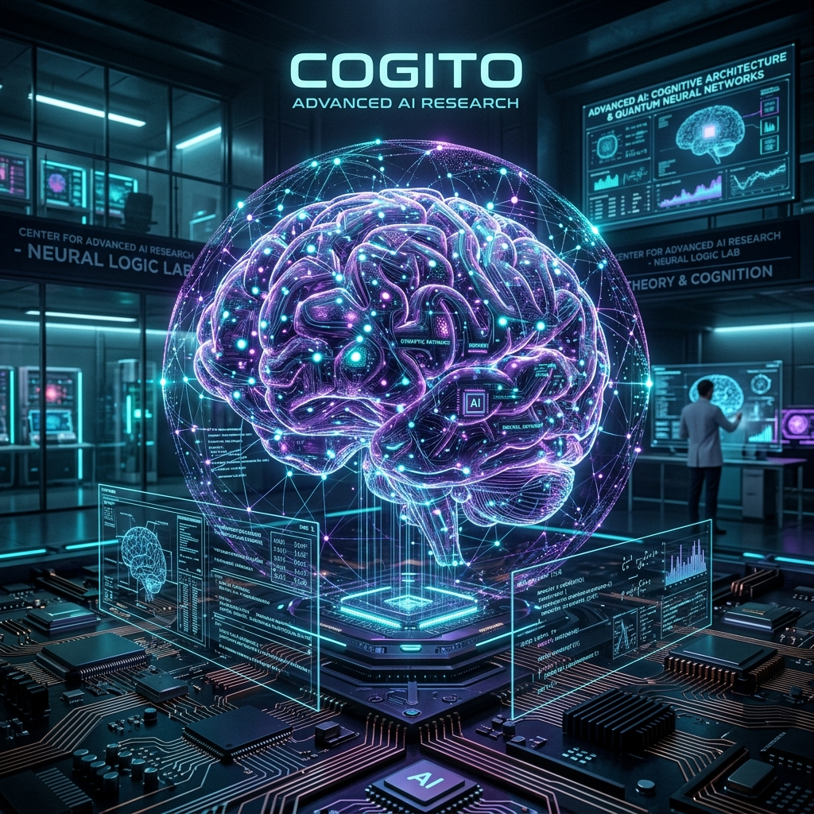

# Advanced AI & Machine Learning Architecture

  

Welcome to the **Advanced AI Curriculum**. This path dives into the deepest technical layers of modern artificial intelligence systems. We are moving far beyond running pip install and basic python scripts. This curriculum focuses on how massive neural networks are compiled, accelerated, decentralized, and secured at a planetary scale.

This is a comprehensive, senior-level systems engineering guide synthesized from foundational university textbooks cutting across hardware accelerators, graph networks, and federated systems.

---

## 📚 Curriculum Map

### Phase 1: Architecture & Distributed AI
*   [01: Deep Learning Systems (Compilers & Hardware)](./01_Deep_Learning_Systems.md)
*   [02: Efficient Processing of DNNs (Pruning & Quantization)](./02_Efficient_DNN_Processing.md)
*   [03: Federated Learning (Decentralized Training)](./03_Federated_Learning.md)

### Phase 2: Graph Networks & Theoretical AI *(Coming Soon)*
*   04: Graph Representation Learning
*   05: Applied Graph Neural Networks

### Phase 3: Natural Language & Generators *(Coming Soon)*
*   06: NLP for Social Media & Unstructured Text
*   07: Conversational AI & Dialogue State Systems
*   08: Deep Learning for Text Production

### Phase 4: Applied Systems & Biometrics *(Coming Soon)*
*   09: Multi-Modal Face Presentation Attack Detection
*   10: Autonomous Vehicle Perception Architecture

### Phase 5: Symbolic AI & Project Governance *(Coming Soon)*
*   11: Logic Programming & PDDL (Planning Domain Definition Language)
*   12: Why AI Projects Fail: Structural and Deployment Pitfalls

---

**How to Use This Guide:**  
Every chapter follows a strict structure:
1.  **The Big Goal** - The foundational problem the architecture solves.
2.  **Core Concepts** - The mathematical or systemic theory.
3.  **Architecture Diagrams** - High-fidelity blueprints.
4.  **Deep Dives** - Extremely technical, highly specific implementations.
5.  **Reflection Questions** - Interview-grade scenarios to test your understanding.
