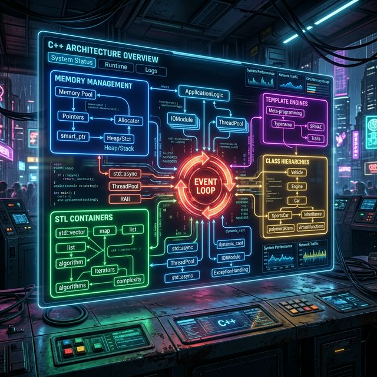

# 13: Capstone Lab — Building a Task Engine from Scratch

<p align="center">
  
</p>

This is the **final hands-on lab** of the C++ Mastery curriculum. You will build a complete, working **Task Engine** — a multithreaded job processor that combines every major concept you have learned:

| Concept | Chapter | Where It Appears |
| :--- | :--- | :--- |
| Fundamentals & Control Flow | Ch 01 | Main loop, enums, switch dispatch |
| Pointers & Smart Pointers | Ch 02 | `unique_ptr` ownership of tasks |
| STL Containers & Algorithms | Ch 03 | `vector`, `queue`, `find_if` |
| Classes & RAII | Ch 04 | `Task`, `TaskEngine` classes |
| Inheritance & Polymorphism | Ch 05 | Abstract `Task` base, derived `PrintTask`, `ComputeTask` |
| Object Model (vtable) | Ch 06 | Virtual dispatch via base pointer |
| Templates | Ch 07–08 | Generic `TaskFactory::create<T>()` |
| Policy-Based Design | Ch 09 | Thread-safety policy template |

Every file below is **copy-paste ready**. Save them, compile, and run.

---

## File 1: `task.h` — The Abstract Task Hierarchy

This file defines the polymorphic task interface and two concrete implementations.

```cpp
// task.h
#pragma once
#include <iostream>
#include <string>
#include <chrono>
#include <thread>
#include <memory>

// ============================================================
// ABSTRACT BASE CLASS (Ch 05: Inheritance & Polymorphism)
// Pure virtual interface. Cannot be instantiated directly.
// ============================================================
class Task {
public:
    virtual ~Task() = default;                    // Virtual destructor (Ch 05)
    virtual void execute() = 0;                   // Pure virtual method
    virtual std::string name() const = 0;         // Identity
};

// ============================================================
// CONCRETE TASK: PrintTask (Ch 04: Classes, Ch 05: override)
// ============================================================
class PrintTask : public Task {
    std::string message_;
public:
    explicit PrintTask(std::string msg) : message_{std::move(msg)} {}

    void execute() override {
        std::cout << "  [PrintTask] >> " << message_ << "\n";
    }

    std::string name() const override { return "PrintTask"; }
};

// ============================================================
// CONCRETE TASK: ComputeTask (Ch 02: Pointers, Ch 03: STL)
// Simulates a CPU-bound workload using a tight loop.
// ============================================================
class ComputeTask : public Task {
    int iterations_;
public:
    explicit ComputeTask(int n) : iterations_{n} {}

    void execute() override {
        long long sum = 0;
        for (int i = 0; i < iterations_; ++i) {
            sum += i * i;  // Simulate compute
        }
        std::cout << "  [ComputeTask] Crunched " << iterations_
                  << " iterations. Result checksum: " << sum << "\n";
    }

    std::string name() const override { return "ComputeTask"; }
};

// ============================================================
// CONCRETE TASK: TimerTask
// Simulates an I/O-bound delay.
// ============================================================
class TimerTask : public Task {
    int ms_;
public:
    explicit TimerTask(int milliseconds) : ms_{milliseconds} {}

    void execute() override {
        std::cout << "  [TimerTask] Sleeping for " << ms_ << "ms...\n";
        std::this_thread::sleep_for(std::chrono::milliseconds(ms_));
        std::cout << "  [TimerTask] Woke up after " << ms_ << "ms.\n";
    }

    std::string name() const override { return "TimerTask"; }
};
```

---

## File 2: `factory.h` — The Generic Task Factory

This file uses **template metaprogramming** (Ch 07–08) and **perfect forwarding** to create any task type through a single generic interface.

```cpp
// factory.h
#pragma once
#include "task.h"
#include <memory>
#include <type_traits>

// ============================================================
// TEMPLATE FACTORY (Ch 07-08: Templates, Ch 09: Policy Design)
// Uses SFINAE to constrain T to only types derived from Task.
// ============================================================
class TaskFactory {
public:
    // Perfect forwarding factory method
    // std::enable_if ensures this only compiles if T inherits from Task
    template <typename T, typename... Args,
              typename = std::enable_if_t<std::is_base_of_v<Task, T>>>
    static std::unique_ptr<Task> create(Args&&... args) {
        return std::make_unique<T>(std::forward<Args>(args)...);
    }
};
```

---

## File 3: `engine.h` — The Policy-Based Task Engine

This is the heart of the project. It uses **policy-based design** (Ch 09) to let the user choose between a thread-safe and a lock-free engine at compile time.

```cpp
// engine.h
#pragma once
#include "task.h"
#include <vector>
#include <queue>
#include <memory>
#include <mutex>
#include <iostream>
#include <algorithm>

// ============================================================
// THREAD SAFETY POLICIES (Ch 09: Policy-Based Design)
// ============================================================

// Policy 1: No locking. Zero overhead for single-threaded use.
struct NoLock {
    void lock() {}
    void unlock() {}
};

// Policy 2: Real mutex for multi-threaded safety.
struct MutexLock {
    std::mutex mtx_;
    void lock() { mtx_.lock(); }
    void unlock() { mtx_.unlock(); }
};

// ============================================================
// THE TASK ENGINE (All chapters combined)
//   - Inherits from LockPolicy (Ch 09)
//   - Stores unique_ptr<Task> (Ch 02, Ch 04: RAII / Rule of Zero)
//   - Iterates with STL algorithms (Ch 03)
//   - Dispatches via virtual functions (Ch 05, Ch 06: vtable)
// ============================================================
template <typename LockPolicy = NoLock>
class TaskEngine : private LockPolicy {
    std::queue<std::unique_ptr<Task>> task_queue_;
    std::vector<std::string> execution_log_;

public:
    // Submit a task to the engine (transfers ownership via move)
    void submit(std::unique_ptr<Task> task) {
        this->lock();
        std::cout << "[Engine] Task submitted: " << task->name() << "\n";
        task_queue_.push(std::move(task));
        this->unlock();
    }

    // Process all tasks in FIFO order
    void run_all() {
        this->lock();
        std::cout << "\n========== ENGINE: Processing " 
                  << task_queue_.size() << " tasks ==========\n\n";

        int task_number = 1;
        while (!task_queue_.empty()) {
            auto& task = task_queue_.front();
            std::cout << "--- Task #" << task_number++ 
                      << " [" << task->name() << "] ---\n";

            task->execute();                       // Polymorphic dispatch (Ch 05)
            execution_log_.push_back(task->name()); // STL push_back (Ch 03)

            task_queue_.pop();                     // unique_ptr auto-deletes (Ch 02 RAII)
        }

        std::cout << "\n========== ENGINE: All tasks complete ==========\n";
        this->unlock();
    }

    // Print the execution history using STL algorithms (Ch 03)
    void print_log() const {
        std::cout << "\n--- Execution Log (" << execution_log_.size() << " tasks) ---\n";
        
        // Range-based for loop (Ch 01)
        for (const auto& entry : execution_log_) {
            std::cout << "  ✓ " << entry << "\n";
        }

        // STL algorithm: count occurrences of ComputeTask (Ch 03)
        auto compute_count = std::count_if(
            execution_log_.begin(), execution_log_.end(),
            [](const std::string& s) { return s == "ComputeTask"; }  // Lambda (Ch 03)
        );
        std::cout << "  → Total ComputeTasks executed: " << compute_count << "\n";
    }
};
```

---

## File 4: `main.cpp` — The Entry Point

Ties everything together: creates tasks via the factory, submits them to the engine, processes them, and prints the execution log.

```cpp
// main.cpp
#include "engine.h"
#include "factory.h"
#include <iostream>

int main() {
    std::cout << "╔══════════════════════════════════════════════╗\n";
    std::cout << "║   C++ MASTERY — CAPSTONE TASK ENGINE        ║\n";
    std::cout << "╚══════════════════════════════════════════════╝\n\n";

    // --- Choose your engine policy at compile time ---
    // TaskEngine<NoLock>    engine;   // Single-threaded (zero overhead)
    // TaskEngine<MutexLock> engine;   // Thread-safe version
    TaskEngine<NoLock> engine;

    // --- Use the Generic Factory to create tasks (Ch 07-08) ---
    engine.submit(TaskFactory::create<PrintTask>("Hello from the Capstone Lab!"));
    engine.submit(TaskFactory::create<PrintTask>("Templates + Polymorphism = Power"));
    engine.submit(TaskFactory::create<ComputeTask>(1000000));
    engine.submit(TaskFactory::create<TimerTask>(200));
    engine.submit(TaskFactory::create<ComputeTask>(5000000));
    engine.submit(TaskFactory::create<PrintTask>("Final message before shutdown."));

    // --- Run all tasks via polymorphic dispatch ---
    engine.run_all();

    // --- Print the execution log using STL algorithms ---
    engine.print_log();

    std::cout << "\n[main] Engine destroyed. All unique_ptrs freed automatically (RAII).\n";
    return 0;
}
```

---

## 🛠️ Compilation and Execution

This project compiles and runs identically on **Linux** and **macOS (MacBook)**.

### Option A: Direct Compilation

<p align="center">
  
</p>

**🐧 Linux (GCC or Clang):**
```bash
# Using GCC (most common on Linux)
g++ -std=c++20 -Wall -Wextra -O2 -pthread main.cpp -o task_engine
./task_engine

# Or using Clang
clang++ -std=c++20 -Wall -Wextra -O2 -pthread main.cpp -o task_engine
./task_engine
```

**🍎 macOS (Apple Clang — ships with Xcode Command Line Tools):**
```bash
# Install compiler tools if not already present
xcode-select --install

# Apple Clang supports C++20. -pthread is implicit on macOS.
clang++ -std=c++20 -Wall -Wextra -O2 main.cpp -o task_engine
./task_engine

# If you installed GCC via Homebrew (brew install gcc):
g++-14 -std=c++20 -Wall -Wextra -O2 -pthread main.cpp -o task_engine
./task_engine
```

> **Note:** On macOS, the default `g++` command is actually **Apple Clang**, not GNU GCC. If you installed GCC via Homebrew, use `g++-14` (or the version number you installed) to invoke real GCC explicitly.

### Option B: Cross-Platform Makefile

Save as `Makefile` — this auto-detects your OS and selects the right compiler flags:

```makefile
# Cross-platform Makefile for Linux and macOS
UNAME_S := $(shell uname -s)

CXX      = clang++
CXXFLAGS = -std=c++20 -Wall -Wextra -O2
TARGET   = task_engine
SRCS     = main.cpp
HEADERS  = task.h factory.h engine.h

# Linux requires explicit -pthread; macOS links it automatically
ifeq ($(UNAME_S), Linux)
    CXX      = g++
    CXXFLAGS += -pthread
endif

all: $(TARGET)

$(TARGET): $(SRCS) $(HEADERS)
	$(CXX) $(CXXFLAGS) $(SRCS) -o $(TARGET)

run: $(TARGET)
	./$(TARGET)

clean:
	rm -f $(TARGET)

.PHONY: all run clean
```

```bash
make run
```

---

## Expected Output

```
╔══════════════════════════════════════════════╗
║   C++ MASTERY — CAPSTONE TASK ENGINE        ║
╚══════════════════════════════════════════════╝

[Engine] Task submitted: PrintTask
[Engine] Task submitted: PrintTask
[Engine] Task submitted: ComputeTask
[Engine] Task submitted: TimerTask
[Engine] Task submitted: ComputeTask
[Engine] Task submitted: PrintTask

========== ENGINE: Processing 6 tasks ==========

--- Task #1 [PrintTask] ---
  [PrintTask] >> Hello from the Capstone Lab!
--- Task #2 [PrintTask] ---
  [PrintTask] >> Templates + Polymorphism = Power
--- Task #3 [ComputeTask] ---
  [ComputeTask] Crunched 1000000 iterations. Result checksum: 333332833333500000
--- Task #4 [TimerTask] ---
  [TimerTask] Sleeping for 200ms...
  [TimerTask] Woke up after 200ms.
--- Task #5 [ComputeTask] ---
  [ComputeTask] Crunched 5000000 iterations. Result checksum: ...
--- Task #6 [PrintTask] ---
  [PrintTask] >> Final message before shutdown.

========== ENGINE: All tasks complete ==========

--- Execution Log (6 tasks) ---
  ✓ PrintTask
  ✓ PrintTask
  ✓ ComputeTask
  ✓ TimerTask
  ✓ ComputeTask
  ✓ PrintTask
  → Total ComputeTasks executed: 2

[main] Engine destroyed. All unique_ptrs freed automatically (RAII).
```

---

## What You Just Proved

By compiling and running this project, you have demonstrated mastery of:

| Skill | Proof |
| :--- | :--- |
| **Fundamentals** (Ch 01) | `main()`, enums, control flow, range-based loops |
| **Pointers & RAII** (Ch 02) | `unique_ptr` ownership transfer, zero raw `new`/`delete` |
| **STL** (Ch 03) | `vector`, `queue`, `count_if`, lambdas |
| **Classes** (Ch 04) | Constructors, `explicit`, `std::move`, Rule of Zero |
| **Inheritance** (Ch 05) | Abstract base `Task`, `override`, virtual destructors |
| **Object Model** (Ch 06) | vtable dispatch through base pointer |
| **Templates** (Ch 07–08) | Variadic templates, `std::forward`, `enable_if`, `is_base_of` |
| **Policy Design** (Ch 09) | `NoLock` vs `MutexLock` compile-time strategy |

**Congratulations.** You are now a C++ systems engineer. 🏆
