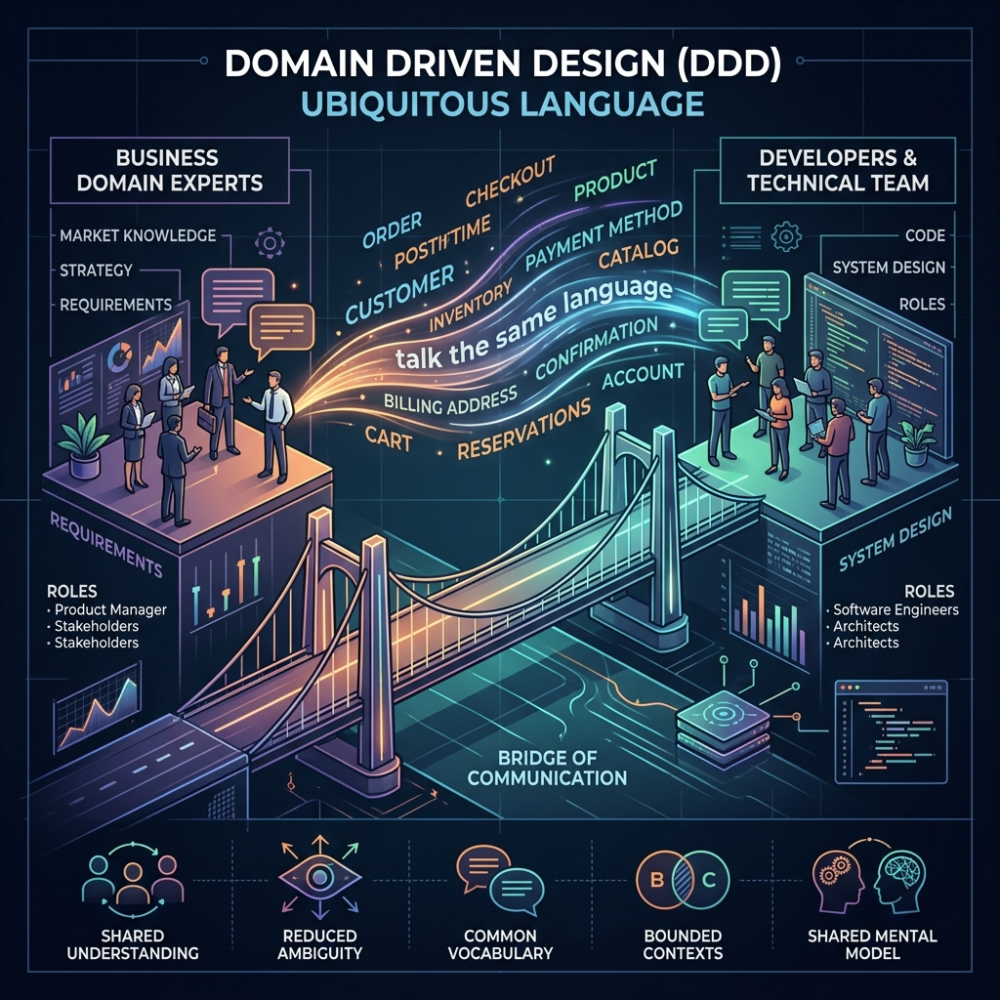

<div align="center">
  
</div>

# Chapter 1: The Ubiquitous Language & Discovering the Domain

**🎯 The Big Goal:** Bridge the massive communication gap between Domain Experts (the people who know the business) and Software Engineers (the people writing the code) by establishing a strictly shared vocabulary called the *Ubiquitous Language*.

---

## 🗣️ The Ubiquitous Language

The biggest reason software projects fail is a translation issue. Business experts talk about "Clients" and "Policies", while developers talk about "Users", "Database Rows", and "Foreign Keys". 

In Domain-Driven Design (DDD), **we stop translating**. Instead, we build a single, shared language—the **Ubiquitous Language**.
- It is spoken in meetings.
- It is written in documentation.
- **Crucially:** It is the exact terminology used in the source code (classes, variables, methods).

If a domain expert says: *"When a Premium Customer purchases a Subscription, their Account is upgraded"*, your code should read exactly like that.

## 🧠 Anemic vs. Rich Domain Models

Without a Ubiquitous Language, developers naturally default to **Anemic Domain Models**. Anemic models are just bags of getters and setters. They hold data, but the actual business rules (the domain logic) are scattered away in giant "Service" classes.

When you apply the Ubiquitous Language to your code, you create a **Rich Domain Model**. The classes themselves contain the behavior and the business rules.

### ❌ The Anemic Domain Model (Anti-Pattern)

Notice how the `Customer` is just a dumb data container. The domain logic is totally disconnected.

```java
// Just a data structure. No behavior.
public class Customer {
    private String id;
    private String type; // "REGULAR" or "PREMIUM"
    
    // ... basic getters and setters ...
}

// The behavior is dumped in a service elsewhere
public class CustomerService {
    public void upgradeCustomer(Customer customer) {
        if ("REGULAR".equals(customer.getType())) {
            customer.setType("PREMIUM");
            // send email, update DB...
        }
    }
}
```

### ✅ The Rich Domain Model (DDD Pattern)

In a Rich Domain Model, the `Customer` class protects its own invariants (rules) and expresses the Ubiquitous Language clearly through its methods.

```java
public class Customer {
    private final CustomerId id;
    private CustomerType type;

    public Customer(CustomerId id) {
        this.id = id;
        this.type = CustomerType.REGULAR;
    }

    // The method name matches the business language!
    // No setType() method exists. State changes through behavior.
    public void upgradeToPremium() {
        if (this.type == CustomerType.PREMIUM) {
            throw new IllegalStateException("Customer is already a premium member.");
        }
        this.type = CustomerType.PREMIUM;
    }

    public boolean isPremium() {
        return this.type == CustomerType.PREMIUM;
    }
}

// The Type is an Enum, not a fragile String
public enum CustomerType {
    REGULAR, PREMIUM
}

// The ID is a specific type, not a generic String
public record CustomerId(String value) {}
```

## 🗺️ Problem Space vs. Solution Space

You cannot build a Ubiquitous Language for the *entire* company. A "Product" means something completely different to the Marketing department than it does to the Shipping department. 

To handle this, DDD divides the world into two spaces:
1. **The Problem Space (Subdomains):** The real world. How the business fundamentally operates. It is divided into:
    - **Core Subdomain:** What makes the company money? Its unique competitive advantage (e.g., Google's Search Algorithm).
    - **Supporting Subdomain:** Necessary, but not the core money-maker (e.g., A custom content management system).
    - **Generic Subdomain:** Problems every company has. Buy these off the shelf! (e.g., Authentication/Identity, Accounting).

2. **The Solution Space (Bounded Contexts):** How we design the software to solve the problems. (Covered in Chapter 2).


---

## 🤔 Reflection Questions

<details>
<summary>💡 View Answer: Are all domain models supposed to be Rich Domain Models?</summary>

No! If a bounded context is a generic or supporting subdomain that just does simple CRUD (Create, Read, Update, Delete), an Anemic Domain Model is perfectly fine and often faster to build. You should only spend the high effort to build a Rich Domain Model for your **Core Domain** where the business rules are genuinely complex and provide a competitive advantage.
</details>

<details>
<summary>💡 View Answer: Why shouldn't we use a single Ubiquitous Language for the entire company?</summary>

It is impossible to force a large organization to agree on a single unified definition for every concept. Trying to build an "Enterprise Data Model" leads to massive monolithic classes that are fragile and impossible to maintain. A Ubiquitous Language is only valid *within the strict boundary of a specific Bounded Context*.
</details>

---

<div align="center">

[📚 Back to Course Overview](../README.md) · [Next Chapter: Strategic Design →](../02_Strategic_Design/)

</div>
