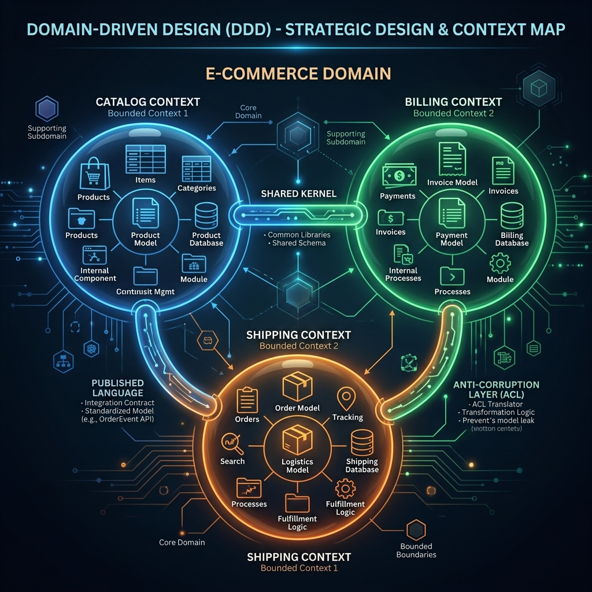

<div align="center">
  
</div>

# Chapter 2: Strategic Design: Bounded Contexts & Context Mapping

**🎯 The Big Goal:** Understand how to split massive, confusing monolithic systems into independent, cohesive models called **Bounded Contexts**, and map out exactly how those contexts integrate with each other using a **Context Map**.

---

## 🌎 The Bounded Context

If the *Subdomain* is the problem space (what we are trying to solve), the **Bounded Context** is the solution space (the software boundary we build to solve it).

A single Ubiquitous Language is only valid **strictly inside its Bounded Context**. 

Consider an E-commerce system. What is a "Product"?
- To the **Catalog Context**, a Product has an image, a description, customer reviews, and SEO keywords.
- To the **Inventory Context**, a Product is just an ID, a quantity on hand, and a warehouse aisle location. It doesn't care about the image.
- To the **Billing Context**, a Product is a tax code, a price, and a ledger account.

If you try to build one giant `Product` class for the whole company, it becomes a 5,000-line monster that every team fights over. Instead, DDD creates three separate `Product` classes, one inside each Bounded Context.

### 💻 Java Code: Context-Specific Models

Here is how the exact same real-world concept is modeled completely differently based on the context it lives in.

```java
// --- Inside Catalog Context ---
package ecommerce.catalog.domain;

public class Product {
    private final ProductId id;
    private String title;
    private String htmlDescription;
    private URL highResImageUrl;
    
    // Behaviors related to display and customers
    public void updateMarketingDescription(String newDescription) { ... }
}

// --- Inside Inventory Context ---
package ecommerce.inventory.domain;

public class Product {
    private final ProductId id;
    private int quantityOnHand;
    private WarehouseLocation location;
    
    // Behaviors related to logistics
    public void decreaseStock(int amount) {
        if (this.quantityOnHand < amount) throw new OutOfStockException();
        this.quantityOnHand -= amount;
    }
}
```

## 🗺️ Context Mapping Patterns

No bounded context is an island. They must integrate. A **Context Map** describes the relationship between them. Who depends on whom? Who decides the API contract?

1. **Partnership:** Two teams mutually depend on each other and plan releases together. Close collaboration.
2. **Shared Kernel:** Two contexts share a common library of code (e.g., standard generic Value Objects). Hard to maintain as both teams must agree to changes.
3. **Customer / Supplier:** One team (supplier) provides a service to another (customer). The supplier dictates the API, but prioritizes the customer's needs.
4. **Conformist:** The supplier dictates the API and does *not* care about the customer's needs. The customer just conforms to whatever the supplier provides (e.g., integrating with a legacy mainframe or external API like Stripe).
5. **Open Host Service (OHS) & Published Language:** The supplier provides a well-documented, standardized API (Published Language like JSON/REST) for *many* consumers. 

### 🛡️ The Anti-Corruption Layer (ACL)

When you pull data from an external system (especially a messy legacy one), you do not want to pollute your clean, beautiful Domain Model with their terrible data structures.

You build an **Anti-Corruption Layer (ACL)**. It sits at the edge of your Context, grabs the external model, and translates it into your Ubiquitous Language.

```java
// The external, messy legacy system returns this awful payload
public class LegacyBillingPayload {
    public String cust_id_str;
    public String status_cd; // "ACT", "SUS", "DEL"
}

// Our pristine Domain Model
public enum AccountStatus { ACTIVE, SUSPENDED, DELETED }

// The Anti-Corruption Layer (ACL) Translator
package ecommerce.billing.infrastructure.acl;

public class LegacyBillingTranslator {
    
    public AccountStatus translateStatus(LegacyBillingPayload payload) {
        return switch (payload.status_cd) {
            case "ACT" -> AccountStatus.ACTIVE;
            case "SUS" -> AccountStatus.SUSPENDED;
            case "DEL" -> AccountStatus.DELETED;
            default -> throw new IllegalArgumentException("Unknown legacy status");
        };
    }
}
```
