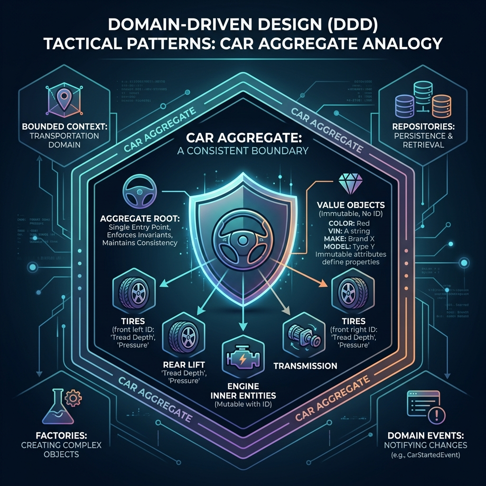

<div align="center">
  
</div>

# Chapter 3: Tactical Design: Entities, Value Objects & Aggregates

**🎯 The Big Goal:** Learn the core building blocks used to translate your domain model into highly cohesive, encapsulated object-oriented code that enforces business rules and guarantees data consistency.

---

## 1️⃣ Entities: Identity over Time

An **Entity** is an object fundamentally defined not by its attributes, but by a thread of continuity and its identity.
- Does it change over time? Yes (lifecycle).
- If two people have the exact same Name and Age, are they the exact same person? No. They have different identities (e.g., Social Security Number).

**Rule of Thumb:** If you need to track it through different states across time, it is an Entity.

## 2️⃣ Value Objects: Measure, Quantify, or Describe

A **Value Object** measures, quantifies, or describes a thing in the domain.
- They have **no conceptual identity**.
- They are completely **immutable**.
- Two Value Objects are equal if all their fields are equal (*Structural Equality*). If you have two $5 bills, you don't care which one is which; they are equal in value.

**Rule of Thumb:** If replacing the whole object is easier than changing a field, it's a Value Object (e.g., `Money`, `Address`, `Color`, `DateRange`). Using Value Objects instead of primitives (Strings and ints) cures "Primitive Obsession" and prevents bugs.

### 💻 Java Code: Value Object vs Primitive Obsession

```java
// ❌ Primitive Obsession: Easy to pass weight instead of amount
public void chargeCreditCard(String currency, double amount) { ... }

// ✅ Value Object: Safe, Validated, Immutable
public record Money(String currency, BigDecimal amount) {
    public Money {
        if (amount.compareTo(BigDecimal.ZERO) < 0) {
            throw new IllegalArgumentException("Money cannot be negative");
        }
        if (currency == null || currency.isBlank()) {
            throw new IllegalArgumentException("Currency must be specified");
        }
    }

    public Money add(Money other) {
        if (!this.currency.equals(other.currency)) {
            throw new IllegalArgumentException("Currency mismatch");
        }
        return new Money(this.currency, this.amount.add(other.amount));
    }
}

// Now the signature is perfectly clear:
public void chargeCreditCard(Money totalAmount) { ... }
```

## 3️⃣ Aggregates & Aggregate Roots

If an Entity is a file in a folder, the **Aggregate** is the folder.

An Aggregate is a cluster of associated objects (Entities and Value Objects) that we treat as a **single unit for data changes**. 
- Every Aggregate has a single entry point called the **Aggregate Root**.
- You are not allowed to modify inner entities directly from the outside. You must ask the Aggregate Root to do it.
- Why? Because the Aggregate Root acts as the gatekeeper, ensuring that business rules (**invariants**) are never violated.

### The Transaction Boundary

An Aggregate is synonymous with a **transactional boundary**. When you load an Aggregate from the database, you load the entire cluster. When you save it, the whole cluster is committed in one database transaction. **Rule:** A single transaction should only ever modify *one* aggregate.

### 💻 Java Code: An Aggregate Root in Action

Imagine an `Order` system. The business rule is: *An order cannot exceed $1,000 total, and you cannot alter an order once it is shipped.*

```java
public class Order { // <-- This is the Aggregate Root (An Entity)
    private OrderId id; // Identity
    private OrderStatus status; // Entity State
    private List<OrderItem> lineItems; // Inner Entities!

    public Order(OrderId id) {
        this.id = id;
        this.status = OrderStatus.PENDING;
        this.lineItems = new ArrayList<>();
    }

    // 🛡️ The Root controls all changes to enforce invariants!
    public void addItem(Product product, int quantity) {
        if (this.status == OrderStatus.SHIPPED) {
            throw new DomainException("Cannot add items to a shipped order.");
        }
        
        Money newItemTotal = product.getPrice().multiply(quantity);
        Money currentTotal = calculateTotal();
        
        if (currentTotal.add(newItemTotal).isGreaterThan(new Money("USD", 1000))) {
             throw new DomainException("Order total cannot exceed $1,000.");
        }

        // Only after validation do we alter the internal state
        this.lineItems.add(new OrderItem(product.getId(), quantity, product.getPrice()));
    }
    
    private Money calculateTotal() {
        return lineItems.stream()
            .map(OrderItem::getTotalPrice)
            .reduce(Money.zero("USD"), Money::add);
    }
}

// Inner Entity. Not accessible directly from the outside world.
class OrderItem {
    private ProductId productId;
    private int quantity;
    private Money priceAtTimeOfPurchase;
    
    // package-private constructor! Only Order can create this.
    OrderItem(...) { ... } 
}
```


---

## �� Reflection Questions

<details>
<summary>💡 View Answer: Can an Entity contain other Entities?</summary>

Yes! An Aggregate is a cluster of Entities and Value Objects. The outer wrapper is called the Aggregate Root (which is an Entity), and it can hold inner Entities. Crucially, the outside world can only reference the Root ID, not the inner Entity IDs.
</details>

<details>
<summary>💡 View Answer: Can an Aggregate Root contain a reference to another Aggregate Root?</summary>

It should strictly hold a reference to the **ID** of the other Aggregate Root, not the actual Java object itself. This prevents developers from accidentally modifying multiple Aggregates in the same database transaction, which breaks the consistency rule.
</details>

---

<div align="center">

[← Previous Chapter: Strategic Design](../02_Strategic_Design/) · [📚 Back to Course Overview](../README.md) · [Next Chapter: Repositories & Services →](../04_Repositories_Services/)

</div>
