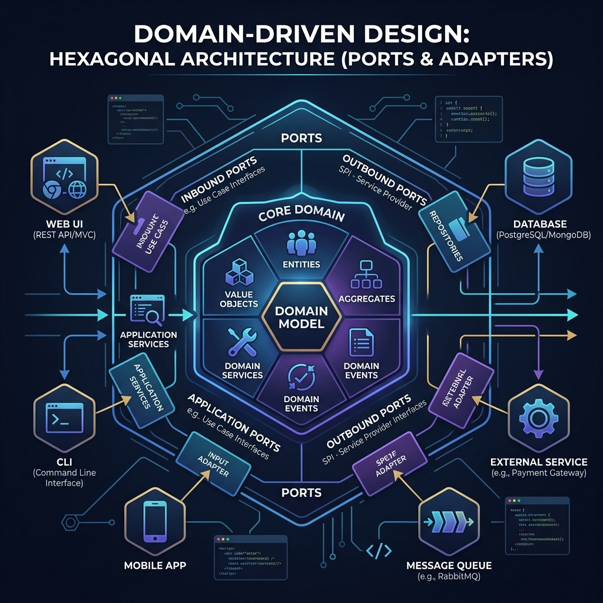

<div align="center">
  
</div>

# Chapter 4: Repositories, Domain Services & Application Services

**🎯 The Big Goal:** Learn how to fetch, save, and orchestrate Aggregates using external layers (Application layer vs Domain Layer) without leaking domain logic out of your core models.

---

## 🏛️ The Layered Architecture

DDD works best inside a **Hexagonal Architecture** (also known as Ports and Adapters) or a strict Layered/Clean Architecture. The rule is simple: **Dependencies point inward.**
1. **Domain Model (Center):** Entities, Value Objects, Aggregates. Knows nothing about databases or web frameworks. Pure Java code.
2. **Application Layer:** Orchestrates use cases. Loads data, delegates to the Domain, saves data.
3. **Infrastructure Layer:** Concrete database queries, REST API clients (Spring Data JPA, JDBC, etc).
4. **UI/Presentation Layer:** Web controllers, CLI.

## 💾 Repositories

A **Repository** mediates between the domain and data mapping layers acting like an in-memory collection of domain objects. 
- You do *not* have a repository for every table or every Entity. 
- You **only have Repositories for Aggregate Roots**. You save the `Order` root, and the repository saves the `Order` and all its `OrderItems` behind the scenes.

**In DDD, the Domain Layer defines the interface, and the Infrastructure layer provides the implementation.**

```java
// --- DOMAIN LAYER ---
// Pure domain language. No SQL, no ORM annotations.
public interface OrderRepository {
    Optional<Order> findById(OrderId id);
    void save(Order order);
}

// --- INFRASTRUCTURE LAYER ---
// Concrete implementation living outside the core domain
@Repository
public class PostgresOrderRepository implements OrderRepository {
    private final JpaOrderDAO jpaDao; // Spring Data JPA etc

    @Override
    public Optional<Order> findById(OrderId id) {
        // execute SQL, map to pure Domain Order object
    }

    @Override
    public void save(Order order) {
        // extract data from domain Order object, execute INSERT/UPDATE SQL
    }
}
```

## ⚙️ Domain Services vs. Application Services

Often, developers throw all logic into a giant `*Service` class. DDD strictly separates services into two completely different beasts.

### Domain Service (Pure Logic)
Some business rules don't fit neatly inside a single Entity. For example, transferring money between two `Account` aggregates. You don't want Account A to modify Account B directly. A **Domain Service** is a stateless piece of pure business logic.

```java
// --- DOMAIN LAYER ---
public class FundTransferDomainService {
    // Pure business rule orchestrating two aggregates. No database calls here!
    public void transfer(Account source, Account destination, Money amount) {
        source.withdraw(amount);
        destination.deposit(amount);
    }
}
```

### Application Service (The Use Case Orchestrator)
An **Application Service** is the direct client of the Domain Model. It coordinates the execution of a use case. It does **not** contain business rules. It contains workflow logic: Fetch data -> Call Domain -> Save Data -> Commit Transaction.

```java
// --- APPLICATION LAYER ---
@Service
public class TransferApplicationService {
    
    private final AccountRepository accountRepository;
    private final FundTransferDomainService transferService;

    @Transactional // Database transaction boundary!
    public void executeTransfer(String sourceId, String destId, BigDecimal amount) {
        
        // 1. Fetch Aggregates
        Account source = accountRepository.findById(new AccountId(sourceId))
            .orElseThrow(() -> new NotFoundException());
        Account dest = accountRepository.findById(new AccountId(destId))
            .orElseThrow(() -> new NotFoundException());
            
        // 2. Delegate to Domain Logic
        transferService.transfer(source, dest, new Money("USD", amount));
        
        // 3. Save Aggregates
        accountRepository.save(source);
        accountRepository.save(dest);
    }
}
```
