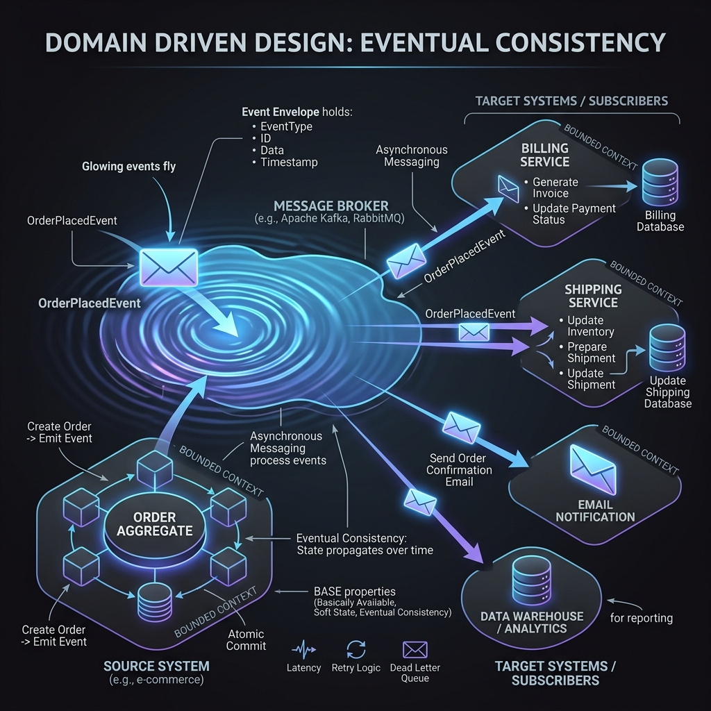

<div align="center">
  
</div>

# Chapter 5: Domain Events & Eventual Consistency

**🎯 The Big Goal:** Decouple massive systems by embracing **Eventual Consistency**. Learn how to publish "Domain Events" when something important happens, allowing other Bound Contexts to react without creating brittle, synchronous APIs.

---

## 📨 What is a Domain Event?

A **Domain Event** represents something important that *already happened* in the domain.
- It is named in the past tense: `OrderPlaced`, `CustomerUpgraded`, `PaymentFailed`.
- It is **immutable**. You cannot change the past.
- It is a core part of the Ubiquitous Language. If a business expert says "When an order is placed, we must notify shipping," then "Order Placed" is your Domain Event.

### Why do we need them?

In a monolith, if placing an order requires 5 different things to happen (update inventory, charge credit card, send email, notify shipping), developers usually write horrible procedural code that does all 5 things in one giant database transaction. If the email server is down, the entire order fails to place!

By using Domain Events, the `Order` aggregate simply says: *"I successfully saved myself, and by the way, an OrderPlaced event just occurred. Anyone who cares can deal with it."*

## ⏳ Eventual Consistency

In distributed microservices, **Atomic Transactions (ACID) across multiple bounded contexts are an anti-pattern**. They require Two-Phase Commits (2PC) which destroy performance and availability.

Instead, DDD relies on **Eventual Consistency** (BASE). 
The `Order` is saved (strong consistency in the Order database). The `OrderPlacedEvent` is published to a broker (like Kafka or RabbitMQ). Milliseconds later, the `Inventory` service consumes that event and updates its database. The system is "eventually consistent."

### 💻 Java Code: Producing and Consuming Events

Here is how an Aggregate Root records an event, and how another component reacts to it.

```java
// --- 1. Define the Event ---
public record OrderPlacedEvent(
    UUID eventId, 
    Instant occurredOn, 
    String orderId, 
    String customerId
) implements DomainEvent {}

// --- 2. Register the Event inside the Aggregate ---
public class Order {
    private final OrderId id;
    private final List<DomainEvent> domainEvents = new ArrayList<>();

    public void place() {
        this.status = OrderStatus.PLACED;
        
        // Emitting the event internally!
        this.domainEvents.add(new OrderPlacedEvent(
            UUID.randomUUID(), Instant.now(), this.id.value(), this.customerId.value()
        ));
    }
    
    public List<DomainEvent> pullEvents() {
        List<DomainEvent> events = new ArrayList<>(domainEvents);
        domainEvents.clear(); // Clear after pulling
        return events;
    }
}

// --- 3. The Application Service publishes the event after saving ---
@Service
public class OrderApplicationService {
    @Transactional
    public void placeOrder(String orderId) {
        Order order = repository.findById(new OrderId(orderId)).orElseThrow();
        order.place();
        repository.save(order);
        
        // Publish strongly inside the same transaction (e.g., using Spring ApplicationEventPublisher or Outbox Pattern)
        for (DomainEvent event : order.pullEvents()) {
            eventPublisher.publish(event);
        }
    }
}

// --- 4. The Listener (in a different module/context) ---
@Component
public class InventoryOrderListener {
    
    @EventListener // Or @KafkaListener depending on architecture
    public void handle(OrderPlacedEvent event) {
        System.out.println("Inventory system reacting to order: " + event.orderId());
        // Deduct inventory...
    }
}
```

## 📦 The Outbox Pattern (Crucial for Production)

If your database commits, but the message broker (e.g., Kafka) crashes right before you send the event, you lose the event forever! Your system is now **inconsistent**.

To fix this, you must use the **Transactional Outbox Pattern**:
1. Save the `Order` entity to the database.
2. In the *exact same SQL transaction*, save the `OrderPlacedEvent` as JSON to a separate `Outbox` table in the same database.
3. A background process reads the `Outbox` table and safely publishes the events to Kafka.
