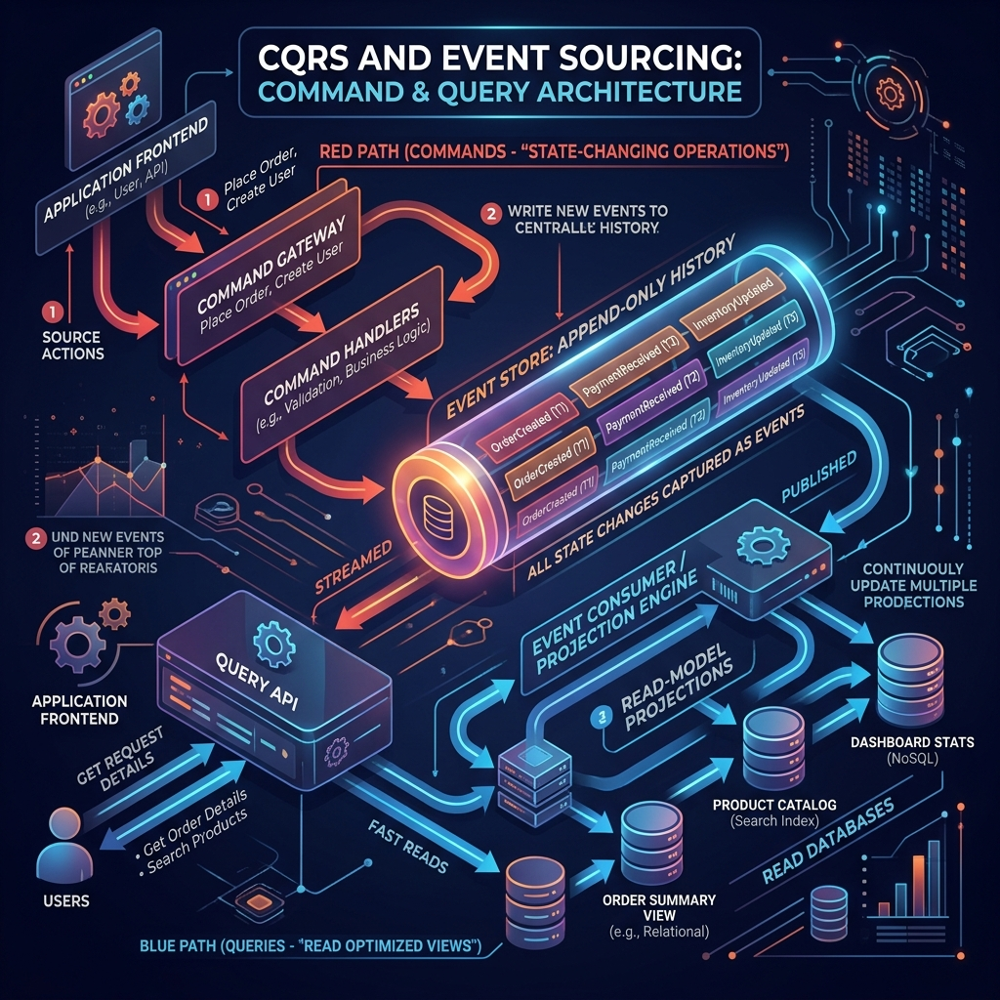

<div align="center">
  
</div>

# Chapter 6: Architectural Patterns: CQRS & Event Sourcing

**🎯 The Big Goal:** Break free from restrictive relational CRUD (Create, Read, Update, Delete) databases by physically splitting your *writes* from your *reads* (CQRS) and treating historical events as the absolute source of truth (Event Sourcing).

---

## 🔀 CQRS (Command Query Responsibility Segregation)

In a traditional application, the same `User` Entity is used to both update a password (a write) and display a user profile on a screen (a read). 
- The write operation wants a deep, highly-validated object graph.
- The read operation wants a flat, denormalized, lightning-fast JSON payload.

**CQRS says: Stop forcing the read and write sides to share the same model.**

- **Commands:** Methods that change state. They do not return data (except maybe an ID). They execute deep domain logic on rich Aggregate Roots.
- **Queries:** Methods that read state. They do not change anything. They bypass the Domain Model entirely and query the database directly using flat DTOs (Data Transfer Objects).

### Advanced CQRS: Physical Database Separation
In advanced systems, the write side saves to a relational DB (like PostgreSQL), publishes an event, and the read side updates a NoSQL database (like MongoDB or Elasticsearch) specifically optimized for the UI screen!

### 💻 Java Code: CQRS Separation

Notice how the `Command` goes through the complex Domain Model, but the `Query` just runs a fast raw SQL query and returns a flat view.

```java
// ======== THE COMMAND (WRITE) SIDE ========
public record PlaceOrderCommand(String orderId, String customerId, List<ItemDto> items) {}

@Service
public class OrderCommandService {
    @Transactional
    public void execute(PlaceOrderCommand cmd) {
        // Loads full aggregate, applies complex business rules
        Order order = new Order(new OrderId(cmd.orderId()), cmd.customerId());
        for (ItemDto item : cmd.items()) {
            order.addItem(item.productId(), item.qty());
        }
        repository.save(order);
    }
}

// ======== THE QUERY (READ) SIDE ========
// A flat DTO designed exactly for the UI screen. No business logic.
public record OrderSummaryView(String orderId, String status, int totalItems, BigDecimal totalCost) {}

@Service
public class OrderQueryService {
    private final JdbcTemplate jdbc; // Bypassing Hibernate/JPA entirely for speed!

    public OrderSummaryView getOrderSummary(String orderId) {
        // Direct, fast SQL projection
        String sql = "SELECT id, status, item_count, total_amount FROM order_read_model WHERE id = ?";
        return jdbc.queryForObject(sql, (rs, rowNum) -> new OrderSummaryView(
            rs.getString("id"),
            rs.getString("status"),
            rs.getInt("item_count"),
            rs.getBigDecimal("total_amount")
        ), orderId);
    }
}
```

## 📼 Event Sourcing

Usually, a database stores the **current state** of an entity. If I move my shipping address from New York to London, the database overwrites New York. The history is gone.

**Event Sourcing** flips this entirely. We never save "state". We only save an append-only log of **Domain Events**.

To reconstruct an Aggregate, we load all its past events and "replay" them in memory.

### Why do this?
1. **Perfect Audit Log:** You cannot delete or overwrite an event. It is a legally compliant, perfect history (e.g., Bank Ledgers work exactly like this).
2. **Time Travel:** You can rebuild the state of the system at any prior second in history by stopping the replay early.
3. **Infinite Projections:** You can write a new read-model tomorrow, replay the events from Day 1, and populate a brand new dashboard instantly.

### 💻 Java Code: Replaying Events

```java
public class OrderAggregate {
    private String id;
    private OrderStatus status;

    // We pass in the history of events to rebuild state!
    public static OrderAggregate loadFromHistory(List<DomainEvent> history) {
        OrderAggregate aggregate = new OrderAggregate();
        for (DomainEvent event : history) {
            aggregate.apply(event);
        }
        return aggregate;
    }

    // Pattern matching to apply different events
    private void apply(DomainEvent event) {
        if (event instanceof OrderCreatedEvent e) {
            this.id = e.orderId();
            this.status = OrderStatus.PENDING;
        } else if (event instanceof OrderShippedEvent e) {
            this.status = OrderStatus.SHIPPED;
        }
    }
    
    // Command method
    public void ship() {
        if (this.status != OrderStatus.PENDING) throw new IllegalStateException();
        // Just emit the event. The framework will save it to the Event Store.
        emit(new OrderShippedEvent(this.id, Instant.now()));
    }
}
```
